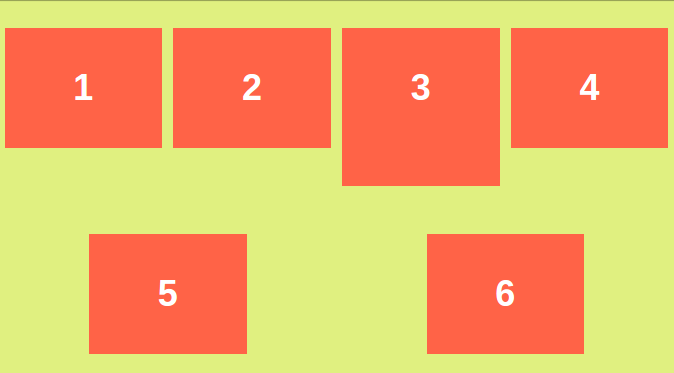

# {{page.title}}
<span style = "color: #A39FAD">Last modified: {{page.last_modified_date}}</span>


## 3.10 Flexbox Part One
### flex
- 위의 inline-block의 문제를 해결하기 위한 것이 flexbox. flexbox는 박스들을 어떤 곳이든 둘 수 있다는 장점이 있다. 
- 규칙1. 자식 엘리먼트가 아니라 부모 엘리먼트에 말해야 한다.
- 규칙2. main axis는 horizontal이고 cross axis는 vertical이다. 
- justify-content의 종류로는 center, flex-end, flex-start, space-evenly, space-around, space-between 등...이 있다. justify-content의 축은 main axis(가로축)이다.
- align-item은 반대로 align cross axis(세로축)가 기본이다.
- 하지만 body의 높이는 div의 크기만큼이기 때문에 align-item을 center를 한다고 해서 움직이지는 않음. 아래처럼 vp의 단위를 사용해서 높이를 설정해주면 가능

```
#style
<head>
	<style>
		body {
			margin: 20px;
			display: flex;
			justify-content: space-evenly;
			align-item: center
		}
		
		div {
			width: 300px;
			height: 300px;
			background-color: teal;
		}
		#yellow {
			background-color: yellow;
		}
	</style>
</head>


<body>
	<div></div>
	<div id="yellow"></div>
	<div></div>
</body>
```
<br>
<br>
### flexbox

```
<body>
display: flex;
</body>
```
<b>규칙 3가지</b>
- 부모 엘리먼트에만 사용해야 한다.
- main-axis & cross-axis (justify-content는 main-axis용, align-item은 cross-axis용)
- 하지만 align-item을 사용하려면 body의 높이를 지정해주거나 100vh를 사용해야 함
- ```justify-content: space-around;``` 와 ```justify-content: space-between```의 차이는 space-between은 콘텐츠들을 묶고 봤을 때 가장 좌측과 가장 우측의 여백을 고려하지 않고 여백을 계산하는 반면, space-around는 가장 좌측과 가장 우측에도 여백을 준다.
<br>
<br>
## 3.11 Flexbox Part Two
### flex-direction
- flex-direction을 통해 column 혹은 row를 사용할 수 있다.
- ```flex-direction: column;``` 을 사용하면 세로로 정렬을 시킬 수 있다.
<br>
<br>
### flex-wrap
- 사용하면 화면의 크기를 바꾸더라도 본연의 크기를 유지하며 옵션이 적용됨.
- 자세한 것은 가장 하단의 게임을 해보면 다양한 종류의 태그들을 알 수 있음.

- ```align-content```는 콘텐츠가 여러 줄을 구성할 때 그 줄들에 대한 정의이고 ```align-items```는 한 줄 안에 있는 콘텐츠들의 정렬이다. 아래의 첫 번째 이미지는 ```align-content: space-around``` 이고, 두 번째 이미지는 ```align-content: space-around; ``` 와 ```align-items: center```를 모두 사용한 것이다.

{: width="100%" height="100%"}
{: width="100%" height="100%"}
> 참고: [stack overflow-What's the dirrerence between align-content and align-items](https://stackoverflow.com/questions/27539262/whats-the-difference-between-align-content-and-align-items)

### flex property 연습
[FLEXBOX FROGGY](https://flexboxfroggy.com/#ko) 웹사이트를 이용하면 flex와 관련된 속성들을 연습해 볼 수 있는 게임을 할 수 있다. 단순한 flex-direction, align-items, justify-content 외에 다양하게 order, align-self 등을 써볼 수 있다.


## 3.12 Fixed
### Position
- div에 ```position: fixed;``` 사용시 body height가 엄청 긴 화면에서 스크롤을 내려가도 그 위치에 고정되어 있음. 
- fixed를 사용하고  top, left, bottom, right 같은 값을 설정해주면 다른 요소가 있어도 완전히 다른 레이어처럼 여겨서 서로 겹쳐지기도 한다.

## 3.13 Relative Absolute
- ```position: static;``` 이 디폴값이고, ```position: relative``` 또한 사용이 가능하다. 
- relative는 아주 약간 움직이고 싶을 때 편리하게 사용할 수 있다. 예를 들어 아래 같은 body를 가지고 있는 구조에서 green div만 살짝 왼쪽과 위쪽(top과 left 값)으로 움직이고 싶을 때 style 값으로 사용할 수 있다.

```
  <head>
	  <style>
		  div {
			  width: 300px;
			  height: 300px;
			  background-color: wheat;
		  }
		  .green {
			  background-color: teal;
			  height: 100px;
			  width: 100px;
			  position: relative;
			  top: -10px;
			  left: -10px;
		  }
	  </style>
  </head>
  <body>
	  <div>
		  <div class="green"></div>
	  </div>
  </body>
```
-  ```position: absolute;``` 는 다른 요소들과 상관 없이 절대적인 위치를 가질 수 있음 (중요한 점은 absolute는 가장 가까운 relative 부모를 기준으로 이동하게 됨. 즉, 아래와 같은 형태는 부모인 div의 위치에 기반하여 움직이지 않고 그 부모인 body를 기준으로 움직이게 됨)

```
    <head>
	  <style>
		  div {
			  width: 300px;
			  height: 300px;
			  background-color: wheat;
		  }
		  .green {
			  background-color: teal;
			  height: 100px;
			  width: 100px;
			  position: absolute;
			  right: 0px;
		  }
	  </style>
  </head>
  <body>
	  <div>
		  <div class="green"></div>
	  </div>
  </body>
```
<br>
<br>
- 위의 코드에서 만약 부모인 div를 기준으로 움직이고 싶다면 아래처럼 부모 div를 relative로 바꿔주면 된다.

```
    <head>
	  <style>
		  div {
			  width: 300px;
			  height: 300px;
			  background-color: wheat;
			  position: relative;
		  }
		  .green {
			  background-color: teal;
			  height: 100px;
			  width: 100px;
			  position: absolute;
			  right: 0px;
		  }
	  </style>
  </head>
  <body>
	  <div>
		  <div class="green"></div>
	  </div>
  </body>
```
<br>
<br>
<br>
## 3.14 Pseudo Selectors part One
- pseudo selector은 좀 더 세부적으로 어떤 요소를 선택하는 것으로 기존에 우리가 배운 방법은 아래와 같다.
1. Tag를 통해서 지칭(ex. body)
2. '.' 을 통해서 지칭(div의 class 값)
3. '#'을 통해서 지칭(div의 id 값)

```
<head>
	div:last-child {
		background-color: teal;
	}
</head>
<body>
	<div></div>
	<div></div>
	<div></div>
</body>
```
<br>
- pseudo selector의 예시\:

```
div: last-child {
	background-color: wheat;
}
```
<br>
- 다른 예: 여러 span이 있고 두 번째, 네 번째 span만 색을 바꾸고 싶다면

```
span: nth-child(2),
span: nth-child(4) {
	background-color: teal;
}
```
<br>
- 하지만 이(짝수의 span만 적용하는 것)를 효율적으로도 할 수 있는데,

```
span: nth-child(even) {
	background-color: tomato;
}
```
<br>
- 재밌는 점은 2n+1 처럼 규칙을 원하는 대로 정해서 적용할 수 있다.
- 만약 p 안에 있는 특정 span의 색을 바꾸고 싶다면? (부모-자식-손주의 구조를 적용하는 방법)

```
p span {
	color: teal;
}
```
<br>
- 만약 div의 바로 밑 자식이 span인 것을 선택해내려면

```
div > span {
	text-decoration: underline;
}
```
<br>
- 만약 p 다음에 있는 spand을 선택하고 싶다면(무조건 옆에 있어야 함)

```
p + span {
	text-decoration: underline;
}
```


## 3.16 Pseudo Selectors part Two
- ~를 사용하면 + 와 똑같이 형제 관계에 있는 요소들을 지정할 수 있지만 무조건 옆에 있지 않아도 지정이 가능하다.

```
p ~ span {
	text-decoration: underline;
}
```
<br>
- hover 값도 pseudo selector로 불러오기 가능
- 만약 required인 input만 border를 주고 싶다면

```
<head>
	<style>
	input {
		border: 1px solid tomato;
	}
	input: required {
		border: 1px solid wheat;
	}
	</style>
</head>
<body>
	<div>
		<form>
			<input type="text" placeholder="username" />
			<input type="password" required placeholder="password" />
		</form>
	</div>
</body>
```
<br>
- attribute를 따로 선택할 수도 있다.

```
input [type="password"]{
	background-color: thistle;
}
```
<br>
혹은

```
input [placeholder="username"] {
	background-color: tomato;
}
```
<br>
- 만약 placeholder에 "name"이라는 단어를 포함한 input의 배경색을 설정하려면 ~을 사용할 수 있다.

```
input[placeholder~="name"] {
	background-color: pink;
}
```
<br>
- mdn의 selector에 가면 더 많은 종류들을 발견할 수 있다.

## 3.17 States
- 개발자 도구를 통해 selector의 states를 확인할 수 있다 (아래의 이미지처럼 styles패널에서 확인 가능).
<br>
{: width="100%" height="100%"}
<br>
{: width="100%" height="100%"}

### states 사용 예시

```
button:active {
	background-color: yellow;
}
```
<br>
- 중요한 포인트는 만약 이렇게 state에 따른 값을 따로 설정해 줄 경우 앞에서 설정해준 값들은 전부 잃는다.

### states 종류들
1. active: 버튼을 클릭하고 있는 상태이나 떼지 않았을 때
2. hover: 마우스를 올렸을 때
3. focus: 키보드로 선택이 되었을 때 (input 창에서 많이 사용)
4. focus-within: 자식 요소에 input이 있는 요소에 사용 (예를 들어, form에 설정을 하면 하위에 있는 모든 focus-within에 모두 적용이 됨)
5. visited: 링크에만 사용되는데, 내가 방문한 적 없는 링크는 파란 색 글자로 표출되는 것이 다르게 나오도록 할 수 있음
<br>
→ 위의 요소들을 결합하여 아래처럼 설정할 수도 있음

```
form:hover input:focus {
	background-color: sienna;
}
```

## 3.18 Recap
### 추가 pseudo elements
- ::placeholder은 placeholder의 스타일을 바꿀 수 있음

```
input::placeholder {
	color: yellowgreen;
}
```
<br>
- ::selection은 드래그 된 영역의 스타일을 설정할 수 있음

```
p::selection {
	backgroud-color: yellowgreen;
	color: white;
}
```
<br>
- 이런 부분 설정은 [documentation](https://developer.mozilla.org/en-US/docs/Web/CSS/::after)에 다양하게 있음(first-letter, first-line 등...)

## 3.19 Colors and Variables
- :root를 사용하여 컬러시스템 적용하기: 아래의 값을 style 제일 앞에 만들면 문서의 전체에 적용된다. → custom property라고 불림

```
<style>
	:root {
		--main-color: rgb(68, 87, 96);
	}
	body {
		background-color: var(--main-color);
	}
</style>
```
<br>
- 형태만 ```--단어-단어: 스타일 옵션;``` 혹은 ```--단어-단어-단어: 스타일 옵션;``` 이렇게 해주면 되지, 어떤 것이든 설정할 수 있다. 예를 들어, 테두리 값을 여러번 사용할 것이라서 설정하고 싶다면 아래처럼 할 수 있다.

```
<style>
	:root {
		--default-border: 1px solid var(--main-color);
	}
	body {
		border: var(--default-border);
	}
</style>
```
<br>
<br>
> 참고<br>
> [노마드코더-코코아톡 클론 크딩](https://nomadcoders.co/kokoa-clone)