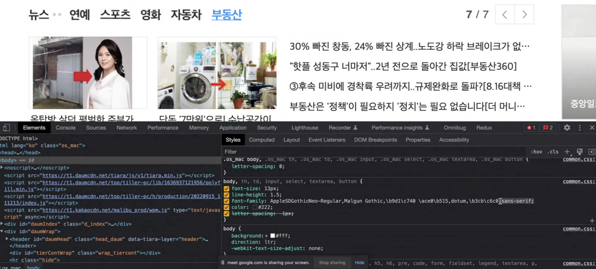
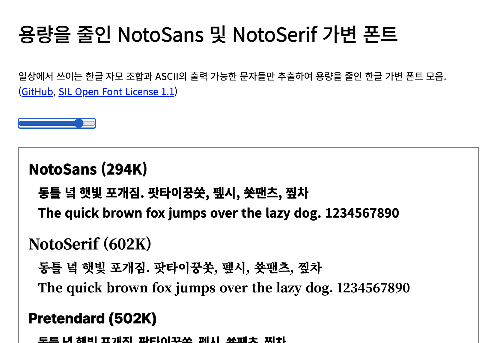
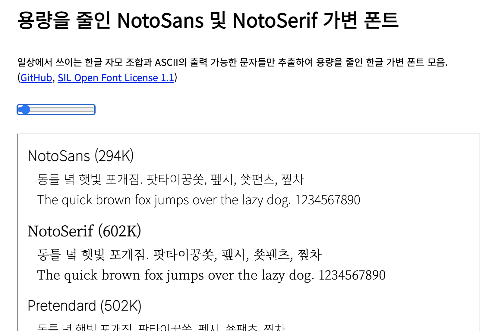

# {{page.title}}
Last modified: {{page.last_modified_date}}

## 웹에서 폰트를 구현하는 방식은 어떻게 변화해왔는가
### Font Fall-back이란?
웹이 처음 나오고 2000년대 초반까지는 fall back 방식을 사용했는데, 아래의 이미치처럼 텍스트에 대하여 이렇게 폰트가 여러개 들어있는 방식이다. 이런 구조로 폰트를 보여준 이유는 각 컴퓨터마다 설치되어있는 폰트가 달랐기 때문이다. 만약 AppleSDGothicNeo가 설치되어 있는 컴퓨터라면 AppleSDGothicNeo로 렌더링되고, 없다면 Malgun Gothic이 되는 그런 방식이다.
{: width="100%" height="100%"}

### Webfont란?
웹폰트는 아예 웹페이지를 개발할 때 폰트 값을 포함하는 것으로 모든 컴퓨터에서 같은 폰트로 볼 수 있다는 장점이 있지만, 폰트를 다운받는 시간이 오래 걸릴 수 있다는 단점이 있다. 특히 한글폰트의 경우 글리프가 영문과 달리 엄청 많기 때문에 잘못 쓰면 비효율적일 수 있다. 

한글의 글리프 수는 대략 1만개 정도가 있고, 그 중에서 실제로 쓰이는 글리프는 2500~3000개 정도가 있다고 한다. 하지만 이 폰트가 여러 두께가 필요할 경우, 폰트가 차지하는 용량이 배가 된다.

그렇기 때문에 29cm의 웹사이트를 예로 보면 영문에만 브랜드 이미지를 위해 웹폰트를 적용하고 한글은 시스템 폰트로 보이도록 해 두었다. 그 결과 폰트 용량이 .2mb만 차지하도록 할 수 있었다.
{: width="100%" height="100%"}

웹폰트는 한글에 적용하기 어렵기 때문에, variable font(가변폰트)를 사용할 수 있다.

### Variable font(가변폰트)
가변폰트는 서체 디자이너가 한 번 잘 신경써서 만들어놓으면 weight를 자유자재로 조절할 수 있도록 한 것이다. 폰트가 변할 수 있는 access들을 정의하는데 weight나 italic의 값에 따라 그 벡터가 변화하는 공식 같은 것이 있는 것이다. 기존에는 폰트 두께에 따라 regular, medium, bold 같은 것이 나뉘었다면, 가변폰트는 하나의 폰트를 조절하여 사용할 수 있는 것. 특히 글리프가 많은 한글폰트 같은 경우에 효과가 극대화된다. 

alan kang님이 작업하신 노토산스 가변폰트의 용량을 줄인 결과는 [여기](https://akngs.github.io/noto-kr-vf-distilled/)에서 확인할 수 있다. 위의 페이지에서 가변폰트의 예시를 슬라이더를 움직여서 확인할 수 있다. 아래는 가변폰트에 두께 변화를 준 예시이다.

{: width="100%" height="100%"}
{: width="100%" height="100%"}

KSC5601은 컴퓨터에서 한글을 나타내는 표준 같은 것인데, 처음의 2350자짜리의 글자 수로 이루어져 있다. 하지만, 여기에 288자를 더 더하면 어지간한 한글 글자들이 다 포함되도록 한 것이 위의 작업물이다.

> 출처:
> 논문스터디-alan kang 님