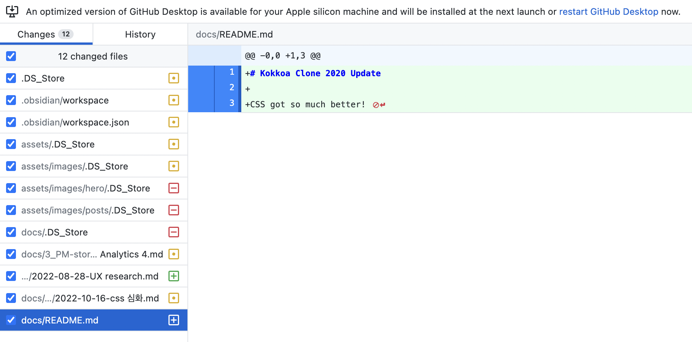
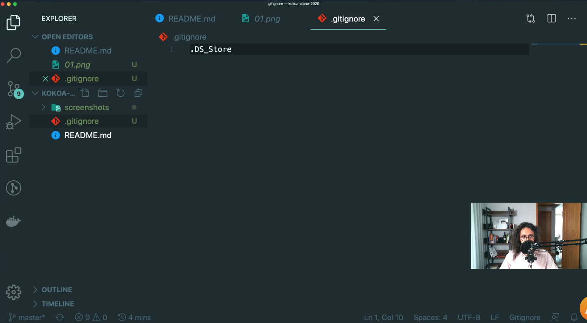

# {{page.title}}
Last modified: {{page.last_modified_date}}

## 5 GIT AND GITHUB

1. 깃허브 레포지토리는 공백이 있을 수 없음
2. 깃허브 데스크톱을 활용하면 커밋과 푸쉬를 아주 쉽게 할 수 있다. 
   → 지금까지 이것도 모르고 터미널로 하고 있었음... 역시 무엇이든지 찾아보면 더 효율적으로 할 수 있구나..
   {: width="100%" height="100%"}

- DS_store 같은 파일을 무시하려면 .gitignore 파일을 추가해주면 된다.
{: width="100%" height="100%"}

- 깃허브는 이미 사용하는 중이어서 깃허브 데스크톱에 대한 것들 위주로 정리

> 참고 
> [노마드코더-코코아톡 클론 크딩](https://nomadcoders.co/kokoa-clone)