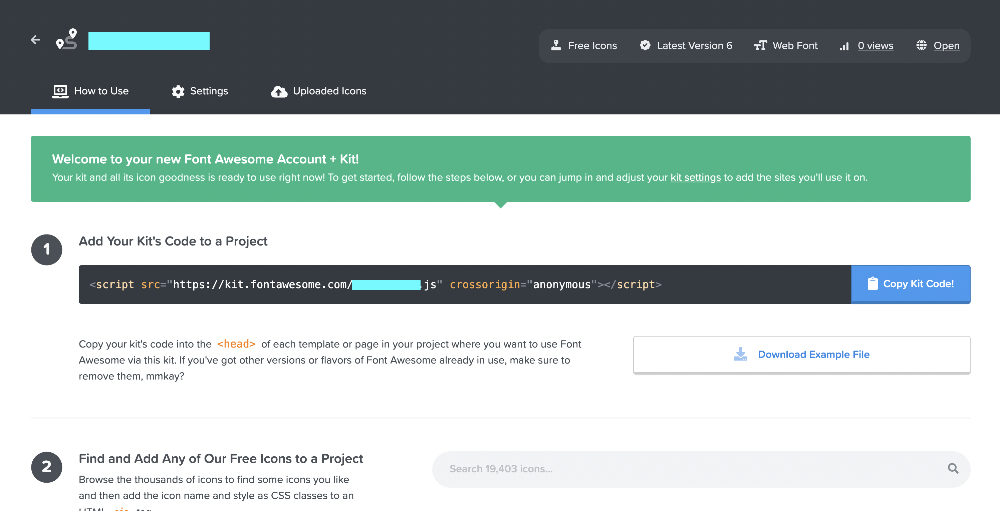
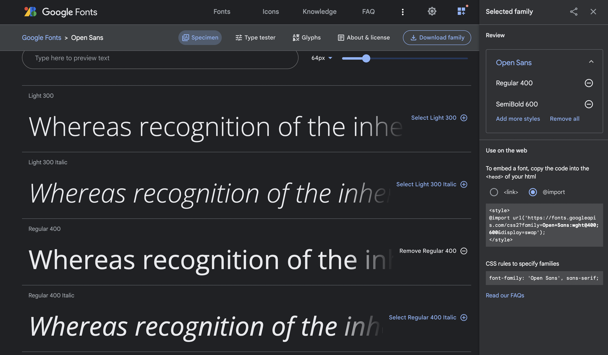
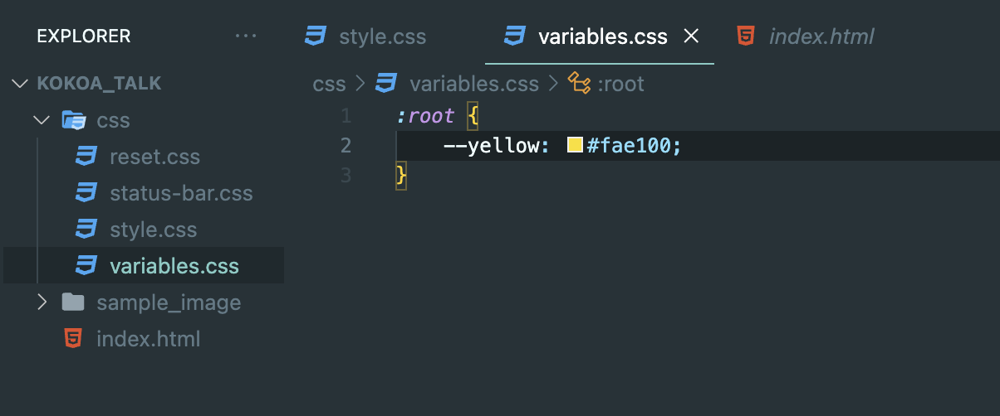
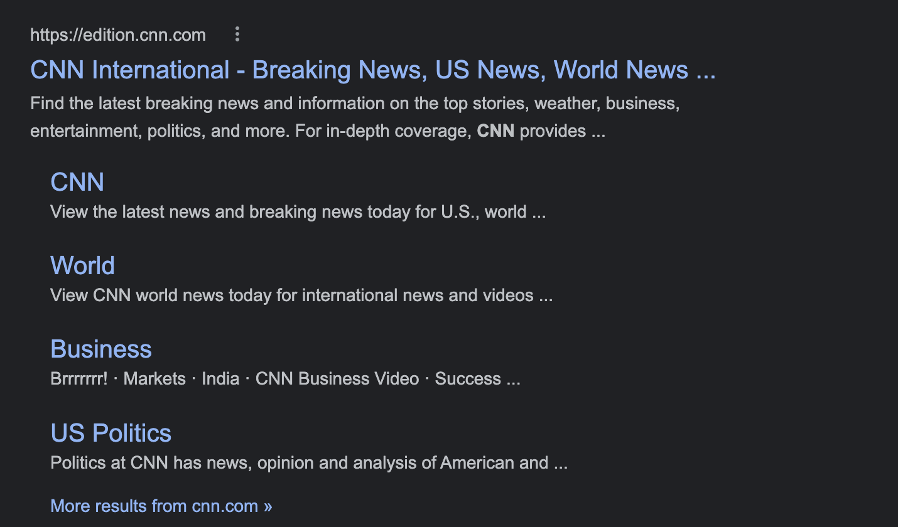

# {{page.title}}
<span style = "color: #A39FAD">Last modified: {{page.last_modified_date}}</span>


## index.html
대부분의 웹 서버는 디폴트로 index.html을 먼저 살펴봄 (index는 처음이라는 뜻)

## html 단축키 (feat. VS code)
- 처음에 ```!``` 입력 후 enter 누르면 바로 html document 만들 수 있음
- status bar 은 class 대신 id을 사용했는데, 그 이유는 status bar은 한 개 밖에 없을 것이기 때문에!
- status bar 안에 세 개의 column이 있지만, column이라고 클래스명을 설정하면 나중에 분명 어디선가 column이 사용될 경우가 발생하기 때문에 아주 긴 클래스 이름을 사용할 것임<br>```<div class="status-bar__column"></div>```<br>이런 방식은 BEM(Block Element Modifier)이라고 부름
- html 주석: ```<!--어쩌구저쩌구-->```

## 6.2 BEM
### BEM (Block Element Modifier)
- BEM은 대체로 아래와 같은 형태를 띈다. 클래스명만 봐도 어떤 역할을 하는지 쉽게 알 수 있다는 장점이 있고, 많은 경력 개발자들은 BEM의 형태를 사용한다.

```
.accordion {
	max-width: 500px;
	margin: 4rem auto;
	width: 90%;
	font-family: "Raleway", sans-serif;
	background: #f4f4f4;
}
.accordion__title {
	font-size: 0.7rem;
	text-transform: uppercase;
	letter-xpacing: 2px;
	padding: 1rem 1.5rem;
	background: #5B5F97;
	color: white;
	cursor: pointer;
	transition: .3s ease;
}
.accordion__title:hover {
	background: #484b77;
}
.accordion__copy {
	display: none;
	padding: 1rem 1.5rem 2rem 1.5rem;
	color: gray;
	line-height: 1.6;
	font-size: 14px;
	font-weight: 500;
}
.accordion__copy--open {
	diaplay: block;
}
```

- 혹은 html안에서는 아래와 같은 형태로 생겼다.

```
<a class="btn btn--big btn--orange" href="https://css-tricks.com">
	<span class="btn__price">$9.99</span>
	<span class="btn__text">Subscribe</span>
</a>
```


## 6.3 Font Awesome
[Font Awesome](https://fontawesome.com/)은 웹개발을 할 때 아이콘들을 쉽게 가져다 쓸 수 있는 도구이다. 회원가입을 하고 나면 메일을 통해 자바스크립트 파일인 code kit 스크립트를 받게 된다.

{: width="100%" height="100%"}


- 스크립트 코드는 내가 font awesome을 사용할 파일의 코드 내에 넣으면 되는데, 항상 body 안에서 마지막 부분에 있어야 한다.
- 그 후 font awesome에서 사용할 아이콘을 찾고 코드를 복사하여 아래처럼 내가 사용하고자하는 코드 안에 붙여넣어 사용하면 된다.

```
<div class="status-bar__column">

<span>No Service</span>

<i class="fa-solid fa-wifi"></i>

<!-- To Do: Wifi Icon -->

</div>
```

- 아이콘을 크게 사용하고 싶다면 혹은 작게 사용하고 싶다면 Font Awesome에서 다른 배수의 이미지를 사용하면 된다.

## 6.5 Status bar CSS
### 폰트 Import
구글 폰트에서 사용하고 싶은 폰트를 선택한 후 아래처럼 Use on the web부분에서 @import를 위한 텍스트를 복사할 수 있다.
{: width="100%" height="100%"}

복사한 후엔 style.css 파일 안에 상단에 그 코드를 넣어주면 된다.

```
@import url('https://fonts.googleapis.com/css2?family=Open+Sans:wght@400;600&display=swap');

body {
	font-family: "Open Sans", san-serif;
}
```

### reset.css
브라우저는 우리가 원치 않는 마진 값 같은 것이 자동으로 적용되어있기도 하다. 이런 자동 마진 값을 삭제하려면 reset.css 파일을 css 폴더 하위에 생성하고 구글에 검색하여 얻어온 reset css의 코드를 붙여넣어주면 된다.

그 후엔 style.css 파일에 가서 ```@import``` 를 통해 reset.css 파일을 넣어주면 된다.

```
@import "reset.css";
```


### variable 관리
아래와 같이 variables.css 파일을 따로 만들어주면 자주 사용하는 값을 따로 설정하여 사용할 수 있다. style.css 파일 안에서 불러오는 것을 까먹지 않아야 한다.

{: width="100%" height="100%"}

아래처럼 style.css 파일 안에 variables.css 를 불러오면 ```var(--변수값);``` 을 통해 사용할 수 있다.

```
@import "variables.css";

#login-form input:focus {
	border-color: var(--yellow);
}
```

## 6.8 Log In Form part Two
### not 프로퍼티
어떤 값이 아닐 때 어떤 style을 적용해주고 싶을 땐, not을 사용할 수 있다.
```
#login-form input:not([type="submit"]){
	border-bottom: 1px solid rgba(0, 0, 0, 0.2);
	transition: border-color 0.3s ease-in-out;
}
```

### inherit
아래처럼 interit으로 설정을 해주면 부모의 값을 받아오도록 설정할 수 있다.
```
#login-form a {
	text-align: center;
	text-decoration: none;
	color: inherit;
}
```

### cursor: pointer;
클릭할 수 있는 버튼에 마우스를 올렸을 때 나타나는 손가락 모양 커서는 ```cursor: pointer;``` 를 통해 사용할 수 있다.


## 6.9 Recap and Forms
### action
action은 어떤 페이지로 data를 보낼건지 지정할 수 있다.
action에서 사용할 수 있는 method는 두 가지 방식이 있다.
1. POST: 백엔드 서버에 데이터를 전송하는 방식
2. GET: GET은 보안에 취약하다. 그렇기 때문에 URL에 보여도 문제가 없는 데이터들을 GET에 사용해야 한다.

이 프로젝트에서는 서버가 따로 없기 때문에 GET을 사용.


## 6.10 Navigaion Bar part One
ul과 li로 이루어진 nav를 잘 사용하면 google에서 사이트를 검색했을 때, 내비게이션 구조가 잘 노출이 된다. 아래는 구글에 CNN을 검색했을 때 보이는 내비게이션의 예시이다.

{: width="100%" height="100%"}

VS code에서 아래처럼 작성을하면 nav 안에 ul 안에 li 안에 a가 있는 구조를 쉽고 빠르게 만들 수 있게 해준다.
```nav>ul>li*4>a```

흔히 내비게이션에서 볼 수 있는 더보기의 아이콘은 ellipsis라고 부른다.


## 6.11 Navigaion Bar part Two
- 같은 값 다중 선택: command + D
- ```position: fixed;``` 를 사용하여 status bar이랑 navigation bar은 위 아래에 붙어있도록 설정해야 한다. 
- ```box-sizing: border-box;``` 를 사용하면 패딩 값을 신경쓰지말고 박스 크기를 설정하라는 것이다.


## 6.13 Navigation Bar part Three
- position: absolute를 사용하면 메세지 아이콘의 위치와 상관없이 메세지 아이콘 위에  새 메세지 표시를 올릴 수 있다.

## 6.14 
