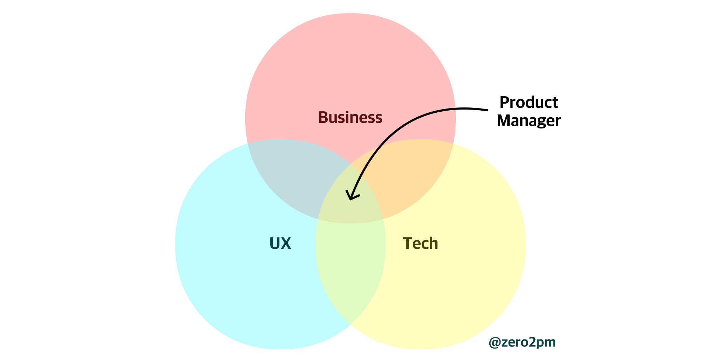
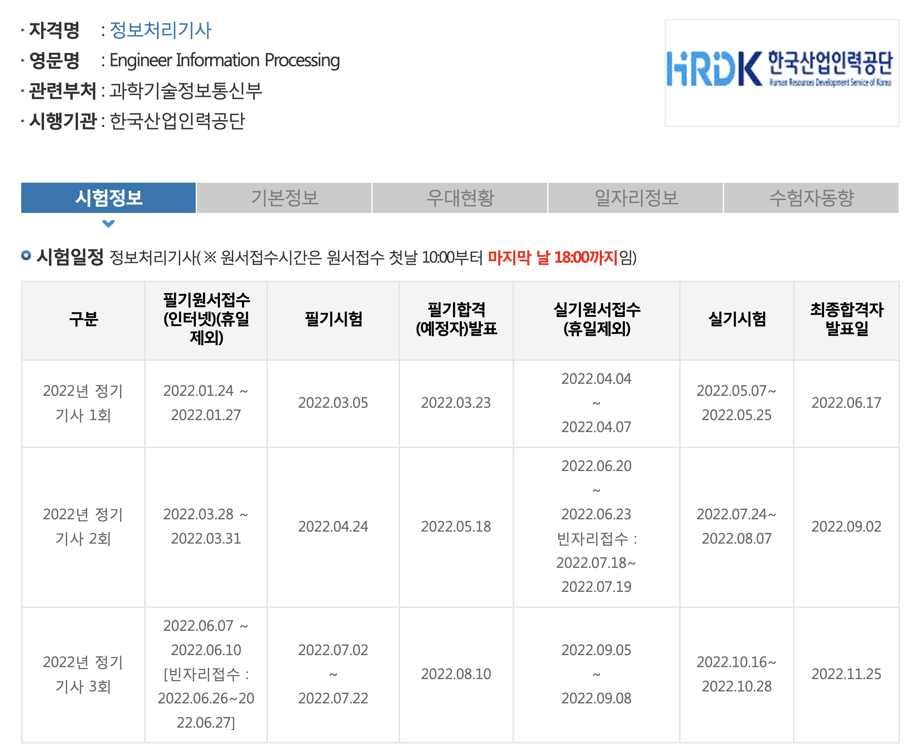

<!--
내가 스스로를 생각했을 때, 나는 PO 혹은 PM이 되어야겠다고 생각했다. 서비스를 운영하며 내가 그 다른 누구보다 서비스에 대한 애착과 주인의식을 가지는 것을 보며 어느샌가 그렇게 다짐을 하게되었다.

하지만, 프로덕트디자이너로 커리어패스를 시작하다보니 그 길이 쉽지는 않을 것이라고 감히 예상한다. 흔히들 PM이 하는 일에 대한 정의를 할 때, 아래와 같은 이미지로 설명한다.

 {: width="100%" height="100%"} 

그렇다면, 나는 이 3개를 충족하는 사람인가? 여기서 "충족하는"은 어떻게 증명할 수 있을까?

## UX 
사실 이미 HCI를 전공하고, 프로덕트디자이너로 커리어를 발전시켜왔음에도 이 부분은 증명을 하기 어렵다. 그저 "기존 프로덕트에서 사용자들이 OO을 불편해하는 것을 OO을 통해 발견하였고, OO으로 개선하여 OO의 결과를 만들어냈습니다."가 지금까지 나의 최선이었다.

그럼에도, 이미 기본 베이스가 조금 있기 때문에 더 심화학습을 하기 다른 2가지보다 더 원활할 것이라고 예상한다. 우선은 유명 HCI 아티클들을 읽으며 기존에 알던 내용들을 다시 한 번 정리하고자 한다.

## Tech
아무래도 PM은 제품이 어떻게 구현될 것인지에 대한 개발의 측면을 함께 생각할 수 있을 때, 추가적인 장점을 어필할 수 있다. 이런 이유로 실제로 개발자 출신의 PM을 선호하는 것도 있다. 하지만, 나에게는 이 부분을 어필할 수 있는 것이 없으므로, 나의 능력을 증명해 줄 수단이 필요하다.

따라서, 중장기적으로 PMP 자격증과 내년 초에 있는 정보처리기사 자격증을 따기로 했다. 아쉽게도 정보처리기사는 내년 초에야 접수를 할 수 있다.

 {: width="100%" height="100%"} 

## Business
사실 비즈니스를 온전히 고려하여 설계할 수 있음을 증명하기엔 MBA 학위가 가장 적합하지 않을까 싶다. 하지만, 나는 우선 UX와 Tech 기반의 PM을 목표로 설정하고자 한다. 너무 많은 것을 고려하다간 오히려 방향성을 잃을 수 있다는 우려가 있다.

하지만, 그럼에도 매 주 특정 서비스가 왜 이런 구조로 비즈니스를 형성했을지 고민해보는 시간을 가지고자 한다. 

새로운 회사를 가더라도 배움을 늦추지 말고 꾸준히 성장하여 PM이 될 수 있도록 해야겠다. 

--!>