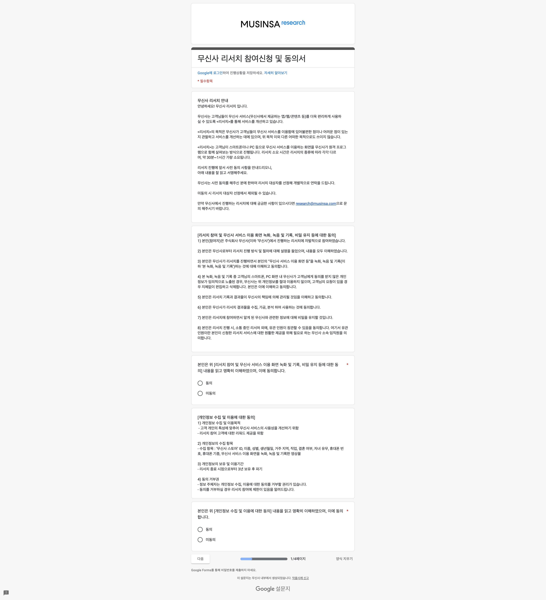
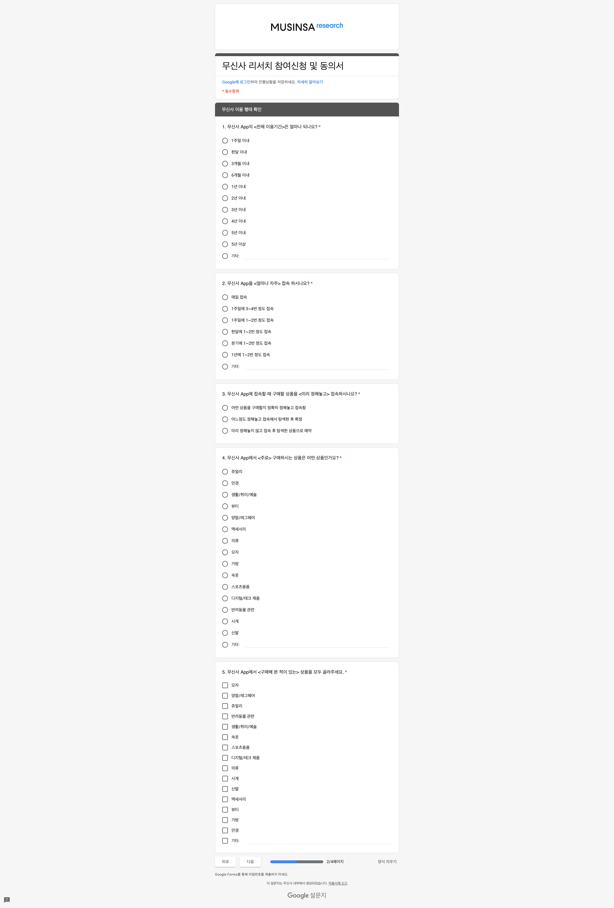
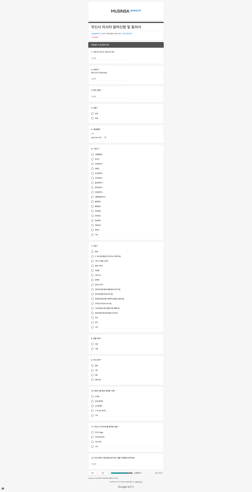
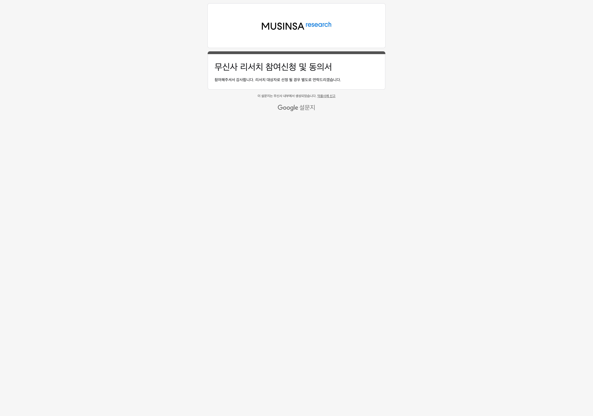

# {{page.title}}
Last modified: {{page.last_modified_date}}

## 사전 참여신청 과정

무신사 리서치 그룹은 [무신사 리서치 카카오 채널](http://pf.kakao.com/_ryXzK)을 통해 운영이 되고 있고, 카카오톡 대화방 안에서 리서치 패널로의 신청이 가능하다. 리서치 패널은 구글 설문조사를 통해 [무신사 리서치 참여신청 및 동의서](https://docs.google.com/forms/d/e/1FAIpQLScl65kdqIbnBvS6LRuimK5qiehKlVPxtc0kgE3WXTfY1bE7lg/viewform)를 작성하여 신청할 수 있다.

참여신청의 과정은 아래와 같다.
**리서치 참여 동의서 작성 - 무신사 이용 행태 확인 - 개인정보 수집 항목 입력 - 신청 완료**

스크린샷으로 레퍼런스를 첨부해놓고 추후에 참고자료로 사용하면 좋을 것 같다.

{: width="100%" height="100%"}
{: width="100%" height="100%"}
{: width="100%" height="100%"}
{: width="100%" height="100%"}
{: width="100%" height="100%"}
