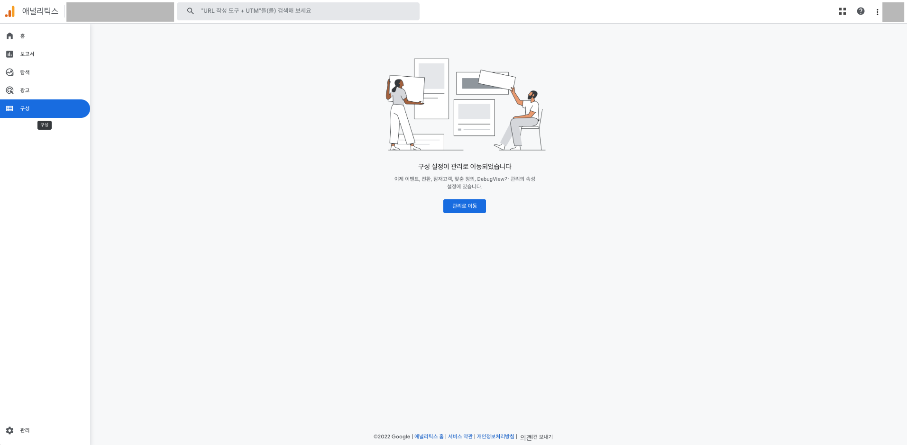
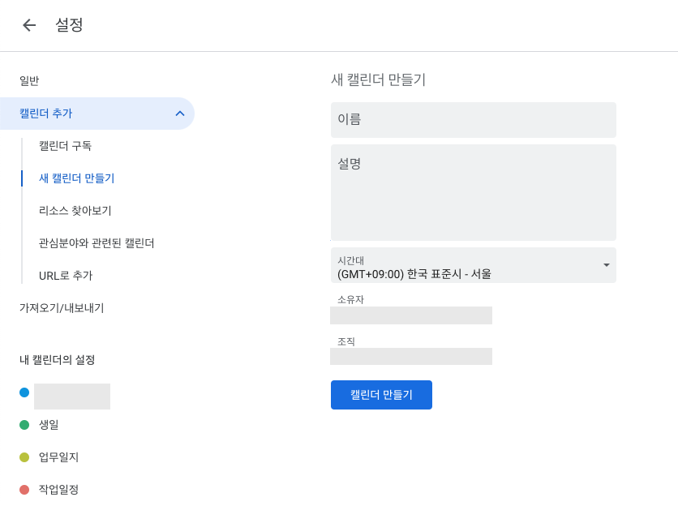
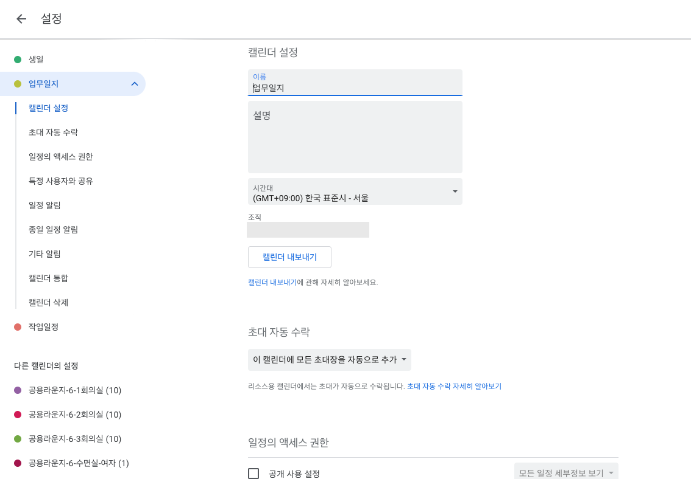

# {{page.title}}
Last modified: {{page.last_modified_date}}

## Google Analytics 4 구성 메뉴 삭제

서비스에서 기능을 제거하거나 이동하면 이용자들이 당황할 수 있는데, 그런 상황을 Google Analytics 4는 아래의 이미지처럼 처리했다. 일정 기간동안 그 기능의 페이지는 유지하되, 어디로 이동했는지 설명해두고 일정 기간이 지나면 페이지를 삭제할 것 같다.
{: width="100%" height="100%"}
오늘(2022-12-07) 기준으로 언제 GNB에서 삭제되는지 확인해봐야겠다..!

## Google Calendar 새 캘린더 만들기
구글 캘린더에서 새 캘린더를 만들 때는 최소한의 데이터만 받도록하고, 추후에 설정에 들어가서 더 자세한 설정을 할 수 있도록 해두었다. 하지만, 내 입장에서는 처음 설정할 때 그 칸들이 없으니까 당황스러운 생각이 들었다.

심플하지만 심리적 부담감을 낮추는 것이 중요할까 혹은 심리적 부담감이 있더라도 상세 정보까지도 받도록 하는 것이 좋을까.

아니면 추후에 상세페이지에서 00, 00, 00을 할 수 있습니다 같은 정보를 공유해주는 것이 좋을까?

{: width="100%" height="100%"}

{: width="100%" height="100%"}