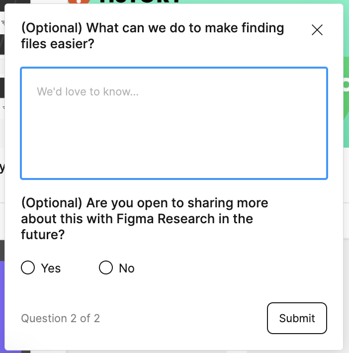

# {{page.title}}
Last modified: {{page.last_modified_date}}

## 피그마 파일 검색 후 설문조사

이 전 단계에서는 '내가 찾고 있는 파일을 찾기 쉽다'에 대한 의견을 5점 척도 기반으로 물어보았다.
질문의 위에 있는 참여 유도 문구로는 "Quick research!" 같은 말을 사용했었다. 하지만 뒤로가기가 없어서 전 단계를 캡쳐하지 못했다.

다음 단계에서 어떻게 해야 더 쉽게 만들 수 있을지에 대한 사용자의 의견 조사
{: width="100%" height="100%"}