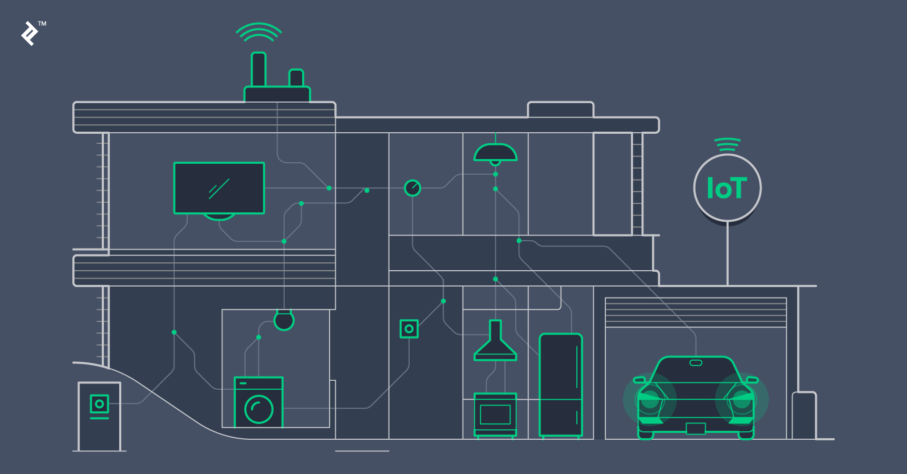

# Intelligibility and Accountability: Human Considerations in Context-Aware Systems

## 간략한 요약

상황 인식 시스템은 인간의 관점에서 집중해야하는 상황에 대한 정의를 내려야 한다. 하지만 그런 상황들은 감지되지 못하는 상황도 있고 혹은 기술적인 방법에 의해 추론되지 못할 수도 있다. 이런 상황에 대하여 인간적 측면에서 가이드를 주는 Design Framework가 필요하다. 이 글은 그런 Design Framework를 제안하고자 한다.

  

## 상세한 정리
{: width="100%" height="100%"}

### Context Aware Building
[예시] e.g., 상황 인식 빌딩 → 소리를 입력하여 도큐멘트에 저장 ⇒ 누군가 그 빌딩에게 당신의 위치를 요구하고 커뮤니케이션 채널을 열어줄 것을 요청 ⇒ 이 상황을 인식한 빌딩은 무엇을 해야하는가?

-   당신이 있는지 여부와 위치, 상태 정보 노출 ? e.g., 당신은 일하고 있지만 이야기 가능하다고..
-   혹은 단순하게 연결을 시켜줘야하는가?
-   혹은 누가 연결을 원하는지 알리고 연결에 대한 허락을 구해야하는가?
-   혹은 시스템이 당신이 바쁘다는 것을 인지하고 발신자에게 연결 불가능하다고 알려야하는가?

이런 상황에서 시스템은 확실하게 감지되지 않고 알 수 없는 수많은 요소들에 의존해야 한다.

그리고 궁극적으로 결정할 수 있는 독립체는 바로 '당신'이다.

문제점 1. 하지만, 인간도 스스로에 대한 것과 상황의 사회적 측면을 표현하지 못했다. ⇒ 결국 기계도 우리를 대체하여 자동적인 행동을 할 수 없다.

해결 1. **디자인 원리**가 필요하다.

→ 특정한 상황적인 디테일을 만드는 것

→ 원칙적인 방식으로 사용자에게 시스템의 추론을 보여주는 것

→ 가능한 시스템의 행동을 제어하는 효과적인 수단을 제공하는 것

문제점 2. 기존의 컴포넌트 기반의 접근은 디자이너가 시각화와 제어를 할 수 없었다.(있는 컴포넌트 밖에 쓸 수 없기 때문에)

해결 2. 기존의 컴포넌트가 할 수 없던 능력을 수행하기 위해 컴포넌트를 개조하고 늘려야 한다.

## Human Considerations in Context

-   기본적인 상황 인식: 환경에 대한 반응성
-   상황의 인간적 측면: 사람에 대한 반응성
-   상황의 사회적 측면: 사람간의 반응성  

## 상황 인식 시스템의 이해가능함과 책임감을 위한 프레임워크

프레임워크는,
-   사용자가 이해할 수 있어야하고
-   다른 사용자들과 시스템 그 자체에 대한 책임을 져야한다.

⇒ 이로써 상황 인식 시스템이 유용하고, 예측가능하고, 안전할 수 있다.

### 이해가능함과 책임감을 위한 상황 인식 원칙

1.  현재 상황 시스템의 능력과 이해도에 대한 것을 사용자에게 알려라
2.  피드백을 제공해라: 
   -   Feedforward: 내가 이것을 하면 어떤 일이 일어날 것인가?
   -   Confirmation: 내가 하고 있는 것이 무엇인지와 내가 무엇을 완료한 것인가?
3.  공공연하지 않은 제한된 정보로 신원이나 행동을 공유해라: 
   -   그들은 누구인지
   -   그들이 무엇을 하고 있는지
   -   그들이 무엇을 완료했는지
4.  사용자에게 시스템과 다른 사용자가 그에게 영향이 가는 행동을 할 때 취할 수 있는 제어 능력을 줘라. 특히 취향의 차이의 경우에.

### 인간 중심에 대한 상황의 세부 요소

1.  개인의 정보에 대한 공유(e.g., 상호간의 관계, 나의 상태 혹은 직군 같은 것), 이것을 개인이 스스로 수정할 수 있어야 함
2.  누군가의 상황에 대한 접근 혹은 상황의 시작.
3.  상황 속 다른 사람 혹은 자신의 존재 여부. (위치와 상태 포함)
4.  누군가 상황을 떠나는 상황 혹은 상황의 종료.
5.  자신과 타인의 행동 또는 데이터의 상황 및 가용성. "참여" "바쁘다" "나감" "통화중" "대기중" 같은 상태 추상화와 "공용" "공유" "제한적" "비공개" 같은 가용성의 상화 포함.
6.  상황에 따른 정보 수집 (e.g., 비디오, 신원, 위치, 활동)
7.  상황의 정보 구조 (i.e., Dey et al's의 관점에서 데이터가 어떻게 해석되고 집계, 저장 되는지)
8.  상황에서 시스템에 의해 혹은 사람에 의한 정보에 대한 접근
9.  목적: 상황의 정보가 어떻게 사용되는가 (시스템 혹은 사람에 의해; e.g., 보기, 복사, 수정, 혹은 보존, 저장)
10.  상황의 종류: 상황에 대한 통제, 사회 규칙 혹은 그 규칙의 기술적 구현에 대한 정보. "강의", "회의", "도서관", "전시", "인터뷰"와 같은 친숙한 구절들을 규칙들을 구조화하기 위해 은유적으로 쓸 수 있다.

## 나의 의견

실제로 Smart home 에서 어떻게 적용되고 있는지에 대한 것이 궁금했으나 찾아보지 못했다. 스마트 스피커를 기준으로 생각하면 현재는 양방향 소통보다는 단방향인데, 어떻게 해야 조금 더 편리한 양방향 소통이 가능할지에 대한 실제 환경 기반의 상세한 가이드라인이 필요하다고 생각한다.

> Reference 
> Bellotti, V., & Edwards, K. (2001). Intelligibility and accountability: human considerations in context-aware systems. _Human–Computer Interaction_, _16_(2-4), 193-212.
