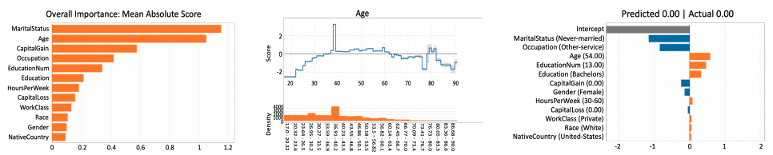

## 간략한 요약

ML(Machine Learning)이 학문적 범위를 넘어서 엔지니어링 분야로 확장되고 있는데, 그에 따라 Interpretability Tools들이 디자인되었다. 그런 툴들로는 the InterpretML implementation of GAMs, the SHAP Python package 가 있다. 하지만 이런 툴들이 목적을 얼마나 달성했는지에 대한 평과가 거의 없었고 과학자들이 ML models를 만들고 평가할 때 일어나는 문제들을 알아내기 위해 어떻게 Interpretability tools를 이용하는지 상황적 연구와 서베이를 진행하였다. 그 결과 과학자들이 Interpretability tools를 맹신하고 잘못 사용한다는 것을 알아낼 수 있었고, 더욱이 시각적인 결과를 정확하게 묘사하는 참가자가 거의 없었다.

  

## 상세한 정리

### 연구 목적

데이터사이언티스트(DS)들이 Interpretability tools를 어떻게 이용하고 있는지 확인하기 위하여
+ ML 모델들이 데이터에서 사회적인 차별을 확장시키고 불평등한 결과를 이끄는 것이 발견되어서
+ 디버깅하기 위하여

### 연구 방법
리서치 전 → Pilot Interviews를 이용하여 DS가 겪는 흔한 문제들을 조사
Contextual Inquiry → DS가 Interpretability tools를 이용하여 위에서 발견된 문제를 어떻게 해결하는지 보기 위하여
Survey → Contextual Inquiry에서 발견된 것을 키우고 양적화하기 위하여 + DS의 Interpretability tools에 대한 멘탈모델을 밝히기 위해

⇒ ML모델을 만들고 평가하는 측면에서 기존에 존재하던 2가지 Interpretability tools를 인간적 측면에서 평가한다.

  
**Interpretability tools 2가지**

1) InterpretML implementation of GAMs
2) SHAP Python package(post-hoc)

### Interpretability

1) 기본적으로 해석가능한 도구 = 단순한 모델
e.g. Point Systems, GAMs(Generalized Additive Models)

2) 사후의 해석을 해주는 도구 = 복잡한 모델
e.g. Local Interpretable Model-Agnostic Explanations(LIME), Shapley addictive explanations(SHAP)

  

### 연구 내용

**파일럿 인터뷰로 밝혀낸 DS가 겪는 흔한 문제들**

1) 값의 누락
2) 데이터의 변경
3) 중복데이터
4) 중복기능
5) 임시 분류
6) 디버깅의 어려움

**Contextual Inquiry**

참가자 11명 + 주피터 노트북 + 데이터(ML 모델) + Interpretability 도구 + 질문지

**GAMs: Glassbox models**
{: width="100%" height="100%"} 

 
 

**SHAP: Blackbox models**
{: width="100%" height="100%"} 

  

결과: Interpretability tools의 의도된 사용과 DS의 이해도 사이에 불일치가 발견되었다. Over- or Under-used 하였음.

  

**Survey**

참가자 197명

GAM-Normal / GAM-Manipulated / SHAP-Normal / SHAP-Manipulated 비교

결과: GAM-Normal vs SHAP-Normal 과 GAM-Manipulated vs SHAPManipulated 사이에서는 확연한 결과의 차이가 보였음

Normal vs Manipulated Visualizations에서는 결과의 차이가 보이지 않았음

{: width="100%" height="100%"} 

참가자들이 평균적으로 기본 모델이 합리적이라고 확신하지는 않았지만 데이터 세트 또는 모델에 대한 의혹이나 해석 가능성 도구에 대해 명시적으로 언급한 사람은 거의 없었다. 또한 일반적으로 모델이 사용될 준비가 되어있다고 생각했다.

  

### 연구 결과

과신뢰 & 오사용
→ 시각화 도구가 무엇을 의미하는지 모르는 참가자들이 더 많았다
→ ML 모델들에서 이상한 부분을 발견했음에도, 모델을 사용할 수 있을 것이라고 믿어버렸다.

---

  

## 나의 의견

  

Interpretability tools는 중요한 영향을 미칠 것이기 때문에 위와 같은 연구는 일정한 주기에 따라 실행되어야 한다고 생각한다.

또한 데이터의 시각화 이외에 다른 Interpretability 방식은 없을지에 대한 연구도 필요하지 않을까 싶다.

> Reference 
> Kaur, H., Nori, H., Jenkins, S., Caruana, R., Wallach, H., & Wortman Vaughan, J. (2020, April). Interpreting interpretability: understanding data scientists' use of interpretability tools for machine learning. In _Proceedings of the 2020 CHI conference on human factors in computing systems_ (pp. 1-14).
