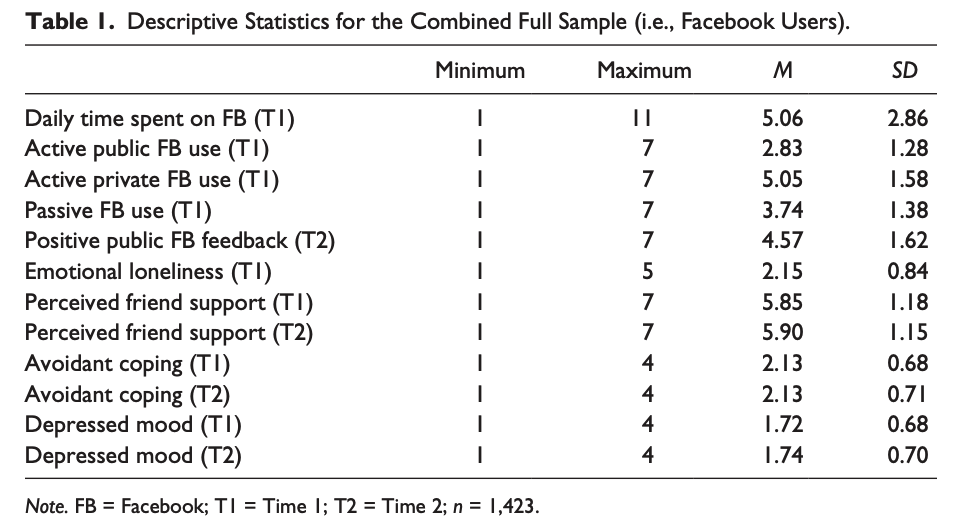
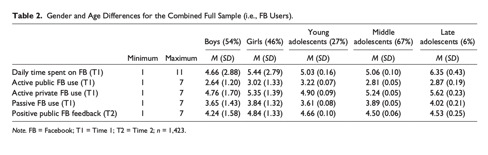
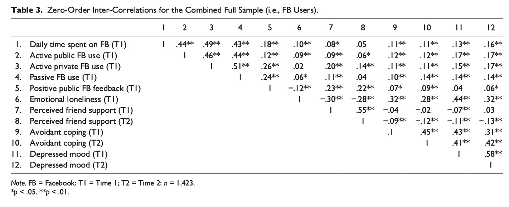

# Toward an Integrated and Differential Approach to the Relationships Between Loneliness, Different Types of Facebook Use, and Adolescents’ Depressed Mood

## 간략한 요약

이 연구는 청소년기의 소셜네트워킹사이트 사용에 대한 예측변수 혹은 결과에 대한 연구.
기존의 연구들은 (1) 하나의 포괄적인 모델로 접근하는 통합적이지 않고 종단 연구가 없었다. (2) SNS 사용의 다양한 타입에 따른 차이를 확인하는 다양한 접근이 없었다.
그렇기 때문에 외로움과 페이스북 사용의 특정한 타입과 청소년의 우울한 감정의 관계를 더 자세하게 들여다보는 통합적이고 다양한 모델으로 접근하였다.
외로움은 청소년의 페이스북 활동과 다르게 관련될 수 있으며, 이는 다시 청소년의 복지를 다르게 예측할 수 있다.

  

## 상세한 정리

### 결론은, A poor - get - richer & A poor - get - poorer

Loneliness: 청소년기에 급증, 청소년은 동시에 발생하는 신체적 사회적 인지적 변화를 겪으며 이는 자아에 대한 불확실성을 형성한다. → Avoidant Coping: 문제를 거부하거나 축소하기 위한 인지적+행위적 시도 → Increase Depressive Symptoms

### 페이스북 사용의 세가지 유형

페이스북은 게시물 작성, 뉴스피드 읽기 처럼 사용할 수 있는 기능이 다양하므로 이를 토대로 사용 유형을 세가지로 나누어 보고자 함.

우선 이는 Active와 Passive로 나뉘어짐

Active: 사용자 사이의 상호작용을 용이하게 하는 활동들

Passive: 사용자가 페이스북 콘텐츠를 활용은 하지만 콘텐츠를 제작한 사람과의 소통은 하지 않음.

1.  (Active)Public Facebook Use: 모두가 볼 수 있는 곳에서의 직접적인 인터랙션을 하는 것(ex. 게시물 업로드)
2.  (Active)Private Facebook Use: 직접적인 소통을 개인적인 설정에서 하는 것(ex. 페이스북 메신저)
3.  Passive Facebook Use

### Uses and Gratifications(U&G) theory - Kanz, Hass, & Gurevitch, 1973

-   개개인이 그들의 니즈를 만족시키기 위해 어떻게 미디어를 사용하는지를 시험,
-   사용자가 미디어와 미디어 콘텐츠를 그들의 개인적인 니즈를 만족시키기 위해 적극적으로 선택한다.

### Social Media Affordances - Gibsons, 1986

-   사용자가 페이스북을 이용하는 타입이 그들의 사회적 지지를 인지하는 정도에 영향을 준다는 가설을 뒷받침.

***사회적 지지에 대한 인지(Perceived emotional support)**: 대상자가 자신이 사랑받고 있고 존중받으며 가치있고 소통과 상호 의무 네트워크에 속해있다고 생각하게 만드는 정보

### 가설

1.  외로움은 청소년의 수동적인 페이스북 사용에 + 영향을 준다.
2.  외로움은 청소년의 적극적인 공공연한 페이스북 사용에 + 영향을 준다.
3.  외로움은 청소년의 적극적인 개인적 페이스북 사용에 - 영향을 준다.
4.  수동적 페이스북 사용은 청소년의 사회적 지지에 대한 인식을 - 시킬 것이다.
5.  적극적인 공공연한 페이스북 사용은 청소년의 사회적 지지에 대한 인식을 + 시킬 것이다.
6.  적극적인 개인적 페이스북 사용은 청소년의 사회적 지지에 대한 인식을 + 시킬 것이다.

{: width="100%" height="100%"} 

{: width="100%" height="100%"} 

 {: width="100%" height="100%"} 

### 연구 결과 정리
1. H1 외로움은 청소년의 수동적 페이스북에 영향 → H4 청소년의 친구들의 사회적 지지에 대한 인지 감소
2. H2 외로움은 청소년의 적극적인 공공연한 페이스북 사용에 영향 → H5 청소년의 친구들의 사회적 지지에 대한 인지를 증가
3. H3 Not Supported
4. H6 적극적인 개인적 페이스북 사용은 청소년의 사회적 지지에 대한 인식을 중가시킨다.

 즉, A poor-get-poorer: 외로운 청소년은 페이스북을 수동적으로 이용하고 그 결과 부정적인 결과(사회적 지지에 대한 인지 감소)를 얻는다. 
A poor-get-richer: 외로운 청소년은 페이스북을 적극적이지만 공공연하게 이용하고 이를 토대로 긍정적인 영향(사회적 지지에 대한 인지 증가)를 얻는다.

## 나의 의견
외로운 청소년은 페이스북을 수동적으로만 이용할 줄 알았는데, 적극적으로 이용하는 모습도 있다는 것이 신기했다. 하지만 이와는 다른 관점에서 페이스북이나 인스타그램을 이용하는 사람과 이용하지 않는 사람의 사회적 지지 혹은 자아존중감에 대한 인식은 어떨지에 대한 점이 궁금했다.

> Reference 
> Frison, E., & Eggermont, S. (2020). Toward an integrated and differential approach to the relationships between loneliness, different types of Facebook use, and adolescents’ depressed mood. _Communication Research_, _47_(5), 701-728.
