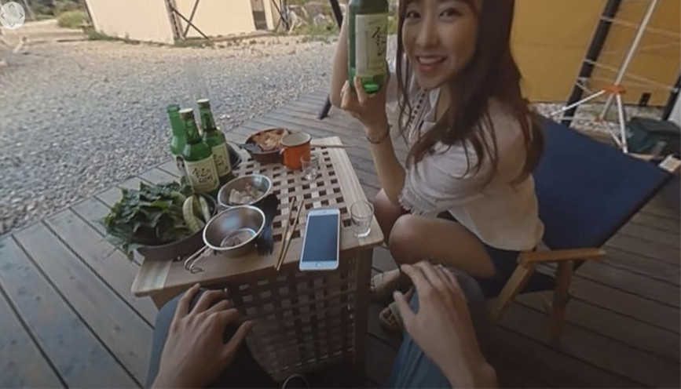
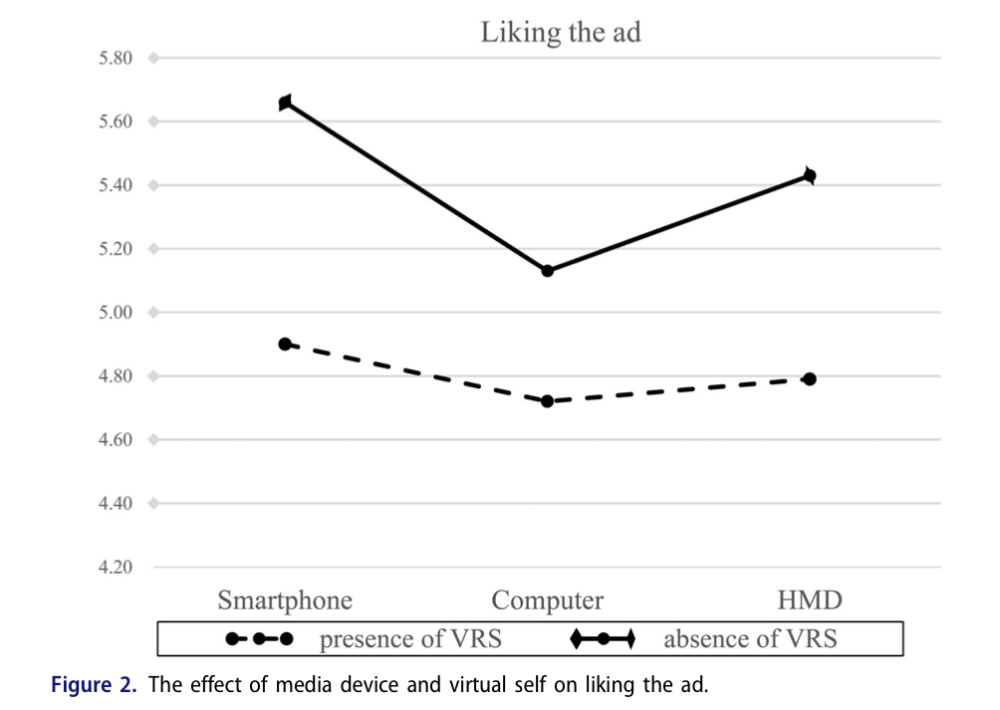
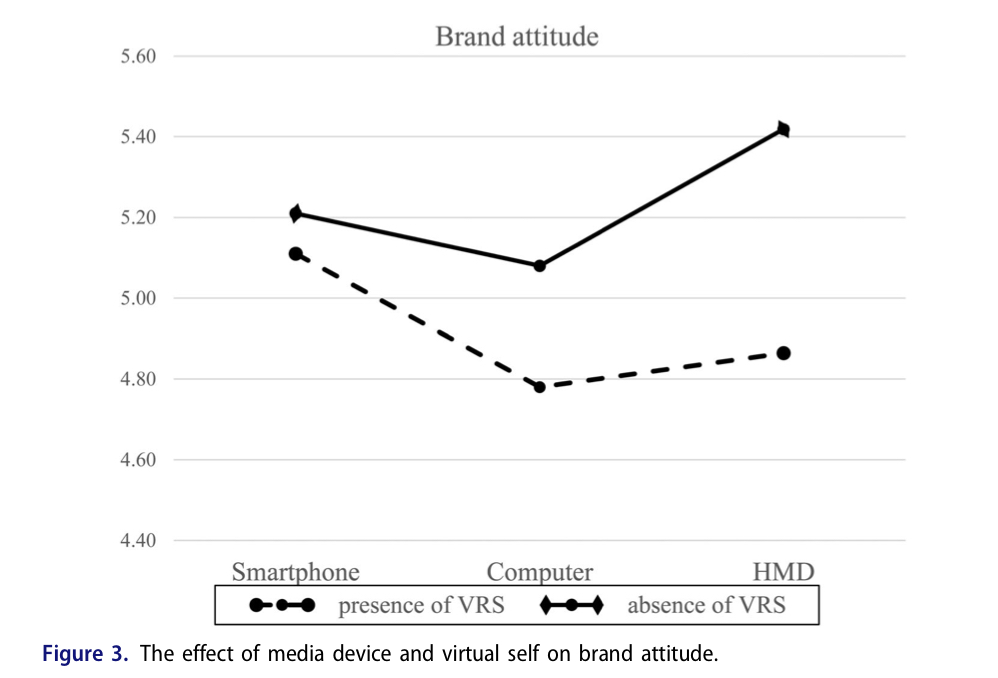
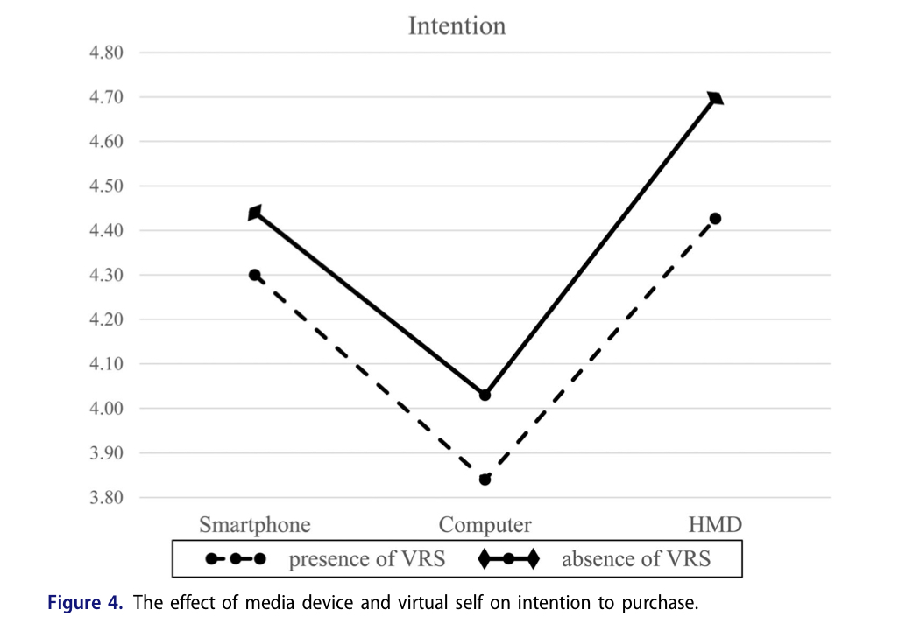

# Virtual reality advertising with brand experiences

## 간략한 요약

### 실험

2 (VRS: 있음 vs. 없음) X 3 (미디어 기기: 스마트폰 vs. 컴퓨터 vs. 헤드마운트 디스플레이)

### 결론

VR에서 VRS(Virtual representation of the self)가 없으니 광고에 대한 긍정도가 올라갔다. 또한 광고된 브랜드에 대한 우호적 태도도 높아졌다.

*VRS(Virtual Representation of the self)

= 자신을 닮은 것을 표현하는 인간 디지털 대체물

= 기존 광고에서 등장하는 광고 인물 (VR은 그게 자신이라는 점이 다르다)

  

## 상세한 정리

### 도입부

3D View에 대한 트렌드: Youtube, Facebook, [New York Times](https://www.nytimes.com/video/360-travel)(카드보드 제공)

⇒ 모두가 스마트폰이 있다는 전제하에, VR이 가까운 미래에서 일상이 될 것이다.

⇒ 이에 더해 코로나로 인해 집콕생활이 늘어났으니 VR 콘텐츠와 광고가 그들의 삶에서 더 많이 소비될 것이다.

**그럼에도 불구하고, VR 광고가 사용자의 인식과 태도에 어떤 영향을 미치는지와 잠재된 이득을 극대화하기 위해 VR 광고를 어떻게 잘 사용할 수 있을지에 대한 연구가 아직 별로 없다.**
  
### GOALS

1.  VR 광고의 효과가 다양한 기기로 봤을 때 다른가.
2.  Virtual Representation of the self의 영향에 주목하여 효과적인 VR 광고를 만드는 전략
3.  어떤 VRS가 광고된 브랜드에 대한 사용자의 경험에 영향을 줄까

**RQ 1 a-c**: VR 광고를 다른 기기들(스마트폰/컴퓨터/HMD)에서 보는 것은 VR 광고 경험에 어떻게 영향을 주는가(a: 광고를 좋아하는지, b: 광고된 브랜드에 대한 우호적 태도, c: 광고된 제품을 살 의향이 있는지)

**RQ 2 a-c**: VRS가 있고 없을 때 무엇이 더 VR 광고에 선호도를 보이는가(a: 광고를 좋아하는지, b: 광고된 브랜드에 대한 우호적 태도, c: 광고된 제품을 살 의향이 있는지)

**RQ 3 a-c**: VRS와 VR 광고 경험에서 self-presence가 어떻게 그 둘을 중개하는지(a: 광고를 좋아하는지, b: 광고된 브랜드에 대한 우호적 태도, c: 광고된 제품을 살 의향이 있는지)
  
### 방법

2 (VRS: 있음 vs 없음) X 3 (미디어기기: 스마트폰 vs 컴퓨터 vs HMD)
  
### 도구

VR ad: 처음처럼 술

광고 2개 모두 같은 모델과 같은 브랜드 사용

→ 젊은 커플의 데이팅 시나리오를 1인칭 관점으로 보기: 여자친구와 테이블에 함께 앉아 광고되는 술을 함께 마시는 것, 여성이 주로 대화, 남성(self)는 광고의 시야 조작 가능

-   VRS X : 고개가 떠있고 자신의 어떤 부분도 보이지 않음
-   VRS O : 몸의 일부를 보여줌(콘텐츠의 일부가 됨) 
  {: width="100%" height="100%"} 
  
### 기구
-   스마트폰: 삼성 갤럭시 S7를 사용하여 유튜브의 VR광고를 풀스크린 화면으로 시청 → 스마트폰 자체를 이동
-   컴퓨터: 곰플레이어(VR용)가 설치된 컴퓨터를 이용하여 시청 → 마우스를 이용하여 이동
-   HMD: 삼성 기어 VR을 사용하여 오큘러스 모바일 플랫폼에서 광고 재생 → 고개를 이동
  
### 측정

**Liking the ad**

1. I think this ad is well made
2. I wand to recommend this ad to my friends
3. I want to watch ohter similar ads

**Attitude toward the advertised brand**

1. bad-good
2. dislike very much-like very much
3. unpleasant-pleasant
4. low quality-high quality
5. unfavorable-favorable

**Intention to purchase the advertised product**

1. I will consider buying this product next time
2. I will try this product next time
3. I am going to buy this product next time

**Self-presence**

1. I felt like as if I was sitting in the chair as the main model did
2. I felt like as if I was there while watching the ad
3. I felt as if I was there

### 결과

ANCOVA test 사용

1.  **광고가 마음에 들었는지(RQ1a, RQ2a)** 기기별 ⇒ No signifiant difference VRS 유무 ⇒ Significant difference (VRS-present > VRS-absence) 
   {: width="100%" height="100%"}
2. 광고된 브랜드에 대한 선호도(RQ1b, RQ2b) → positive or negative 기기별 ⇒ No signifiant difference VRS 유무 ⇒ Significant difference (VRS-present > VRS-absence) 
   {: width="100%" height="100%"}
3. 광고된 제품에 대한 구매 의향(RQ1c, RQ2c) 기기별 ⇒ No signifiant difference VRS 유무 ⇒ No significant main effect (VRS-present > VRS-absence) 
   {: width="100%" height="100%"}
  
### The mediation effects of self-presence

Presence : Physical, Social, Self-presence

Self-presence: 실제 가상현실 속에 본인이 존재하고 있는 듯한 느낌이 들 때 발생

**RQ3a-c** : **How self-presence would mediate the association between VRS and VR ad experiences**

RQ3a: **광고가 마음에 들었는지** ⇒ self-presence 가 VRS-absence와 Liking the ad를 연관시켰다. VRS-absence = Stronger self-presence

RQ3b: **광고된 브랜드에 대한 선호도 ⇒** self-presence가 VRS-absence와 선호도를 연관시켰다. VRS-absence = Stronger self-presence

RQ3c: **광고된 제품에 대한 구매 의향 ⇒** self-presence가 VRS-absence와 구매 의향을 연관시켰다. VRS-absence = Stronger self-presence

> Reference 
> Song, H., Kim, J., Nguyen, T. P., Lee, K. M., & Park, N. (2021). Virtual reality advertising with brand experiences: the effects of media devices, virtual representation of the self, and self-presence. _International Journal of Advertising_, _40_(7), 1096-1114.
