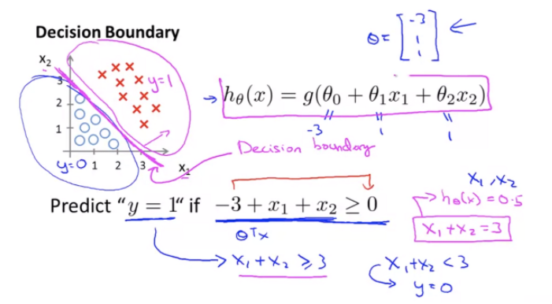
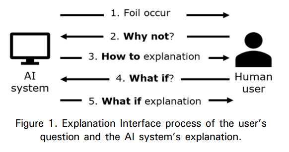
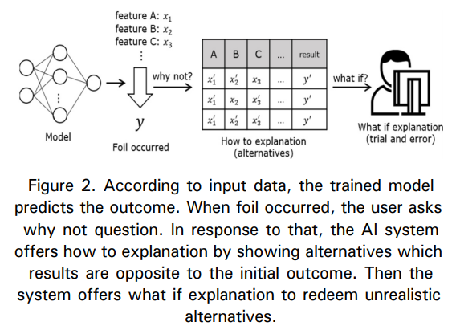
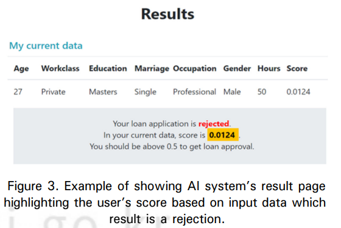
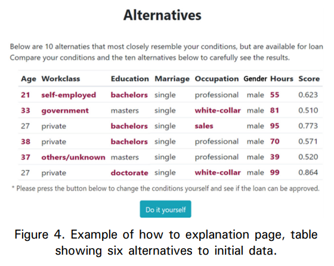
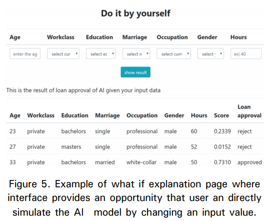
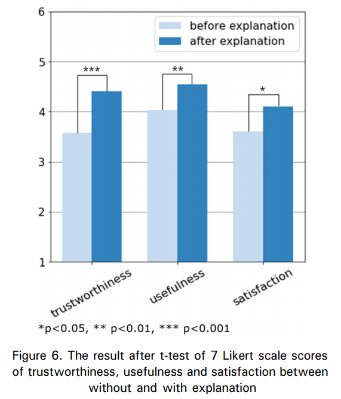

# 반 사실적 설명을 사용한 인공지능 시스템 설명 인터페이스 개발

## 상세한 정리

인공신경망 네트워크 → 자율주행 자동차, 범죄 예측 등 활용도가 높아짐

"심층 신경망 (Deep neural network)" = 수백만 개의 연산으로 예측 값을 도출하는 복잡한 비선형 함수

→ 신경망이 답을 도출하는 과정을 쉽게 이해할 수 없음

→ 시스템의 오용이나 불신을 초래, 사용자가 시스템을 사용하는 것을 꺼려하게 될 수도 있다.

{: width="100%" height="100%"}

⇒ 인공 신경망의 **결정 경계(decision boundary)**필요성 대두

⇒ 인과 관계를 이해하는데 도움이 되는 **설명가능 인공지능**의 필요성 대두

기존 머신러닝 모델의 문제점: 설명가능성(Explainability) ↔ 모델의 성능 ⇒ **"Trade-off"**

⇒ 인공 신경망의 높은 정확도는 유지하며 설명가능성이 높은 모델을 만들기 위한 연구

⇒ 대조적인 사례를 사용하여 **반 사실적(counterfactual) 설명**을 제공하는 방법

### 반 사실적 설명

기존 입력 값에 최소한의 변화를 주어 기존과 반대되는 결과를 도출할 수 있는 가상의 예시를 사용자들에게 보여주는 방법. /Miller의 연구에 따르면 **인공지능 시스템의 설명은 대조적**(coutrastive)이어야 한다. → 사용자가 예상했던 결과와 반대될 경우 사용자가 원하는 결과를 얻기 위해 입력 값이 어떻게 변형되어야 하는지 대안을 보여줌으로써 사용자에게 도움

⇒ 여기서, 문제점은 반 사실적 설명은 연속형 특성값(continuous input features)을 사용해서만 반 사실적 설명을 생성할 수 있다.

⇒ 불연속 특성값(discrete input feature, 성별이나 인종 같은)을 설명할 수 없다는 한계가 있다.

### How to / What if

How to, What if, Why not, Why

= Intelligibility question: 사용자들이 시스템을 사용하며 주로 묻을 수 있는 질문의 집합

⇒ **How to와 What if를 합쳐 반 사실적 설명**을 통해 반 사실적 사례 알고리즘이 도출해내는 비현실적인 방안을 사용자가 유용하게 사용할 수 있다.

결과적으로,

⇒ 시스템의 유용성(usefulness)을 향상

⇒ 사용자의 인공지능 시스템에 대한 이해와 만족도 향상(신뢰성, 유용성, 만족도)

### 선행 연구

**설명 가능한 인공지능**

사용자가 인공지능 시스템의 내부적으로 동작하는 과정과 최종적으로 도출되는 결과를 이해하고 해석할 수 있도록 알고리즘의 결과물이 생성되는 과정에 대한 설명을 제공하는 기술

⇒ Transparent 디자인 / 사후 설명(post-hoc explanation)으로 나눌 수 있다.

**Transparent**

-   투명성의 목표에 따라 크게 모델 전체 수준, 개별 구성 요소 수준(매개변수), 특정 학습 알고리즘 수준의 세 가지로 나눌 수 있다.
-   투명한 모델일 수록 모델 안의 요인과 매개변수를 직접적으로 분석할 수 있다는 장점이 있지만 심층 신경망은 일반적으로 정확도가 높아질수록 복잡성도 높아지기 때문에 모델의 설명가능성과 정확도 사이의 trade off가 있다는 단점
-   높은 정확도와 설명가능성을 동시에 만족시키기 위한 모델을 만들기 위한 연구가 진행되고 있다.

**사후 설명**

-   어떻게 모델이 작동하는지가 아니라 왜 그렇게 작동했는지를 밝히는 기술
-   복잡한 인공지능 시스템의 내부 논리를 이해하지 않고도 설명을 생성할 수 있다는 장점
-   접근 방식 네 가지

1.  모델의 결과와 입력 값간의 관계를 자연어로 나타내는 설명
2.  시각화 및 대화형 인터페이스를 사용한 설명
3.  지역 최적해 또는 근삿값을 사용한 설명
4.  반사실적 사례, 반례 등을 사용한 사례 기반 설명 등

**반 사실적 설명**

초기 입력 값을 재설정해 기존과 반대되는 결과를 도출할 수 있는 반 사실적 사례들을 생성

**사례 1**(Wachter 외): 기존의 결과와 반대되고 현재 데이터에 최대한 비슷한 입력 값들의 조합을 생성하는 반 사실적 설명을 최적화 문제를 사용해 구현하는 방법 제안

**사례 2**(Mothilal 외): 기존의 반 사실적 설명 생성 방법에서, 생성된 반 사실적 사례들의 입력 값이 변화하는 범위를 조정할 수 있는 다양성(diversity)과 변화한 입력 값의 실제 적용할 수 있는 정도인 근접성(proximity)의 개념을 추가한 새로운 반 사실적 설명 구현 방법을 제안

⇒ 기존의 방법은 다양한 정도의 범주형 특성값(categorical feature)을 사용해 반 사실적 설명을 생성할 수 없다.

⇒ 인공신경망의 결정 경계를 이해하기 위해 고려할 수많은 입력 값들의 조합을 인간이 모두 분석할 수 없다.

⇒ 그 중 의사결정 경계를 대표적으로 보여줄 수 있는 사례를 선택하기 어렵다.

⇒ 인공신경망의 결정경계의 근삿값에 대한 설명을 제공하더라도 해당 근삿값이 항상 전역 최적값에 대한 근삿값이 아닐 수도 있고, 이를 일반 사용자가 이해하기에는 너무 복잡할 수 있다.

Hume: 인간은 반 사실적 사례를 통해 인과관계를 이해한다고 주장

Roese: 반 사실적 사고는 대조효과와 인과 추론으로 이루어져 있으며, 인간은 대조효과인 반 사실적 사고를 통해 사건의 원인을 바꾸며 인과관계를 이해할 수 있다.

Byrne: 사람들이 합리성을 이해하고 합리적인 원리에 따른 다른 대안들을 생성하기 위해 반 사실적 사고를 이용한다.

⇒ 인공지능 시스템에 반 사실적 설명을 직접 적용해 설명의 실효성을 알아본 것이 아닌 실험자들에게 부정적인 기억을 떠올리게 한 후, 반 사실적 사고를 하는 방법으로 진행되거나 마케팅 분야에서 반 사실적 사고가 소비자의 의사결정에 미치는 영향으로 연구되었다.

**Intelligibility type explanation**

(Lim 외) Intelligibility question = why, why not, what if, how to와 같이 사용자들이 새로운 시스템을 사용하면서 가질 수 있는 질문들의 리스트

Intelligibility type explanation = 각 질문들의 답에 해당되는 설명

→ (Lim 외) why not을 대조적(contrast)설명, how to를 반 사실적(counterfactual) 설명, 그리고 what if를 transfactual 설명으로 연결

→ (Mittelstadt) 반 사실적 사고를 what if 로 표현할 수 있다고 주장

→ (Miller) why not과 how to 질문이 본질적으로 동일하므로 사용자가 why not 질문을 했을 경우 how to 설명을 제공해야 한다고 주장

⇒ What if 설명을 통해 사용자들은 인공지능 시스템의 의사결정 경계를 시뮬레이션하고 분석할 수 있다. = 다양한 입력 값을 사용자들이 직접 시스템에 넣어보며 어떤 결과가 나오는지 시도해볼 수 있는 DIY 키트. → 이를 통해 사용자는 궁극적으로 자신이 원하는 결과를 얻기 위해 앞으로 어떤 작업을 수행해야 하는지 결정하는데 도움을 얻을 수 있다.

(Lim 외) Intelligibility type explanation인 why, why not, how to, what if의 효과를 개별적으로 평가

-   의사결정나무를 사용한 상황 인식 시스템에서 why와 why not 설명이 what if와 how to 설명보다 사용자의 이해도와 신뢰도를 향상시키는데 더 효과적
-   후속 연구에서 인간이 동일한 작업이나 상황에 대해서도 매번 같은 설명 유형을 선호하지는 않는 다는 것을 발견

### 설명 인터페이스

Intelligibility type explanation을 기반으로 한 why not, how to, 그리고 what if 설명을 사용한 반 사실적 설명 방법

{: width="100%" height="100%"}

설명인터페이스의 흐름

**foil**: 사용자가 예상한 결과와 실제 인공지능 시스템의 결과가 다를 경우

**why not**: 왜 결과가 사용자가 예상한 것과 다른지에 대한 질문(왜 실제 결과가 나왔는지 묻는 대신)

**how to**: 설명 인터페이스가 어떤 조건에서 사용자가 원하는 결과가 나올 수 있는지 대안 제공(사용자의 질문에 대답하기 위해 인터페이스는 초기 입력 값과 반대의 결과가 나올 수 있는 입력 값들의 조합을 통해 대안들을 보여줌)

**what if**: 설명을 통해 기존 연구에서 생성한 반 사실적 설명의 실용성을 보완하며 사용자가 인공지능 시스템의 이해도를 높이기 위한 설명 제공(사용자가 직접 입력 값을 조정하며 어떤 결과가 나오는지 확인, 모델이 어떻게 작동하는지에 대한 이해도를 높임 = 멘탈 모델을 업데이트: 삭제하는 것이 아님)

⇒ How to 설명에서 인공지능 시스템이 도출하는 비현실적인 방안을 가이드라인 삼아 사용자가 세운 시스템에 대한 mental model을 what if 설명을 통해 확인하며 업데이트

⇒ 앞에서 설명 시스템이 제공한 대안을 기반으로 각 사용자의 상황에 맞는 현실적이고, 사용자에게 실제로 도움이 되는 입력값들의 조합을 찾을 수 있다.

⇒ 실제 자신의 상황에 가장 비슷하고 만족스러운 결과를 얻기 위해서는 어떤 값을 변화해야할지 찾을 수 있도록 해 시스템의 사용성과 만족도를 높일 수 있다.

⇒ 시스템이 어떻게 작동하는지에 대한 이해도를 높여 신뢰도를 높일 수 있다.

### 실험

인공지능을 기반으로 한 대출 가능 여부를 판단해주는 의사 결정 지원 시스템 (decision support system)

why not, how to, what if 설명으로 구성된 설명 인터페이스를 사용한 후, 설문조사

→ DiCE 모델을 사용해 반 사실적 설명 생성(기존의 결과와 반대되는 결과가 나오는 반 사실적 사례 10가지를 생성함으로써 how to 설명을 제공)

{: width="100%" height="100%"} 
: 나이, 직업, 학력 등의 정보를 기반으로 1점 만점 중 0.5점 이상이면 대출 승인

{: width="100%" height="100%"} 
: 대출 거부되는 결과 도출

{: width="100%" height="100%"} 
: 대출 승인을 받을 수 있는 10가지 대안을 표로 제시(사용자가 입력한 값과 다른 값은 진하게 표시)

{: width="100%" height="100%"} 
: What if 설명: 사용자가 대출 승인 결과가 나올 수 있도록 다양한 입력 값을 직접 넣어볼 수 있게 한다. 입력값을 조정해가며 어떤 결과가 나오는지 바로 확인. = 의사결정

-   설문조사를 통해 시스템의 신뢰도, 유용성, 만족도를 평가
-   how to와 what if 설명이 실제 모델에 대한 이해도와 신뢰도 향상의 이유에 영향을 미치는지 확인하기 위한 추가 설문

⇒ T-test 결과 설명 인터페이스를 사용했을 경우 신뢰도, 유용성, 만족도 모두 설명이 없을 때 보다 높게 나타났다.

{: width="100%" height="100%"} 

**⇒ how to와 what if 설명을 사용한 설명 인터페이스가 사용자들이 시스템의 내부 작동 과정을 이해하는데 도움을 주고, 설명이 없는기존 인공지능 시스템과 비교해 설명 인터페이스를 적용한 인공지능 시스템의의 유용성 상승을 설명할 수 있음**  

## 나의 의견

"불연속 특성값(discrete input feature, 성별이나 인종 같은)을 설명할 수 없다는 한계가 있다."라고 했는데, 이 부분을 어떻게 해결할지 궁금하다.

반사실적 설명을 회사 내부 서비스에 잘 적용해 볼 수 있을 것 같다.

> Reference 
> 신소연, 김상연 and 이상원. (2020). 반 사실적 설명을 사용한 인공지능 시스템 설명 인터페이스 개발. 정보화연구, 17(1), 63-71.
