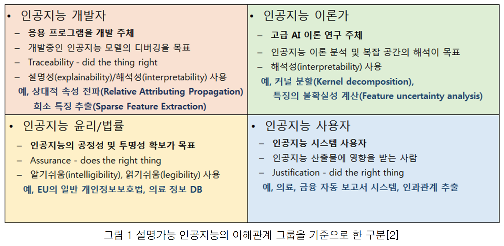

# 설명가능 인공지능 연구동향

사회적으로 인공지능의 의사 결정 이유를 제시하도록 제도화하는 중

e.g. 유럽연합 - GDPR: General Data Protection Regulation → 알고리즘에 의해 자동으로 결정된 사안에 대해서 회사에서 설명을 제공하도록 강제

e.g. 미국 - 회사가 내린 신용카드 발급, 주택 담보 대출 등의 주요 금융 결정에 대해서 이유를 제시하도록 법적 으로 강제 +방위고등연구계획국(DARPA: Defense Advanced Research Projects Agency)의 주도하에 연구가 진행

e.g. 국내 - 과학기술정보통신부의 국가혁신성장동력 연구의 일환으로 설명가능인공지능 연구센터가 설립

{: width="100%" height="100%"}

## Interpretability / Explainability

→ 설명성(Explainability)과 해석성(Interpretability), 투명성(Transparency), 정당화(Justification) 등의 다른 용어로 구분하여 사용하는 경우가 많다.

⇒ 관계자마다 인공지능 시스템과 관련하여 수행하는 행위가 다르기 때문

**설명가능 인공지능 연구는 의사 결정의 이유를 설명하는 것뿐만 아니라, 해석을 도와주는 모델과 도구를 포괄하는 경우가 많다**

**자유도**: Interpretability > Explainability ⇒ 다양한 이해관계 당사자의 동의를 얻고 있는 경우가 많다

= 해석(Interpretability)이라는 것 자체가 완결된 결과물을 내포하고 있지는 않기 때문에, 기존의 인공지능 프레임워크에 비해서, 제안한 시스템이 의사결정 과정을 해석하는데 조금 더 용이하면 충분한 경우가 많다.

= 설명(Explainability)은 복잡한 의사결정의 과정을 사람이 이해할 수 있는 방법(언어 및 시각적 표현)을 통해서 설명을 제공해야 할 뿐만 아니라, 실제 의사결정 과정의 주요한 세부사항을 포함하여야 한다는 점에서 좀 더 달성하기 어려운 목표 & 결과물에 대해서 이해관계 당사자간 이견이 존재할 수 있다.

## 인공지능을 설명하기 힘든 이유

인공지능을 설명하기 힘든 이우는 사람과 인공지능의 의사결정 과정이 다르기 때문이다.

### 사람의 인지

1 . 사람은 발달 과정에서 두 가지 직관을 체득

1.  물리적 직관(Intuitive Physics): 다양한 물리 현상들을 머릿속으로 시뮬레이션 할 수 있게 되는 것
2.  심리적 직관(Intuitive Psychology): 객체는 목표가 있으며 그 목표를 이루기 위해서 효율적으로 행동할 것이라고 생각하는 것, 객체의 행동을 보고 객체들 간의 관계가 대립적인지 우호적인지도 알 수 있다.    
3.  사람은 학습 모델을 빠르게 구축할 수 있다.
4.  문제를 더 기초적인 문제로 조합(Compositionality)해서 학습하는 것
5.  인과관계(Causality)를 통해 추론하는 것
6.  이미 배운 것을 새로운 분야에 적용(Learning to Learn)하는 것
7.  사람은 빠르게 생각할 수 있다.
    

→ 가설을 세우고, 이미 알고 있는 지식을 이용해서 또는 실험적으로 검증하여 정확하지 않더라도 빠르게 근사하여 추론할 수 있다.

## DARPA의 설명가능 인공지능 연구

{: width="100%" height="100%"}

1.  설명 가능한 모델 구축: 심층 설명 학습, 해석 가능한 모델, 모델 귀납으로 나뉜다.
2.  이유 설명 인터페이스

**심층 설명 학습** : 변형된 딥러닝 기술, 심층 신경망이 설명 가능한 특징들을 학습하도록 하는 기술. : 은닉계층의 노드가 의미 있는 속성을 나타내도록 학습. e.g. 개와 고양이의 이미지를 구분하는 모델을 학습한다면, 각 은닉 노드가 귀 모양, 꼬리 모양, 입의 위치 등을 나타내도록 학습해서 모델이 어떤 이미지를 개라고 판단했을 때 활성화 된 은닉 노드를 통해 판단의 근거를 알 수 있다. → RNN 등의 자연어 생성 모델을 통해 언어적으로 나타낼 수도 있고, 이미지에 근거가 되는 부분을 표시해 시각적으로 나타낼 수도 있다.

**해석 가능한 모델** : 구조화 된, 해석 가능한 인과 관계 모델을 구축하는 연구 e.g. BPL(Bayesian Program Learning): 모델을 작은 조각들의 조합으로 표현하도록 학습하는 방법 → 글자를 생성하는 모델을 학습할 때 글자를 획으로 나누어서 가장 그럴 듯 한 획의 조합으로 생성하도록 한다. e.g. And-Or-Grap: 어떤 객체를 특성들의 논리곱(And)과 논리합(Or) 조합으로 나타낸 그래프로, 모델이 구조화 되어있어 모델의 결정과정을 논리적으로 설명하기 쉬운 장점

**이유 설명 인터페이스** : 모델의 의사결정에 대한 설명을 사용자가 이해할 수 있는 방식으로 표현하는 연구 → 설명가능성과 정정가능성의 원칙이 충족되어야 함

-   설명가능성: 제시한 설명이 반복적일 것, 필요한 설명을 모두 포함하고 있을 것, 불필요한 섦령을 포함하지 않을 것, 양이 적절할 것 등
-   정정가능성: 설명이 유동적일 것, 사용자의 피드백을 존중할 것, 점진적인 변화를 주시할 것 등

{: width="100%" height="100%"}

DARPA의 설명 가능 인공지능 시스템의 사용성 평가 방법

## 모델 불가지(Model-agnostic) 설명법

: 다양하고 복잡한 임의의 블랙박스 모델의 의사결정에 대해서 근사한 설명을 제공하는 기술

-   LIME(Local Interpretable Model-agnostic Explanations): 임의의 블랙박스 모델을 이미 설명이 가능한 데이터 주변에서 희소 선형 결합을 통해 국부적으로 설명 가능하게 만드는 방법, 지역적으로 선형모델을 적용하는 방법 e.g. 이미지를 분류하는 블랙박스 모델이 어떤 이미지를 개라고 판단했다면 이미 설명 가능한 다른 모델의 개에 대한 설명, 즉 개를 표현하는 픽셀들을 주어진 이미지와 대조하여 어느 부분이 개라고 판단한 근거인지 제시
-   BRL(Bayesian Rule Lists): 모델을 일련의 if-then 조건문으로 표현하는 모델 귀납 방법 , 고차원·다변수인 특징공간을 간단하고 이미 해석 가능한 조건문으로 나누어 복잡한 모델을 이해할 수 있게 한다. e.g. SHAP(SHapley Additive exPlanation): 다양한 참여자가 보상을 공평하게 나눠야 하는 협력 게임(Coaltitional Game)에 참가자들의 기여도를 이론적으로 평가하는 Shapley 값에 기반하여, 복잡한 인공지능 시스템의 입력을 협력 게임의 참가자로, 그 결과물을 나눠야 하는 보상으로 인식하여 입력 특징별 기여도를 견본추출(sampling)으로 근사하는 것

{: width="100%" height="100%"}

예시) 300,000만 유로의 어떤 집

어떤 아파트가 50평방 미터의 크기이고 2층에 위치하며 근처에 공원이 있고 고양이가 출입금지이다. 모든 아파트의 평균 예측가는 310,000 유로이다. 그렇다면 평균가와 비교하여 각 특성들이 얼마나 예측값에 기여를 한 것일까?

→ 선형모델이라면 쉽게 예측할 수 있지만 비선형 모델의 경우 가중치에 따른 영향력을 확인하기 더 어렵다. → 게임 이론 이용: 총 지불금(payout)에 각 선수들(players)의 기여도에 따라 선수의 지불금을 정의하는 것.

위의 예시로 돌아간다면, 10,000 유로의 차이를 어떻게 알까?

{: width="100%" height="100%"}

이런 식으로 각 player의 기여도를 측정

## 계층적 상관성 전파(LRP: Layer-wise Relevance Propagation)를 통한 입력 시각화

국내에서 개발한 신경망의 모델에서 예측 결과로부터 역전파 형태로 신경망의 각 계층 별 기여도를 측정할 수 있는 기술

-   각 계층의 기여도를 히트맵 형태로 시각화하여 직관적으로 이해할 수 있다.

{: width="100%" height="100%"}

고양이 이미지를 보고 고양이의 종을 분류하는 신경망을 학습했다고 하면, 학습된 가중치를 바탕으로 이전 계층의 각 노드에 기여도를 역전파 한다. 입력 이미지의 어떤 부분이 신경망의 결과 도출에 큰 영향을 미쳤는지 직관적으로 알 수 있다.

{: width="100%" height="100%"}

입력 시각화 기법) 딥러닝 기반 자율주행 제어 시스템의 의사결정을 입력 수준에서 설명하는데 유용하게 사용. 핸들의 방향을 왼쪽, 중앙, 오른쪽으로 꺽게 되는 이유가 되는 입력을 알기쉽게 설명해 주고 있다.

## 자동 통계학자의 시계열 분석 보고서를 통한 설명

데이터를 분석하여 예측하고, 설명하고, 검증하는 과정에서 사람이 이해할 수 있는 보고서를 제공하는 과정까지를 자동화하는 것을 목표로 하는 시스템

시계열 데이터: 가우시안 프로세스 커널의 조합을 학습하는 베이지안 추론 알고리즘 개발

*가우시안 프로세스: 부드러운 시계열 함수를 다양한 커널을 바탕으로 다변수 가우시안으로 회귀분석하는 기술

{: width="100%" height="100%"}

다수의 시계열 데이터에 존재하는 공통적인 특성을 찾고 설명하는 시스템

{: width="100%" height="100%"}

관계형 자동 통계학자에서 자동으로 생성한 문장의 예

→ 다수의 환율 데이터를 분석하여, 각 환율 데이터가 언제, 어떻게 움직이는지를 자동으로 자연어로 표현

> Reference 
> 최재식.(2019).설명가능 인공지능 연구동향.정보과학회지,37(7),8-14.