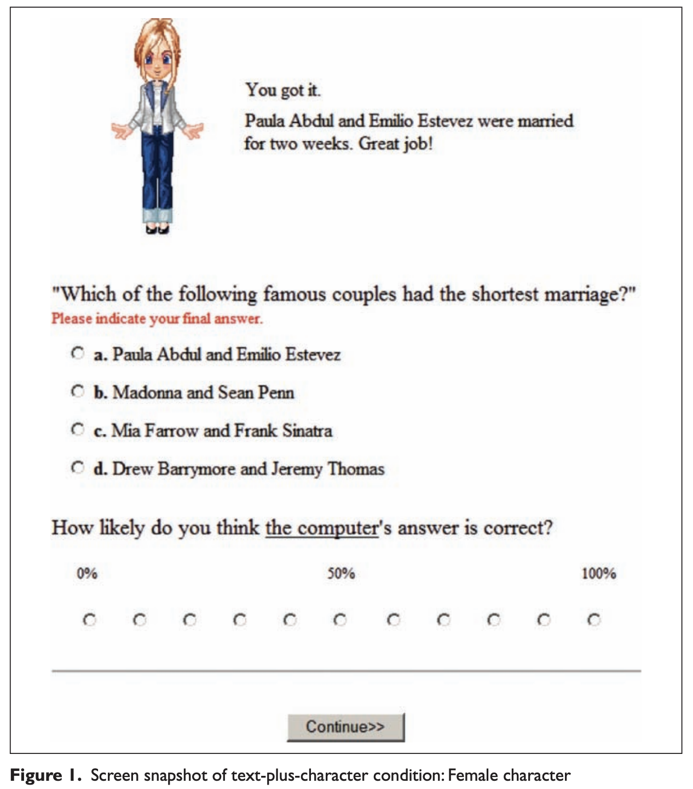

# What triggers social responses to flattering computers?

## 요약

CASA(computers are social actors) 패러다임의 두가지 설명에 대한 평가

-   Anthropomorphism
-   Mindlessness

Flattery effects를 사회적 반응으로 이용하여 인간이 컴퓨터의 사회적 특성을 부여하는지 확인.

**그 사이에 영향을 주는 것**

1.  인터페이스의 인간 같음 : How humanlikeness of the interface,
2.  개인의 합리성 : individuals' rationality
3.  인지 분주함 : Cognitive busyness

## 상세한 정리

### CASA paradigm

: Computers are social actors

→ 사람들은 컴퓨터에 사회적 특성을 부여 & 사람한테 하는 반응을 똑같이 보임
e.g., 전문적인 주제에 대해서는 남자의 목소리를 여자의 목소리보다 더 전문적이라고 평가, 반대로 사랑과 관계에서는 여자를 더 적절하다고 평가  
→ 컴퓨터의 말과 억양에서 성격을 평가할 뿐 아니라, 같은 성별인 컴퓨터에 더 우호적인 경향 
→ 인간적인 특성이 없을 때도 부여
e.g., Self-disclosure: 컴퓨터가 자신의 약점을 드러내면 더 친근하게 대답
e.g., Flattery effects: 컴퓨터가 하는 평가가 그냥 랜덤으로 나오는거라고 말했는데도 불과하고 진짜 칭찬을 한 것처럼 긍정적인 반응을 이끌어냈다. (컴퓨터가 칭찬을 하면, 자신이 더 잘했다고 생각하며 컴퓨터와의 상호작용을 그냥 평범한 피드백일 때 보다 더 긍정적으로 평가)

HCI에서 이런 연구들이 많았지만 상당한 양의 설명과 이런 연구의 명백한 경계 조건이 불분명하게 남아있다.

단순히 HCI의 사회적 규범을 따르는 것을 넘어서, 왜 사람들이 social heuristics를 컴퓨터에 적용하는지 두가지 설명법을 평가하고자 하였다: **Anthropomorphism & Mindlessness**

**⇒ Flattery effects를 사회적 반응의 예시로 사용하여 a, b, c의 영향을 평가** 
(a) 인터페이스가 사람같음: the degree of human likeness of the interface 
(b) 분석적 평가능력(합리성): the individual’s proclivity to engage in analytical thinking (i.e., rationality)
(c) 인지 자원 여부: situational demand for cognitive resources might affect the ways in which people respond to blatantly placebic praise from the computer
   
### Anthropomorphism VS Mindlessness Explanations  for CASA

**Anthropomorphism**

: CASA 패러다임에 따르면 컴퓨터를 Anthropomorphize하는 행동은 거의 자동적으로 발생하는 것  
: 반면 다른 연구들은, 인터페이스가 얼마나 사람을 닮았는지를 구별하고 그 영향을 시험
e.g., 단순한 텍스트 디스플레이 vs 말하는 얼굴을 이용해서 커리어 카운슬링에 대한 반응 평가.
e.g., 인간 대리인 vs 강아지 대리인 vs 만화캐릭터 강아지 대리인 과의 소셜딜레마 게임 → 강아지 대리인이 선호는 높았지만, 인간 대리인이 협력을 가장 잘 이끌어 냈음)  
: 다른 연구들은 더 자세하게 사람같은 컴퓨터 에이전트를 이용
e.g., 컴퓨터 에이전트의 비언어적 행동이 몰입적인 VR 환경에서 대인관계 간격에 어떤 영향을 주는지 
→ 더 진짜 같은 응시를 했을 때, 최적의 직접성을 위해 사람들은 대인관계 간격을 늘렸다. 
e.g., envelope feedback(고개끄덕임, 응시, 고개 움직임)과 emotional feedback(표정) 비교 
→ envelope feedback이 더 긍정적인 평가를 이끌어냈고 task를 수행하기 위해 더 적게 말할 수 있었다. 
e.g., 전문 서비스 로봇의 인간같은 모습(표정, 팔 다리, 옷)이 일하는 관계에 어떤 영향을 주는지를 지위(부하, 동료, 관리자)와 함께 관찰 
→ 참가자가 기계 같은 로봇과 일할 때 인간 같은 로봇일 때보다 업무를 완수하기 위한 책임감을 더 느끼고 특히 부하일 때 더 그렇다는 것을 고려했을 때, Anthropomorphic 모습은 인간-로봇 상호작용에 중요한 역할 
e.g., 인간 같음이 시간이 흐르면서 새로운 행동을 배울 수 있는 로봇 강아지의 형태로 만들어졌을 때, 더 긍정적인 인식을 불러일으키고 더 강한 유대감을 형성

⇒ 이 연구들은 유의미했으나, 인터페이스의 Anthropomorphic 품질과 컴퓨터의 사회적 반응을 연결짓지 않았다.   
⇒ 얼마나 anthropomorphic한지를 좋아하는 정도, 소통적 행동, 업무 수행의 관점에서는 평가했지만, 컴퓨터의 사회적 대우에서는 평가하지 않았다.  
⇒ 이 문제를 해결하기 위해 인간같음 정도를 체계적으로 구조화하고 위의 Flattery effects에 나타나는 정도에 대한 영향을 평가하였다.

**Mindlessness**

: 컴퓨터가 인같 같은 특성을 보일 때(상호작용과 목소리 같은), 사람들은 그런 단서들에 집중하느라 컴퓨터의 상호작용의 비사회적 성격을 고려하지 못한다고 주장했다. 결과적으로 컴퓨터에게 사회적 기대를 적용하는게 부적절한걸 알지만 무의식적으로 컴퓨터에게 사회적 범주(성별)를 적용하고 학습된 사회적 행동(호혜)을 한다.

Mindlessness 와 컴퓨터에 대한 사회적 대우의 관계를 알아보기 위한 연구 e.g., flattery effects는 컴퓨터 경험이 많은 사람들 사이에 더 많이 나타났다. (아첨을 들었을 때, 긍정적 감정을 느끼고 컴퓨터의 능력을 좋게 평가하였다.): 연습이 과학습을 불러일으키고 무의식적 행동의 가능성을 높이는 것처럼, 컴퓨터에 인간적 면모를 무의식적으로 적용 ⇒ mindlessness가 컴퓨터에 대한 사회적 반응을 촉진시키는 것 같지만 mindlessness가 직접적으로 측정되지 않았다. 단순히 얼마나 컴퓨터를 오래 썼는지에 따라 추론하였다. ⇒ 이 문제를 해결하기 위해 ex1에선 인간의 전반적인 분석적 생각의 성향(합리성)을 측정하였고 그에 따른 컴퓨터의 아첨에 대한 효과를 측정하였다. ex2에선 mindlessness를 멀티태스킹 갯수를 통해 조작하였다.
   
### EXPERIMENT 1

CEST(cognitive-experiential self-theory)에 따르면, 정보를 가공하는 2가지 다른 시스템은 **Experiential**과 **Rational**이다.

-   Experiential: 직관적, 전의식 시스템, 자동적인, 사실에 의거한, 전체론의, 주로 비언어적인, 영향과 직접적으로 연관이 있는, 휴리스틱의
-   Rational: 분석적, 의식 시스템, 의도적, 노력에 의한, 주로 언어적인, 영향 없는, 인지 자원이 필요한

→ 각 개인마다 기질이 다르다는 것이 전제(=a broad personality theory)

→ 이것과 mindlessness를 같이 보았을 때, mindlessness(rational thinking style)는 social responses to computers(flattery effects)의 전제조건이다.

**Anthropomorphism explanation(humanness of interface)** = 단순한 텍스트 vs anthropomorphic 만화 캐릭터

{: width="100%" height="100%"}

**H1a-1b:** 참가자들은 아첨하는 컴퓨터를 사회적으로 더 매력적으로 느끼고 더 신뢰할 것이다. 하지만 이런 효과는 단순한 텍스트일 때보다 anthropomorphic한 만화 캐릭터일 때 더 나타날 것이고 low rationals인 사람들에게 더 보일 것이다.

**H2a-2b:** 참가자들은 아첨을 들었을 때 자신의 수행을 더 긍정적으로 평가할 것이다. 하지만 이런 경향은 anthropomorphic한 만화 캐릭터가 있을 때 더 나타나고 그리고 low rationals인 사람들에게 더 보일 것이다.

다음 가설은 기존의 Flattery effects 연구를 확장하여 순응성의 관점에서 컴퓨터에 대한 행동 반응을 측정.
→ 컴퓨터랑 사소한 게임을 할 때 참가자한테 답을 잘못 선택했다고 말하고 다른 것을 제안. 랜덤으로 답을 제안한다는 것을 아는데도 불구하고 의미없는 코멘트(아첨 vs 일반적 코멘트)에 따라 수용하는 것에 차이가 있을까? 
→ 이런 순응성은 칭찬을 들었을 때 컴퓨터에 대한 긍정도와 설득력도 올라가서 컴퓨터의 답을 따를 수도 있고/ 혹은 긍정적 피드백이 참가자의 자존감을 높여서 덜 수용적으로 만들 수도 있다.

**RQ1a-1b:** (a)anthropomorphic 캐릭터의 presence와 (b)개인의 합리성은 컴퓨터의 제안을 수용하는 것에 있어서 flattery effects를 완화시킬것인가?
  
#### 과정

문제를 12개 주는데 그 중 5문제는 틀렸다고 하고 랜덤으로 답을 추천해준다. (참가자는 랜덤인 것을 암) 7문제는 당신 답이 맞아요! 이지만 반에게는 정보전달만 하고, 나머지 반에게는 flattery까지 한다. e.g., 정말 대단하네요 같은.

모든 문제는 풀고 나서 답을 알려주지 않는다.
  
#### 결과

**H1a-1b:** 참가자들은 아첨하는 컴퓨터를 사회적으로 더 매력적으로 느끼고 더 신뢰할 것이다. 하지만 이런 효과는 단순한 텍스트일 때보다 anthropomorphic한 만화 캐릭터일 때 더 나타날 것이고 low rationals인 사람들에게 더 보일 것이다.

⇒ H1a와 H1b 둘다 not supported (미미한 차이와 영향은 있었으나 통계학적인 significance가 없었음)

**H2a-2b:** 참가자들은 아첨을 들었을 때 자신의 수행을 더 긍정적으로 평가할 것이다. 하지만 이런 경향은 anthropomorphic한 만화 캐릭터가 있을 때 더 나타나고 그리고 low rationals인 사람들에게 더 보일 것이다.

⇒ Supported: 그냥 글자보다 anthropomorphic한 만화 캐릭터가 나타냈을 때 합리성이 낮은 사람들의 자존감이 더 낮았다. (high-rationals인 사람은 영향 X)

**RQ1a-1b:** (a)anthropomorphic 캐릭터의 presence와 (b)개인의 합리성은 컴퓨터의 제안을 수용하는 것에 있어서 flattery effects를 완화시킬것인가?

⇒ low rationals는 아첨할 때 덜 순응하는 경향을 보여줬다. (high인 사람은 영향 X)

아첨이 아닌 진짜일 땐 더 수용하는 경향이 있었다.

**결론적으로,**
Anthropomorphic한 만화 캐릭터가 컴퓨터에 대한 전반적인 긍정적 평가를 이끌어냈지만, 덜 합리적인 사람들에게서는 자존감을 낮췄다. → **Social Facilitation Effects** 
덜 합리적인 사람들은 컴퓨터가 아첨할 때 제안을 덜 수용하는 경향을 보였다.
   
### EXPERIMENT 2

Ex1에서 Individuals' rationality score = chronic mindfulness → 몇가지 문제가 있음

1.  anthropomorphism 과 mindlessness explanations의 측정 사이에 불균형이 있다 : 전자는 상황적 변수로 조절된 반면 후자는 개인의 성향에 따라 평가되었다
2.  사람들이 무엇을 염두에 두고 있는지 불분명했다. : 문제의 답을 이미 알고 있어서 다른 주변의 단서들(만화캐릭터나 아첨하는 코멘트)을 무시했을 수 있다.

⇒ 이런 문제들을 해결하기 위해 Ex2에서는 참가자들에게 부과되는 인지부하를 변화시켰고, 줄어든 인지 능력이 컴퓨터의 flattery effects를 어떻게 완화시키는지 평가하였다.

**H3a-3b:** 참가자들은 컴퓨터의 (a)사회적 매력과 (b)신뢰도가 큰 것이 일반적인 feedback 보다 아첨 덕분이라고 할 것이다. 하지만, 2가지 업무를 할 때 더 그렇게 생각할 것이다.

**H4:** 참가자들은 본인의 수행을 아첨을 들었을 때 더 긍정적으로 평가할 것이다. 하지만, 2가지 업무를 동시에 했을 때 더 그렇게 생각할 것이다.

**RQ2:** 인지 업무의 수는 컴퓨터의 제안을 받아들일 때 flattery effects를 어떻게 완화시킬 것인가?
  
#### 과정

Ex1과 동일하나 (a) no cartoon characters were used와 (b)2가지 업무를 동시에 하도록 한 참가자는 9자리 숫자를 외우고 반복하도록 한 것이 다르다.
  
#### 결과

**H3a-3b:** 참가자들은 컴퓨터의 (a)사회적 매력과 ~~(b)신뢰도가~~ 큰 것이 일반적인 feedback 보다 아첨 덕분이라고 할 것이다. 하지만, 2가지 업무를 할 때 더 그렇게 생각할 것이다.

H3a는 supported: 참가자는 아첨하는 컴퓨터를 사회적으로 더 매력적이라고 생각했다. H3b는 not supported

**~~H4:** 참가자들은 본인의 수행을 아첨을 들었을 때 더 긍정적으로 평가할 것이다. 하지만, 2가지 업무를 동시에 했을 때 더 그렇게 생각할 것이다.~~

H4는 no significant main or interaction effects.

**~~RQ2:** 인지 업무의 수는 컴퓨터의 제안을 받아들일 때 flattery effects를 어떻게 완화시킬 것인가?~~

flattering comments에서 업무를 몇개 하고있는지는 영향이 없었다.

**결론적으로,**
사회적 매력도에 대한 평가: 일반 컴퓨터 < 아첨하는 컴퓨터 → 그 주장에 대하여 점점 더 의구심을 가지게 되었고 답변을 무시하게 되는 경향이 생겼다.

> Reference 
> Lee, E. J. (2010). What triggers social responses to flattering computers? Experimental tests of anthropomorphism and mindlessness explanations. _Communication Research_, _37_(2), 191-214.