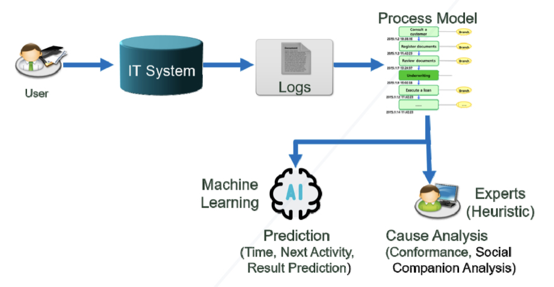

# 프로세스 분석을 위한 설명 가능한 인공지능 기법 비교 연구

## 간략한 요약

인공지능을 위한 다양한 XAI가 있지만 어떤 기법들이 프로세스 원인분석 자동화에 적합한지 정리가 되어있지 않다.

→ 이유 원인 분석 자동화를 위한 최적의 머신러닝 및 XAI 알고리즘을 제시하겠다.

## 상세한 정리

### 프로세스 마이닝

문제가 되는 프로세스를 분석하여 그 문제의 원인을 파악하는 것으로 프로세스 결과 예측 중심의 접근 방법.

→ 한계가 있다.

현재는 LIME(Local Interpretable Model-agnostic Explanations), SHAP(SHapley Additive exPlanatoins), SA(Sensitivity Analysis), LRP(Layer-wies Relevance Propagation) 등 다양한 알고리즘이 제안되고 있다.

→ 하지만 어떤 기법들이 프로세스 원인 분석 자동화에 적합한지 X

'유럽 한 전자회사에서 환불 업무 프로세스를 수행한 사례 데이터' → 다양한 머신러닝 및 XAI 알고리즘을 적용하여 환불이 지연된 프로세스들의 원인을 분석해보고 각 알고리즘의 특징 및 장단점 비교 → 프로세스 이유 원인 분석 자동화를 위한 최적의 머신러닝 및 XAI 알고리즘 제시

### 1. 프로세스 마이닝과 머신러닝 기반 예측

: 정보시스템에 기록된 로그를 기반으로 프로세스 모델을 자동으로 도출하는 기법 → 원인이 명시적으로 도출되는것은 아님 → 원인 분석은 분석가의 전문성과 업무 경험에 의존

{: width="100%" height="100%"}

### 2. 프로세스 이유 원인 분석 자동화

: 기존 머신러닝 기반 프로세스 수행 결과 예측 알고리즘에 XAI를 적용함으로써 프로세스의 수행 결과에 대한 원인 분석을 자동화하는데 목적이 있다.

{: width="100%" height="100%"}

머신러닝은 결과를 예측하고 XAI는 이미 지연이라는 결과를 알고있는 상태에서 원인을 찾아낸다.

→ 프로세스 이유 원인 분석 자동화는 프로세스 마이닝의 결과를 알고리즘을 통해 정량화, 자동화함으로써 분석가의 개인 역량과 경험에 의존하지 않고 쉽게 프로세스 원인 분석이 가능하도록 지원한다.

### 3. 설명 가능한 인공지능(XAI)

-   Interpreting Model: 모델 자체를 해석하는 방법
-   Explaining Decision: 왜 그런 결정을 내렸는지에 대해 데이터로 설명하는 방법

**1) LIME 알고리즘** → 핵심 가정은 입력값에 약간의 변화를 주었을 때 모델의 예측 결과값이 크게 바뀌면 그 변수의 중요도가 높다는 것

**2) SHAP 알고리즘** → 머신러닝 모델의 출력을 설명하기 위해 게임 이론의 Shapley Values를 기반으로 한 알고리즘 Shapley Values란 하나의 특성에 대한 중요도를 알기 위해 여러가지 특성들의 조합을 구성한 후 해당 특성의 유무에 따른 평균적인 변화를 통해 얻어낸 값 학습데이터와 학습된 모델을 가지고 설명 모델을 생성하고 새로운 입력 데이터에 대해 예측 결과에 대한 영향도를 방향과 크기로 표현한 Shapley Values를 계산하여 입력 Feature가 학습된 모델의 출력값에 대해 어떤 공헌도를 가지는지 설명한다.

**3) SA와 LRP 알고리즘** → SA(Sensitivity Analysis)는 LIME과 마찬가지로 데이터 중심으로 지역변수의 민감도 계산 각각의 입력 변수들이 예측결과에 미치는 영향력에 대해 순위 상관계수를 계산하여 민감도 분석 상관계수는 결과(예측변수)와 입력(가정변수) 간의 상관관계를 나타내는 수치로 만약 가정변수와 예측변수가 높은 상관계수가지면 유의미한 영향력임 → LRP(Layer-wire Relevance Propagation)는 예측 모델에서 각각의 뉴런에 대한 가중치를 계산하는 모델 중심의 해석 방법 딥러닝 모델에서 레이어 단위로 결과에 영향력을 주는 관련성을 구하는 역전파 기술로 예측 결과에 대한 딥러닝 신경망의 각 계층별 기여도를 측정하여 히트맵형태로 시각화.(딥러닝 모델에 대해서만 적용 가능)

### 연구 방법 및 결과

{: width="100%" height="100%"}

1.  기존 프로세스 전문가들에 의해 분석된 전자제품 환불 업무의 프로세스 마이닝 결과 학인
2.  다양한 머신러닝 알고리즘 이용하여 환불 프로세스의 정시처리/지연 결과 예측
3.  이 예측 모델을 LIME, SHAP, LRP 등의 XAI 알고리즘으로 분석하여 실제 전문가의 분석 결과와 가장 유사하게 원인을 파악하는 알고리즘 확인

환불 프로세스 상 문제가 3가지 있었지만 그 중 2번째 문제인

'환불 수행 기간 지연의 원인' 을 머신러닝관 XAI 알고리즘을 통해 사람의 개입 없이 자동으로 도출해보고 그 결과가 실제 전문가들의 분석 결과와 같이 '운송회사를 통한 배송'인지를 확인하였다. → 프로세스 지연 여부를 예측하는 머신러닝 모델을 구성한 뒤 XAI 알고리즘을 적용하여 머신러닝이 지연될 것이라고 예측한 이유 파악

-   환불된 물건을 제휴회사가 아닌 일반 운송회사를 통해 배송할 경우 처리 기간이 지연되었는데, 운송회사에서 팔레트에 화물이 일정량 이상 쌓여야 배송을 시작하기 때문.

### 연구 결과

딥러닝(LSTM) 기반의 프로세스 예측 모델에 대한 원인 분석은 LIME 알고리즘이 SHAP, SA와 LRP 알고리즘 보다 상대적으로 우수하지만 사람의 개입 없이 원인분석을 자동화하는 수준에는 못미치는 것으로 판단되었다.

특이점은 모델 예측 정확도는 LSTM이 가장 높았으나 원인 분석에 대한 해석력은 고전적인 머신러닝 모델인 Logistic Regression이 가장 높았다. (모델 내부의 구조를 확인해볼 수 있는 화이트 박스 분석 가능 but 정확도와 해석력이 trade off 관계)

하지만 XAI 알고리즘 간에는 원인 분석 결과에 대한 유의미한 수준의 차이가 없다. 머신러닝 모델의 특성이 결과에 더 큰 영향을 미친다.

> Reference 
> 정찬일, 이후진.(2020).프로세스 분석을 위한 설명 가능한 인공지능 기법 비교 연구.전자공학회논문지,57(8),51-59.
