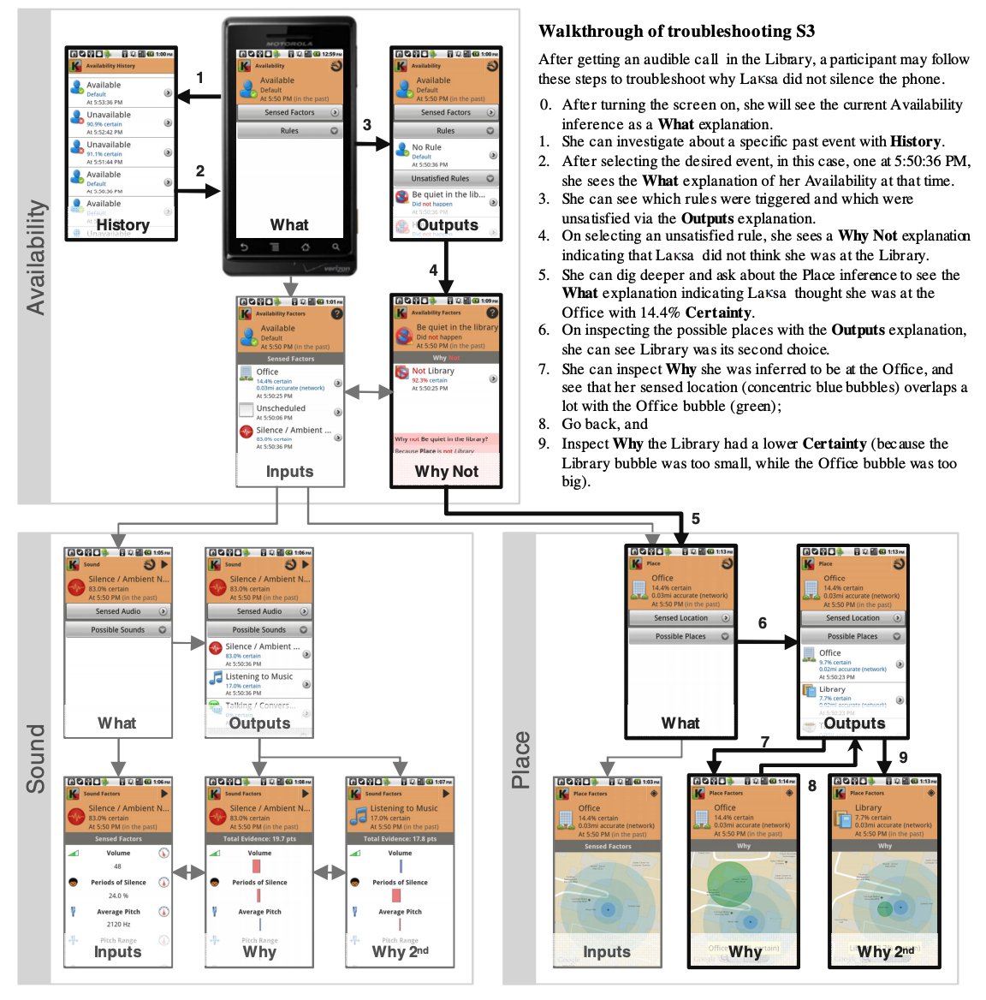
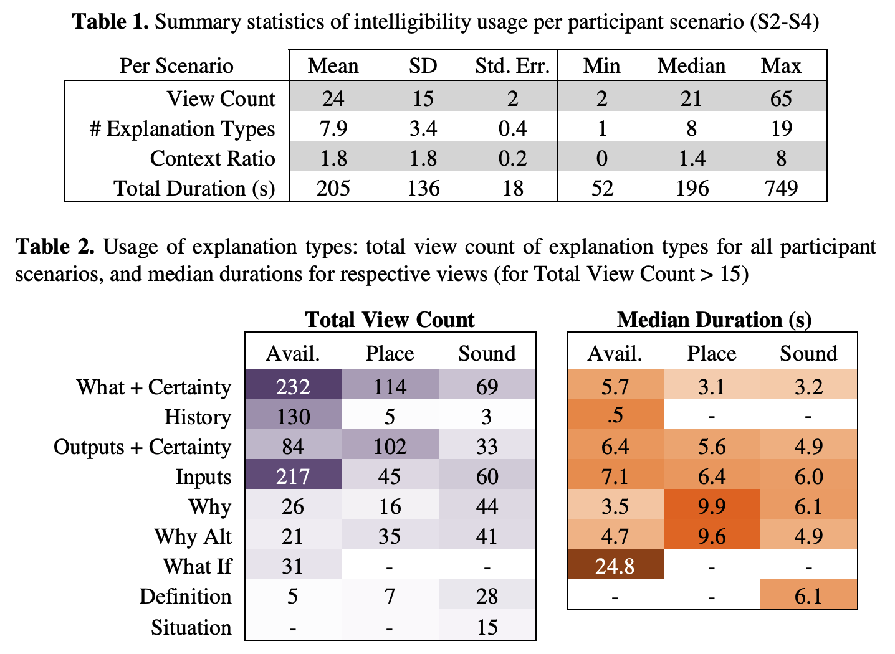
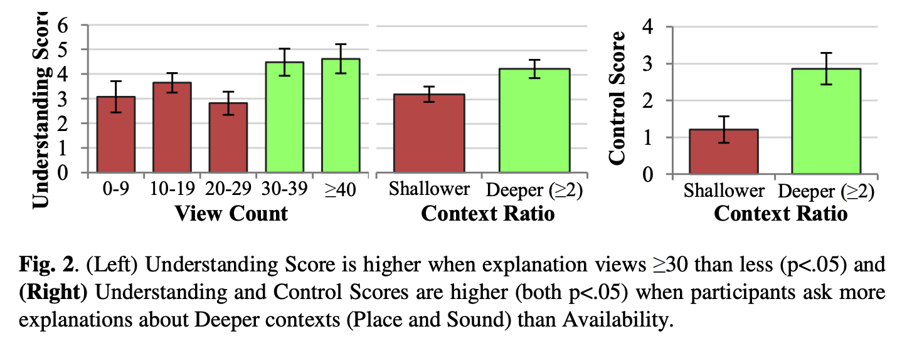

# Evaluating Intelligibility Usage and Usefulness in a Context-Aware Application

## 간략한 요약

Intelligibility는 복잡한 추론과 내포된 인식으로 end users가 상황 인식 프로그램을 이해하도록 돕기 위해 제안되었다. 하지만 end users가 정말로 원할까?, Intelligibility를 얼마나 사용할까, 그리고 이해도를 높이기 위해 충분한가? 이런 것들을 설명하기 위해 본 연구에서는

-   End users가 얼마나 많은 설명을 보는지
-   Application의 행동을 이해하는데 어떻게 영향을 주었는지
-   Application의 행동을 개선하기 위한 사람들의 제안 을 살펴보고자 한다.

⇒ 즉, 무엇이 성공적인 intelligibility 사용을 이루는지 논의하고 유용한 사용을 촉진하기 위한 intelligibility 디자인 방법을 제안하고자 한다.

   
## 상세한 정리

상황 인지 application은 내제된 인식과 복잡한 추론을 통해 자동적으로 그리고 차분하게 사용자에게 적응한다. 사용자들은 이런 application이 무엇을 아는지 모르고 그 행동을 이해하고 믿기 위해 고난을 겪는다.

→ 상황 인지 application은 intelligible하여 사용자에게 그들의 행동에 대한 설명을 제공해야 한다.

기존의 상황 인지 application은 약간의 intelligibility를 제공했지만 사용자가 물을 질문이 제한적이었다. : What, Certainty, Inputs, Why, Why not

⇒ Lim & Dey가 **Laksa**를 제안: 다양한 상황 타입을 위한 8가지 질문 유형 → 사람들에게 주는 영향을 알 수 없어서 중단. → 새로 고안했지만 프로토타입이 interactive 하지 않고 사용자가 계속 intelligibility에 노출되어서 편향이 일어났을 것이다.

⇒ 결론적으로 남은 질문은, intelligibility가 사용자의 이해와 신뢰를 높여줄 수 있더라도, 사용자는 그것을 사용하고 싶어할까? 만약 그렇다면 얼마나? 그리고 context-aware applications에 대한 그들의 이해를 얼마나 높일 수 있을까?

⇒ high-fidelity 프로토타입으로 9가지 설명 타입을 제공하겠다. = 3가지 상황 종류(Availability, Place, Sound)에 따른 Certainty, Why, Why Not, What If 같은 설명

-   application의 추론을 사용자가 이해하는데의 영향

1.  사용자는 실제 상황 인지 application에서 intellibility를 얼마나 사용하는가
2.  application의 행동과 상황을 이해하기 위한 설명의 유용성에 대한 사용자의 의견
3.  상황을 이해하고 조작하는 것에 대한 intelligibility를 사용하는 것이 얼마나 유용한가
   
### Laksa 2 Prototype

모바일 폰은 유용하지만 방해가 될 때도 있다.(회의중, 영화관 혹은 집중할 때) → 상황을 인지하고 진동모드를 자동으로 변경하는 Laksa를 만들었다.

1.  Availability: Available, Semi-Available, Unavailable(아래의 상황에 따라 결정됨)
2.  Place: 사무실 ,카페, 도서관(위도와 경도에 따른 추론)
   > Each Place is inferred with different certainty based on how much the user's estimated location area "overlaps" with the circular area of the named place: more overlap leads to higher certainty.
3.  Sound: 말하는소리, 음악, 엠비언트 노이즈(나이브베이즈 classifier에 따라 추론)
4.  Schedule: 개인적, 일, 비스케쥴, 다른 이벤트

{: width="100%" height="100%"}
> 굵은 선이 Walkthrough of troubleshooting S3 상황 속 사용자의 흐름, 7과 8에서 bubbles를 사용하여 Intelligibility UI(장소가 어떻게 추론되었는지, 다양한 소리를 설명하기 위한 바 차트로 증거의 가중치 표현

Laksa는 Intelligible → 사용자가 application이 무었을 아는지 이해하고 추론을 어떻게 하는지 알 수 있도록 해준다. 아래의 질문들에 대한 설명을 Intelligibility Toolkit [6]을 이용하여 제공한다.

1.  무엇(**What**)이 문맥을 위한 추론인가? **Certainty**는 어떻게 되는가? 언제(**When**) 이 value가 추론되었는가?
2.  **History**: H 시간에서의 추론은 무엇인가?
3.  **Inputs**: 정확이 어떤 것이 문맥에 영향을 주었는가?(요소, 관련된 세부사항, 기타)
4.  **Outputs**: 이 상황이 어떤 값으로 추론되는가? **Certainty**는 얼마인가?
5.  왜(**Why**) 이 값이 추론되었는가?
6.  **Why Not(Alt)**: 왜 이 추론은 아니었는가?
7.  만약(**What if**) 요소가 다르다면 추론 어떻게 되었을까? → 사용자의 조작 필요. Availability를 위하여.
8.  **Description**: 상황 용어와 값의 의미
9.  **Situation**: 추론에 영향을 주기 위해 무엇이 일어났는가 e.g., 들려진 오디오 클립의 재생?
   
### Scenario-Driven Quasi-Field Study

1.  참가자에게 중요한 상황을 제공하고
    
2.  그들의 상응하는 행동을 관찰하고 측정하기 위하여
    

시나리오 상황: 실험상황에서 중요한 사건을 겪고 그에 대하여 무슨 일이 일어나는 중인지 설명되는 플래시카드를 제공받는다. Laksa를 참여자가 원하는 만큼 많이 쓸 수도 있고 적게 쓸 수도 있다. 각각의 시나리오 후에 참여자는 상황과 앱에 대하여, Laksa의 추론에 대한 이해에 관하여, 어떻게 개선시킬수 있을지에 대하여 질문을 받는다.

**Scenarios** → 락사의 기능과 설명에 대한 Exploration&Verification / 락사의 부적절한 행동을 진단하기 위한 Fault Finding / 참가자가 잠재적인 미래 상황을 찾을 수 있는 Preemptive Exploration

1.  사무실에서 대화하는 상황: 이 때 자유롭게 대화하면서 락사의 주요 기능과 설명을 인지. 락사가 사무실이라는 것과 대화 소리 추론.
2.  음악을 듣던 중 책을 읽고 부재중 전화 상황: 락사가 음악을 이야기 하는 중으로 추론하고 무음모드로 바꿔서 동료로 부터 온 전화를 놓침. 동료가 화나서 계속 전화했던 상황 인지.
3.  도서관에서 전화벨의 방해 상황: 도서관으로 이동하는 중에 동료에게 전화가 오지만 락사가 위치를 사무실으로 잘못 추론하여 전화벨이 크게 울리는 상황 유도.
4.  카페에서 Availability를 미리 확인하는 상황: 플래시카드를 통해 상황을 전달받고 카페에서 참가자가 전화를 받을 수 있을지 체크.
   
### 결과

같은 시나리오로 진행했지만 락사의 인지와 설명 결과의 다양성 때문에 변수가 있었을 수 있다.

S4에서 참가자의 행동이 확연하게 2가지로 나뉘었는데

1.  단순히 앉아서 What If 설명을 사용
2.  카페로 걸어가서 Laksa를 테스트

{: width="100%" height="100%"}

**Preception of Application Behavior and Explanations**

S2와 S3의 락사의 행동에 대해서 부적절하다고 인식 S4에서의 행동은 적절하다고 인식 참가자들은 설명이 도움이 된다고 일반적으로 인식했지만 S2는 S4보다 도움이 덜 된다고 하였다.

**Intelligibility Usage**

S2에서 S4의 사용 로그를 종합하여 참가자의 intelligibility 사용 결정 대부분의 참가자들은 많은 설명 종류를 확인하였고(중앙값 8), 많은 횟수 사용하였고(중앙값 21), 시나리오 마다 3분정도 확인하였다. 상황(deeper contexts like place or sound)에서 Availability보다 더 많이 보았다. Usage는 아주 관여된(65뷰, 12.5분)에서 보수적인(2뷰 혹은 1 설명타입 혹은 지속시간 1분)으로 나뉜다. (설명 타입일까요?)

Table2에서 어떤 설명 타임이 가장 인기가 높았는지 볼 수 있다.

**User Understanding and Control Suggestions**

각각의 시나리오에서 참가자들은 0-8로 락사의 행동에 대한 신뢰를 측정(중앙값 4) 41%는 장소와 사운드에 대하여 추론된 값에 대한 믿음이고 28%는 추론에 대한 전반적 이해, 15%는 인풋 상태와 모델 메커니즘에 대한 이해, 2.5%는 더 깊은 기술적 디테일에 대한 이해였다.

참가자는 0-6 까지의 각각의 시나리오에 대하여 맞는 Control Suggesion을 제공하였고 2.1이 평균이었다. → Availability Rules 29% Settings 27%, Sound 8%, Behavior change 36% 만큼 컨트롤 제공

Intellibility usage에 대한 정도와 패턴은 사용자가 Laksa를 얼마나 이해하였는지에 대해 영향을 미쳤다.

{: width="100%" height="100%"}

**Impact of Intelligibility Usage on Understanding**

View Count와 Context Ratio를 Intelligibility usage로 선정. View COunt를 10단계로 나누어 확인. Fig2가 더 높은 이해와 컨드롤 점수로 이어준 더 많은 깊은 사용의 모든 결과들을 요약하여 보여준다.
   
### 결론

더 많은 설명을 보는 것은 사용자의 application 추론을 이해하는 것에 도움을 줄 것이다. 특히 더 복잡한 상황에서. → 더 효과적인 intelligibility 사용을 촉진해야 한다. → 어떤 사용자가 intelligibility를 보고 싶어하는지 제약을 둬야 한다. → 사용자의 상황 인지 application에 대한 이해를 돕기 위해 얼마나 많은 intelligibility를 제공해야 하는지 논의해야 한다.

> Reference 
> Lim, B. Y., & Dey, A. K. (2013, July). Evaluating intelligibility usage and usefulness in a context-aware application. In _International Conference on Human-Computer Interaction_ (pp. 92-101). Springer, Berlin, Heidelberg.
