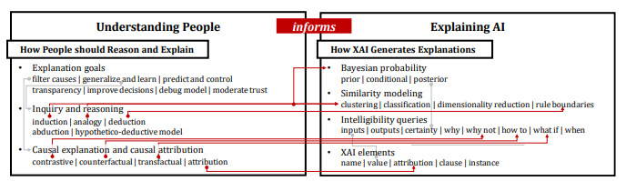
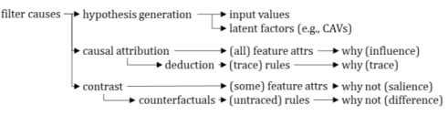
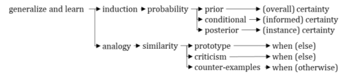
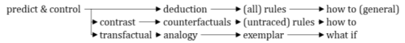

# Why These Explanations

## 간략한 요약

경험적인 유저 연구가 설명의 효율성을 측정할 수 있었음에도 불구하고, 아직도 왜 특정 설명이 이해에 도움이 되는지 불분명하다. 저자는 인간 중심 설명의 XAI를 위해 철학, 인지 심리, AI 분야에서 최근에 개발된 개념적 프레임워크를 이용하여 **어떻게 인간이 XAI의 니즈를 이끌어내는지** 확인 → 이해, 신뢰, decision 성능 개선을 위한 XAI facilities 적용 전략 구분

⇒ 인간의 추론 니즈에 기반한 XAI 특징의 디자인 구축

## 상세한 정리

### Introduction

기존에 수많은 유저 중심의 혁신적인 알고리즘 시각화와 인터페이스와 툴킷이 있고 연구들이 있지만 이것들은 너무 분류학적이거나 명확한 원리에 기반한 것일 뿐이었다.

→ 이 연구에서는 다양한 설명 종류에 대한 니즈를 이끌어내는 인간의 생각을 토대로한 이론을 밝혀낸다.

기존에 공식적 이론을 토대로한 Miller, Hoffman, Klein의 연구가 있었지만, '좋은'설명의 기준을 단순하게 연구자의 직관으로 정의한다거나, 설명이 어떻게 이끌어지는지와 인간이 대조적 설명을 스스로 형성해내는 방법을 설명해냈지만, XAI 기반의 선택의 상황에서 **인간의 특정한 추론 목표를 뒷받침하기 위해 언제 최적으로 사용할 수 있는지에 대한 설명이 누락**

**⇒ 우리의 프레임워크가 유저 중심의 XAI 시스템을 명확한 XAI 특징을 사용하여 더 잘 만들 수 있도록 도움을 줄 것이다.**

**Lim and Dey의 설명 종류를 활용하여 구체적인 설명 특징을 만들기 위하여 프레임워크를 사용하는 방법!**

→ Lim& Dey의 연구에서 사람들이 각자 다른 종류의 설명을 선호하고 사용한다는 것을 발견

⇒ 우리의 연구는 왜! **1. 사람들이 특정 설명을 선호하고 2. 어떻게 사람들이 추리 오류와 인지 편향을 범하는지 3. 이런 오류를 완화하기 위해 설명을 어떻게 선택할지**

기존 연구들
   
### XAI Framework of Reasoned Explanations

-   다양한 XAI 기법
-   이런 방법들의 니즈를 타당화하는 인지/추론 이론
-   사람들이 어떻게 추론하고 선택을 하는지

→ 1. XAI, 추론, 심리에서 개념을 발견하고 → 2. 관계를 설명하기 위해 연결지점을 찾고 → 3. 왜 특정 XAI 기법이 유용한지 타당화하기 위한 틈을 찾고 → 4. 더 많은 컨셉을 발견

{: width="100%" height="100%"}
> 어떻게 몇몇 추론 방법이 XAI를 설명하기 위해 사용되는가

결론적으론 인간의 추론 과정과 XAI를 이어주는 개념적 프레임워크를 만들 것이다.

인간과 기계 모두를 고려하기 위해 4개의 프레임워크로 나누었는데, 그 중 2가지를 이야기.

1.  사람들이 어떻게 이상적으로 추론하고 설명을 찾는지 → 좋은 선택 방법이 무엇을 지원해야 하는지에 대한 기반을 제공하는 추론 방법과 설명 타입을 명확하게 설명
2.  다양한 AI 모델링과 XAI 방법을 설명하고 특정 추론 방법을 지지하기 위해 어떻게 발전되어 왔나.
   
### How People should Reason and Explain

인간은 어떻게 설명을 통해 사건과 관찰을 이해를 하는가

-   아는 다양한 방법
-   어떤 구조가 지식을 수반하는지
-   논리적으로 추론하는 법
-   우리는 왜 설명을 찾는지에 초점을 맞추어 설명

**Explanation Goals**

인간은 자신의 관찰을 단순화하기 위해 원인을 작은 집합으로 나누기 위하여, 자신의 관측을 개념적 모델로 일반화하고 미래 현상을 예측하고 조절하기 위하여 설명을 이용하고 그를 통해 배움을 유용하게 한다.

설명의 목적

-   transparency
-   Improve user decision making
-   Scrutability(해독가능성)
-   Debugging
-   Moderate trust

**Inquiry and Reasoning**

by Pierce
-   Deductive reasoning: top-down logic, 연역적
-   Inductive reasoning: bottom-up logic, 귀납적
-   Abductive reasoning: Inductive와 비슷하지만 다른점은 그 중 가장 맞는것을 선택적으로 귀납하는 것

by Popper
-   Hypothetico-Deductive model(HD model): 연구의 단계를 1) 새로운 문제를 관찰하고 발견 2) 관찰로부터 귀납하여 가설 형성 3) 가설로부터 일어나는 예측 연역 4) 가설이 틀린지 관찰을 실험하고 찾아보기 (의학적 추론에서 많이 사용됨)
-   Analogical reasoning: 하나의 사건에서 다른 것을 추론하는 과정(귀납 추론의 작은 버전, 여러 사례가 아닌 하나의 사례에서 추론하기 때문에)

**Causal Attribution and Explanations**

인간은 관찰한걸 이해하기 위해 더 많은 정보를 필요로 하고 다양한 종류의 설명을 찾는다.

by Miller
-   Causal attribution: 결과나 관찰에 영향을 줄 수 있는 내적 혹은 외족 요인의 표현 ≠Causal explanation, 주요한 요인을 정의하지 않기 때문 하지만 잠재적인 요인은 알 수 있음 Causal chain → 시간과 흐름에 따른 요인을 결합하여 추론과 설명을 이끌어냄
-   Causal explanation: 이미 존재하는 지식에 대한 관찰을 해석할 때 선택된 요인에 초점을 맞춘 설명 
  → 설명이 Contrastive(발생한 fact ↔ 일어날 수도 있는 foil 사이의) 
  → foil이 왜 발생하지 않았는지 why not을 물어볼 수도 있음 
  → Counterfactual(대안의 결과가 일어나려면 무엇이 바뀌어야 하는지, 이를 통해 cause를 알 수 있음) = Causal attribution보다 유용하다. 더 적은 요인을 제안하기 때문에 사용자가 조작이 수월 
  → What if도 비슷한 개념.
    
  Hoffman과 Klein은 transfactual reasoning 이라고 지칭: counterfactual reasoning은 과거로 거슬러 올라간다
    
  **⇒ 결과적으로 Contrastive(Why Not)과 Counterfactual(How To)가 Transparency를 위하여 단순한 추론보다 중요하다.**
   
### How XAI Generates Explanations

알고리즘이 인간의 설명 구조와 연결하여 어떻게 설명을 만들어내는가.

Bayesian Probability : 결정권자들이 사건의 확산에 주목하며 추론하는 것을 돕는다. 확률적으로.

Similarity Modeling : distance-based 방법(e.g., 케이스 기반 추론, 클러스터링 모델), Classification(e.g.,지도학습, nearest neighbors), Dimensionality reduction(e.g., collaborative filtering, principal components analysis, matrix factorization, and autoencoders) → inductive와 analogical 추론에 기반하여 비슷하거나 다른 것을 구분한 것.

Intelligibility Queries : 사용자가 스마트 시스템에 대해 물어볼 수 있는 사항들, 예를 들어 시스템 상태(Inputs, What Output, What else outputs, certainty)와 추론 메커니즘(Why, Why Not, What If, How to) 같은. → 사람들은 각각 다른 Intelligibility queries를 사용

XAI Elements : XAI 설명을 구성하는 요소들(attribution, name, value, clause)
   
### Intelligibility Types

Lim and Dey 방법론 새롭게 이용

-   Inputs
-   What Output/Outputs: 나온 결과와 나올 수 있는 결과
-   Certainty: 확실성 → 신뢰도, 대안을 선택할지 말지(Lim and Dey는 predictive model을 고려했지만 현재는 bayesian 모델링에도 적용될 수 있다)
-   Why: input으로부터 output이 왜 나왔는지 rule based와 feature attribution 혹은 evidence의 weights에 따라서
-   Why Not: 왜 대안책(foil)이 발생하지 않았는지. 현재 상태와 inferred outcome을 고려하여 pairwise comparison 로 input에 초점을 맞추어 설명(= How to, counterfact가 추가된 것)
-   What if: 사용자가 예측해보거나 시뮬레이션해 볼 수 있도록
-   When: 어떤 상황이나 시나리오 상 혹은 어떤 상황과 함께를 지칭하는 것 → 프로토타입이나 case-based 설명에 적합, counterfactual은 아님.
   
### Selecting Intelligibility for Explanation Goals

세가지 설명 목표(Filter causes, Generalize and learn, Predict and goals를 어떻게 뒷받침할지, 위에서 그렸던 figure를 상세하게 설명

**Find and Filter Causes**

{: width="100%" height="100%"}

Inputs, Why and Why Not 설명을 통해 사용자가 현재 시스템 추론의 원인을 이해하도록

첫번째: 직접적인 원인을 가르쳐주진 않지만 원인을 위한 가설을 결정할 수 있도록 두번째: rule trace 혹은 feature attribution 혹은 importance를 연역적으로 확인 세번째: 추론된 outcome을 대조

**Generalize and Learn**

{: width="100%" height="100%"}

Certainty와 When설명을 이용하는 방법

첫번째: 귀납을 통한 추론(결과가 나올 수 있는 확률) 두번째: analogy를 통한 단순한 추론

**Predict and Control**

{: width="100%" height="100%"}

How to와 What if설명을 이용하는 방법(예측하기 위하여)

첫번째: 연역 추론을 활용하여 시스템이 어떻게 추론하는지 rule읽기 두번째: 특정 대조 케이스에 초점을 맞추어 상황을 어떻게 바꿀지 세번째: 특정한 상황을 What If를 이용하여 실험해 볼 수 있음(When설명과 비슷)
   
### Conclusion

유저 중심 XAI 개발을 위한 이론 기반 개념 프레임워크를 철학, 인지심리, AI에서 이끌어내어 설명하였다.

→ 이 프레임워크를 사용하여 왜 몇몇 설명이 유용한지, 어떻게 인지 편향으로 인하여 특정 추론 방법이 실패하는지, 이런 실패들을 완화하기 위해 어떻게 XAI를 다르게 적용해야 할지의 구체적인 방향성을 알 수 있다.

→ XAI의 기술적 특징의 구체적인 디자인 구역을 설명하고 인간의 추론을 위한 요구사항을 연결함으로써, 이 프레임워크는 인간 중심 XAI 시스템을 구축하는데 도움을 주고자 한다.

> Reference 
> Lim, B. Y., Yang, Q., Abdul, A. M., & Wang, D. (2019). Why these explanations? Selecting intelligibility types for explanation goals. In _IUI Workshops_.
