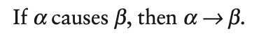
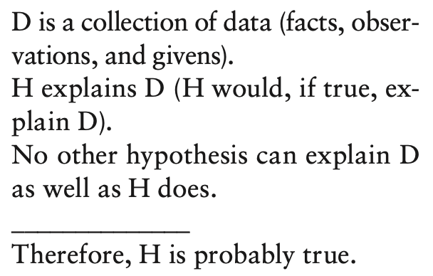
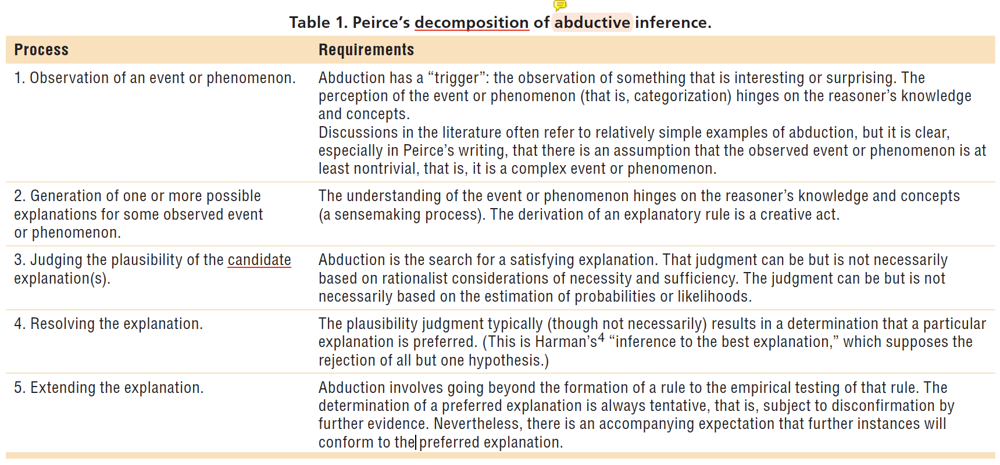
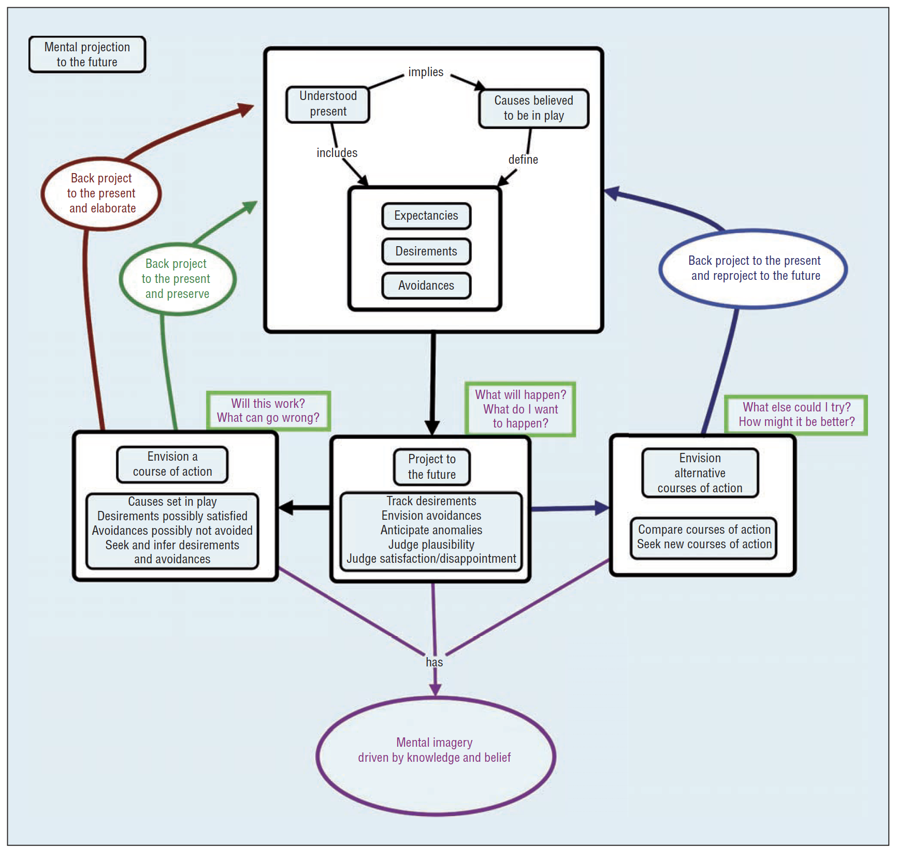

# Explaining Explanation Part 1: Theoretical Foundations

## 간략한 요약

이 논문에서는 아래의 질문들에 대한 탐구를 한다.

-   설명이란 무엇인가? → Theory
-   사람들은 어떻게 설명을 하는가? → Evidence
-   인공지능 시스템은 그들의 작업을 어떻게 설명할 수 있는가? → Possibilities
-   인공지능 시스템이 어떻게 하면 사람을 더 잘 이해하게 만들고 또한 더 잘 설명하게 만들수 있을까? → Possibilities

⇒ 인간이 지저분하고, 복잡하고, 불분명한 상황에서 더 나은 선택을 할 수 있도록 도움을 주는 인공지능 시스템 개발하기 위하여

Explanations = 설명된 현상을 원칙과 연결짓고 인과관계와 메커니즘을 나타낸다.

→ 또한, Explanation & Abductive Inference의 관계도 증명 
= Charles Sanders Pierce's concept of **abduction**가 이해되는 방식에서 Explanation이 최고의 설명이다(?)

## 상세한 정리

### Causation versus Causal Reasoning

Causation ≠ Causal Reasoning

#### Causation

-   David Hume: 원인(Cause)과 영향(Effect)은 개별의 현상이며 원인은 무조건 영향 전에 발생해야 한다. → 모든 원인과 영향은 모두 작용력(forces), 현상(Events), 믿음(Beliefs), 결정(Decisions), 행동(Actions), 등등 이 될 수 있다. 하지만 **"원인 설명을 만드는 것 & 원인을 명제"로 보는 것 은 문제**가 있는데,

1.  전세계적 지식(?)
2.  자연어 이해(?)
3.  현상의 존재론을 만드는 것
4.  일시적인 관계를 위한 존재론을 만드는 것 
   ⇒ 원인의 작용이 지속적인지 끝이 있는지 알고, 단지 상태일 뿐인 것을 구분하는 등의 것들을 해야한다.

-   Formalisms: "Cause"는 단순히 어떤 명제가 다른 명제를 설명하는가에 대한 술부인가 혹은 영향을 주는 것인가

{: width="100%" height="100%"}

하지만 Causation은 당장 앞에 놓인 의미론적이고 확산하는 문제들을 다루지 못했다.(조건에 의존하는 형태이거나, 종속적인 것일 뿐이었다.) → 의미를 제한하게 됨 but 복잡한 문제일 경우 전세계적 지식, 관심, 자연어 이해의 문제로 확장된다.

#### Causal Reasoning

설명에 대한 Causal Reasoning은 상위 레벨 혹은 광범위한 인식의 중심에 있다. 
→ 행동을 계획하고 분석하는 과정의 중심이다.(물리적 원인이 아닌)

-   Causal reasoning은 센스메이킹의 중심이다: 배운 것을 기반으로 현상을 이해하고 원인 모델을 수정하기 위해 causal resoning을 적용하는 것
-   Causal reasoning은 멘탈모델의 중심이다: 이벤트가 어떻게 발생하고 개입하면 어떤 일이 일어날 것인지 (지식과 믿음에 달려있다)
-   Causal reasoning은 선택을 하는 과정의 중심이다: 상황을 인식하고 분류하는 방법을 결정하고 행동을 평가하기 위한 시뮬레이션의 종류를 결정
-   Causal reasoning은 재계획의 중심이다: 왜 계획이 잘못 흘러가는지 진단하고 무엇이 바껴야하는지 고려
-   Causal reasoning은 협력의 중심이다: 개인의 행동이 어떻게 팀의 행동에 영향을 줄지 예측
-   Causal reasonig은 예측적 사고의 중심이다: 가능한 현상(특히 발생할 확률이 낮지만 영향이 큰)을 준비하기 위해 우리의 멘탈모델을 이용

⇒ Reasoning은 현상의 설명을 추구하는 과정(병렬적이고 상호작용하는 예측하기 어려운 원인에 대한)

02pm 해석: Causation은 정의된 조건 같은 것이고 Causal Reasoning은 그것을 찾기 위한 확장된 과정인가?

### Theoretical Foundations

#### Abduction\: 귀추

다양한 학문에서 다르게 다뤄진 열린 개념이었다.

-   Aristotle: "reduction", 하나의 결과에서 발생한 두개의 설명에 대한 것을 이야기하였다.
-   Peirce: Aristotle과 Hume과는 다른 해석, Deduction(연역)과 Induction(귀납)으로 나누어서 추론을 보는 방식과 그가 "Abduction"이라고 부른 방식을 거부하였다. He rejected the idea that the roster of “acceptable types of inference” includes just the two classical types, deduction and induction, and his neoclassical type that he called abduction. 
  → 기존의 deduction/induction은 한가지 방식으로 대체
  \*e.g., RULE (All men are mortal)
  \*Case 1 (Socrates is a man) 
  \*The Case falls under the rule (Socrates is mortal)
  → Induction은 n cases를 통해서 예측하는 것(=generalization), 경계가 없다는 단점이 있지만 pierce는 그것이 상관없다고 생각
  ⇒ Abduction이 hybird한 것. Abduction이 Induction을 포함할 수 있는 개념
  ⇒ 무언가를 인식하고 분류하는 행동은 가설을 형성하는 방식이다.
  
  ⇒ 1867-1902의 글에서 Peirce는 Abduction을 "정보에 기반한 추론", "가설적 추론(관찰한 놀라운 상황에서 추론한 가설적 설명)"이라고 불렀다. 
  Abduction은 class에 대한 일반화가 꼭 필요한 Deduction/Induction과는 다르게 그 사람의 지식에서 나온 관찰이나 설명적 가설 같은 'Propositions'에 의존한다. 
  ⇒ Abduction은 개별적 특별한 경험을 더 일반적인 현상으로 렌더링하는 것(다른 경험이 더 나은 가설을 제안하는 것에 의해 대립되기 전까지 유지)

{: width="100%" height="100%"}

  
{: width="100%" height="100%"}
\: 결론적으로 Abduction은 특정하고 복잡한 현상이나 상황에 대한 최적의 설명을 찾고 경험적으로 실험하는 과정

⇒ Abduction에 대한 정의가 다양하지만 '지식'에 많이 의존하며 상황에서 벌어진 복잡한 현상에 대한 추론이다. 
⇒ Abduction은 **Retrospective** 하고 **Prospective** 하다.

#### Retrospection

= 과거에 일어난 원인에 대한 추론 분석 → Causation과 Cause-effect relations에 Counterfactual Reasoning이 관여된다. 
= 과거에 벌어지거나 벌어지지 않은 것들에 대해 다룬다

계획하거나 행동 분석은 Prospective한 것 → Prediction

#### Prospection

= 일어나거나 일어나지 않고 그것이 미래의 다른 것을 이끌어내거나 이끌어내지 않는 것에 대함 
e.g., “만약 x가 일어나지 않으면 미래에 어떤 일이 발생할 것인가?” → counterfactual으로 보일 수 있지만 그 사실이 아직 발생하지 않아서 팩트가 아니므로 counterfactual이 아니다. 
⇒ Transfactual(transcends facts)
→ Prospective reasoning의 목적은 몇몇 현상을 예측할 뿐 아니라 상황, 존재론, 변수를 바꿀 수 있는 것을 예측한다. 
e.g., 전자: “What will happen?” 후자: “What can I try? Will it work? What do I have to pay attention to?”

{: width="100%" height="100%"}
\: Figure 1. A macrocognitive model of “mental projection to the future.” Notice that this model describes what happens when an individual envisions a course of action, considers the effects (desirable and undesirable), and then “back projects” to the present to either modify the plan or consider alternative courses of action. Retrospection & Prospection의 연결 과거의 관점에서 현재의 원인을 보고 미래를 예측

### Discussions

일반적으로 causation을 위한 증거는 너무 모호해서 유효한 추론이라고 하기 어렵기 때문에 일반적으로 유용한 기준이 아니다. Piercean의 Abduction 모델과 미래로 투영하는 멘탈 현상이 원인 추론의 기본이 되어야한다.

> Reference 
> Hoffman, R. R., & Klein, G. (2017). Explaining explanation, part 1: theoretical foundations. _IEEE Intelligent Systems_, _32_(3), 68-73.
