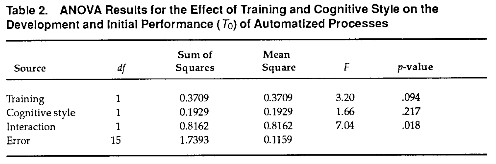
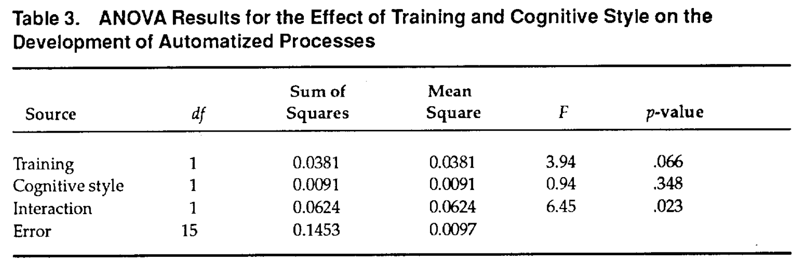
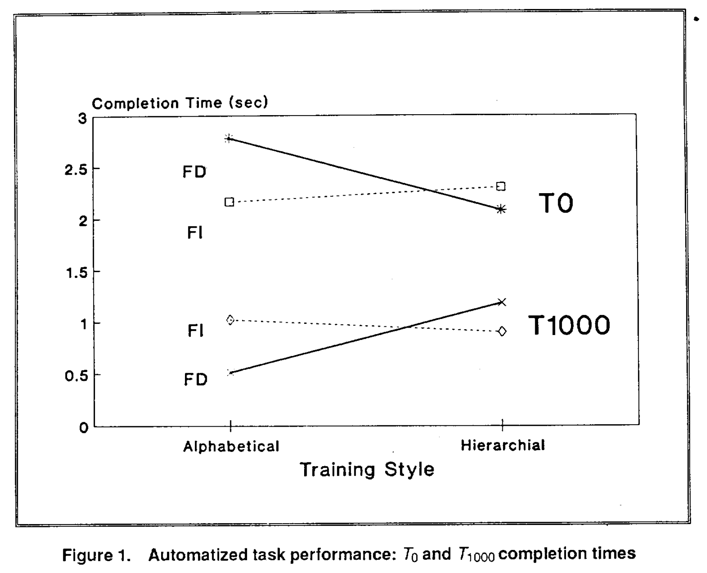
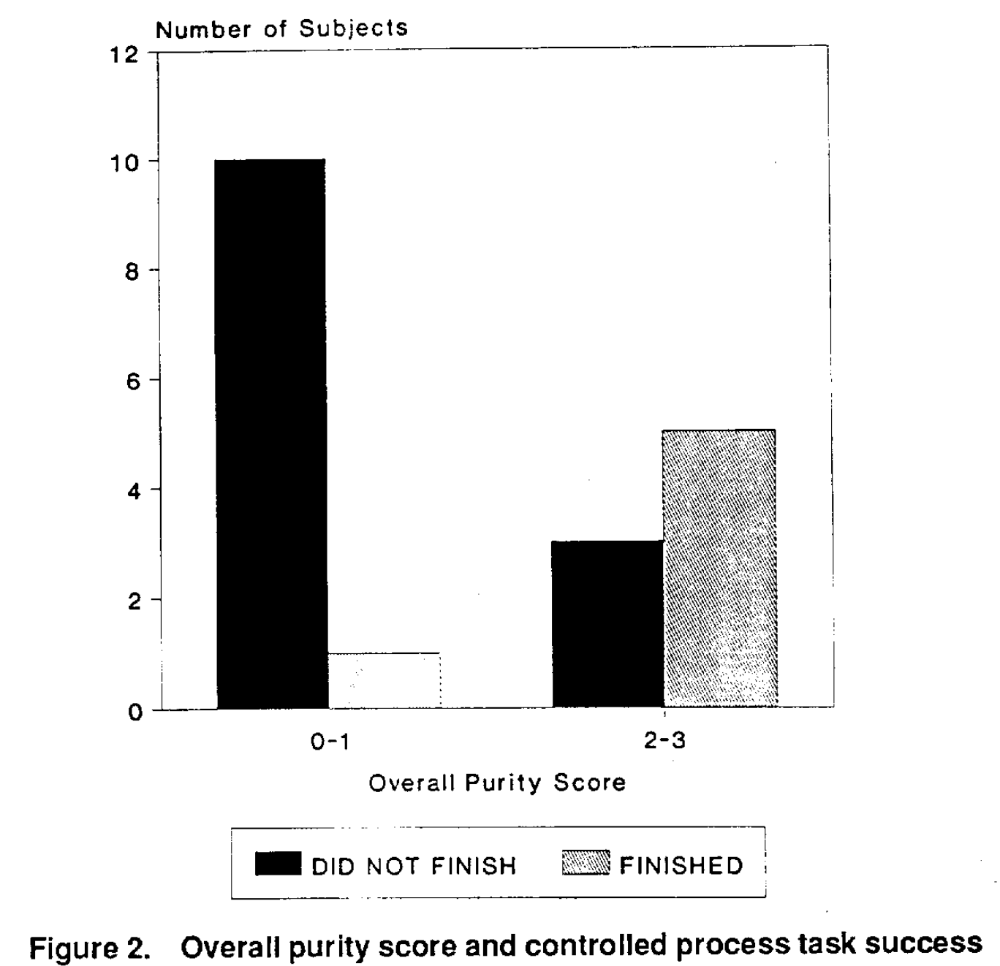
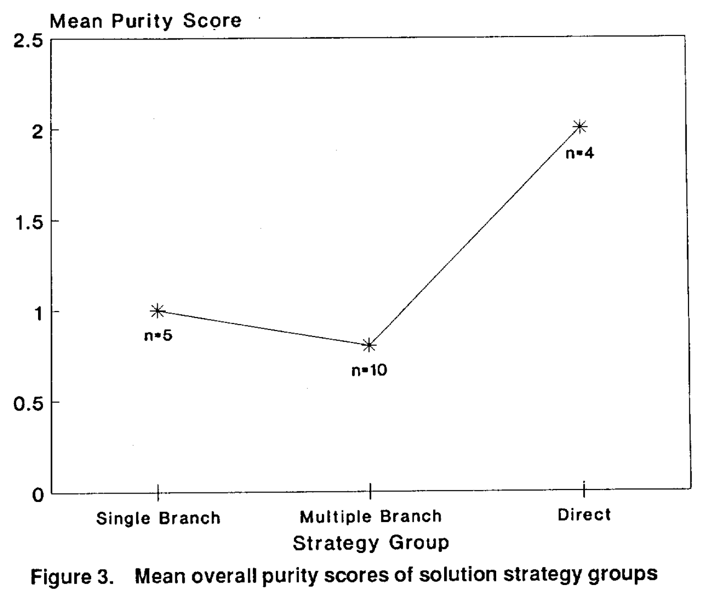

## 간략한 요약

업무 표상의 발달, 자동화된 업무 수행, 조작된 업무 수행에 대한 개인의 훈련 스타일과 조작 차이의 영향에 대하여 시험한다. 쉽고 반복적인 작업에 대해서는 대체로 자동화가 훈련 스타일과 멘탈 업무 표상이 영향이 있었다. 복잡한 업무에 대하여는 도메인 표상이 중요한 수행 결정 요인이다.

→ 업무 표상이 쉽고 어려운 과업 수행 모두에 중요한 결정요인이다. 트레이닝 스타일 혹은 개인의 차이를 위한 영향은 없었다.(?)

인간과 컴퓨터의 상호작용을 필요로 하는 시스템을 위한 트레이닝 프로그램은 배우는 과정을 원활하게 하고 업무 수행을 향상시키기 위해 이런 것들을 설명해야 한다.

## 상세한 정리

### Introduction

컴퓨터 기반 업무에 대한 스킬을 얻는 것을 돕기 위한 훈련이 필요하다.

인지 기반 업무의 생산성에 영향을 주는 세가지 요인으로는,

1.  이전 학습 (훈련을 포함한)
2.  과업에 대한 현재 지식
3.  개개인별 차이

이다. 업무 스케쥴이나 보상 같은 외부 요인도 있겠지만 이 연구에서는 배제하고 진행한다.

**Mental repersentation of the system**

복잡한 문제를 풀기 위한 능력엔 개인이 가지고 있는 시스템에 대한 멘탈 표상이 중요하다.

예시 1. Kieras and Bovair(1984): 프로그래밍에서 멘탈모델을 훈련한 사람은 아닌 사람보다 더 빨리 과정을 배우고 실행하고 더 우수한 기억력을 보여줬으며 비효율적 절차를 더 잘 단순화 하였다.

예시 2. Mayer(1989): 초보 프로그래머 훈련 프로그램에서 구체적인 모델을 제시하는 것은 학습을 원활하게 도와줬다.

예시3. Adelson(1981): 전문가는 랜덤화된 컴퓨터 코드들을 위계 구조에 따라 재정리하는 반면 초보자들은 구문상 유사함에 따라 정리했다.

예시4. McKeithen, Reitman, Reuter, Hirtle(1981): 컴퓨터 프로그램의 재생산에 있어서 초보자들은 일반적인 연상 기호(알파벳 같은)를 사용한 반면 전문가들은 기능에 따라 그룹화하는 전략을 사용하였다.

→ Mayer은 구체적인 모델을 초보 프로그래머의 훈련에 결합한 반면, Adelson과 Mckeithen 등은 상위 레벨의 스킬을 얻는 것에 위계 표상의 사용을 제안하였다.

최근에는,

**Individual differences**

훈련 프로그램을 개개인의 차이에 따라 맞출 필요가 있다.

예시1. Sein and Bostrom(1989): '추상적인' 학습 스타일을 가진 사람은 분야의 추상적 기능을 강조하는 훈련 프로그램을 제공 받았을 때 더 잘 수행한 반면, '구체적인' 학습 스타일을 가진 사람들은 구체적인 훈련 프로그램을 제공받았을 때 더 잘 수행했다.
  
**Particular mental representation**

몇몇 연구원들은 전문가와 초보 프로그래머들이 특정한 멘탈 표상화를 형성하도록 해보았다.

예시1. Adelson(1984): 초보자를 의미론적 표상을 사용하도록 하고 전문가들이 종합적인 표상을 사용하도록 억압하여 봤으나, 이런 표상은 불안정했고 결국 자신의 원래 표상으로 돌아갔다. (초보자들은 종합적, 전문가들은 의미론적으로) → 시간이 흐름에 따라 초보자가 경험을 얻고 나서 바뀐다.
  
**Breadth-first (not a depth first)**

troubleshooting 업무를 수행하기 위해서는 폭 넓은 방식의 훈련 스타일이 중요하다.

Zeit and Spoehr(1989): 학습 도구의 위계 구조는 학습자의 지식 표상 구조를 반영한다. 위계 구조는 절차적인 표상을 이끈다.(위계 구조가 없는 사람은 아닌 반면)

Lambert and Newsome(1989): intelligent system에서 제시한 질문의 형식과 구조가 전문가 혹은 초보자가 문제 풀이를 수행하는 것에 주는 영향을 연구했는데, 질문이 구체적 정보를 요구하면 초보자가 더 빨리 수행했고, 질문이 추상적인 정보를 요구하면 전문가가 더 빨리 수행했다.
  
**Automatic processes(Fisk & Gallini, 1989)**

예시1. Wiedenbeck(1985): 단순하고 자동화된 업무도 전문가가 현저히 빠르게 하고 더 정확하다.
  
**The Dual Processing Code Theory(Schneider & Shiffrin, 1977)**

인지 과정엔 두가지 다른 과정이 존재한다: Controlled / Automatic → 구분 1: **인지 자원의 사용과 조작 여부**, 자동화된 과정에는 인지 자원이 필요하지 않고 조작이 필요 없음

→ 구분 2: **그들의 발달**, 처음 배운 과정은 controlled 되고 연습이 누적되며 automatized되면 no cognitie resouces가 필요하게 되어 업무 수행의 속도와 효율성이 올라간다.
  
**Cognitive style**

전문가들은 프로그램의 표면 구조에 영향을 덜 받기 때문에 field에 상관없이 행동한다. (Field-independent)

→ 전문가들의 멘탈모델은 수정의 어려움에 영향을 받는 반면, 학생들은 프로그램의 구조나 콘텐츠에 영향을 받는다.(Field-dependent)
  
⇒ 결론적으로 과업에 대한 개인의 차이와 훈련과 현재의 지식 표상 사이에 복잡한 상관관계가 존재한다는 것을 알 수 있다.

#### Derivation of Hypotheses

Knowledge representation on performance의 영향: Controlled vs Automatized

H1: 업무 표상(representation)은 controlled 과정 업무 수행에 영향을 준다.
H2: 업무 표상(representation)은 자동화된 과정의 발달과 수행에 영향을 준다.

위의 리뷰들을 통해 다른 요소들, 특히 훈련과 인지 과정이 업무 수행에 영향을 주는 결정요인임을 알 수 있다. 위의 가설에서 실험한 performance이 이 요인에 의해 틀렸음이 입증되는지 보기 위하여,

H3: 훈련과 인지 스타일이 controlled 프로세스의 발달과 수행에 영향을 준다.
H4: 훈련과 인지 스타일이 automatized 프로세스의 발달과 수행에 영향을 준다.

표상, 훈련, 인지 스타일이 상호연관이 있을 수 있다. 그에 따라 받은 훈련과 개인의 인지 스타일 차이가 업무 수행 표상의 타입의 결정요인인지 알아보기 위하여,

H5: 훈련과 인지 스타일은 발달되는 표상에 영향을 준다.

### Method

워드프로세서를 알파베티컬하게 혹은 위계질서에 따른 방식으로 인지 스타일을 다양하게 훈련받는다. 훈련을 따라 그들의 업무 표상화는 평가되고 controlled와 automatic 과정 업무를 수행하도록 요구된다.

#### Task

네가지 업무 수행

1.  Cognitive style assessment: FI(Field Independence)와 FD(Field Dependence)로 개인의 차이를 분류
2.  Domain training: 참가자는 워드 프로세스 트레이닝을 2가지 방법으로 나누어 같은 요구와 예시를 배우도록 지시받는다. - alphabetically vs. hierarchial manner based on their functional interrelationships
3.  Representation evaluation: 17개 워드프로세서의 짝지어진 기능을 배우고 결론적으로는 136 아이템을 배운다. 그런다음 각 짝을 5점 척도로 비슷한 정도를 점수매긴다. 참가자의 워드프로세서에 대한 표상을 보기 위해 이 데이터는 평가된다.
4.  Stimulus task execution: 참가자는 텍스트를 수정하는 과업을 수행하도록 요구받는다. 첫번째 수정(Automatic processing task)에서 참가자들은 균등 배분된 행간과 함께 정렬을 30회 하도록 지시받는다. 이 과업은 계속 반복되기 때문에 Automatized 되어야 한다. 두번째 수정에서 참가자들은 문단을 side-by-side로 놓도록 지시받는다. 이 과업은 다른 과정을 복합적으로 이용해야해서 복잡하다. 15분 내에 과업을 수행해야 한다. 기존에 연습하지 않았기 때문에 Controlled process 과업으로 분류된다.

#### Subjects

20명으로 진행
→ Hidden Figures test 점수에 따라 FI(Field Independence)와 FD(Field Dependence)로 분류: Cognitive style
→ 랜덤하게 alphabetically와 hierarchically로 분류

### Results

#### Training and Individual Difference Effects

Representation Development(H4)

{: width="100%" height="100%"}
 
{: width="100%" height="100%"}
 
{: width="100%" height="100%"}

#### Representation Effects

{: width="100%" height="100%"}
 
{: width="100%" height="100%"}

### Conclusion

-   H5는 supported 되지 않았다.
-   자동화 과정의 발달과 수행에 훈련과 인지 스타일의 영향이 있었다.: Field Dependent한 참가자들은 Alphabetic training일 때 빠르게 배웠고 Hierarchically일 때 느리게 배웠다.
-   Automatized processes는 task representation에 영향을 받았다.
-   Controlled process task performance는 task representaion에 영향을 받았다.

→ Domain representation이 존재한다: 인지 기반 업무에 대한 determinant of operator performance

기존에는 automatization은 반복적 연습이 필요하다고 했지만, 이번 연구를 통해 개인의 operator characteristics에 따라 다르다는 것을 발견하였다.

-   task representation은 더 복잡한 업무에 영향을 주었다. → 맞는 representation을 선택해야 한다.

> Reference 
> Koubek, R. J., & Mountjoy, D. N. (1991). The impact of knowledge representation on cognitive‐oriented task performance. _International Journal of Human‐Computer Interaction_, _3_(1), 31-47.