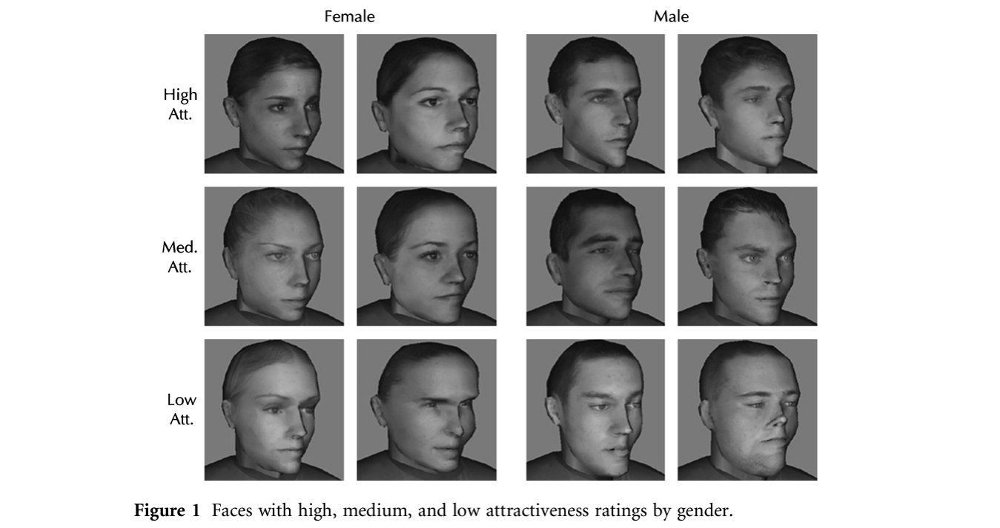
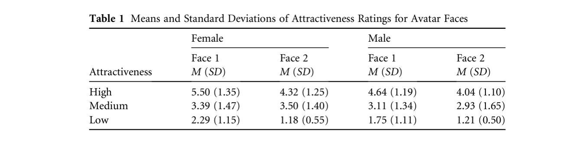
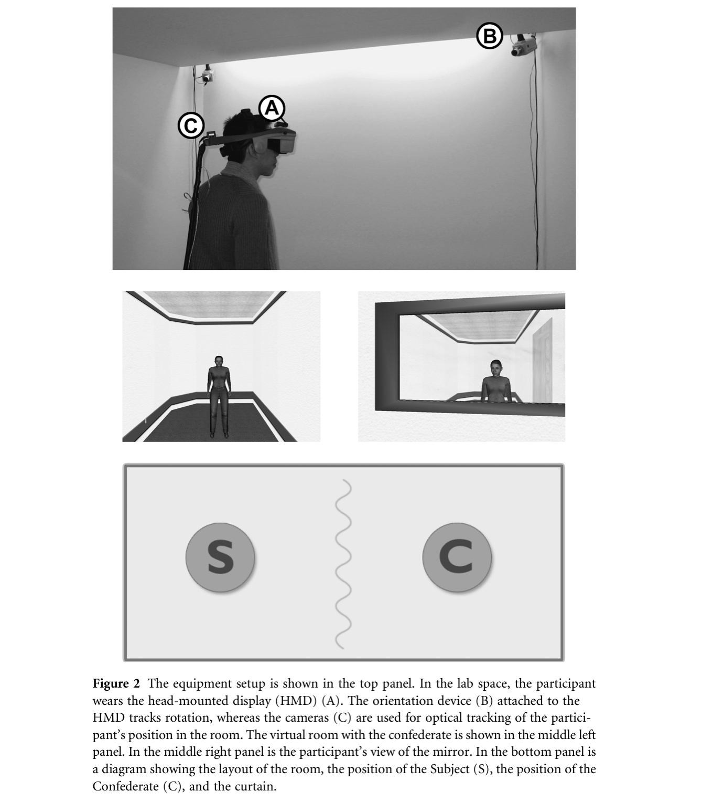
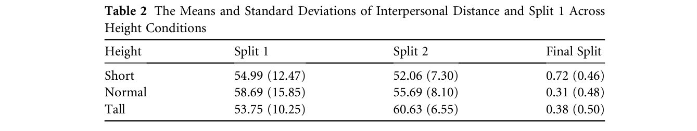

## 간략한 요약

온라인 게임과 웹기반의 채팅방 같은 가상환경은 우리의 디지털 자기표상을 극적으로 그리고 쉽게 바꿀 수 있게 해준다. 이런 자기표상의 변화는 우리의 행동도 변화시킬까?

Proteus Effect: 개인의 행동은 다른 사람이 그들을 어떻게 인식하는지에 관련 없이 디지털 자기표상을 따라간다.

첫 번째 연구: 더 매력적인 아바타를 배정받은 참가자가 그렇지 않은 참가자보다 상대방에게 self-disclosure하고 interpersonal distance에 있어서 더 친밀하게 행동했다.

두 번째 연구: 키가 큰 아바타를 배정받은 참가자가 키가 작은 아바타인 참가자보다 협상 과업에서 더 대담하게 행동했다.

## 상세한 정리

Proteus는 그리스 신화의 개념으로 형용사 'protean'의 어원으로 다양하고 많은 자기표상을 가질 수 있는 능력을 일컫는다.

기존의 물리적인 세계에서는 자기표상을 바꾸는 것이 비싸거나(성형수술) 어려웠는데(성전환수술) 가상환경에서는 '아바타'를 이용하여 사용자가 자기자신의 자기표상을 선택하거나 커스터마이징하는 것이 쉬워졌다.

기존의 연구들엔 온라인 환경에서 사회적 교류에 대한 기술적 어포던스의 영향에만 치중하거나 CMC에서의 얇은 커뮤니케이션 채널이 인상 형성에 어떻게 영향을 미치는지에 대한 관심만 존재했다.

이 연구에서는 아바타 변화의 익명성이나 진짜인가에 대한 측면 이외의 온라인에서 우리의 행동에 어떤 변화를 주는지에 대해 관심을 가지고자 한다.

**Behavioral confirmation**

**Behavioral confirmation(1997, Snyder, Tanke, & Berscheid):** 한 사람(perceiver)이 다른 사람(target)에 대해 가지는 예상이 그 예측에 순응하도록 행동하게 하는 과정이다.

온라인 환경에서 매력적인 아바타를 가진 target과 상호작용하는 perceiver는 target이 더 친근하고 아름다운 매너로 행동하도록 야기할 수 있다.

**Self-preception theory and deindividuation theory**

다른 사람이 나를 어떻게 인식하는지와 관계없이 우리의 아바타가 우리의 행동을 바꿀 수 있을까?

**Self-perception theory(1972, Bem):** 사람들은 자신의 어떤 태도가 그 행동을 유발했는지 관찰한다. 예를 들어 내가 원래 좋아하던 행동이었어도 그에 대한 외부적 보상이 주어지면 그것의 내부적인 흥미를 덜 느끼게 된다.(Overjustificaton effect)

**1966, Valins:** 어떤 사람의 사진을 보고 심장박동이 빨라졌다고 믿도록 설정되면 그 사람을 더 매력적으로 느낀다.

**1988, Frank and Gilovich:** 검은 유니폼을 입은 사람들이 흰 유니폼을 입은 대상자보다 더 공격적으로 행동했다. 검은 유니폼을 입은 사람을 보면 그들을 터프하고, 예민하고, 공격적으로 보듯이 내가 입으면 그렇게 행동하는 것.

**Deindividuation theory(1969, Zimbardo):** 도시의 북적이는 공간은 사람들을 반사회적 행동으로 이끈다.

하지만, 친밀행동(**Affiliative behavior**) 또한 이끌 수도 있다.(**1973, Gergen, Gergen, & Barton**): 밝은 곳에 놓여진 두 사람은 이야기만 한 반면, 어두운 공간 속에 놓여진 두 사람은 서로 의도적으로 터치하거나 안는 경향이 있었다. 즉 deindividuation이 antisocial 하지만은 않다.

(1979, Johnson & Downing): 같은 맥락으로, 간호사 유니폼을 입은 사람보다 Ku Klux Klan 옷을 입은 사람이 teacher-learner 패러다임에서 전기 충격의 체벌을 더 길게 줬다.

즉, Deindividuation은 identity cues에 의존하여 반사회적으로 행동할지 친사회적으로 행동할지에 큰 영향을 준다.

cf) SIDE, Social Identity model of Deindividuation Effect(Postmes, Spears, & Lea, 1994; Spears & Lea, 1994): deindividuation은 그룹 특징와 그룹 규범에 대한 순응인 것이다.

**The Proteus Effect**

: 우리의 아바타는 우리가 온라인에서 행동하는 것에 확실하게 영향을 준다. 온라인 환경에서 deindividuated 된 사용자는 마치 검은 옷을 입은 사람들이 더 공격적인 아이덴티티를 가진 것처럼, 그들의 아바타에서 추론되는 새로운 아이덴티티를 가지게 된다.

≠ SIDE theory, SIDE theory는 그룹 규범인 반면 Proteus effect는 개인의 아이덴티티에 대한 순응인 것. 혼자 있을 때도 작용함.

**Collaborative virtual environments and transformed social interaction**

연구를 진행함에 있어서 Proteus Effect만 실험하기 위해 Behavioral confirmation을 없애기 위해 노력하였다. 그러하여 CVEs, Collaborative virtual environments을 활용하였는데, 따로 떨어진 원격 물리 환경을 이용하지만 삼차원 디지털 공간을 나눠 이용하여 상호작용 시스템을 구축하였다. 아바타는 지속적으로 서로에게 새로 그려진다. 하지만 Transformed Social Interaction을 이용하여 타겟은 자기 자신을 매력적이라고 생각하지만 perceiver은 매력적이라고 생각하지 않도록 구성하였다. 이런 일련의 과정을 실험했는데, 그 과정은 연구1에서 확인 할 수 있다.

-   **Interpersonal distance**
    
    Burgoon, 1978에 따르면 매력적인 개인이 너무 가깝게 오는 등의 행위를 하여 nonverbal expectancies를 깰 때, positive valence가 사회적인 이점이 될 수 있다. 즉, 매력적인 개인이 더 자신감 넘친다.
    
    **H1: Participants in the attractive condition walk closer to the confederate than the participants in the unattractive condition.**
    
-   **Self-disclosure**
    
    Snyder et al.'s (1977)에 따르면 우리는 행동적 연산으로서 self-disclosure를 사용한다. Langlois et al(2000)에 따르면 매력적인 개인이 더 외향적이고 친밀한 경향이 있다.
    
    **H2: Participants in the attractive condition would exhibit higher self-disclosure and present more pieces of information about themselves than participants in the unattractive condition.**
    
-   키가 큰 사람은 더 유능하다고 여겨진다(Young & French, 1996), 더 로맨틱한 파트너로 선호된다(Freedman, 1979; Harrion & Saeed, 1996) 그리고 리더로 선출되는 경향이 더 있다.(Stogdill, 1948) → confidence를 확인하기 위하여
    
    **H3: Participants in taller avatars would behave in a more confident manner and negotiate more aggressively than participants in shorter avatars.**
    

### Experiment 1

참여자들은 랜덤하게 매력적이거나 덜매력적인 캐릭터를 배정받았다. 그리고나서 반대의 성별의 사람과 상호작용하게 된다. 또한 상대방은 attractive한지 unattractive한지에 대하여 알 수 없다.

**Facial attractiveness pretest**

다른 집단에서 얼굴을 따와서 객관성을 확보하였으며 매력적인지 매력적이지 않은지 확인하기 위해 사전테스트를 진행하였다. 아래의 그래프가 그 결과이다.

{: width="100%" height="100%"}

{: width="100%" height="100%"}

따라서 High 와 Low한 매력도는 평균과의 차이를 SD만큼 확보할 수 있었다.

{: width="100%" height="100%"}

물리적인 실험실 환경은 이렇게 구성되었는데, 사용자 앞에는 커튼이 있으며 서로의 실제 얼굴을 절대 볼 수 없다. 연구 1에서는 참가자는 뒤에 거울이 보인다. 앞으로는 상대방이 5m의 거리에 존재하게 된다. 상대방은 HMD에 짜여진 각본을 따르며 몸짓에 대해선 짜여진 것이 없다.

우선은 둘이 인사를 하고나서 참여자는 가까이 오도록 요구된다. 그러고 나서 상대방은 참여자에게 자기소개를 하도록 요구하고 멈추거나 참여자가 자신이 말한 것이 충분했는지 물어보면 상대방은 그 참여자에게 더 말해주도록 요구한다. 만약 참여자가 상대방에게 질문하면 상대방은 "미안하지만 나는 그 질문에 대답할 수 없어. 계속하자"라고 답한다.

**측정 - Interpersonal distance**

참여자와 상대방 사이의 거리는 VR 시스템을 통해 자동으로 측정된다.

**측정 - Self-disclosure**

얼마나 정보를 노출했는지에 대해 Two blind coders(코딩 테이블에 따라 정량화하여 코딩하는 사람, 코딩하는 사람과 참가자가 모른다는 개념이 blind)가 센다. 그 두 코더는 interrreliability가 .84였다.

### Results and discussion

Interpersonal distance: 매력적인 조건에 있는 참여자가 상대방에게 더 가까이 다가갔다.( M = 0.98, SD = 0.35) 덜 매력적인 참가자는 (M = 1.74, SD = 1.20), _t_(30) = -2.42, _p_ =.02, _d_ = .40

Self-disclosure: 매력적인 조건에 있는 참가자가 자신의 정보를 더 많이 노출했다. ( M = 7.19, SD = 2.77) 덜 매력적인 참가자보다.( M = 5.42, SD = 1.56), _t_(30) = 2.23, _p_ = .03, _d_ = .38.

즉 이 두 결과는 Proteus Effect를 보여준다.

### Experiment 2

전반적인 과정은 Experiment1 과 같으나 Experiment 2의 참가자는 가상 환경 내에서 자기 뒤에 거울이 없다.

실험 2에서는 키가 주는 영향을 실험하는데, 기존 다른 연구에서 키가 자신감과 능숙도에 영향을 주었던 것을 참고.

따라서 키가 큰 아바타를 가진 참여자가 협상하는 게임에서 더 불공평한 나눔을 하는 것에 자신감이 있을 것이라고 가설을 설정하였다.

게임: 참가자와 상대방은 총 4번 협상을 하게되는데, 1, 3 협상에서 참가자가 몫을 나누는 역할을 한다. 참가자가 몫을 나누고나서 상대방은 그걸 수락할지 말지 결정하는데 수락하면 몫을 나눈것을 가지고 수락하지 않으면 두명 모두 그 몫을 잃는다. (2, 4 는 상대방이 나누며 2에서 상대방은 50:50으로 나누고 4에서 상대방은 75:25로 나눈다) → 최후통첩 게임

이 상황속에서 참가자가 어떻게 나누는지가 fair 하고 unfair한 선택을 했다는 것을 나타낸다. 또한 마지막 Split에서 참가자가 상대방이 75:25로 제안한 것을 수락하는지 안하는지를 통해 실험을 확인한다.

상대방은 참여자의 키가 바뀌는 것을 알지 못한다(키가 계속 같다). 참여자만이 키가 작을때와 클 때를 경험한다.

### Results and discussion

{: width="100%" height="100%"}

결과에서 outlier는 제외하였다.

첫번째 Split에서는 키의 영향이 적었다. (맛보기 느낌)

두번째 Split에서는 키의 영향이 있었다. 키가 큰 참여자가 키가 작은 참여자보다 확실하게 더 원하는대로 나누었다.

마지막은 불공평한 제안을 수락하는 정도를 보기위한 실험이었는데, 키가 작은 참여자가 키가 크거나 키가 평범한 참여자보다 불공평한 제안을 더 수락했다. 키가 작은 참여자: 72%, 키가 평균적인 참여자: 31% 키가 큰 참여자: 38%

결론적으로 키의 조작은 협상에 대한 태도에 영향을 주는데 그 영향은 시간이 지남에 따라 더 있다. 키가 큰 참여자는 불공평한 split을 제안하는 경향이 더 뚜렷했고, 키가 작은 참여자는 불공평한 split을 수락하는 경향이 더 뚜렷했다. 즉 negotiation tast는 Proteus Effect을 지지한다.

> Reference 
> Yee, N., & Bailenson, J. (2007). The Proteus effect: The effect of transformed self-representation on behavior. _Human communication research_, _33_(3), 271-290.