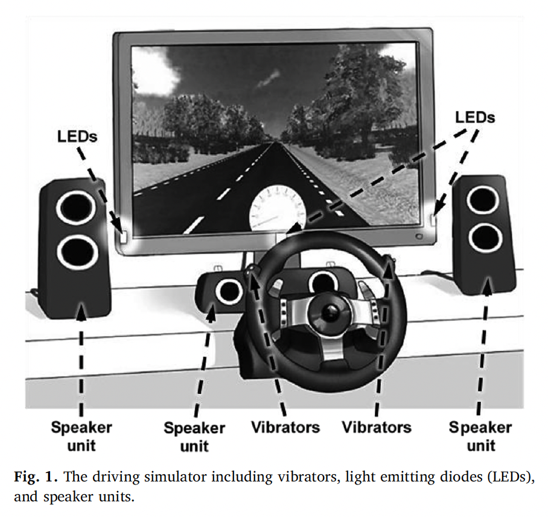
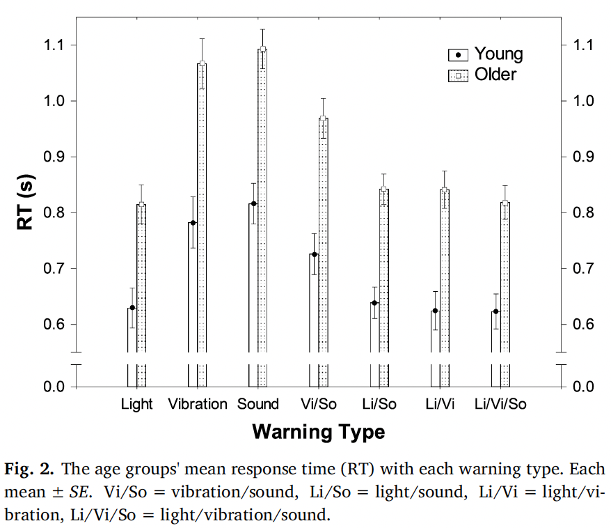
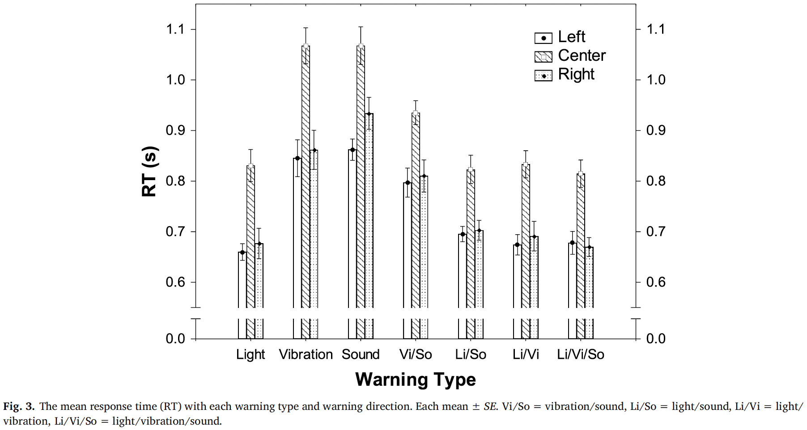
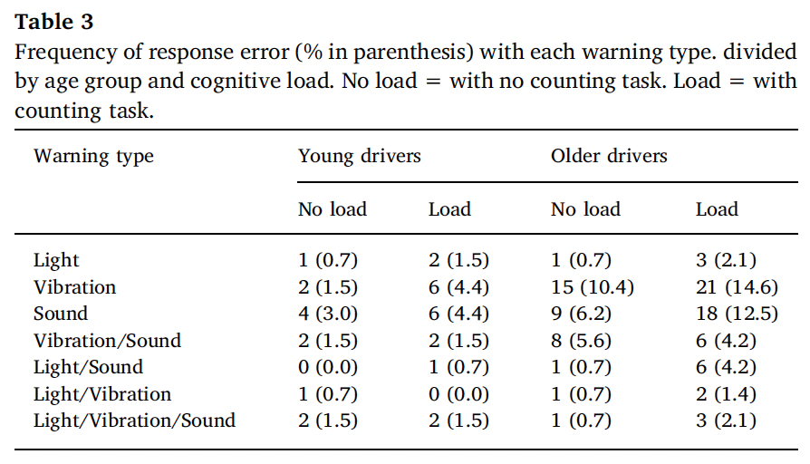
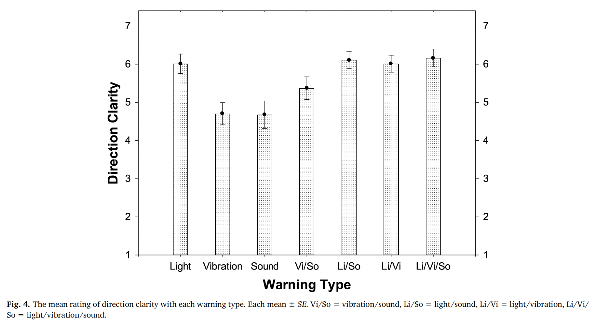
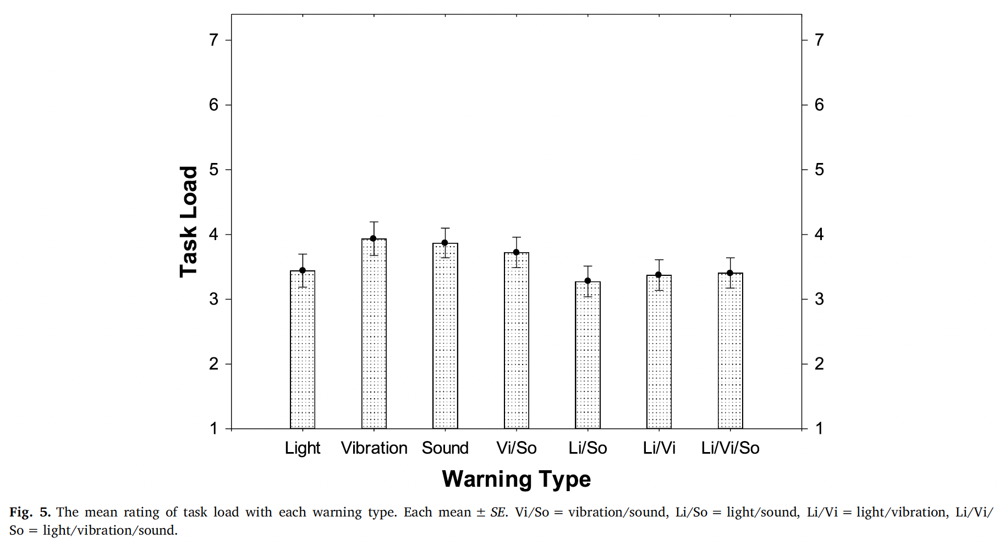

# Age, cognitive load, and multimodal effects on driver response to directional warning

## 간략한 요약

운전자의 운전능력 감소는 나이와 큰 연관이 있는데, 그렇기 때문에 차 안의 경고 시그널을 나이가 있는 운전자에게 맞출 필요가 있다.

따라서 uni-, bi-, trimodal directional warnings (light, sound, vibration)이 나이가 적고 많은 운전자에게 운전 시뮬레이션에서 어떤 반응을 일으키는가 알아보고자 한다.

결과적으로, 모든 경고 종류에서 나이 많은 운전자의 반응이 나이 적은 운전자보다 느렸다. 또한 인지 부하를 일으키는 작업이 더해지면 더 느려졌다.

전체 멀티모달 중에서 조합 구성 요인들의 반응시간(vibration의 반응시간, sound의 반응시간)과 비교했을 때, vibration-sound 조합의 멀티모달만이 더 빠른 반응을 보였다.

전체 멀티모달 중에서 조합 구성 요인들과 비교했을 때, 반응 오류가 줄어든 멀티모달은 extra 인지 부하 작업에서 나이 많은 운전자의 vibration-sound 였다.

즉, 나이 많은 운전자는 더 빠르고 정확한 반응의 관점에서 bimodal 경고가 효과가 있다.

## 상세한 정리

### Introduction

**Inattention**

Bargman et al; Klauer et al; Victor: 어느 정도의 인지 자원이 안전한 운전에 필요해서 부주의는 사고를 유발한다

De winter et al; Lu et al: wargning signals를 이용해서 다가오는 위험을 알릴 수 있다. (경고등)

Petermeijeret et al: 효과적인 take-over request(TOR)을 전달해야한다. → warning signal

Collins McLaughlin and Mayhorn; Dieuleveult et al; Thompson et al: 나이가 있는 운전자는 인지 능력과 운동 신경 저하로 인해 상황 인지가 어렵다.

**Non-driving secondary tasks(distraction)**

Lee et al: 운전이 아닌 다른 작업을 하는 것은 extra load를 유발한다. 그로 인한 사고가 많다.(McEvoy et al; Staubach; Young et al)

**Multimodal warnings**

Gray et al: unimodal warning signals는 복잡한 상황에서 가려질 수 있다. multimodal warning이 더 효과적이다. high load 상황에서도 효과적이다. 반응 오류도 적게 만든다.

Biondi et al; Ho et al: bimodal signals는 더 빠른 반응 시간을 유도한다.

Ho et al; Spence and Ho: 하지만 그 반응은 공간적으로 일치하는지가 효과를 결정한다. ex. 진동이 브레이크를 유도하는 시각적 이벤트와 같은 방향에서 일어나는지

**TOR(Take Over Request)**

: 운전 건내받으라는 request?

Petermeijer et al: bimodal(청각-촉각)의 효과가 있었지만 방향이 일치해야하는지는 확인하지 못했음

Musseler et al: 위험 물건의 반대쪽에서 일어나는 반응이 더 빠른 반응을 불러일으켰다. in driving scenarios allowing the driver to assess thedriving scene, the contralateral response away from the direction of adanger-object is faster as opposed to the ipsilateral response towards atarget

차선 이탈 시스템에 활용되는데 도로 바깥 부분의 울퉁불퉁한걸 밟았을 때처럼.

**Age related deteriorate**

나이가 듬에 따라 물리적 심리적 기능의 저하가 생긴다.

Mahoney et al: 젊은 사람에 비해 나이 든 사람이 반응 속도가 더 느리다. (uni and bimodal signals 모두에 대해)

Oskarsson et al: trimodal display가 가장 효과적이었다.

### Method

**[참가자]**

나이 적은 운전자 15명(20-25세) 나이 많은 운전자 16명(65-79세) 조건: 1년에 5000km이상 운전, 운전 면허 딴 지 2년 이상, 운전 관련한 질병 없음(시각, 촉각, 청각)

{: width="100%" height="100%"}

**[장치]**

위의 이미지에서 볼 수 있는 시각(LEDs), 촉각(Vibration), 청각(Speaker unit)적 장치들 이용

**[실험 Design 과 자극]**

7 (Warning Type) X 2 (Age Group) X 2 (Cognitive Load) X 3 (Warning Direction) → between subjects: age group, within subjects: warning type, cognitive load, warning direction

**Warning Type**: 시각(빛) X 촉각(진동) X 청각(소리) 조합 7개

**Age Group**: Old vs Young

**Cognitive Load**: Extra vs None → 숫자를 말로 세는데 1000 998 996.. 같이 센다.

**Warning Direction**: right, left(핸들 돌리기) and center(브레이크)

**DV**: Reponse time(RT), Response errer 빈도

처음 7 블럭은 Warning Type이 랜덤하게 주어지며 Warning Direction이 포함됨, 다음에 이 과정을 반복하는데 Cognitive Load가 있는 상태로 다시 실험, 즉 총 14블럭

**[자기보고 측정]**

1.  블럭 하나를 마칠 때 마다 방향 지시가 명확했는지 평가 (1은 전혀 명확하지 않다 7은 완전 명확하다)
2.  블럭 하나를 마칠 때 마다 task load가 얼마나 느껴졌는지 평가 (1은 전혀 느끼지 못했다 7은 많이 느꼈다)

**[과정]**

우선 인지 부하에 대해서는 숫자 세는 단계가 있어도 그것보다 정확하고 빠르게 경고 시그널에 반응하는 것이 중요하다고 명시. 숫자 세다가 까먹으면 처음부터 다시 시작. 그리고 실험을 시작하기 전에 각 자극별로 Trial 한번씩 함.

방이 어두운 상태에서 실험 시작하여 반은 cognitive load 있는 블럭 진행 반은 cognitive load 없는 블럭 진행

한 블럭이 끝나면 방에 불이 켜지고 자기보고 측정 과정 실행, 7블럭 마치고 나면 cognitive load 반대의 것 진행

### Results

**[Response time]**

Warning Type, Age group, Warning direction, Cognitive laod 은 significant 했다. Warning type X Age group의 interaction effect은 significant Warning type X Warning Direction의 interaction effect은 significant

{: width="100%" height="100%"}

{: width="100%" height="100%"}

나이 많은 운전가의 반응 속도가 나이 적은 운전가보다 모든 Warning type에서 느렸다. 나이가 적은 운전가와 많은 운전가 모두 Light 가 들어있는 Warning type은 그렇지 않은 Warning type보다 반응속도가 빨랐다.

Interaction effect: 나이 많은 운전자의 vibration-sound에 대한 반응 속도가 그 구성요소들의 반응 속도보다 빨랐고 나이 적은 운전자의 vibration-sound에 대한 반응 속도가 그 구성요소들에 대한 반응 속도보다 빨랐따.

Light를 포함하고 있는 4 그룹간의 차이는 significant하지 않았다. Light를 포함한 그룹들에서 나이 적은 운전자의 반응속도가 더 빨랐지만 나이 적은 운전자의 light-sound에 대한 반응 속도와 나이 많은 운전자의 light에 대한 반응속도는 예외였다.

{: width="100%" height="100%"}

**[Response error]**

{: width="100%" height="100%"}

**[Perceived clarity of warning direction]**

Warning signal의 효과는 significant 했다. 특히, light가 있는 warning과 그렇지 않은 warning의 차이가 significant 했다.

Cognitive load도 significant 했다. cognitive load가 있을 때, 경고 방향이 덜 명확했다.

{: width="100%" height="100%"}

**[Perceived task load]**

warning type에 따른 차이가 significant 했다. light가 들어있는 type의 경우는 확실하게 load가 덜 일어났다. Light가 포함된 것들 사이의 차이는 없었다.

Cognitive load의 영향 또한 significant. 과업이 있을 경우의 loading이 더 있었다.

### Discussion

운전자의 RT에 대해 나이, 인지 부하, multimodal effects가 있었다.

숫자를 세는 과업이 있을 경우 RT가 더 느렸고, 각각 warning에서 나이 많은 사용자가 RT가 더 느렸다. 두 그룹 모두 unimodal vibration, unimodal sound, bimodal vibration-sound에서 RT가 느렸다.

하지만, Light가 포함되지 않을 경우 나이 많은 운전자의 performance가 저하되었다. 그리고 light가 포함되면 젊은 운전자가 light 없을 때에 비해 느리지 않았다. (하지만 환경이 어두운 환경에서 진행됐음)

하지만 trimodal은 특별한 차이를 보이지 않았다.

Multimodal effects는 있었다. (나이 많은 운전자의 vibration-sound에 대한 반응, center vibration-sound warning)

light가 있는 type은 error가 적었다. multisensory warning에서는 Vibration-Sound가 그 구성요소들보다 error가 적었다.

결론적으로, 나이가 많은 운전자는 bimodal 경고에서 효과를 볼 수 있다.

> Reference 
> Lundqvist, L. M., & Eriksson, L. (2019). Age, cognitive load, and multimodal effects on driver response to directional warning. _Applied ergonomics_, _76_, 147-154.
