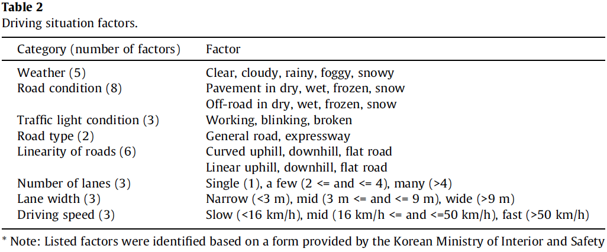
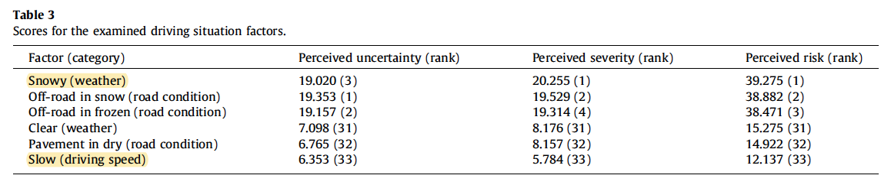
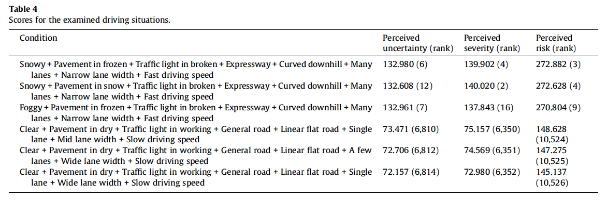
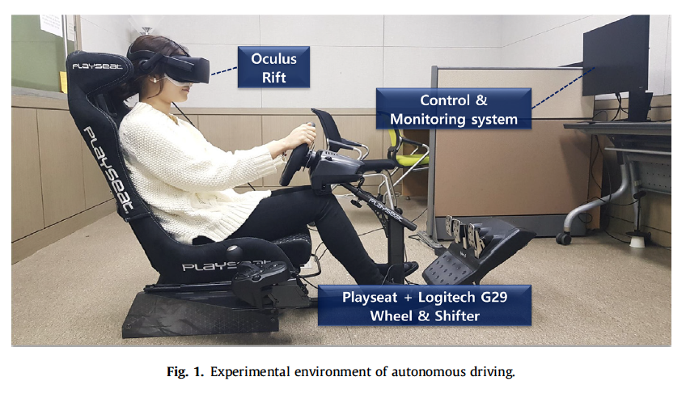
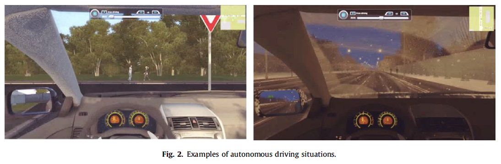
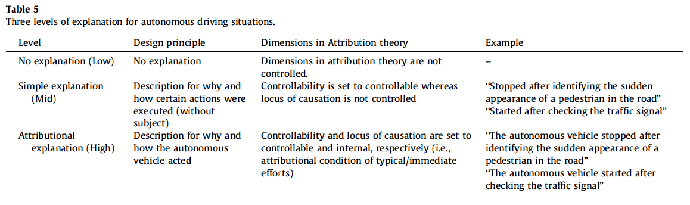
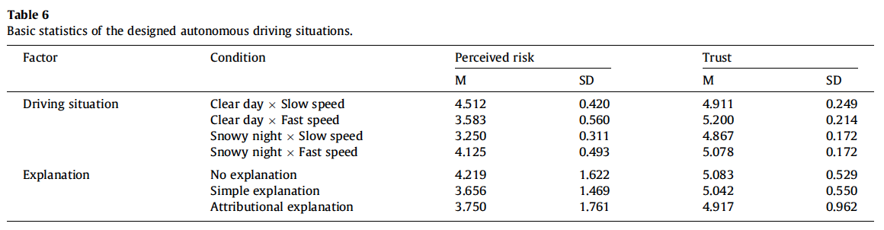
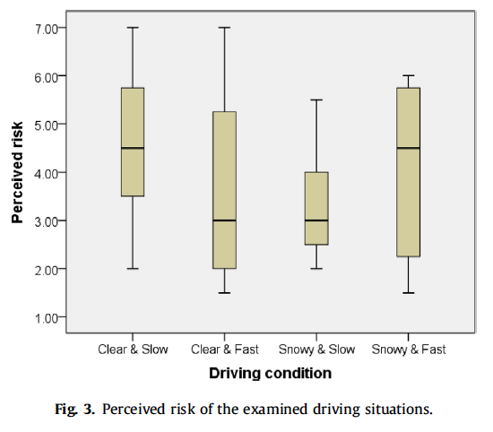
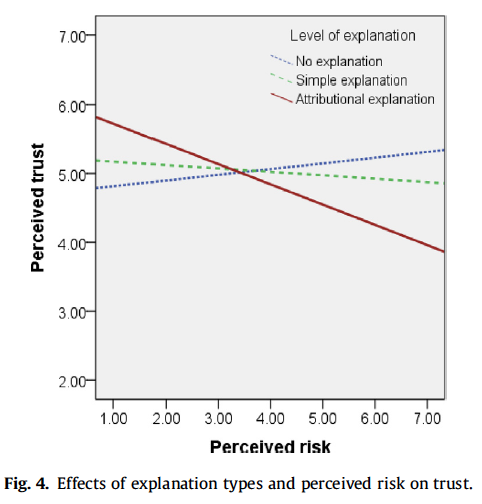

# Effects of explanation types and perceived risk on trust in autonomous vehicles

## 간략한 요약

네가지 운전 상황(snowy, clear X slow, fast)과 세가지 설명 종류(no, simple, attributional explanation)을 통해 자율주행 자동차의 행동에 대한 설명의 효과를 확인.

설명 종류는 자율주행 자동차에 대한 신뢰에 영향을 준다.

인지된 위험이 높으면,

-   attributional 설명은 낮은 신뢰를 이끌고,
-   no 설명은 높은 신뢰를 이끈다.

인지된 위험이 낮으면 반대로,

-   attributional 설명은 높은 신뢰를 이끌고
-   no 설명은 낮은 신뢰를 이끈다.

눈오는 날씨와 빠른 운전 속도는 인지된 위험(Perceived Risk)의 주된 요인이다.

## 상세한 정리

### Introduction

**Hoff and Bashir(2015)**: 자동 시스템에 대한 신뢰를 높이려면 anthropomorphic feature, communication styles, feedback 등을 이용할 수 있다.

**Lee and See(2004)**: 자동화 시스템에 대한 신뢰는 믿음-태도-의도-행동의 순서에 따라 형성될 수 있다고 한다. 그리고 사용자는 시스템에 대하여 속성을 attributing 함으로써 발생한다. 또한 자동화 시스템의 성능, 절차, 목적을 clarifying 함으로써 발생한다.

**Koo et al. (2015)**: 반자율주행 자동차의 행동에 대한 설명을 주는 것은 자동차에 대한 수용도를 높여준다. → 하지만 설명의 종류에 대한 실험이 없음

### Background

**/ Autonomous vehicles**

**The Society of Automotive Engineers(SAE) International**: 자율 주행 정도에 대한 정의를 내림. 0 (자동화 X) - 5 (완전한 자동화)

**Choi and Ji(2015)**: 자율주행 자동차의 사용 동기에 신뢰(Trust) 가 중요한 영향을 미친다.

**Ward, Raue, Lee, D'Ambrosio, and Coughlin (2017)**: 위험과 이점에 대한 인지, 지식 정도, 신뢰가 자율주행 자동차 사용 동기에 영향을 미친다.

다른 주요한 관련 연구들도 신뢰가 중요하다고 확인하였다.

→ 자율주행 자동차에 대한 신뢰를 높이려면?

**Verberne, Ham and Midden (2012)**: 자율 주행의 목표를 공유하고 정보를 제공

반대로 **Helldin, Falkman, Riveiro, and Davidsson (2013)**: 너무 많은 정보를 제공하는 것은 신뢰를 낮춘다.

**Koo et al. (2015)**: 반자율 자동차를 수용하는 것에 있어서 자동차의 행동에 대한 "why" 설명만 제공하는것이 "why"와 "how" 설명 모두를 제공하는 것보다 좋았다.

하지만, 이런 효과들은 설명의 종류와 자율주행의 상황에 따라 달라질 수 있다.

**/ Attribution theory (Weiner, 1979)**

: 사람들이 사건의 원인을 원인이 발생한 장소(내적/외적), 안정성(안정적/불안정적), 그리고 조작가능성(조작가능/조작불가능)의 차원에 따라 attribute 한다.

**Discounting principle(Kelly, 1973)**: 사람들은 다른 요소들의 가능성을 줄여서 가능한 원인을 찾아낸다.

**Ahn and Bailenson (1996)**: mechanism에 기반한 원인 설명이 더 효과적이다.

→ attributional theory에 기반한 효과를 이해하기 위해, attribution theory에 기반한 설명과 인지된 위험의 moderation effect을 실험하였다.

### Design of this study

**Pre-study:** 운전하는 상황의 인지된 위험을 확인하기 위해 운전 경험이 있는 운전자들로부터 요소를 확인

{: width="100%" height="100%"}

각각의 요소에 대해서 사람들은 uncertainty와 severity를 수치로 표하도록 했고 이걸 결합하여 perceived risk 변수를 추출하였다. (운전경력을 종합하기 위해 운전 경력을 곱하였다)

{: width="100%" height="100%"}

{: width="100%" height="100%"}

결과 값들을 곱해서 인지되는 제일 위험한 상황과 안전한 상황을 추출.

-   눈오는 날 빠르게 운전하는 것이 인지된 위험의 정도가 가장 높았고
-   맑은 날 느리게 운전하는 것이 가장 낮았다.

**Main-study:** 사람들은 12 가지 실험 조건(운전 상황 4가지 X 설명 종류 3가지) 중 하나를 경험하고 인지된 위험과 신뢰 정도에 대한 반응을 보고한다. :특이한 점은 본 연구에서는 운전 경력을 따지 않았음.

{: width="100%" height="100%"}

{: width="100%" height="100%"}

설명의 종류는

-   낮은 설명: 아무 설명도 주어지지 않음
-   중간 설명: 왜 그리고 어떻게 행동했는지 설명(e.g., stopped after identifying the sudden appearance of a pedestrian in the road.)
-   높은 설명: attribution, 왜, 어떻게 행동했는지 설명(the autonomous vehicle stopped after identifying the sudden appearance of a pedestrian in the road)

{: width="100%" height="100%"}

**[Results]**

**IV: 운전 상황 DV: 인지된 위험**

특이한 점은 위의 사전 조사와는 다른 결과가 나왔는데, 맑은 날 느리게 운전하는 상황에서 가장 높은 인지된 위험을 느꼈고, 눈이 오는 날 느리게 운전할 때 가장 낮은 위험을 느꼈다. 맑은 날 빠르게 운전하는 것이 눈 오는 날 빠르게 운전하는 것보다 안전하다고 느꼈다.

{: width="100%" height="100%"}

{: width="100%" height="100%"}

-   Bootstrapping 방법 이용: A **bootstrap sample** is a smaller sample that is “bootstrapped” from a larger sample. Bootstrapping is a type of _re_sampling where large numbers of smaller samples of the same size are repeatedly drawn, with replacement, from a single original sample.

{: width="100%" height="100%"}

**Moderation effect**: 낮은 위험 인지에서는 attributional explanation이 신뢰가 가장 높았고 위험정도가 높아질 수록 반대로 갔다.

내 생각: 설명에 소요되는 시간도 영향이 있지 않을까? → Helldin et al. (2013): providing detailed information about autonomous driving situations can deteriorate trust compared to providing no information.

그래도 결론적으로,

눈 오는 날 빠르게 운전하는 것이 인지된 위험의 가장 중요한 요인이었다.

설명 종류가 신뢰에 영향을 미치는 것을 확인하였고, 이런 영향은 운전 상황에 따른 인지된 위험에 따라 moderate 되는 것을 확인하였다.

> Reference 
> Ha, T., Kim, S., Seo, D., & Lee, S. (2020). Effects of explanation types and perceived risk on trust in autonomous vehicles. _Transportation research part F: traffic psychology and behaviour_, _73_, 271-280.
