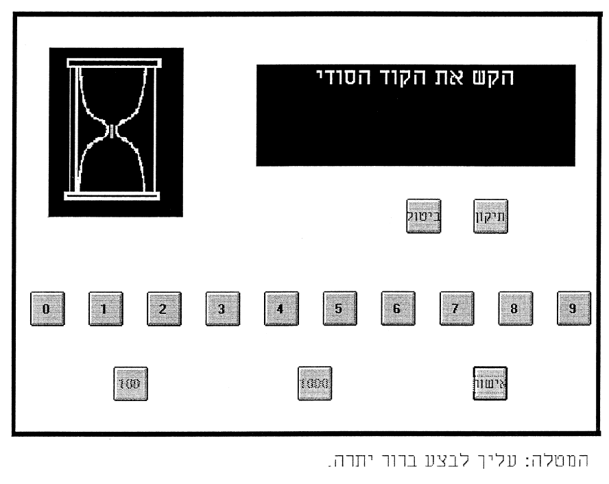

# What is beautiful is usable

## 간략한 요약

사용자의 컴퓨터 시스템의 아름다움에 대한 인식(perception)과 사용성의 관계를 실험-실험에서는 ATM을 대신하여 컴퓨터 응용 프로그램을 사용

'인식(perception)'은 시스템을 사용하기 전/후에 걸쳐서 확인

-   **Pre-experimental measures**: 시스템의 미에 대한 인식과 사용성에 대한 인식이 강하게 관련되어있다.
-   **Post-experimental measures**: 시스템의 미에 대한 인식과 사용성에 대한 인식이 여전히 유지되어 있다.

Multivariate analysis of covariance(MANCOVA) **⇒** 시스템의 아름다움의 정도 → (사용하기 전)아름다움과 사용성에 대한 인식에 영향 **⇒** but, 실제 사용성에는 영향 X

(기존 사회 심리학자들이 연구한 신체적 매력성이 다른 사람들의 성격에 대한 평가에 영향을 준다는 결과와 일치)

## 상세한 정리

### Introduction

[form-function]

### Background

**1980s** = usability engineering에 대한 연구 시작(Gould, 1988; Shackel, 1988) → 객관적인 성과(배우는데 걸리는 시간, 에러율, 업무를 완성하는데 걸리는 시간)에 관해서만 강조했었다.

**최근** = 덜 엄격하고 좀 더 주관적인 것(User satisfaction)이 좋은 HCI 의 기준으로 등장(기존에 화면 디자인이나 그래픽의 미에 대한 것이 다뤄졌더라도, 대부분 인간의 정보 처리와 관련되었다. 인간의 감정이나 경험이 아닌)

처음엔 미-사용성에 대한 논쟁이 있었지만, 후자가 더 중요하다는 것이 명백했다. 하지만 이런 것은 사용자의 행위에 대한 감성과 HCI의 관계를 무시하는 것이다.

**Jordan(1998)**: 사용성과 심미성 모두 즐거운 전자 제품을 만드는 것에 중요하다.

심미성의 영향이 HCI 연구에서 간과 되었기 때문에 관련 연구가 적었다.

**Kurosu & Kashimura(1995)**: ATM의 사용성(Apperent usability)이 쉬운지에 대한 사전 인식와 다른 요소들(e.g., perceived beauty)간의 관계

**[Social psychology]**

**Dion et al. (1972)**: 신체적 매력과 사회적으로 추구되는 성격 간의 관계에 대한 연구(더 매력적인 사람이 아닌 사람보다 더 성격이 좋아보인다.)

-   Mechanism 1: **Stereotyping approach**(아름다움을 다른 인간의 특성과 관련짓는것)
-   Mechanism 2: **Halo effect**(신체적 아름다움이 인간의 특성에서 가장 명백하고 접하기 쉬우므로 처음에 인식되고 다음 인식들에 영향을 미치는 것)

**Reeves and Nass(1996)**: 개인의 컴퓨터, TV, 새로운 미디어와의 상호작용은 근본적으로 실제 삶처럼 사회적이고 자연스러운 것이다.

이 외에도 "**retail personality(Martineau, 1958)**"라는 개념도 도래함

⇒ Aesthetics - Perception (Affective response)

-   Stereotyping
-   Halo effect
-   디자인의 심미성에 대한 감정적 반응이 시스템의 전반적인 평가에 대한 영향을 미칠 수 있다.

### RQ

-   처음의 아름다움과 사용성에 대한 인식의 관계 → 인터페이스의 아름다움에 가려진 사람의 평가를 볼 수 있음
-   시스템을 사용하고 난 후에 심미성과 사용성에 대한 인식의 변화(기존 연구에는 유지된다는 연구도 있고, 아니라는 연구도 있음)

-   이것이 사용자의 심미성 인식과 실제 사용성으로부터 영향을 받는가

### Method

**2 X 2 between groups(인터페이스의 심미성 레벨: 저, 중, 고 X 사용성: 낮, 높)**

{: width="100%" height="100%"}

**[Asethetics factor]**

처음에 9개의 ATM 레이아웃 제공(기존 연구에서 차용).

3 X 3 X 3 (심미성 저 중 고): 포함된 것들이 같고 배치 방식이 달랐음

사용자는 9개를 1-10점으로 평가하도록 요구됨, 그리고 낮은 조건의 기계를 쓰도록 배치되면 자신이 낮게 평가한 것을 사용.

**[Usability Factor]**

11 task를 수행. ATM과의 상호작용을 어렵도록 조작(e.g., 시스템 딜레이 시간의 길이 조절, 한 번 눌렀을 때 조작하지 않는 버튼, short cut을 수행하지 못하도록 하는 방해 등)한 후 최대한 빨리 업무를 수행하도록 요구

{: width="100%" height="100%"}

**[Procedure]**

1.  9개의 ATM 레이아웃을 랜덤한 보여주는데, 각각 3번씩 보여주고 그 때마다 aesthetics, ease of use, amount of information on the screen을 평가하도록 함(총 27번)

-   이걸 토대로 aesthetics 조건에 배정됨

2.  각각의 aesthetics 조건에 배정된 사람들은 ATM 사용에 참여하여 4가지 타입의 업무 수행(수행 전 연습) 2가지 중 1개의 usability 레벨에 배정되어 과업을 수행
3.  자신이 사용한 시스템에 대하여 평가하도록 요구

**[Tasks]**

ATM기에 4자리 인적 코드를 입력하고 시작(다 같은 코드임)

{: width="100%" height="100%"}

{: width="100%" height="100%"}

11가지 과업 수행: 계좌 잔고 요구(3회)/현금 인출(3회)/잔고 확인 및 인출(2회)/예치(2회)

-   but 실제로 인출/예치 하는 것은 아님

**[Variables]**

**Pre-experimental perceptions**

-   aesthetics
-   usability
-   amount of information it contains

**Post-experimental perceptions**

-   aesthetics
-   usability
-   amount of information it contains
-   *user's satisfaction

-   number of errors & task completion times

**[Results-Manipulation check]**

{: width="100%" height="100%"}

ANOVA → Aesthetics factors의 강한 영향(F(2, 121) = 338.58; p < 0.001)

**ATM의 심미성**: 8.26(고), 4.97(중), 2.07(저) → 이 셋의 차이가 significant한지 Scheffe post hoc contrast 사용해서 확인한 결과 모든 차이가 0.001 아래였다 ⇒ Aesthetics manipulation O

**사용성 조작(manipulation)**: 11 tasks의 completion times를 각 사용성 조건 별로 확인 → 2-way ANOVA로 'usability'와 'aesthetic'의 'completion 시간'에 대한 영향 확인한 결과 aesthetic의 영향은 없었고 usability의 영향은 있었다. aesthetix X usability의 interaction effect도 없었다. ⇒ Usability manipulation O

**[Results-Correlation analysis]**

{: width="100%" height="100%"}

→ Intercorrelations

Pre-aesthetics = Pre-usability

Pre-Information ≠ Pre-aesthetics, Pre-usability → 참가자가 개념의 차이를 인지한 다는 것을 알 수 있음

Post-aesthetics = Post-usability

Post-satisfaction = Pre, Post-aesthetics, usability

Aesthetics ,amount of information는 전후 상관관계 O(Usability는 X)

Post-satisfaction이 Pre-usability와 aesthetics를 통해 유추할 수 있음

**[Results-Analysis of variance]**

{: width="100%" height="100%"}

복잡...

Aesthetics 레벨이 낮아질수록 2가지 Usability가 낮아지고 둘의 차이가 나타났지만, Aesthetics가 높은 조건에서는 Usability의 차이를 느끼지 못했다.

**Multivariate analysis of covariance (MANCOVA)**

→ **Aesthetics (3 levels) VS Usability (2 levels)**

→ **DV**: Post-aesthetics, usability, amount of information and satisfaction

⇒ post-measures 에 영향을 주는 것은 Aesthetics 뿐 (Satisfaction은 Stepdown analysis에서는 X, aesthetics랑 usability랑 연관이 있을 때만 관련되고 혼자서는 관련 X 라는 것)

{: width="100%" height="100%"}

**Aesthetic (3 levels)**

{: width="100%" height="100%"}

High Aesthetics 와 다른 2개랑 차이가 컸다.

**Usability (2 levels)**

{: width="100%" height="100%"}

결론적으로 사용자의 인터페이스 심미성에 대한 초기 인식은 시스템의 사용성 인식에 영향을 주었고, 시스템을 실제로 사용하고 난 후에도 유지되었다.

> Reference 
> Tractinsky, N., Katz, A. S., & Ikar, D. (2000). What is beautiful is usable. _Interacting with computers_, _13_(2), 127-145.
