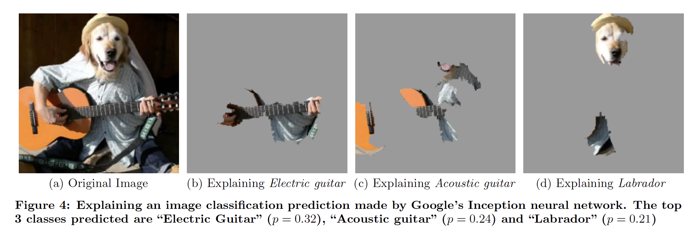
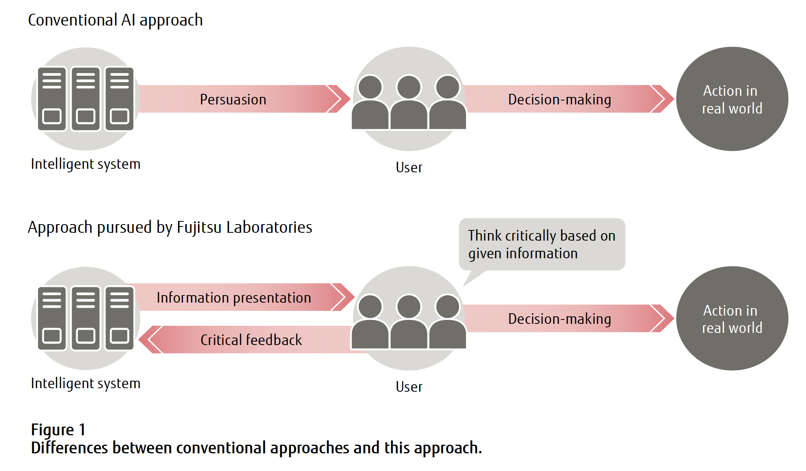
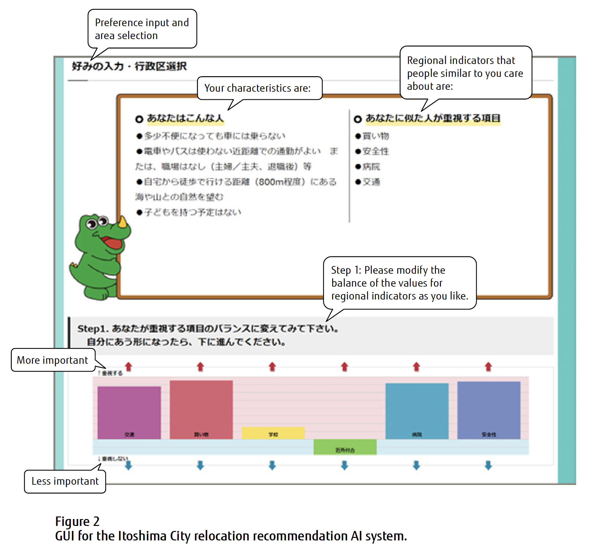
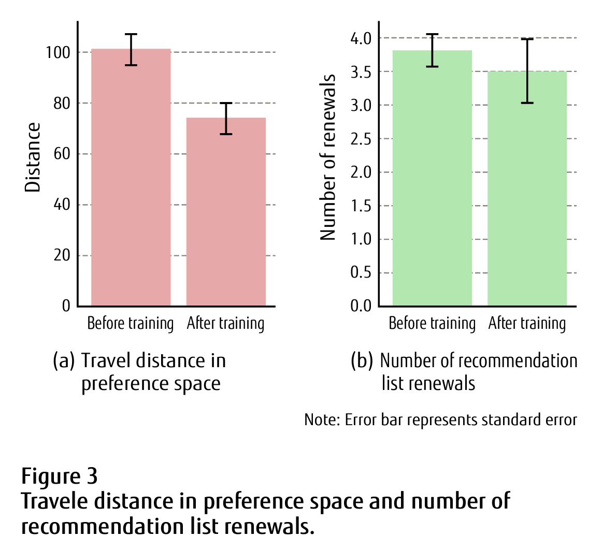

# Interactive Recommendation AI to Support Transparent Human Decision Making

## 상세한 정리

기존 XAI 연구(M. T. Ribeiro et al., 2016): 이미지에서 어느 부분이 AI에 의한 판단의 이유로써 효과적이었는지 보여주며 explain

{: width="100%" height="100%"}
\: M. T. Ribeiro et al. 의 논문 중

Decision making을 도우려면 XAI는 충분하지 않다. 사용자가 AI의 결과물을 냉정하게 평가하고 결과물을 수정할 수 있는 기술을 발전시켜야 한다. = users’ interaction ⇒ Critical interaction이 있은 후에야 인간과 AI가 협업할 수 있는 것이다.

{: width="100%" height="100%"}

기존 XAI: 보여지는 설명이 인간을 얼마나 잘 설득시키는 지에 대한 관점에서 발전 이 연구: 사용자가 AI의 결과에 대해 생각하고 결과에 대한 비판적 피드백을 하여 고려하는 것을 통한 선택을 하는 상황을 보장하는 방향

⇒ 사용자가 AI 기술을 이해할 수 있는 방향으로 발전이 되어야 함(transparent) ⇒ Interactive XAI를 발전시켜야 함: 시도와 에러를 통해 AI의 매커니즘을 이해하여 Decision making을 하는 것 ⇒ Transparent and Trustworthy AI

## Recommendation AI for relocation destinations

→ 일본에서 AI가 준 설명의 영향을 실험하기 위해 만든 것이 시초

기존의 기술과 문제점을 설명하고, recommendation AI for relocation destinations를 예시로 실제로 어떻게 적용하는지 보여주고, 마지막으로 시스템 평가하고 future direction

## Conventional technologies and their problems

인간과의 상호작용을 통해 decision-making을 도와주는 system은 여러개가 있었다.

### Critiquing

2000년대 후반, critiquing이 만들어졌는데, 핸드폰이나 디지털 카메라 같은 제품의 추천시스템에 대한 사용자의 피드백을 추가하여 만들어짐.

비즈니스 맥락에서, 사용자가 선택한 조건에 맞춰 아이템을 보여주는 것도 recommender systems (정말?) → job matching & real estate matching

→ 사용자에게 피드백을 받을 수 있어도, 기술을 'transparent'하게 만드는 것에는 집중하지 않는다.

Decision의 결과가 중요할 수록, 사용자의 AI에 대한 이해가 필요하다.

→ 이 연구에서는 그 과정이 transparent한, **Interactive AI** 를 제안한다.

## Relocation destination recommendation AI

→ 자신에게 맞는 지역을 찾아 시골 지방으로 이전하고 싶은 사람들을 돕기 위한 시스템

도시에 사는 사람들은 지방에 대한 상세한 정보가 부족함 → 어디로 갈지 찾을 때 잠재적인 이전 목적지에 대해 배워야 함

⇒ 이 시스템이 이전을 원하는 사람들에게 Itoshima City에 있는 적합한 지역을 추천해 줌

1.  도시에서 Itoshima City로 이전해 온 사람들 인터뷰 & 미래에 이전할 사람 인터뷰 ⇒ 지방거주자들이 이전 목적지를 선택할 때 고려하는 features들 정의
2.  지역데이터에 기반한 Features 수치화 ⇒ 데이터를 사용하여 교통, 쇼핑, 병원 같은 지역 features에 따른 regional indicators가 만들어짐.

& Itoshima City로 이전하고 싶은 사람을 분류하는 factors도 생성 → 운전을 할 줄 아는지, 아이들의 연령층, 등 → 10가지 정도의 카테고리로 분류 ~~(기준이 무엇?)~~ 3. 각 카테고리의 사람들이 regional indicator의 요소를 얼마나 중요하게 생각하는지를 보기 위한 정량적 질문 진행

⇒ 이런 과정을 통해 아래의 GUI를 생성

{: width="100%" height="100%"}

-   왼쪽상단: 이주를 원하는 사용자의 카테고리가 노출
-   오른쪽 상단: 사람들에 의해 중요하게 선택된 regional indicators 노출
-   사용자에 의해 중요하게 선택된 regional indicators를 하단에 바그래프와 화살표로 표시 → 화살표를 클릭하여 regional indicators의 중요도를 변경할 수 있음 → 이 기능을 통하여 사용자는 적절한 균형을 구체적으로 명시할 수 있음
-   바 그래프 아래엔, 추천된 이전 목적지의 랭킹이 노출(regional indicators의 값과 함께) ~~이건 왜 figure에 안보여줬지~~

이 시스템은 시스템과 사용자 사이의 상호작용을 배울 수 있는 mechanism이 있다. → 학습한 결과에 따라 자동적으로 사용자 카테고리를 바꿔줌 → 더 많은 사용자가 사용할 수록 사용자의 특성을 배우고, 동시에 사용자가 추천 지역에 대한 정보를 알 수 있도록 한다.

**Transparency** → linear model based on multi-attribute utility theory를 이용(인간의 decision-making 반영? which is modeled initial phase of human decision-making.) = 개별 area에 대한 점수는 regional indicator value & degree of importance of the indicator set의 총합이라는 이야기(바그래프로 나타난)

## System evaluation

System의 효과는 Subject experiment를 통해 진행(99명: 16명은 지방으로 이사가는 것을 고민중인 사람들에게 Itoshima을 소개하기 위해 인포메이션 방문한 사람, 83명은 지방으로 이사가고 싶지만 Itoshima에 대해 알지 못하는 사람들을 인터넷으로 모집: 55는 학습 전 모델을 이용 28명은 학습 후 모델을 이용)

효과를 보기 위해 log data를 이용(트레이닝 전 vs 후)

비교 데이터: 선호도를 어느정도 바꿨는지(6차원 공간으로 표현하여 그 공간내에서 얼마나 움직였는지), recommended areas를 몇번이나 새로고침 했는지

⇒ 결과적으로, Information session을 방문한 사람들은 자신의 선호도를 바꾸지 않았다.(심지어 한 참가자는 시스템이 "여기 사세요"라고 하는 것 같았다고 했다.)

인터넷을 통해 뽑힌 참가자들은 인터랙티브한 AI 시스템을 통해 Itoshima City로의 이전하는 consultation 과정

1.  시스템을 통해 이전 목적지를 추천받음
2.  스태프와 함께 어디로 이전할지 논의

아래의 표를 통해 인터넷을 통해 뽑힌 참가자의 정량적 결과를 볼 수 있음

{: width="100%" height="100%"}

(a) 트레이닝 전과 후의 travel distance 차이 비교(p = 0.003) → training 후 travel distance가 significant하게 줄었다

(b) 새로고침 수 비교(p = 0.55) → 트레이닝 전 후 새로고침 수의 변화는 없었다. = 참가자들은 추천 지역이 자신의 조건에 바로 맞더라도 평균적으로 preferences를 4번정도 바꿨다. → 사람들은 자신에게 맞는 것을 찾기 위해 추천리스트를 일정횟수 바꿔보기를 원한다.

사람들은 consulting people 보다 시스템이 더 쉽고 빨랐다고 했다. 또한 시스템을 통해 알기 어려운 지역을 알기 쉽다고 말했다. 그 외에도 공정하고 객관적이다라고 말했다.

단점으로는, 실제로 사는 것이 어떤지 알고 싶었는데 텍스트 정보의 한계가 있다. 같은 이야기를 하였다.

결과론적으로, information sessions의 참가자들은 AI의 추천을 고정된 instruction이라고 생각하고 상호작용하고 싶지 않다고 했다. → 인터페이스 개선의 여지가 있음

Simple linear model을 사용했어도 사용자가 바로 이해하진 못했음 → 어떻게 이해 가능하게 모델을 설명할 지에 대한 이슈

> Reference 
> Nakao, Y., Ohori, K., & Anai, H. (2020). ‘Interactive recommendation AI to support transparent human decision making. _Fujitsu Sci. Tech. J.
