# Why and Why Not Explanations Improve the Intelligent Systems

## 간략한 요약

**Context-aware intelligent systems**는 내제된 인풋값을 사용하고 사용자가 알기 어려운 복잡한 규칙과 머신러닝 모델에 따라 선택을 한다.

→ 그 결과, 시스템의 명료함이 부족하게 되고 이는 사용자의 trust, satisfaction, 시스템에 대한 acceptance를 낮춘다.

→ 시스템의 선택 과정에 대하여 자동으로 설명을 제공하여 완화 가능

실험: 참가자들에게 시스템의 작동과 함께 다양한 자동 생성 설명을 제공하고 시스템에 대해 얼마나 이해했는지 확인 → 시스템이 왜 그렇게 _행동했는지_ 묘사하는 설명은 이해를 높이고 신뢰도를 높였다. → 시스템이 왜 그렇게 _행동하지 않았는지_ 묘사하는 설명은 이해도는 낮았지만 적절한 성과를 보여주었다. ~~어떤 performance?~~
   
## 상세한 정리

**Context-aware intelligent system**: 사용자의 현재 상태(맥락)에 따라 적응하고 맞추는 시스템 e.g., 사용자의 활동, 위치, 환경적 조건에 따라

-   Calm computing: 사용자의 개입 없이 암묵적으로 인풋 값이 수집되는 것 → 이런 요소 때문에 사용자가 이해할 수 없는 과정이 발생하게 됨 (Intelligibility X = 사용자가 예측한 것과 시스템의 행동의 mismatch)

[추가적 개념들]

-   Weiser’s vision of ubiquitous computing: 소프트웨어 공학과 하드웨어 공학, 컴퓨터 공학에서 일컫는 컴퓨터가 언제 어디서든 사용될 수 있을 것이라는 것. (≠ 데스크탑)

⇒ Automatically generated explanations로 해결 ⇒ decision making, recommender systems에서 효과적(trust, acceptance 높아짐) e.g., Amazon’s product recommender system, Pandora’s music recommender

{: width="100%" height="100%"}
   
## Intelligibility

많은 연구들이 설명의 생성과 제공에 초점이 맞춰 있었다. → **Knowledge-based systems(KBS)** : Gregor & Benbasat에 따르면 reasoning trace(케이스 별 추론 과정 제공), justification(”심화된” 도메인 지식을 붙이는), strategic(시스템의 문제를 해결하는 전략), terminology(용어 정의)의 카테고리로 콘텐츠들이 구분될 수 있음 → **Intelligent tutoring systems(ITS)**

**Context-aware systems**는 사용자의 혼란을 초래(덜 친숙한 인터페이스, 시스템이 무엇을 하는지 이해 X, 왜 그렇게 했는지 이해 X)

→ 이 연구는 **reasoning traces**가 될 수 있는 설명에 대해 집중

Reasoning traces 는 대개 why & how에 대한 질문을 설명하는 반면 새로운 시스템을 이용하는 end-users가 물을 수 있는 질문들이 추가적으로 있다. → 1. What: 시스템이 무엇을 하였는가? → 2. Why: 시스템이 W를 왜 하였는가? → 3. Why Not: 시스템은 X를 왜 하지 않았는가? → 4. What If: Y가 일어나면 시스템은 무엇을 하는지? → 5. How To: 현재 상황을 고려할 때 시스템이 Z하게 하려면 어떻게 해야하는가?

### = 5 Intelligibility Questions

각 질문을 설명하는 것은,

### Intelligibility Type Explanations

Norman은 User의 목표와 시스템 상태의 정보를 구분하는 두가지 간극을 묘사하였다.

→ 1 ~ 3번의 질문에 대한 설명: **gulf of evaluation**(인지된 기능성과 사용자의 의도, 예상의 분리) → 4 ~ 5번의 질문에 대한 설명: **gulf of execution**(시스템으로 할 수 있는 것과 그것에 대한 사용자의 인지)

사람들은 현재 인풋과 조건에 약간의 변화가 생기면 어떤 일이 일어날지 알고 싶어 한다: Q4 사람들은 특정 상황이나 조건에서 원하는 결과를 얻으려면 무엇을 바꿔야하는지 알고싶어 한다: Q5

**관련 기존 연구**

Whyline(2004): Q2(**Why**) → 초보 프로그래머들이 가질 수 있는 Intelligibility questions에 대한 설명 연구

Crystal application framework(2006): Q3(**Why Not**) → 데스크탑 사용자가 가질 수 있는 Intelligibility questions에 대한 설명 연구

⇒ 하지만 이 설명 종류에 대한 유용성이 비교되지 않았음

**KBS(Knowledge-based systems)** → Why, Why Not, How To 질문들을 위한 reasoning trace explanations e.g., MYCIN (하지만 질문들 사이의 효과에 대한 비교는 없었음)

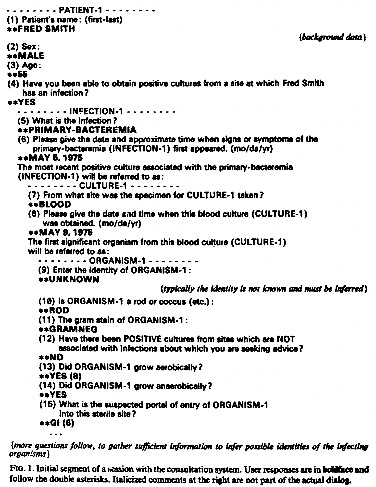{: width="100%" height="100%"}
\: 인터랙션이 쉽고 자연스럽도록 노력, 질문이 신중을 기해서 작성된 것(multiple choice 질문처럼 재미 없게 만들지 않기 위해서)

후기 논문들도 reasoning trace를 위한 타당한 설명을 제공하는 것과 problem-solving 전략을 설명하는 것에만 집중.

이 논문은 **Reasoning trace explanations**에 집중(context-aware 시스템이 깊은 지식을 기반으로 한 선택을 추론하는 것에 대한 것이 아니기 때문에) → Why, Why Not, What If, How To 중 어떤 질문 유형이 사용자에게 가장 도움이 되는가(Input과 Output을 분명하게 보여주기 때문에 What은 제외)
   
## 가설

우선 설명의 종류가 다르면 사용자 경험(시스템에 대한 이해도, trust에 대한 인식)이 다를 것이라고 생각했다.

**Why에 대한 가설: Why 설명은 시스템 행동의 원인을 추적하는 것에 도움을 주고 따라서 더 잘 이해할 수 있도록 할 것이다**

<aside> 💡 → H1: _Why_ explanations will improve user experience over having no explanations (_None_).

</aside>

**Why Not에 대한 가설: Why 설명과 비슷한 영향을 가질 것이지만, Why Not 설명은 사용자가 쉽게 사용할 수 없을 것이다. Why는 reasoning trace가 하나 혹은 적겠지만, Why Not은 여러 trace가 있을 것이기 때문에.**

<aside> 💡 → H2: _Why Not_ explanations will (a) improve user experience over having no explanations, but (b) will not perform as well as _Why_ explanations.

</aside>

**How To & What If 에 대한 가설: How To & What If 질문은 사용자가 스스로를 정의하는 예시에 의존하기 때문에(?) 인터랙티브하고 역동적이어야 한다. 이런 설명은 설명이 없는 것보다는 유용할 것이다. 하지만 초보 사용자는 시스템에 익숙하지 않을 것이므로 좋지 않은 예시를 고를 것이며 Why 보다 효과가 좋지 않을 것이다.**

<aside> 💡 → H3: _How To_ or _What If_ explanations will (a) improve user experience over having no explanations (_None_), but (b) will not perform as well as _Why_ explanations.

</aside>

## Intelligibility Testing Infrastructure

사용자는 context-aware application의 schematic, functional _intelligible_ system을 사용하게 된다.

→ **a set of inputs (e.g., Temperature, Humidity)** → **uses a model (e.g., Decision-tree)** → **produce a single output (e.g., Rain Likely, or Rain Unlikely)**

⇒ **사용자는 inputs, outputs, explanations (or none) depending on intelligibility type**를 받게된다.

## System Implementation

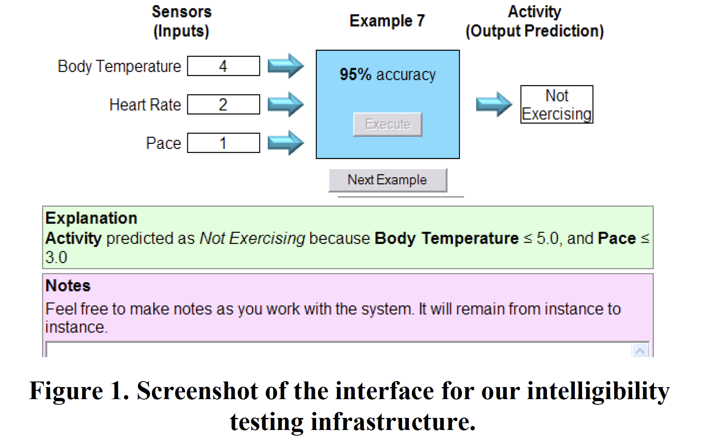{: width="100%" height="100%"}

사용자는 Input values listed를 보게되고 _**Execute**_ 버튼을 누른다 → 시스템은 Output을 _**Generates**_ 한다 → 예시를 배우고 나서 _**Next Example**_을 클릭한다. → _**Explanation condition**_에 따라 사용자는 예시에 대한 설명을 받게된다. (사용자가 요구 할 때만 보여지는 경우도 있음?)

**Sensor-based context-aware systems** 사용

→ multi sensors(수치값)의 Input 값을 기반으로 decision을 만듬. 하지만 Inequality-based(~~?~~) rules를 사용하여 output을 계산(output을 2 클래스 중 1개로 결정)

아래처럼 2 Input 값을 고려하여 2 Inequality rules를 정한다.

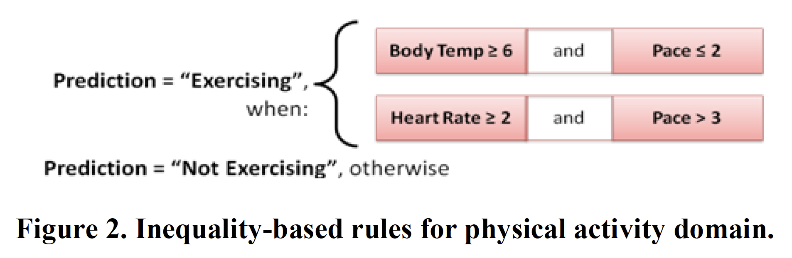{: width="100%" height="100%"}

사람들이 도메인 지식이 부족해서 시스템에 대한 이해도에 영향을 미칠 수도 있으니 정수로 모든 수치값을 대체하였음(e.g., 무게를 들 때 체온이 36.8도에서 38.3도로 올라갈 수 있는 걸 아는 것 같은 도메인 지식) → Body Temperature (1 to 10), Heart Rate & Pace (1 to 5)

Context-aware applications에서는 ML이 많이 사용되고, 이 실험도 마찬가지로 사용.

→ Decision trees & Naive Bayes 중 **Decision trees** 사용(얘네가 그나마 explainable & transparent함, SVM이나 Neural Networks는 Interpretable X)

→ 모든 inputs의 순열 중에서 250 경우를 학습하여 output value를 결정하기 위해 decision tree 모델 형성

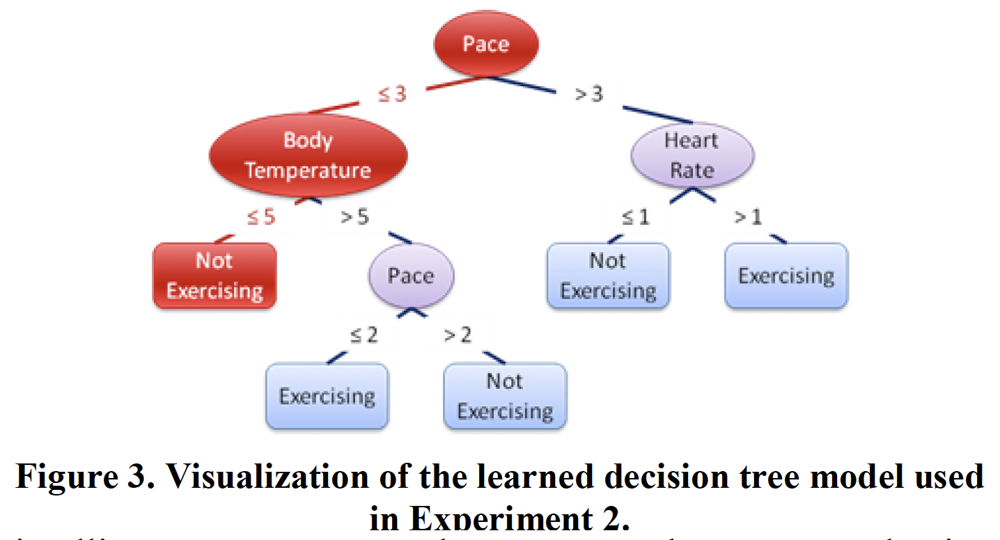{: width="100%" height="100%"}
   
## Decision Tree Explanations

Decision Tree는 4가지 intelligibility type questions에 대한 설명을 제공하기에 적합하다. 아래의 표를 통해 설명이 어떻게 만들어졌나 알 수 있다.

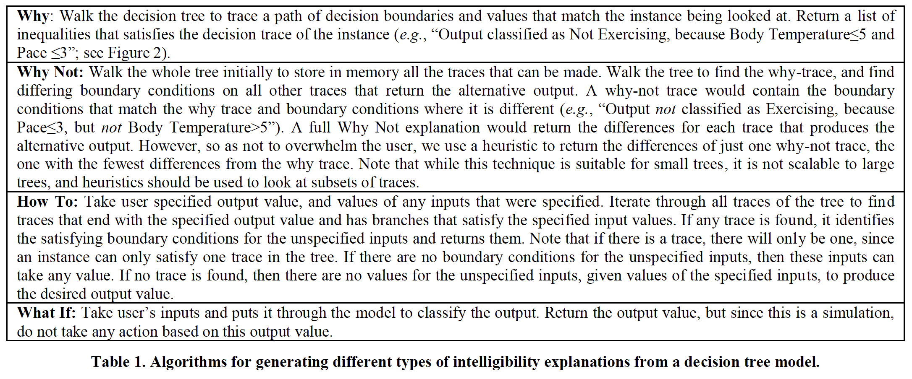{: width="100%" height="100%"}

## METHOD: Experiments

{: width="100%" height="100%"}
\: Activity recognition of exercising

Experiment 1을 통해 Why, Why Not, and the control condition with no explanations의 intelligibility explanations를 실험. (피실험자의 도메인 지식 때문에 결과 해석이 힘들었음)

Experiment2는 Abstract한 Domain을 사용 → Why, Why Not, How To, What If 4가지의 Intelligibility type questions 설명 제공

### Study Procedure

1.  Learning Section: 사용자가 시스템과 상호작용하고 시스템이 어떻게 동작하는지 배움
2.  Fill-in-the-Blanks Test Section: 피실험자의 시스템에 대한 이해 확인-1
3.  Reasoning Test Section: 피실험자의 시스템에 대한 이해 확인-2
4.  Survey Section: 피실험자에게 시스템이 어떻게 동작했는지 설명하도록 요청(시스템의 로직에 대해 피실험자가 얼마나 학습했는지 평가하기 위함)하고 설명에 대한 인식에 대해 평가하고 시스템에 대한 이해도(understandability), 신뢰도(trust), 유용성(usefulness)에 대해 평가하도록 요구

**[ Learning Section ]**

-   인풋과 아웃풋이 있는 24개 예시를 각 예시당 적어도 8초 이상 보게 된다.(각 사용자는 모두 같은 순서로 예시를 본다.)
-   실험 조건에 따라 설명이 제공된다. Learning Section에서만 설명이 주어짐.
-   사용자는 시스템이 어떻게 동작하는지 배워야 한다고 과업이 주어지며 노트를 사용하여 메모를 할 수 있다. Learning Section을 마치면 사용자는 노트를 보며 학습할 수 있는 시간이 주어진다.

**[Fill-in-the-Blanks Test Section]**

-   사용자는 빈칸이 있는 예제의 빈칸을 채우는 과업을 수행하게 된다. (15 경우가 있는데, Body Temperature 3개, Heart Rate 3개, Pace 4개, 결과 빈칸 5개) → 피실험자 모두 같은 순서
-   빈칸을 채우고 나서 왜 그렇게 생각했는지 이유가 물어진다.
-   답은 알 수 없고, 추가적인 설명도 주어지지 않는다.

**[Reasoning Test Section]**

-   3가지 복잡한 예제(output이 왜 나온 것 같은지 이유 설명하기)가 주어진다. → 이전에 마주하지 못한 새로운 예제 → 피실험자 모두 같은 순서
-   이해도가 높으면 trust가 높은지 확인하기 위해, 그들이 시스템의 결과를 얼마나 신뢰하는지 물어진다.
-   답은 알 수 없고 추가적인 설명도 주어지지 않는다.

**[Survey Section]**

-   Self-report information: 전반적으로 시스템에 대해 어떻게 생각하는지, 느끼는지 더 자세한 설명을 위해(e.g., 멘탈모델 끌어내기, 시스템과 설명을 trust 했는지, understood 했는지)

### Measures

**Types of intelligibility explanations** → better understanding the system → better task performance, improved perception of the system, improved trust in the system output

**User understanding**

→ correctness(Fill-in-the-Blanks) & detail of the reasons(Reasoning Test with why and why not questions, mental model in the survey)

{: width="100%" height="100%"}
\: coded reasons

**Task performance** → task completion time(Learning section의 배우는 시간, Fill-in-the-Blanks에서 채우는데 걸린 시간), Fill-in-the-Blanks Test inputs and output answer correctness

**User Understanding**

→ Survey에서 mental model 확인, Why처럼 coded 됨

**User Perception**

→ 16 Likert-scale questions of system and explanation perceptions 10: Understood System, Found System Confusing, Liked System/Found it useful 6: Explanations Difficult, Explanations Useful, Understood Explanations.

**User Trust**

Reasoning Tests의 Why & Why not questions → coded(Table 1)

-   trust가 5-point Likert-scale로 기록
   
## Experiment 1

### Experiment 1: H1(Why vs None), H2(Why Not vs None & vs Why)

Wearable device(Body Temperature, Heart Rate, Walking/running Pace) → Exercising O/X (무게 들기, 뛰기)

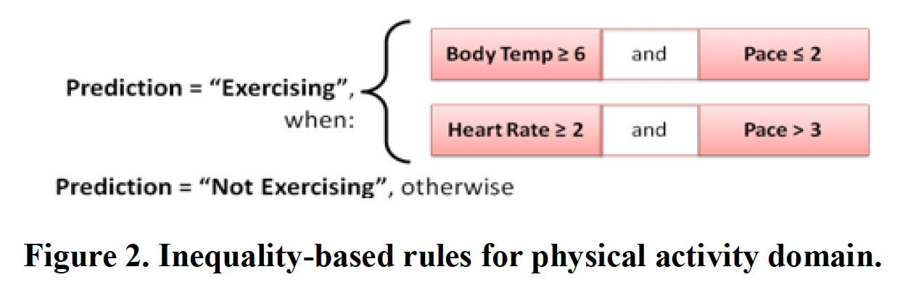{: width="100%" height="100%"}

### Experiment 1 - Results

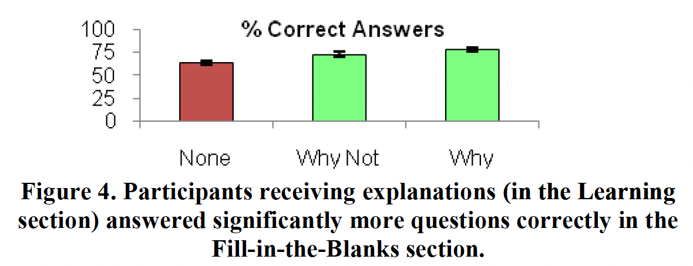{: width="100%" height="100%"}

사람들이 그들의 이해를 적용하는 능력을 확인하기 위해 몇개 맞췄는지를 이용

**Intelligibility types → 몇 개나 맞췄는지(DV)**

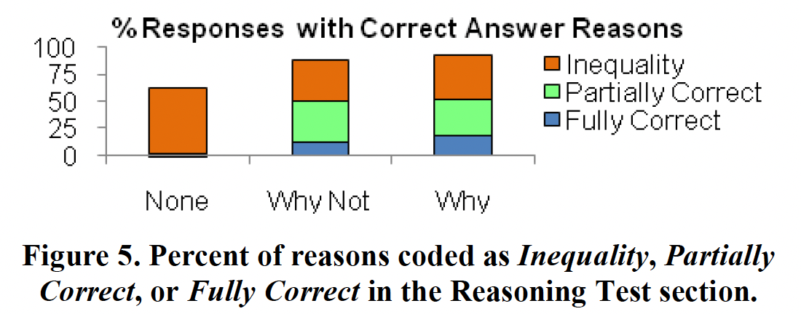{: width="100%" height="100%"}

사람들이 자신의 이해를 formalize 할 수 있는지를 보기 위해 Inequality or better (0 or 1), Partially or Fully Correct (0 or 1), Fully Correct (0 or 1)

Condition → Reason coding(DV)

: providing explanations → more correct answers(but Why & Why Not 차이 X)

상세하게

Partially Correct: Why & Why Not 모두가 None 보다 높음 Fully Correct: Why가 None & Why Not 모두 보다 높음 하지만, Why & Why Not 사이의 Significant 한 차이는 X

Trust: Why > None, Why Not은 X

Survey에서는 Significant한 차이 X

### Experiment 1 - Discussion and Implications

-   전반적으로 Trust가 낮은 것은 ‘natural’하게 보이지 않아서 일 수도 있다(e.g., 체온은 높은데 속도가 낮으면 Not Exercising인 것)
-   설명 O → understanding 높, trust 높, 시스템의 결과에 대한 agree 높
-   Why에서 일부 피실험자들이 인풋 값이 Exercising 과 어떻게 관련돼야 하는지 말하기도 했고, 인풋 값을 “High”나 “Low”로 하기도 했다. → prior knowledge가 이해에 드는 노력을 줄여줄 것임을 알 수 있음.
   
## Experiment 2

### Experiment 2 - H3(How to & What If vs None, why)

Explanations types의 effectiveness 비교(아래의 테이블에 따라 구분)

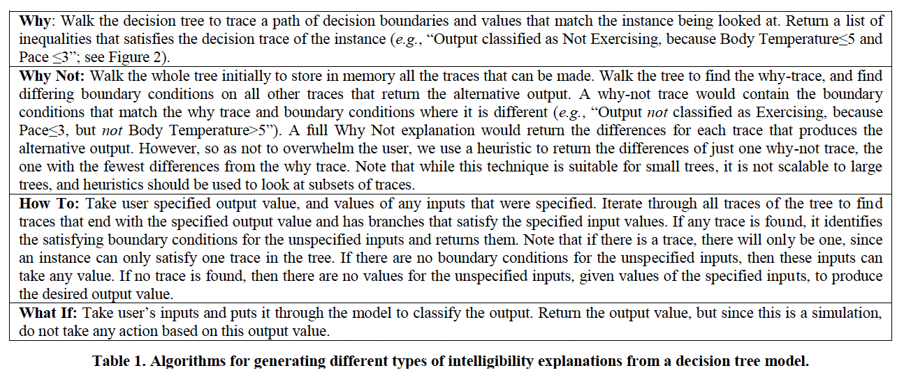{: width="100%" height="100%"}

### Experiment 2 - Method

1과 같은 과정이지만 일부 인풋들이 A, B, C로 되어있고, 아웃풋 값이 a, b로 되어있다.

**What If**

{: width="100%" height="100%"}

**How To**

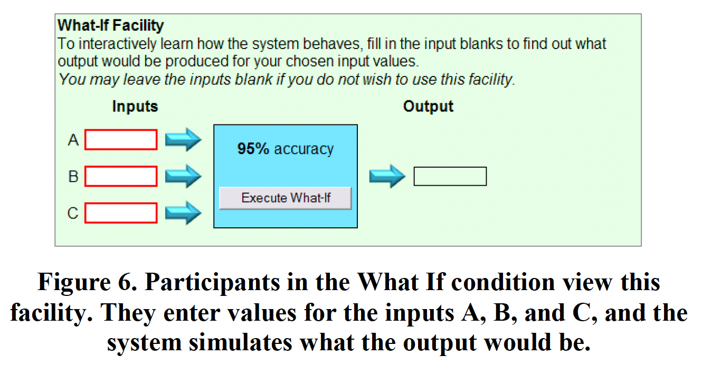{: width="100%" height="100%"}

### Experiment 2 - Results

Why, Why Not 조건이 None, What If, How To 조건보다 → 정답 수 많았다(Fill-in-the-Blanks tests), 이유 적절, 이해도 높

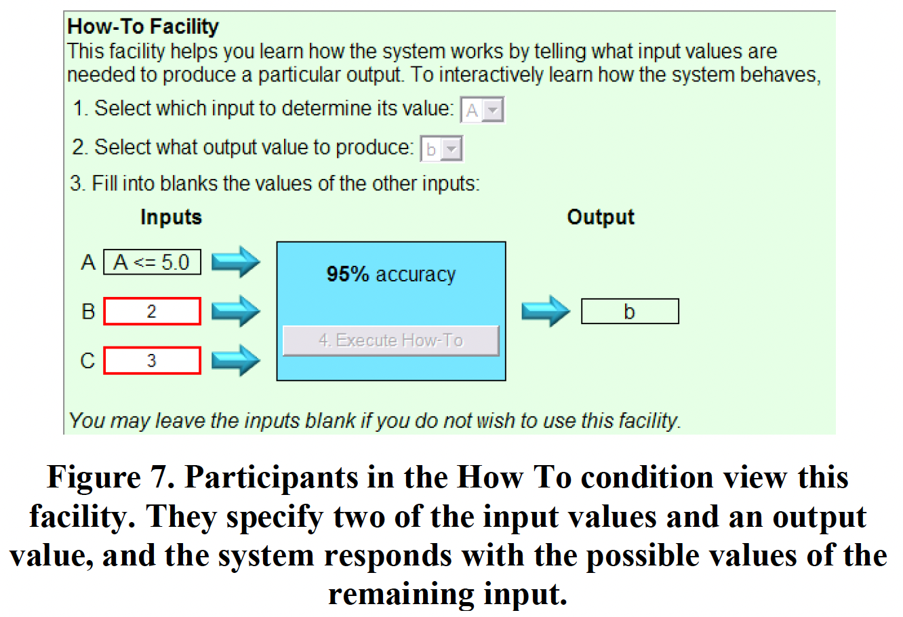{: width="100%" height="100%"}
\: Participants in the Why and Why Not conditions had an accuracy of 80.0% and 74.2%, respectively, compared to 61.7% for the None condition

{: width="100%" height="100%"}

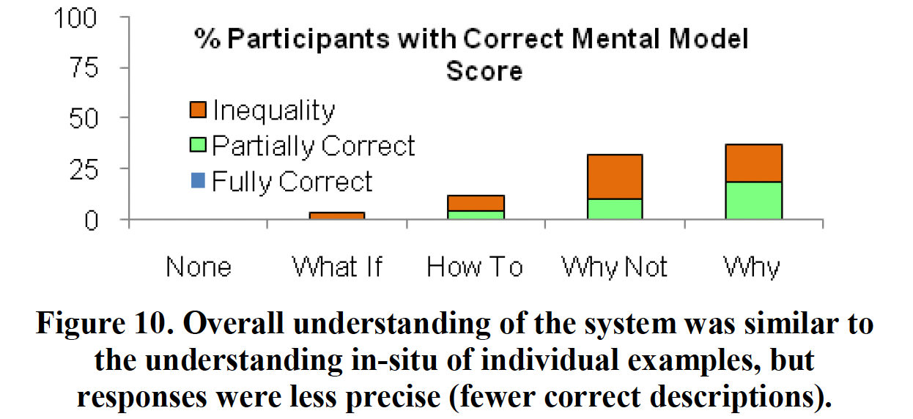{: width="100%" height="100%"}
\: the self-reports of understanding for Why and Why Not were 3.14 and 2.79, respectively

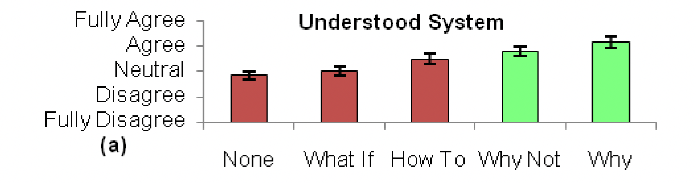{: width="100%" height="100%"}

### Experiment 2 - Discussion and Implications

Why & Why Not → understanding, trust, task performance 향상

Why 설명 이 Why Not 보다 정확한 이해를 도움(단순히 뒤집은 건데도), fewer correct answer rules, extraneous inputs and rules

⇒ Why Not 이 두 rule을 합쳐 생각하지 않고 seperately하게 생각함. reasoning trace만 학습한 것을 알 수 있음.(Why Not에는 “but” “not”이 들어있어서 그런 걸 수 있다, 더 많은 mental effort 필요)

⇒ Why를 먼저 제공하고 Why Not을 제공해야함. (How to, What if는 비효율적이지만 execute하는 방법을 다루는 과업에서는 효율적일 수 있음.)
   
## General Discussion

-   Experiment 1에서의 mental model이 2보다 덜 정확했다. → prior knowledge가 생기고 ~~설명에 집중하지 않은 것을 알 수 있음?~~

⇒ 실생활 서비스에서 이런 문제가 발생할 수 있음. 겪으며 prior knowledge가 생기고 집중해서 설명을 보지 않는

→ 대안1: knowledge-based systems community에서 배우게 할 수 있음 → 대안2: deeper justification explanation 제공(왜 일상에서 이해한 것과 다른지)

⇒ prior knowledge가 없는 사람한테도 도움이 됨

-   실제 상황에서는 다를 수 있음(아래와 같은 것이 다뤄지지 않았음) → 사용자는 이해를 못하겠을 때 Why를 물어볼 것이고, 특정 결과를 예상했으나 그걸 얻지 못했을 때 Why Not을 물어볼 것이다. → 이 실험에서 Why Not이 덜 효과적으로 보였어도 Why Not이 선호될 수 있다.
-   실제 context-aware systems은 더 복잡할 수 있다. → 대안: 설명을 간소화 하여 전달 → 배우는 시간을 짧게 하기: 처음엔 긴 설명 제공하고 점점 설명이 간소화 됨.
-   사용자가 설명을 원할 때만 받고 싶을 수도 있다.(빈도를 정하게 하기)
   
## Conclusions

Context-aware applications에서 Novice users에게 Reasoning trace explanations를 제공하는 것은(특히 Why) understanding 과 trust를 높인다.

> Reference 
> Lim, B. Y., Dey, A. K., & Avrahami, D. (2009, April). Why and why not explanations improve the intelligibility of context-aware intelligent systems. In _Proceedings of the SIGCHI conference on human factors in computing systems_ (pp. 2119-2128).

