# AI-Driven Interface Design for Intelligent Tutoring System Improves Student Engagement

## 간략한 요약

ITS(Intelligent Tutoring System)의 인터페이스를 위한 AI-driven design을 탐구한다. → 학생들의 문제해결 과정에 대한 진단 피드백을 주고 학생들의 engagement에 대한 영향을 확인

AI 요소들을 이용한 다양한 인터페이스 디자인 제안 & 학생의 engagement에 대한 영향을 경험적으로 확인
   
## 상세한 정리

### ITS를 위한 AI 기술(AIEd: Artificial Intelligence in Education)

-   **Knowledge Tracing (KT)**: 학생들의 지식을 기간동안의 학습 활동을 통해 모델링 하는 것 → Bayesian Knowledge Tracing, Collaborative Filtering, Deep Learning···
-   **Learning path construction**: 학생의 학습 목표를 최적화 시켜주기 위한 학습 아이템 추천 → reinforcement learning framework···
-   **The context of the user interface for ITS** → Intelligent authoring shell, affective interface, usability testing

ITS의 인터페이스는 AI의 분석을 학생들에게 투명하게 보여주지 않고 학생들의 engagement 에 반대의 영향을 준다.

→ 기존의 AIEd의 Explainability는 학생들이 자신의 약점과 강점을 알 수 있도록 도움을 주는 피드백을 주는 방법에만 연구가 진행되었다.

⇒ 이 연구에서는 학생의 문제 푸는 과정에 대한 피드백을 통해 학생들의 engagement에 대한 영향을 주는 ITS 인터페이스의 AI-driven 디자인을 탐구한다.

→ 다양한 AI 컴포넌트로 이루어진 인터페이스 디자인을 통해 → 각 페이지 디자인은 다른 수준의 AI 기능의 인터페이스와 짝지어져서 다른 수준의 정보와 설명력을 제공한다. → 학생들의 **engagement**에 대한 영향 평가: Conversion rate, Average Revenue Per User (ARPU), Total profit, average number of free questions a student consumed

Controlled A/B tests with more than 20K students → engagement 25.13% up

### User flow

1.  Diagnostic test: 토익 시험에서 볼 수 있을 법한 7~11가지 질문으로 구성
    
2.  $Santa$: 백엔드 AI 엔진에서 1의 테스트를 통해 각 유저를 모델링함
    
3.  Diagnostic page: 사용자의 문제 풀이 과정에 대한 분석
    
4.  Practice questions: 사용자는 추가 연습 문제를 풀 것인지 선택 후 추가 연습 문제 풀이
    
    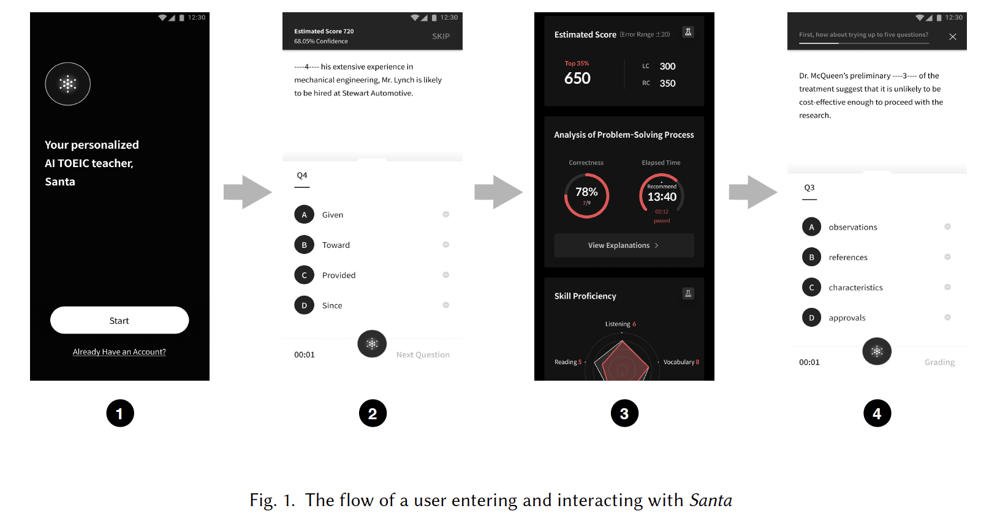{: width="100%" height="100%"}
    

사용자가 추가 연습 문제를 푸는지 안 푸는지에 따라 그 페이지 디자인이 user engagement를 늘리고 motivate 시킨다고 생각.

**Page design A & Page design B** → 다른 AI 모델을 사용하여 다른 정보와 설명력 제공 (?)

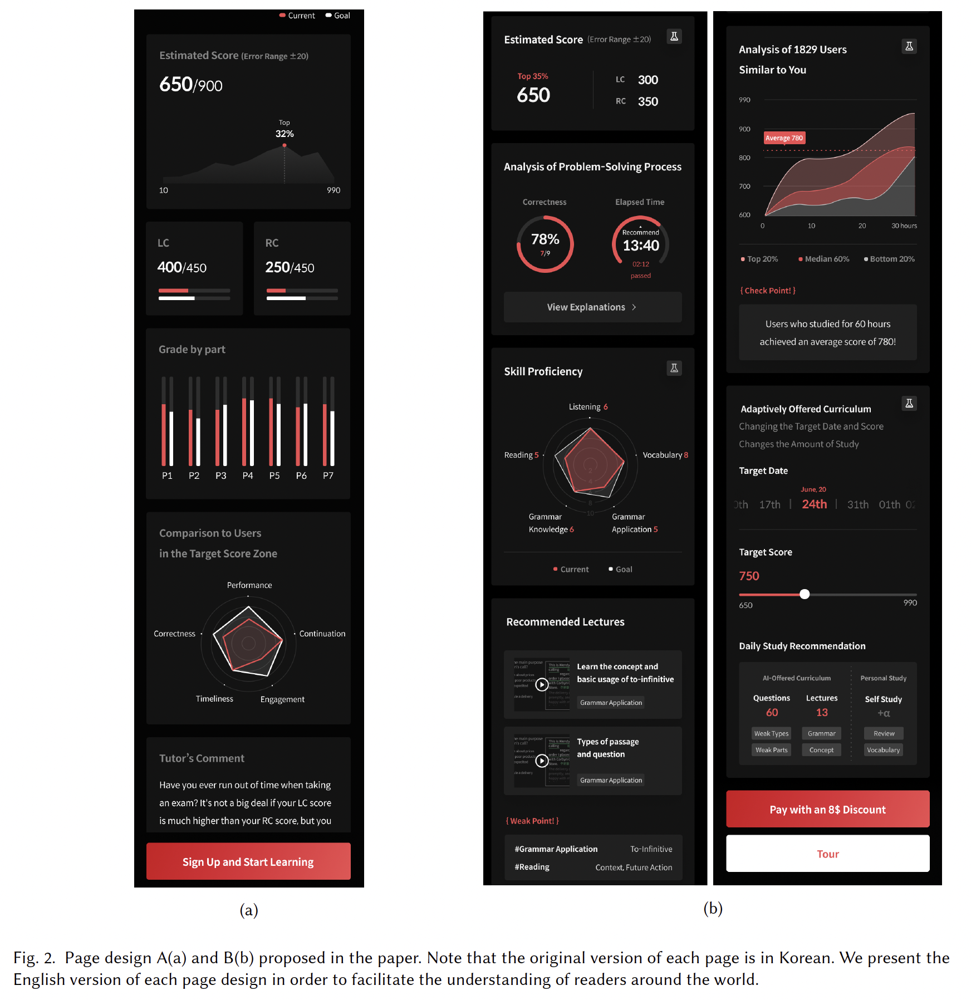{: width="100%" height="100%"}

## Page A

-   **Estimated Score (Figure 3a)**: Estimated scores, target scores, percentile rank
-   **Grade by Part(Figure 3b)**: Red(user), White(required) → 강점 약점 알 수 있도록
-   **Comparison to Users in the Target Score Zone(Figure 4)**: AI 모델이 사용자의 문제 풀이 과정을 어떻게 분석하는지 설명
-   *Performance: The user’s expected performance on the actual TOEIC exam.
-   Correctness: The probability that the user will correctly answer each given question.
-   Timeliness: The probability that the user will solve each given question under time limit.
-   Engagement: The probability that the user will continue studying with Santa.
-   Continuation: The probability that the user will continue the current learning session.*
-   **Tutor’s Comment (Figure 3c)**: 사용자의 능력에 대한 설명과 타겟스코어에 도달 할 수 있도록 제안 → 실제로 선생님한테 배우는 것 같은 경험을 제공하기 위하여

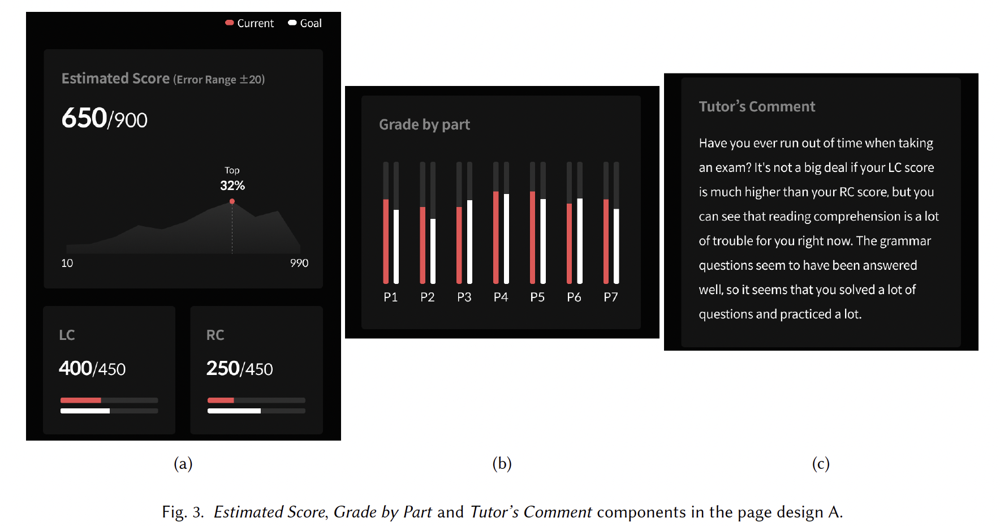{: width="100%" height="100%"}

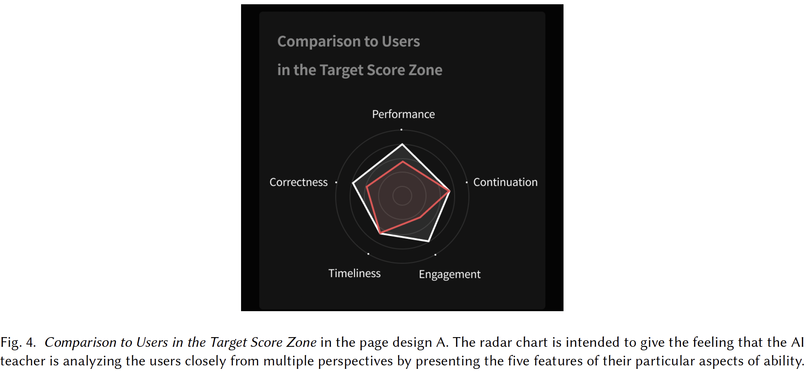{: width="100%" height="100%"}

## Page B

-   **Estimated Score (Figure 5a)**: 그래프는 제외됨, 대신 퍼센트로 나타냄(더 간결하고 직관적이도록)
-   **Analysis of Problem-Solving Process (Figure 5b)**: diagnostic test에 대한 전반적인 리뷰(View Explanation 버튼을 통해 설명을 볼 수 있음)
-   **Skill Proficiency (Figure 5c)**: 토익시험에 대한 사용자의 현재 능숙도, red(user) white(target score users)
-   **Recommended Lectures (Figure 6a)**: 사용자들이 약점을 알 수 있도록 하고 그를 보완하기 위한 강의 추천, Skill Proficiency에서 가장 약한 2개 노출
-   **Analysis of Users Similar to You (Figure 6b)**: Santa를 사용하면 점수 향상이 어떻게 되는지 제공, top 20%, 중위 60%, 하위 20%로 나누어 제공, Santa를 60시간 사용한 것에 대한 점수 제공
-   **Adaptively Offered Curriculum(Figure 6c)**: 사용자가 학습 목표를 달성할 수 있도록 개인화된 learning path 제공. 목표하는 날짜와 목표 점수를 바꾸면 하루에 학습해야 할 질문 수와 강의 수가 바뀜. 현재 사용자와 비슷한 상태의 사용자가 그 점수를 도달하기 까지 어떻게 했는지에 따라 제공.
-   **Santa Labs (Figure 7)**: flask button을 누르면 AI 모델이 계산한 것에 대한 설명을 볼 수 있음. 실제로 AI가 분석하고 있다는 느낌을 주어 신뢰도를 향상시키기 위함

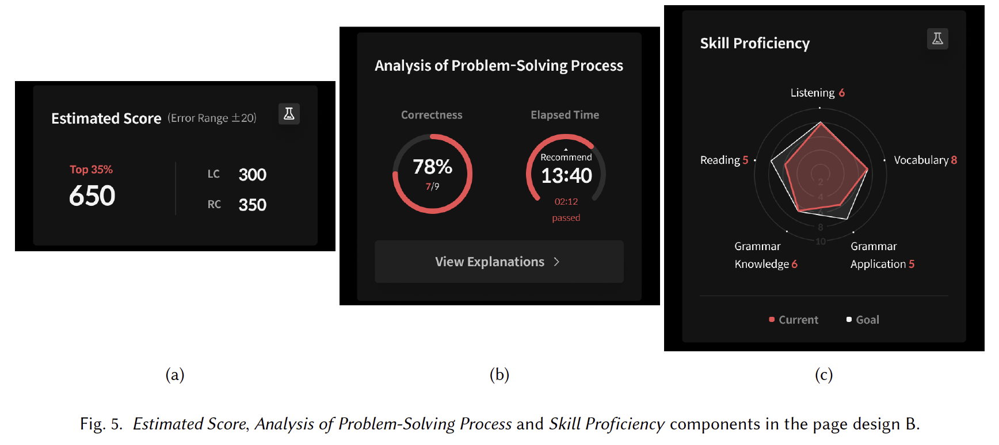{: width="100%" height="100%"}

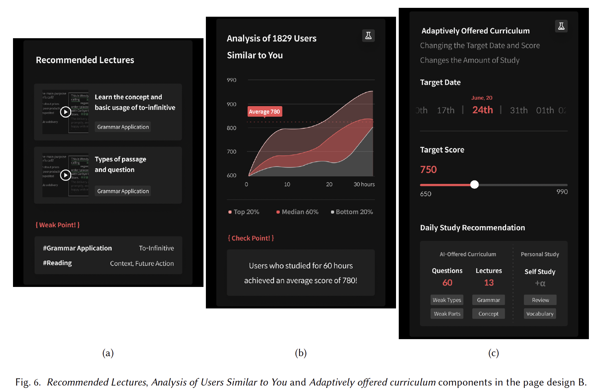{: width="100%" height="100%"}

Engine에 대한 설명은 스킵

## Results

**Conversion rate, Average Revenue Per User(ARPU), total profit and the average number of free questions a user consumed** 사용

### Impact of Radar Chart in Page Design A on Student Engagement

Page design A with the radar chart이 사용자의 모든 engagement 요소를 개선시킴 각각 _22.68%, 17.23%, 25.13%, 11.78% 개선됨_

→ 결과적으로 AI-like 인터페이스 디자인이 학생의 engagement를 개선시킨다는 것을 알 수 있음

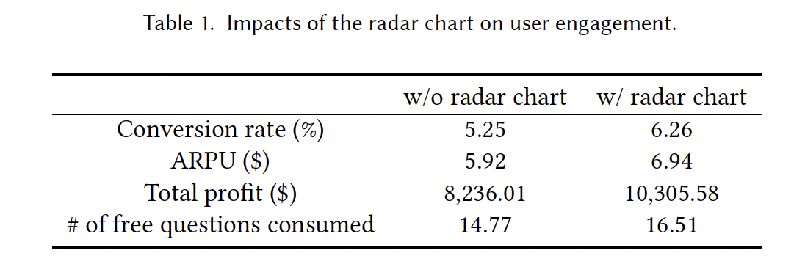{: width="100%" height="100%"}

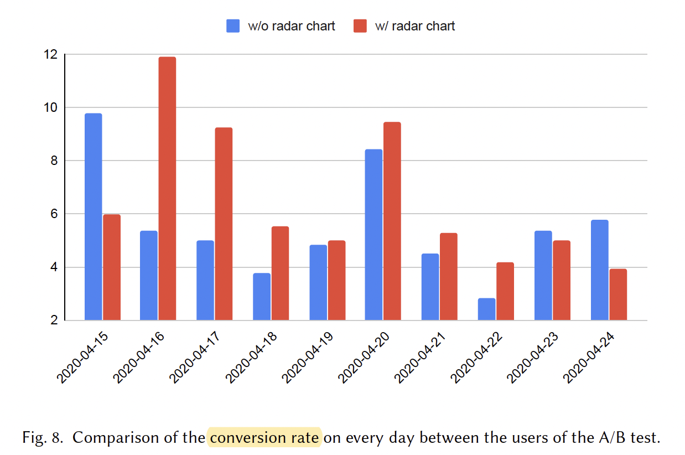{: width="100%" height="100%"}
\: with radar chart → more payments

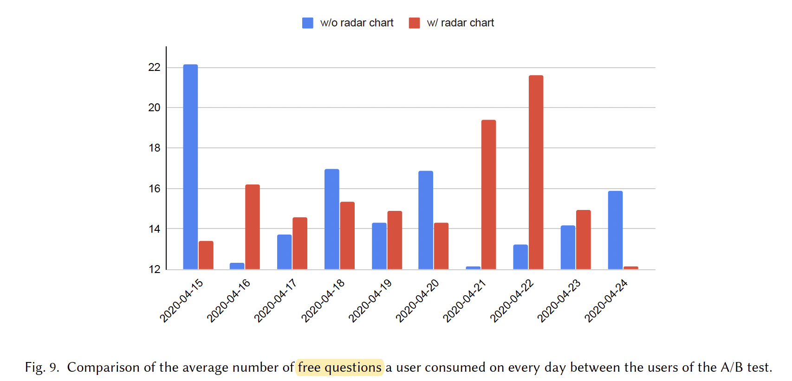{: width="100%" height="100%"}

with radar chart → solved more free questions

### Comparison of Page Design A and B on user engagement

Page design A보다 Page design B가 사용자의 모든 engagement 요소를 개선시킴 각각 _11.06%, 10.29%, 12.57%, 7.19%_ ~~(왜 격일 간격이지?)~~

→ 결과적으로 page design B의 사용자들이 더 많은 지불을 하고 더 많은 무료 질문들을 풀었다

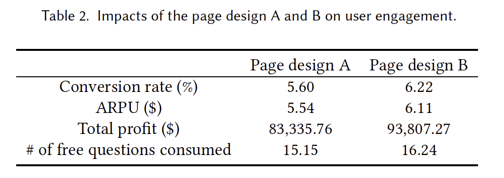{: width="100%" height="100%"}

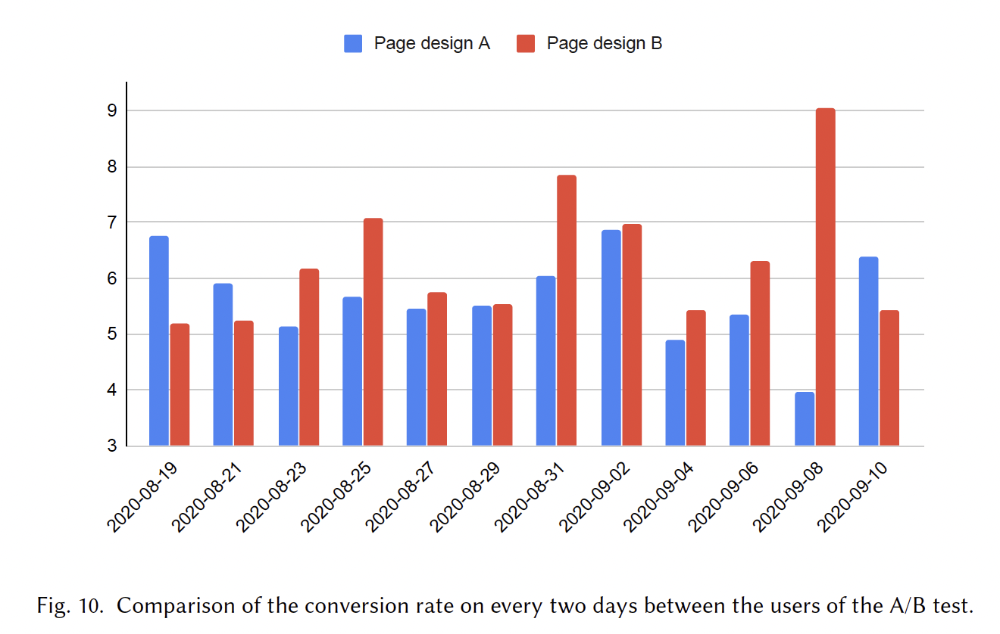{: width="100%" height="100%"}

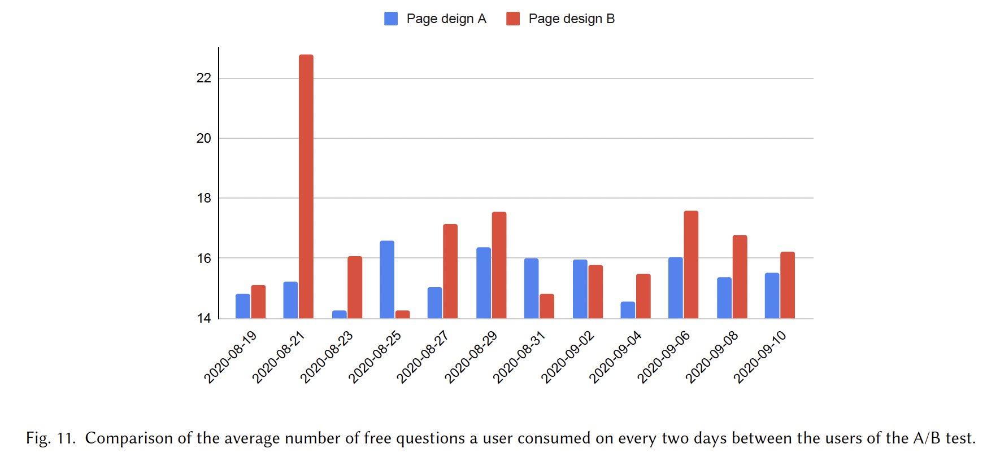{: width="100%" height="100%"}

⇒ AI 기능을 잘 사용함으로써 더 정보가 많고 설명이 많은 인터페이스의 ITS는 사용자의 engagement를 향상시킬 수 있다.

⇒ AI-driven interface 디자인은 학생의 engagement를 향상시킬 수 있다.

> Reference 
> Kim, B., Suh, H., Heo, J., & Choi, Y. (2020). AI-driven interface design for intelligent tutoring system improves student engagement. _arXiv preprint arXiv:2009.08976_.
