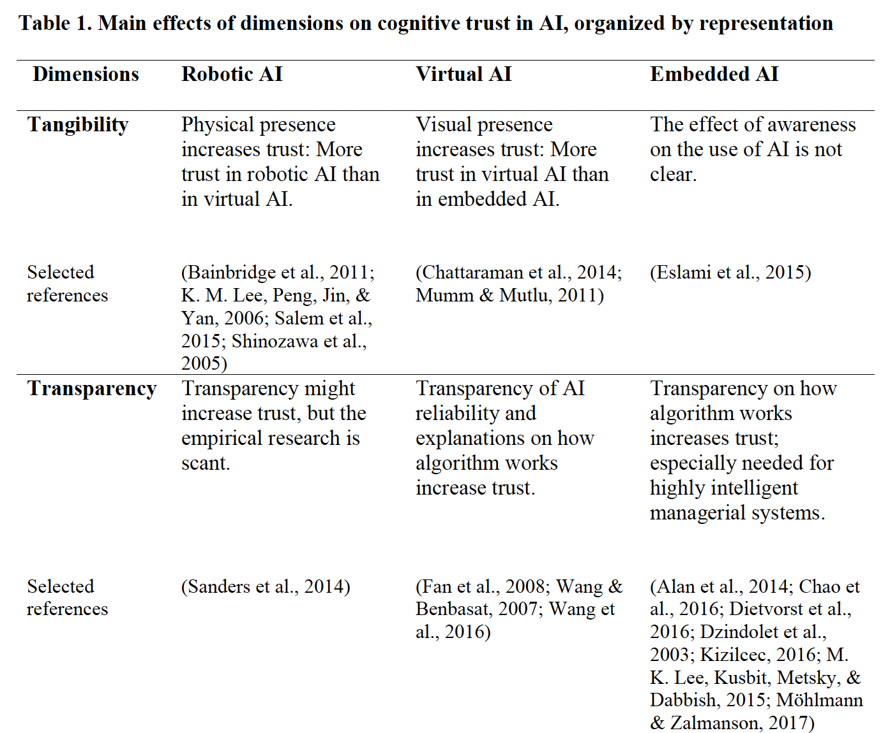
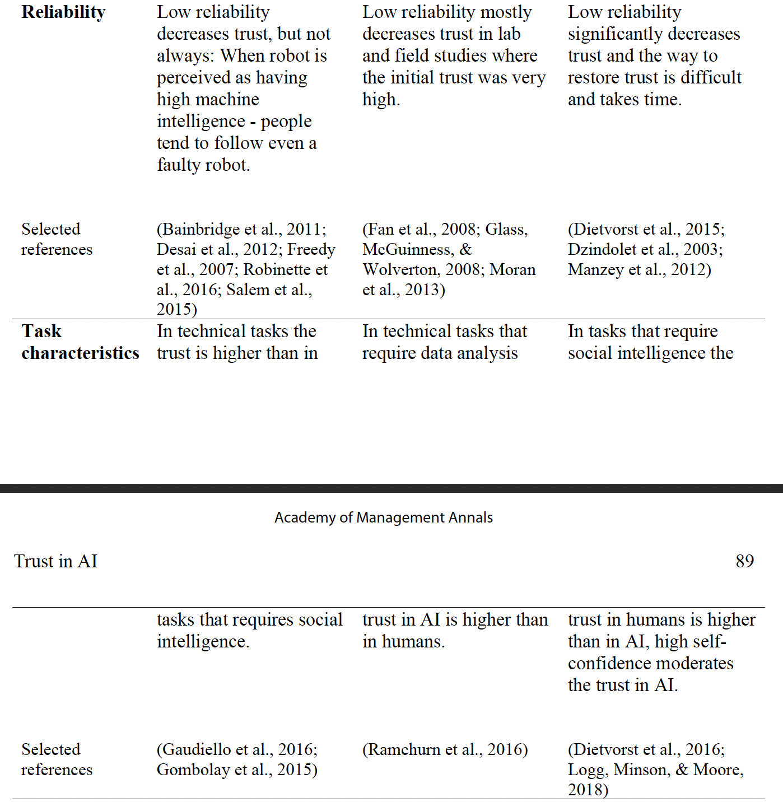
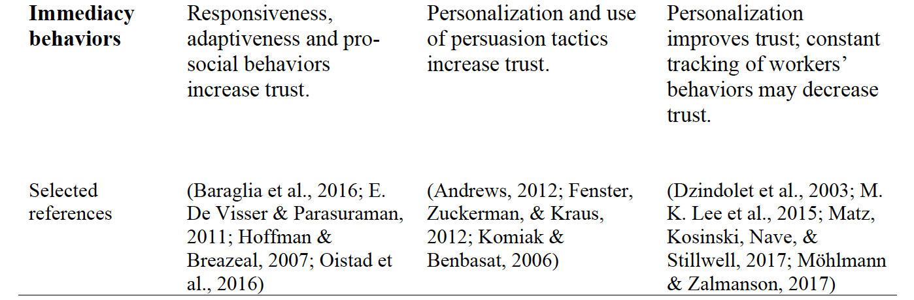
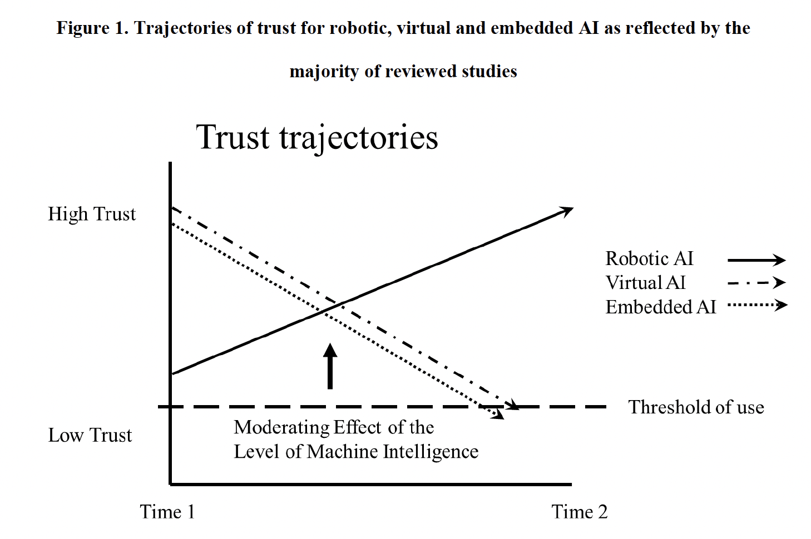

# Human Trust in AI

## 논문 목표
For each AI representation (robotic, virtual and embedded), we discuss the common dimensions that emerged from our review as relevant for cognitive trust (tangibility, transparency, reliability, task characteristics and immediacy behaviors) and for emotional trust (tangibility, anthropomorphism and immediacy behaviors).

\: 각각의 AI 형태(로봇, 가상 에이전트, 내장형)에 따라 인지적 신뢰(명백, 투명성, 신뢰성, 과업 성격, 즉각적 행동; based on perceptions of trustee reliance and competence), 감정적 신뢰(명백, 의인화, 즉각적 행동; Emotion-driven or affect-based trust)의 차원을 논의한다. 
→ Cognitive & Emotional 차원으로 나누어서 생각

**검색 키워드**: artificial intelligence (AI), intelligent agents, agent-human interaction, algorithm aversion, robot-human interaction, intelligent automation, trust in robot, trust in technology

{: width="100%" height="100%"}
{: width="100%" height="100%"}
{: width="100%" height="100%"}

# Literature Review Methodology

## What is Artificial Intelligence?

→ 스킵

## Trust and Integration of AI in Organizations

### User reactions to technological features

처음엔 TAM(Tavis, 1989): **Perceived usefulness**(기술이 과업을 수행하는데 도움을 얼마나 줄 것인지에 대한 믿음), **Ease of use**(새로운 기술을 사용하기 위해 노력이 얼마나 들어갈지)

→ The concept of **Trust**(Ghazizadeh, Lee, & Boyle, 2012; Hoff & Bashir, 2015; Lee & See, 2004; Pavlou, 2003)

신뢰도는 기술에 대한 의존의 정도를 예측할 수 있게 하는 반면, 사용자의 신뢰도와 기술의 능력 사이의 순응 정도(**Calibration**)는 기술 사용의 실제 결과에 영향을 줄 수 있다. → 고능력 기술에 대한 낮은 신뢰는 남용 뿐 아니라 사용하지 않게 하거나 고비용을 초래한다.(시간 낭비, 일의 효율) → 무능한 기술에 대한 높은 신뢰는 과신과 오용을 초래한다. (안전 위반, 원치않던 결과 초래)ㅕ

<aside> 💡 **Trust(Mayer et al, 1995)** : the willingness of a party to be vulnerable to the actions of another party based on the expectation that the other will perform a particular action important to the trustor, irrespective of the ability to monitor or control that other party

:당사자가 다른 자의 행동에 의해 피해를 입을 수도 있는 것 (행위자를 모니터링하거나 조종할 수 있는 능력과는 관계 없이 신뢰자에게 특히 중요한 행동을 할 것이라는 기대) → 결국 긍정적 결과를 위해서 위험을 감수 할 수 있는 경향이라는 것(Hoff & Bashir, 2015; Rousseau, Sitkin, Burt, & Camerer, 1998)

</aside>

기존에 기술들은 처음에 낙관론으로 시작해서 점점 실망하고 Trust가 시간이 지남에 따라 낮아질 수 있는 반면, AI는 미성숙하다는 비관주의 때문에 그 반대로 작용할 수 있다. 처음엔 trust가 낮지만 직접적인 상호작용 후 높아질 수 있다.

<aside> 💡 **Trust를 높일 수 있는 AI 특성** : Tangibility, transparency, reliability, Immediacy behaviors, the context of the task being performed, role of machine intelligence in moderating the impact of experience with AI on human trust

: 실감성, 투명성, 신뢰성, 즉각적 행동, 수행되는 과업의 맥락, AI의 경험이 인간의 신뢰에 주는 영향을 중재하는 것에서 기계 지능의 역할

</aside>

Recognizing the differences between trust in humans and trust in technology, Hoff and Bashir (2015) argued that for understanding the adoption of a complex new technology it is essential to address emotion-driven trust.

# Building Cognitive Trust in AI

<aside> 💡 Research on human trust attest to the importance of an object’s representation and tangibility for establishing trust, and the extant research on AI also supports this notion.

: 대상체와 실감성은 신뢰를 형성하는 것에 중요하다.

</aside>

Tangibility: 지각될 수 있거나 만져질 수 있을 것 같음

Transparency: 사용자에게 기반이 되는 규칙이나 로직을 그들이 얼마나 알 수 있는지

Reliability: 시간이 지나도 같거나 예측되는 행동을 보여주는 것 → 측정하기는 힘듬

Immediacy: 상호간 밀접함을 높이기 위한 사회적 행동(i.e., 선행 학습, 적극적 청취, 반응성)

## Cognitive trust in robotic AI

### Trust trajectory

로봇 AI의 신뢰도는 처음엔 낮다가 점점 높아진다 (직접적 상호작용에 따라 높아지는 인간의 신뢰도처럼) → 자동화된 로봇을 실제로 사용하는 경험을 해보면 다른 어떤 수단보다 그에 대한 신뢰도를 높일 수 있다. → 기계 지능의 레벨이 높아지면서 인간같은 immediacy behaviors가 가능해지고 그럼에 따라 초기 trust가 급격하게 높아지고 사용자의 순응이 높아진다.

→ 그럼 주가를 예측하는 실습을 해 본 사용자는 로보어드바이저에 대한 신뢰도가 높아질까?

{: width="100%" height="100%"}

### Tangibility

로봇의 실제 실존감이 초기 trust에 중요하다고 생각되었지만, AI representation & presentation of the task 에 따라 trust에 대한 영향이 다르다.(가상에서 수행되는 것이면 가상의 로봇이든 2D 로봇이든 차이가 없음)

-   responsiveness보다 tangibility가 trust에 더 중요한 것처럼 보이지만, 장기의 상호작용에서는 prosocial behaviors가 더 중요하다.
-   현존하는 것 뿐 아니라 로봇의 물리적 외관도 중요하다(인간 같은 로봇은 도덕적 선택에 대해서 더 인간 같은 선택을 할거라고 여겨졌다)
-   팀을 형성하는 활동은 robot의 anthropomorphism에 대한 인식을 높였지만, 로봇의 지능 레벨에 대한 인식에는 영향을 주지 않았다.

### Transparency

연구가 더 필요

### Reliability

-   상호작용에 따라 trust가 늘어난다는 것은 reliable performance가 높다는 것이다.
-   reliability는 타이밍이 중요한데, 초기에 reliability가 낮아지는것이 후기에 낮아지는 것보다 trust를 더 낮췄다.
-   reliability가 일정하지 않은 것이 reliability가 낮은 것보다 더 trust에 좋지 않고 사용자를 헷갈리게 만들었다.
-   후기 연구에서 (똑똑한 인공지능에서) reliability가 생각보다 중요하지 않을 수도 있다는 것이 발견되었다.(중요한 오작동을 했더라도 긴급 상황에서 로봇을 따르는 경우가 있었다)

### Task characteristics

-   로봇 AI가 더 인간 같을 수록, 신뢰도의 수준이나 특정 과업에 상관 없이 그들을 믿고 따랐다. → 과업의 성격이 기계 지능이나 사회적 행동에 따른 인지적 신뢰에 주는 moderating effect를 확인해봐야 한다.

### Immediacy behaviors

-   인공지능의 수준이 올라갈 수록 사용자는 로봇이 더 주도적이고 적응적? 이라고 생각했다.
-   Experienced immediacy(social gestures)에 영향을 주는 행동은 일반적으로 도움이 된다: 사회적 제스처, 현존감 → 로봇의 요구에 대한 순응도가 올라감
-   Faulty behavior은 trust를 잠시 낮추지만, compliance는 지속된다.
-   proactive vs reactive → proactive한 로봇을 사용할 때 수행력이 올라갔을 뿐 아니라, proactive를 더 선호한다고 했다.
-   stable vs adaptive → 간섭 정도는 사용자의 수행에 영향이 없었지만, 사용자는 adaptive한 자동 로봇에 대한 신뢰도가 더 높았다. (higher levels of self-confidence & lower levels of workload) → 타이밍과 상황에 적절함이 trust를 가능하게 한다.
-   They found that robot’s user-oriented immediacy gestures, such as approaching the user and nodding toward him/her when in proximity, had a positive impact on users’ perceptions of robot’s anthropomorphism. Furthermore, social gestures decreased the sense of physical risk and participants kept less distance from the higher immediacy robot than the robot that did not demonstrate these behaviors.
-   Intervening behaviors: team building activity (trust increase)

## Cognitive trust in virtual AI

Virtual agent: 챗봇 or 아바타(가상의 대상체는 어느 전자 기기에도 존재할 수 있고, 얼굴이나, 몸, 목소리 혹은 글을 쓸 줄 아는 능력 같은 특징을 지닐 수 있다.) → 기존 연구들은 interface design에만 관심을 가지고, 이런 요소가 기계 지능의 레벨에 주는 영향에는 관심을 갖지 않았었다.

### Trust trajectory

-   처음의 trust는 상호작용을 함에 따라 점점 낮아짐(reliability와 함께)
-   Ben Mimoun et al. (2012) 사람들은 처음에 웹사이트 내의 가상AI에 관심을 갖다가도, agent’s representation과 그의 실제 기계지능 사이의 calibration이 부족해서 실망감을 만들어 냈고 그것을 버리게 만들었다. → 사람 같은 representation은 지능이 높을 것 처럼 보이지만 기술적 현실에 맞지 않다.
-   반대 경우: 초기의 낮은 trust → misuse & negative behavior → 상호작용에 따라 높아진다는 증거도 있음: first-hand 경험이 third-hand 경험보다 trust를 높인다(고기계지능일 경우 직접적 상호작용은 초기 trust를 높인다.)
-   When agents with low machine intelligence are paired with human-like representations, the users are more likely to start with high expectations and experience a trust decrease. By contrast, virtual agents with high machine intelligence can engage in higher immediacy behaviors, which facilitates a positive trust trajectory.
-   낮은 기계 지능의 에이전트가 사람의 모습을 할 경우 사용자는 기대로 높은 기대치로 시작해서 신뢰 감소를 경험할 수 있다. 반대로, 높은 지능의 에이전트는 높은 immediacy behaviors를 보여줄 수 있어서 긍정적 신뢰 형성을 만든다.

### Tangibility

-   Tangibility(visually present)는 AI의 인지적 신뢰에 긍정적 영향을 준다.(로봇에서도)
-   에이전트의 형상이 웹사이트에 대한 평가를 높이기는 한 반면, emotional trust에만 영향을 주지 cognitive trust에는 영향을 주지 않는다고 Wang이 설명했다. (Usefulness에 대한 인식에는 영향을 주지 않았으므로)
-   Wang의 연구: 에이전트의 transparency(에이전트의 추천에 대한 설명)가 인지적 신뢰에 큰 영향을 주었다(시각적 형상보다)

### Transparency

-   말도 안되게 높은 기대치를 완화하는 법 → 가상 AI의 기능에 대한 설명을 제공 → Pieters: explanation-for-trust vs explanation-for confidence explanation for trust: “how” question, 시스템이 어떻게 작동하는지(내부적 작동의 디테일을 드러내는 것) explanation for confidence: “why” question, 외부적 의사소통에 대한 정보를 제공하므로써 사용자가 시스템을 사용하는 것을 편리하게 만드는 것. → Wang and benbasat: “why” & “how”, “altenratives”를 통해 설명을 통한 투명성을 조작하였고 그 결과 “how”는 사람들의 확실성과 자비심을 높여주었다. 선택에 대한 투명성은(왜 그것이 선택되었는지) 에이전트의 자비심에 대한 인식에 영향을 주었다.
-   투명도를 높이는 또 다른 방법은 reliability를 투명하게 하는 것이다. (투명한 reliability가 낮으면 참가자들은 그들의 선택을 더 잘 조정하였다. 적절할때만 조언을 수용하고) → 결과적으로 에이전트에 대한 trustworthiness도 높아짐

### Reliability

-   Reliability는 가상 AI에 대한 사용자의 믿음과 믿는 행동에 중요한 역할을 한다. (로봇 AI와는 다름) → 에이전트에 대한 trust가 compliance에 아주 영향을 준다. → reliability가 잘못되면 trust가 감소하고 compliance를 낮춘다. → 단순히 낮은 reliability를 알고 있는 것이 아니라 경험하는 것은 trust에 명확한 영향을 준다.
-   Factoring in the levels of initial trust는 가상 AI의 행동의 영향을 더 잘 예측하게 해준다.

### Task characteristics

-   재난에 대한 반응으로 가상 에이전트의 설명이 인간의 것보다 정보를 더 잘 모았고 방법을 글로 더 잘 전달했다

### Immediacy behaviors

-   고지능 가상 AI → immediacy behaviors(*social responsiveness, personalization)*를 높이고 → trust가 올라감
-   Pro-social → Agent’s personality로 보일 수 있다.
-   예시를 주는 에이전트가 단순히 정의만 주거나 정의와 예시 모두를 주는 에이전트보다 더 영향이 있었다.(인간일 경우 둘 다 주었을 때가 더 효과적)

## Cognitive trust in embedded AI

완전한 Embedded AI는 사용자에게 “보이지 않는다” → 시각적 표현이나 구분 가능한 정체가 없고 사용자는 그 존재를 알 수 없을 수도 있다. e.g., 검색엔진, 지도 GPS 같은

-   내재적 AI의 cognitive trust는 reliability와 transparency에서 더 유도된다.(로봇 AI와 다르게)
-   전문정도나 기계 지능의 정도가 cognitive trust에 큰 역할을 한다.(과업의 종류도) (로봇 AI 처럼) → 더 똑똑해 질 수록 인지적 신뢰를 위하여 맥락적 & 유저 중심의 요소가 중요하다.(AI reliability를 평가하기 어려워지기 때문에)

### Trust trajectory

-   정확도에 대한 피드백을 기반으로 AI의 trust가 바뀐다.
-   초기엔 높은 trust
-   하지만 낮은 trust에 대한 연구도 있다. 처음에 trust가 낮으면 사용을 거부하게 되고 그 결과 trust를 높이는 경험을 하지 못하게 된다. → 기업들이 embedded AI의 사용을 숨기는 이유

### Tangibility

-   내제된 AI의 사용자의 자각이 trust에 주는 영향에 대한 연구가 부족
-   알고리즘에 대해 아는 것은 사용자의 귀인(attribution), 인식(perception), 행동(behavior), 조작에 대한 감각(overall increased sense of control)을 바꾼다. → 알고리즘을 노출하는 것(숨기는 것)은 중요한 윤리적 질문을 야기할 뿐 아니라 사용자의 장기적 trust에 영향을 준다.
-   알고리즘이 사용됐다는 것을 몰랐을 때는 놀라거나 화나기도 했지만, 그것이 어떻게 작동하는지 알고나서는 계속 플랫폼을 이용했다.
-   사용자의 trust 회복의 한계를 탐구해야 하고 사용자의 인지에 대한 비용과 효과를 탐구해야 한다.

### Transparency

-   기술 에러에서 오는 혐오감을 극복하기 위한 방법을 찾던 중, 연구자들은 투명성이 cognitive trust에 주는 투명성의 역할을 실험하였다.
-   알고리즘의 투명성이 부족하면 사용자들은 불확실한 상태에 머무르게 됨
-   가능한 실수에 대한 이유를 설명했을 때 신뢰도 향상
-   단순히 무엇이 기술적으로 가능한지만 알려줘도기술에 대한 의존도 & 사용성에 대한 믿음 & 사용하기 쉬움에 관련됨 → low risk & high reliance
-   반대의 결과도 있음 → 자율주행차량의 불확실성을 알고나서 수동 운전으로 전환한 사례
-   peer-reviewing system에서 참가자들이 자신이 예상한 결과가 나오지 않았을 때는 설명이 trust를 이끌어 냈다. 하지만 알고리즘 행동 설명과 raw 점수를 받았을 때, 추가적인 데이터는 혼란을 야기했다.
-   페이스북: 왜 이런 알고리즘이 적용됐나 (어떻게 작동하는가가 아닌)를 설명해주면 trust보다 confidence가 올라감. → 다른 연구: “how”를 사용자들이 알게되면 사용자들은 알고리즘을 살짝 바꿀 수 있게된다.
-   Embeddedness of AI → 누가 이득을 보도록 의도 되었는가에 대한 질문을 야기 → trust 약화
-   decision aid는 그것의 실제 이득에 대한 투명성이 중요하다.

### Reliability

-   내제된 AI의 에러는 인지적 trust(& reliance)에 해롭다 → 복구하기 어려움 → 긍정적 & 부정적 반복이 대칭적이지 않음
-   algorithm aversion → 알고리즘이 날씨 예측을 실패하면 더 이상 사용을 거부한다. 인간의 예측이 더 심각한 영향을 주어도 인간을 선택한다.

### Task characteristics

-   수학적 과업 같은 것은 AI 가 더 잘할 것이라고 가정되어있으나 실험 결과 늘 그렇지는 않다. → AI와 사람에 대해 초기 trust에 차이가 없었으나 인간의 기술이 필요한 것(업무 평가)에서는 알고리즘보다 인간을 믿었다.
-   self-confidence 같은 주관적 요소가 trust에 중요 → 자신이 잘한다고 생각하면 덜 믿음 → 그걸 무시해서 성과가 안 좋았어도 전문가는 자기를 더 믿음 → 전문가는 다른 사람의 조언을 비전문가보다 고마워하지 않는다.(자기의 의견에 더 의존) ⇒ 그렇다면 전문가가 믿게 할 수 있는 요소는 무엇이 있을까?

### Immediacy behaviors

-   로봇AI와 가상AI에서는 trust에 긍정적 영향을 줬지만, embedded AI에서는 직원을 지속적으로 모니터링한다는 능력을 강조할 수 있고 그에 따라 trust가 낮아지게 된다.
-   개인화가 부족하면 trust가 내려간다.→ 개인화에 따라 공정함과 신뢰도에 대한 인지가 올라간다
-   내제된 AI가 Immediacy behavior를 만드는 법 → nudge: 디폴트 옵션(기본적 인지 과정과 편향에 기반한) → boost: 더 나은 정보(개인별 목표를 달성하기 위해 움직여야하는 방향을 정함에 따라 행동을 바꾸는

# Building Emotional Trust in AI

감정적 trust는 인간-기계의 관계에서 자주 다뤄지지 않지만, 감정은 인간의 trusting behaviors에 확실히 영향을 준다고 알려졌다.

인간처럼 행동하는 로봇은 인간의 감정적 행동에 대해 긍정적일 때도 있고 부정적일 때도 있다. → 어떻게 이런 특징들이 인간의 감정과 감정적 신뢰에 영향을 주는지 이해할 필요가 있다.

## Emotional trust in robotic AI

### Tangibility

-   tangibility는 감정적 trust에 긍정적 영향을 주기도 하지만, 부정적 영향을 주기도 함
-   NARS: Negative Attitued toward Robots Scale
-   서빙로봇의 기능성, 유용성, 의존성에 대한 믿음과 NARS 사이의 관계에 대한 부의 관계에서 문화적 배경이 로봇에 대한 태도를 형성하는 것에 중요하다는 것을 밝혀냈다.
-   물리적 자세가 tangibility에 영향을 준다: 앉아 있는 로봇에게 더 잘 다가감 → trusting behavior를 낮추는 물리적 위험일 수 있다 → 경험하지 않은 사람들에게는 거리를 두는 것이 좋다.
-   나이 든 사람들은 컴퓨터가 전달하는 것보다 로봇이 전달한 피드백을 더 재미있고 동기부여적이고 믿음직스럽다고 말했다. → 처음에 로봇에 대한 성향을 부정적으로 보지 않으면 tangibility는 감정적 trust를 높일 수 있다. → 사전의 태도가 moderator가 될 수 있음(tangibility → development of emotional trust 에 대한 영향에서)

### Anthropomorphism

-   Anthropomorphism은 부정적 영향이 없고 긍정적 영향만 있다고 생각되었다.
-   <부정> 하지만 uncanny valley를 통한 부정적 영향도 발견되었고, 일부에서는 인간 같은 로봇보다 기계 같은 로봇이 더 공감적이고 믿음직스럽다고 했다. → 더 인간 같거나 더 선택의지를 가지고 있다고 묘사될 때 덜 똑똑한 로봇보다 uncannier하다고 여겨졌다. → 더 인간 같은 로봇이 더 높은 수준의 불안을 이끌어냈다.
-   하지만 초기에만 부정적일 뿐, 시간이 지나고 경험을 하며 없어질 수 있다.
-   지능이 낮은 anthropomorphic 로봇에 의해서 낮은 감정적 trust가 불러 일으켜 질 수 있다.
-   <긍정> human-likeness는 상호작용을 통해 즐거움, 궁금증, 호감 등을 이끌어 낼 수 있다고 했다.
-   인간 같은 특징은 상호작용을 함에 있어서 감정적 trust, 편안함을 이끌어 낸다.
-   자율주행차에 이름이랑 목소리가 주어졌을 때, 더 믿어졌고 에러에 대해 덜 비판받았다.

### Immediacy behaviors

-   human-like appearance와는 다르게 human-like behaviors는 로봇 AI에서 감정적 trust와 호감을 이끌어낸다. (responsiveness)
-   back-channeling을 engagement strategy of robot으로 사용할 수 있다. _(i.e., interactional cues of active listening, which are mostly non-verbal, such as nodding or moving toward)_ → 참가자의 스트레스와 인지적 부하를 낮춰준다는 것을 발견하였다. (Jung et al., 2013) → 내제적 혹은 가상 AI는 그럼 back-channeling을 어떻게 보여주는가?
-   사용자는 “dishonest”한 로봇을 좋아할 뿐 아니라 “erroneous”한 로봇도 좋아한다. → 아마도 에러가 있는 로봇은 경쟁심리가 생기지 않아서
-   Imperfect functioning anthropomorphic robots
-   high-immediacy animal-like behaviors → emotional trust를 유도할 수 있다. → 사회적 지능을 반영하는 행동(사회적 제스쳐, 반응성, 활발한 듣기, 백채널링, 학습, 그리고 심지어는 베끼기)가 감정적 trust에 엄청난 지속적인 영향을 주었다. (외형보다)
-   초기 신뢰도가 낮았어도 pro-social 로봇과의 상호작용 경험을 통해 trust를 높일 수 있다.

## Emotional trust in virtual AI

### Tangibility

-   가상 AI에서 tangibility가 감정적 trust에 가장 큰 긍정적 영향을 주었다.
-   추천 에이전트의 Virtual embodiment → 즐거움, 신뢰도, social presence의 인식을 높여주었다.
-   anthropomorphic agent에서 옥시토신이 인간의 trust에 영향을 준다는 것을 발견하였다. (tangible이 없는 것보다)

### Anthropomorphism

-   Tangibility와는 다르게 anthropomorphism은 감정적 trust에 대한 효과가 다양하다.
-   Anthropomorphism characters = capable of human qualities(reasoning & motivation) → 높은 기대와 초기 trust를 유도 → 하지만 기대가 너무 높으면 실패하게됨
-   Relatedly, while examining the personalization of an agent’s visual image, Verberne et al. (2015) found that when an agent was represented by a face whose features were adjusted based on the face of the user, the users reported higher levels of trust while using a driving simulation and were more willing to allow the agent to choose the route. → 사용하는 주식도구의 AI 모델이 사용자의 얼굴을 사용하면 그것 또한 trust를 높일까?
-   아바타가 사람으로 묘사되었을 때(AI 기반이 아니라), 더 영향을 미치는 것으로 확인되었다.
-   AI로 묘사되었을 때는, 사람들은 인상관리에 덜 신경쓰고 자신의 민감한 개인적 정보를 더 노출했다. (인간으로 묘사될 때 보다)

### Immediacy behaviors

-   AI의 상호작용 능력은 사용자의 긍정적 감정, 감정적 신뢰, 만족도를 이끌어낸다고 알려져있다. → 사용자의 성격에 따라 moderate 될 수 있음.(사회적 상호작용에 대한 수요) → Immediacy behaviors의 Personlization이 필요
-   너무 사람같지 않은 behavior을 원함: 말이랑 입만 맞든지 제스처만 맞든지)

## Emotional trust in embedded AI

-   Embedded AI의 감정적 trust는 기술에 대한 명성과 그 회사에 대한 명성에 기반으로 만들어 질 수 있다.
-   Embedded AI의 감정적 vs 인지적 trust의 상호작용과 초기 신뢰에 대한 이해를 위한 연구가 필요하다.

# General Discussions

## Building Cognitive Trust in AI - Discussion and Future Research

AI의 형상과 기계 지능의 레벨은 trust 발달에 중요한 역할을 한다.

### Cognitive trust

-   로봇 AI: 인간의 관계에서 trust가 발달되는 것과 비슷: 낮게 시작해서 경험에 따라 높아짐
-   가상, 내재형 AI: 반대로 작용. 높게 시작해서 경험에 따라 낮아짐.

**⇒ moderation effect: 기계의 지능 레벨**

-   로봇 AI: 기계의 지능 레벨이 높으면 trust가 빠르게 상승하고 회복됨 (낮은 reliability에서도)
-   가상, 내재형 AI: 처음의 높은 trust 레벨을 유지할 가능성을 높여주고, (높은 기대치를 충족시키며), 그리고 trust가 감소할 가능성을 낮춰준다.

이와는 반대되는 연구 결과도 있었는데, 로봇 AI의 trust가 초기에 높고 가상, 내재형 AI의 trust가 초기에 낮았다. 이는 미사용 혹은 오용으로 이뤄지는데, 웃긴 것은 미사용은 hands-on 경험을 막는 반면 오용은 그럴 기회를 제공한다.(trust를 높이는 것에도 도움이 된다는 것이다.)

**과업의 성격 또한 중요한 역할을 한다**

-   사회적 혹은 감정적 지능을 요구하지 않는 사건에서 human trust가 높다

**Transparency**

-   가상, 내재형 AI: 알고리즘이 어떻게 작동하는지, reliability가 어떤지에 대한 투명성이 cognitive trust를 형성하는데 중요한 역할을 한다. (추가적으로 이를 토대로 calibration이 가능하며, 초기의 말도 안되게 높은 신뢰도를 낮출 수 있어서, 실질적 사용을 쉽게 만들고, 가파른 trust의 하락을 막는다.)

**Reliability**

-   Reliability와 Trust 사이의 관계는 복잡하다.
-   하지만 내재형 AI의 decision-making: 낮은 reliability의 결과로 사용되지 않았고 그 경우에선 trust를 위한 reliability가 중요하다. (하지만, 물리적 형상 X, immediacy behaviors X, high machine intelligence 라는 사인 X)
-   로봇 AI: 기계 지능이 높고 immediacy behaviors가 있을 때, trust를 높였다(에러 행동으로 인해 reliability는 낮음에도 불구하고) + 에러적 행동은 감정적 trust를 높이고 liking을 높였다(특히 로봇과 가상에서).

**Immediacy behaviors(i.e., listening and personalization)**

-   로봇 AI: Immediacy behaviors가 high machine intelligence로 보일 수 있는 요소임 → trust 형성에 가장 중요하다고 여겨졌으나, 이를 설명하는 심리적 매커니즘이 없음

## Building Emotional Trust in AI - Discussion and Future Research

-   로봇 & 가상 AI에 대한 연구는 많으나 내재형에 대한 연구는 적음(appearance and behavioral factors에 관련)
-   내재형에 대한 연구가 추가적으로 필요한데, AI의 존재와 타이밍, 개발자의 명성에 따른 상대적 역할의 요소들이 영향을 줄 수 있다.
-   가상 & 로봇 AI: 감정적 trust에 tangibility가 주는 영향이 중요하다. → 가상 AI: tangiblility가 가장 긍정적 영향(facilitating social presence, increasing liking, positive feelings and emotional trust) → 로봇 AI: 물리적 존재가 부정적 감정을 초래할 수 있다(두려움)

## Cognitive versus Emotional Trust in AI

감정적 trust에 영향을 주는 요소는 인지적 trust에 영향을 주는 요소가 다르다.

-   Transparency & reliability: 인지적 trust에는 영향이 없고 감정적 trust에 대해서는 연구가 필요하다, 낮은 reliability는 로봇 AI에서 감정적 trust에 대한 긍정적 영향이 있었다.
-   알고리즘 선택은 인간이 만든 선택과 같더라도 진짜라는 느낌과 윤리성이 낮은 것 때문에 덜 선호된다.
-   Tangibility: 인지적 trust에서는 긍정적 영향을 주나, 감정적 trust에서는 그렇지 않음(물리적 존재가 무섭게 느껴질 수 있고 가상의 존재는 비현실적인 기대를 불러일으킬 수 있어서)
    -   감정적 trust: High anthropomorphism → high machine intelligence (하지만 지능과 모습 사이의 비일치는 부정적 감정적 암시를 줄 수 있다)
-   Immediacy behaviors: 인지적 trust에서는 긍정적 영향이 있었으나, 감정적 trust에서는 사람들을 불편하게 했다(모습도 너무 사람 같고 행동도 너무 사람 같을 때).
-   Task characteristic가 주는 영향에서도 감정적 trust와 인지적 trust는 달랐다.
    -   조언을 수용할 때, 기술적 이슈에서는 cognitive trust가 AI에 높았으나 사회적 지식을 요구하는 문제에 대해서는 아니었다.
    -   자기를 노출하는 문제에서는 AI에 더 노출했다.
-   사용자의 경향이 기술에 주는 영향은 감정적 trust에서 더 연구가 많이 되었다.
    -   emotional trust → 사회적 상호작용과 NARS(negative attitude toward robots)가 필요는 trust 발달에 중요하다.
    -   cognitive trust → 성능의 레벨에 대한 사용자의 기대에 대하여 말한다. (특히 가상, 내제형 AI)

즉, AI에서 인지적 trust 형성과 감정적 trust 형성에는 차이가 존재한다.

-   emotional & cogintive trust in AI는 사람-사람 사이의 trust와 첫 인상에 관한 연구에서 이점이 있을 수 있다.
    -   상대방이 좋은 의도를 가지고 있는지, 의도를 추구할 수 있는지(?)
-   AI에서는 AI’s likability & perceived intelligence가 trust 에 중요하고 이는 조작될 수 있다. ⇒ Perceived warmth/likability of AI’s representation은 인간의 감정에 영향을 줄 엄청난 잠재력을 지니고 있다.
    -   사용자와 시각적으로 닮거나, 매력도, 인간 같은 로봇의 얼굴의 특징

# Results

how AI differs from other technologies and presents the existing empirical research on the determinants of human trust in AI

> Reference 
> Glikson, E., & Woolley, A. W. (2020). Human trust in artificial intelligence: Review of empirical research. _Academy of Management Annals_, _14_(2), 627-660.
