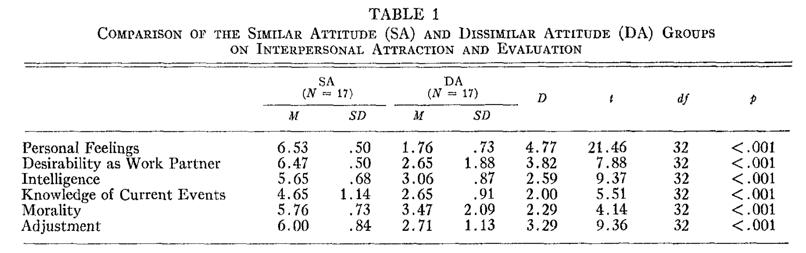
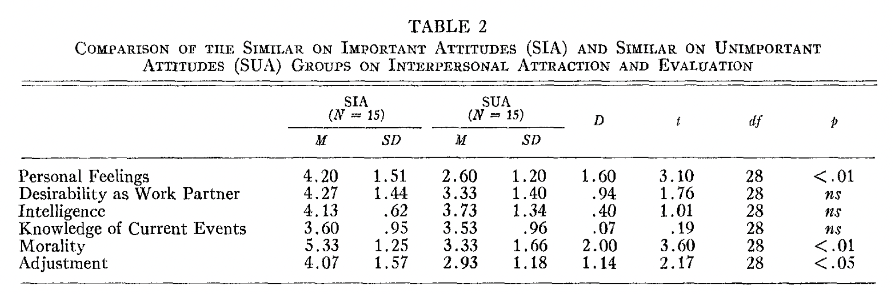

# Interpersonal Attraction and Attitude Similarity

## INTRODUCTION

[인간-인간 사이의 감정 형성]

**상호작용을 형성하는 것**

-   Bryne → **Propinquity**: 신체적 & 기능적 거리가 상호작용과 상호간 매력에 영향을 준다
-   Atkinson, Heyns, & Veroff, 2019; Schachter, 1959: **Affiliation need**
-   **Generalization from previous interpersonal interactions**

**영향(결정) 요인**

⇒ Newcomb, 1956 → **Reciprocal reward & Punishment**가 중요한 결정 요인임.

⇒ 또한 두 사람 사이의 **태도의 비슷함 혹은 비슷하지 않음**도 하나의 변수 → 나와 같은 지각과 개념을 가진다면 rewarding 상호작용을 줄 것이고 따라서 긍정적 관계를 형성할 것이다. / 반대로 다른 것을 보여준다면 punishing 상호작용을 줄 것이고 따라서 부정적 관계를 형성할 것이다.

Disagreement → 멍청하고, 지식이 없고, 비도덕적이고, 제정신이 아닌 것으로 여겨지기도 한다.

-   개인에게 무엇이 중요한지 같은 다른 요소가 영향을 줄 것이다.
    -   Bonney, 1946 등: 친구들 사이에 비슷함이 많다(아닌 사람과의 관계에서보다)
    -   Jones & Daugherty, 1959; Smith, 1957: Attitude similarity & interpersonal attraction

## Hypothesis

_(a) a stranger who is known to have attitudes similar to those of the subject is better liked than a stranger with attitudes dissimilar to those of the subject, → 나와 비슷한 태도를 가진 낯선 사람을 다른 낯선 사람보다 더 좋아할 것이다._

_(b) a stranger who is known to have attitudes similar to those of the subject is judged to be more intelligent, better informed, more moral, and better adjusted than a stranger with attitudes dissimilar to those of the subject, and → 나와 비슷한 태도를 가진 낯선 사람을 그렇지 않은 사람보다 더 똑똑하고 더 지식적이고 더 도덕적이며 더 적응력이 있을 것이라고 생각할 것이다._

_(c) a stranger who is known to have similar attitudes on issues important to the subject and dissimilar attitudes on unimportant issues is better liked and is evaluated more positively on the other four variables than a stranger for whom the reverse is true. → 나에게 중요하다고 생각되는 것을 비슷하게 평가하는 낯선 사람과 중요하지 않다고 생각하는 것에서 다르게 생각하는 사람을 더 좋아할 것이고 긍정적으로 평가할 것이다._

## METHOD

### Attitude measure

-   파일럿 연구에 기반하여 26개의 issues 선정(중요한 것에서 중요하지 않은 것까지) → 예) 중요-integration, God, premarital sex relations / 덜 중요-western movies and television programs, classical music, politics
-   가장 중요한 13개와 가장 중요하지 않은 13개 issues를 모두가 공통으로 설문

### Procedure

-   참가자들은 기존에 참여한 attitude scale이 상호관계 예측을 위한 연구라고 거짓 설명됨
-   성별을 기반으로 4그룹으로 나뉘어 다른 반의 테스크 결과(지어낸)가 주어짐,
    -   Attitude scales가 본인이랑 똑같은 것
    -   Attitude scale이 정반대인 것
    -   가장 중요한 issues는 비슷하고 가장 덜 중요한 issues는 다른 것
    -   가장 덜 중요한 issues는 비슷하고 가장 중요한 issues는 다른 것

### Interpersonal attraction and evaluation

-   Interpersonal Attraction: 피실험자들은 상대방을 얼마나 좋아할 것 같은지 & 상대방과 함께 일하는 것이 즐거울 것 같은지
-   Judgements: 상대 학생의 지능, 현재 사건에 대한 지식, 도덕성, 적응력

## RESULTS

{: width="100%" height="100%"}

-   H1: Dissimilar Attitudes (DA)의 그룹에 비해 Similar Attitudes (SA) 그룹이 확실하게 **더 긍정적인 감정적 결과**를 보여줬다. (p < 0.001) → 개인적 감정, 같이 일하고 싶은지에 대한 것
-   H2: Dissimilar Attitudes (DA)의 그룹에 비해 Similar Attitudes (SA) 그룹이 상대방을 **더 똑똑하고 현재 사건을 잘 이해하고 도덕적이고 적응력이 좋다**고 평가하였다. (p < 0.001)

{: width="100%" height="100%"}

-   H3: 부분적으로 확인됨. Similar on Important Attitudes (SIA)가 Similar on Unimportant Attitudes보다 상대방을 더 긍정적으로 평가하였지만, **개인적 감정, 도덕성, 적응력**에 관해서만 차이가 있었다. (함께 일하고 싶은지, 똑똑한지, 현재 사건을 잘 이해하는 지는 X)

## DISCUSSION

-   Relationship between interpersonal attraction and attitude similarity 확인하였음.

> Reference 
> Byrne, D. (1961). Interpersonal attraction and attitude similarity. _The journal of abnormal and social psychology_, _62_(3), 713.