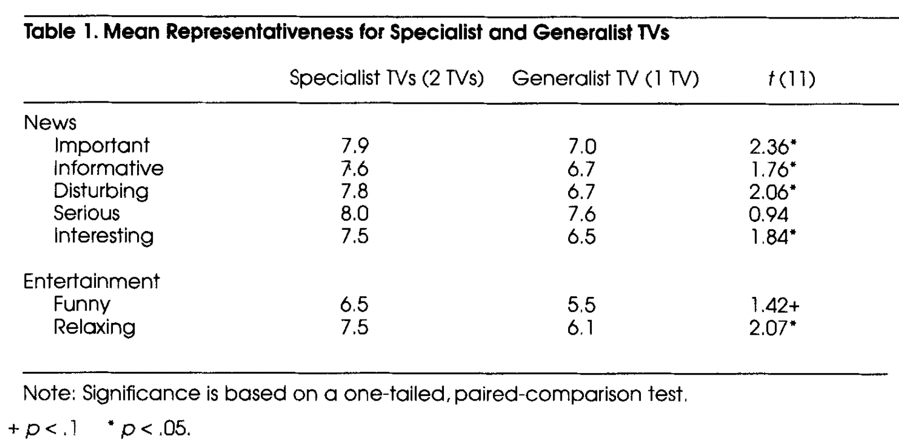
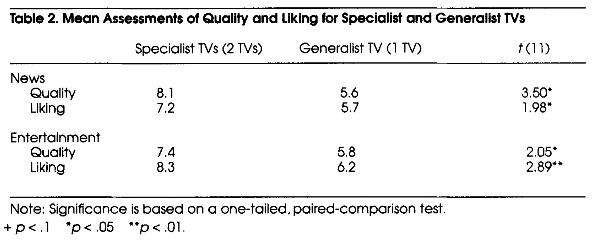

# Technology and Roles_A Tale of Two TVs
## 요약
### **Specialized functions or uses**

**→ 일반 TV vs 뉴스 TV, 엔터테인먼트 TV (라벨링으로 조절)** : 특정한 기능이나 사용으로 Specialized 된 TV는 콘텐츠에 대한 더 긍정적 평가 결과를 보여주었다. (심지어 TV set과 프로그램이 동일한 경우에도)

**→ 사람들이 TV 셋에 적힌 콘텐츠 타입과 일치하는 역할을 TV에 부여한다.**

## 정리

**이 연구는 박스로서의 tv의 영향을 확인한다.**

: 텔레비전 셋의 차이가 텔레비전 콘텐츠에 대한 반응을 변화시키는가, (특히 우리가 화면이 가질 수 있는 여러 역할이나 기능 중 하나의 특정한 역할을 부여했을 때).

### 박스로서의 TV?

1.  **다른 크기의 화면은 같은 콘텐츠를 보여주더라도 평가에 대해 다른 집중을 보여주고 다른 기억을 보여준다.**
    1.  뉴스 측면: Lombard, 1995
    2.  중성적 맥락: Reeves, Lombard, & Melwani, 1992
    3.  feature films: Reeves, Detenber, & Steuer, 1993
2.  **TV를 일이 일어나고 사람들이 존재하는 공간의 박스로 여긴다.**
    1.  사람들이 화면에 가까이 갈 수록 화면 속 사람과 가깝게 있다고 느낀다 + (사람 사이의 거리가 가까운 것처럼) 그들에 대해 더 극적으로 평가한다. :Lombard, 1992; Reeves et al., 1992

→ 이 두 연구를 토대로 보면 물리적 공간이 집중, 기억, 행동을 안내하는 중요한 단서라는 것을 알 수 있다.

*비슷한 맥락의 연구로 물리적 공간이 기억의 중요한 단서로 작용한다는 연구가 있다: Rothkopf, Dixon, & Billington (1986) ~~우리가 공부할 때 아 이거 몇페이지 어디있던건데 하는 그런 느낌?~~

TV 모니터로 6명의 인물이 토론하는 장면을 봤을 때, 하나의 TV에서 프레임으로 봤을 때보다 6개의 다른 TV로 봤을 때, 어떤 발언이 어디서 나온 것인지 잘 지정하였다. → Spacial cue to aid memory → TV 박스가 사람과 행동이 존재하는 공간으로 규정될 수 있음.

1.  **의식적으로 만들어지거나 그렇지 않은 것에 상관 없이 특정 역할을 다른 TV sets 에 부여한다.**
    
    1.  Nass, Steuer, Henriksen, & Dryer (1994): 컴퓨터에 역할을 쉽게 부여할 수 있으며, 이런 역할이 컴퓨터에 대한 사용자의 사회적 반응에 영향을 미친다.
    
    ⇒ TV에도 같은 반응을 할 것이라는게 이 연구의 가설
    

**우리는 어떤 사람이 지속적인 행동을 할 것을 예측하도록 학습하고 나면, 그 사람은 specialized 된다. 즉, 그 사람은 역할이 부여된다.**

**Specialization의 특성**에 기반하여 연구를 진행

-   Agents(사람이든 tv든)는 그들의 specialties안에서 일관되게 행동하고, 이런 행동이 그들로 하여금 그들의 역할을 더 대표하는 것처럼 보이도록 만든다. 반대로 generalist는 다양하게 행동해서 특정한 역할의 원형이 될 수 없다.
-   Specialists가 Generalist보다 적어도 그들의 전문화 영역 안에서는 더 낫다.

## 가설

1.  news-only tv를 본 사람은 동일한 콘텐츠를 generalist tv에서 본 사람보다 그 뉴스가 뉴스의 특성을 더 잘 반영한다고 여길 것이다.
2.  entertainment-only tv를 본 사람은 동일한 콘텐츠를 generalist tv에서 본 사람보다 그 예능이 예능의 특성을 더 잘 반영한다고 여길 것이다.
3.  Specialist tv의 콘텐츠의 인지된 퀄리티가 Generalist tv보다 더 높을 것이다.

## Watching TV

30분동안 TV 보기

### **News TV(Specialist)** & **Entertainment TV(Specialist)**

vs **news-entertainment TV(Generalist)**

파일럿 테스트를 통해 뉴스와 예능을 묘사하는 각각의 variables 선정

**News**: Important, Informative, Disturbing, Serious, Interesting

**Entertainment**: Funny, Relaxing

## Representativeness and Superiority of Specialist TVs

각자 프로그램을 2개 보고 리모콘으로 VCR을 멈추고 평가하는데, 그렇게 쭉 총 8개를 보게 된다. → Specialist 조건은, 뉴스 tv를 본 다음 일어나서 다른 tv로 옮겨가는데, 2 프로그램마다 이 과정을 반복한다.

{: width="100%" height="100%"}

가설과 일치하여, Specialist TV가 Generalist TV보다 더 representative한 콘텐츠를 더 제공한다고 보여졌다.

→ 뉴스는 더 중요하고 , 더 정보적이고, 더 불안하며(disturbing), 더 유익하다.

→ 예능은 더 재미있고, 더 안정시켜준다.

{: width="100%" height="100%"}

Superiority of the specialist TV 콘텐츠에 대한 가설에 대한 증명.

→ Specialist TV를 본 사람들은 뉴스와 예능의 질에 대하여 Generalist TV를 본 사람보다 높게 평가하였다.

→ 또한, Specialist TV를 본 사람은 뉴스와 예능을 Generalist TV를 본 사람보다 더 좋아하였다.

## Responses to Specialist Televisions

**TV에 전문화된 역할을 부여하거나 사용하는 것은 TV나 프로그램이 동일할 때에도, 콘텐츠에 대한 더 긍정적인 평가를 보여주었다.**

이는, 전문 역할에서의 개인에 대한 인식에 대한 기존 연구의 예상과 일치한다.

(a) 전문가들은 그들의 역할 내에서 일관되게 행동한다.

(b) 그리고 그들의 전문 분야 안에서 일반인보다 뛰어나다.

⇒ TV도 컴퓨터(CASA)와 같이 상호작용을 유발하는 것: psychological reality를 가지고 있다.

> Reference 
> Nass, C. (1996). Technology and Roles: A Tale of Two TVs. _Journal of Communication_, _46_(2), 121-28.
