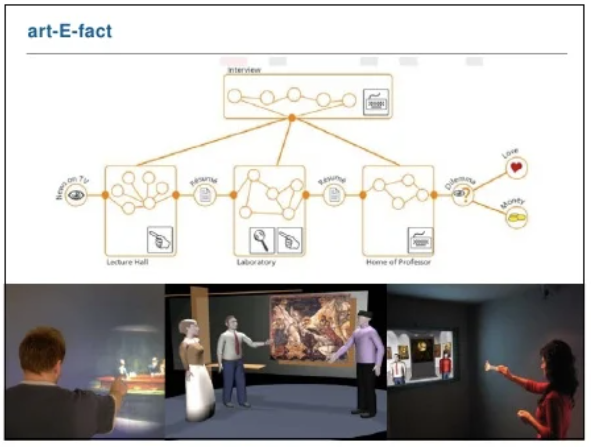
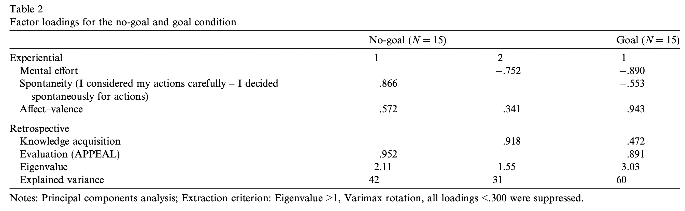

# To do or not to do: Differences in user experience and retrospective judgments depending on the presence or absence of instrumental goals

## 요약
스토리텔링 시스템을 이야기하며 겪는 Affect & Mental effort & Spontaneity(자연스러움?) 과 Retrospective judgments of Appeal 사이의 관계 확인 

→ 수단이 되는 골이 있는지 없는지에 따라 영향 확인
→ Mental effort에 영향을 주었을 뿐 아니라, 회상적 평가가 형성되는 방식에도 영향을 미쳤다.

## Introduction

경험(Experience)을 하는 동안 우리의 뇌는 현재 사건에 대한 감정 해석을 구성한다(Kahneman, 1999)

또한 사람들은 경험을 한 후, 그에 대한 **회상의 요약 평가**를 내린다.(Kahneman, 1999; Hassenzahl and Sandweg, 2004). → **Retrospective Summary Evaluation**

→ 이런 평가는 추후에 그 경험과 제품과의 소통에 대한 기반이 된다. (외워져서 미래를 안내하는 역할이 됨)

⇒ HCI에서는 R**etrospective summary evaluations**을 제품 품질의 직접적인 지표로 여기는 연구자들도 있다.

-   처음에는 경험 도중에 겪은 순간들의 단순한 평균 혹은 합 이라고 여김.
-   Redelmeier and Kahneman, 1996: 환자에게 과정중의 고통을 물어봤을 때, 그들은 **peak-end rule**에 따라 회상하였다. → 가장 고통이 클 때와 마지막 순간의 고통의 평균치
-   Hassenzahl, 2000: 노력한 경험이 클 수록 제품에 대한 우호적 평가가 낮게 나타났다. 하지만 마지막에 경험한 노력이 참가자의 평가에 대한 가장 좋은 지표였다. 다른 지표의 예: average of all effort measures, peak/end, variance, trend

⇒ 즉, **Retrospective usability evaluation**은 참가자가 만든 경험과 관련이 있었다 (같은 것은 아님). 오히려 어떤 순간에서 기인하거나 타겟에 대한 일반적 지식과 태도에서 기인.

**Situation**은 retrospective product evaluations에 영향을 주는 다른 측면이다.

-   Hassenzahl et al., 2002: 많은 웹사이트들이 얼마나 매력적인지에 영향을 주는 tasks들을 찾았다 (**제품 사용의 맥락에 따라 평가가 달라진다**). → 목적이 있는지 없는지에 따라 다른데, 목적이 있을 땐 사용성(simple-complex)이 매력도(good-bad)와 인과관계가 있는 반면, 목적 없이 구경하는 그룹은 그렇지 않았다.

⇒ 본 연구에서는 경험하는 동안 측정된 수치와 회상적인 것의 관계를 확인한다.

사용자는 art-E-fact 플랫폼을 기반으로 디지털 스토리텔링 시스템을 사용하며 상호작용을 겪게되는데, 그 때 순간적 감정(affect)와 정신적 노력(mental effort)을 확인한다.

**Affect**: Schwarz and Clore, 1983에 따르면 순간적 좋고 나쁜 감정은 과업 혹은 제품의 다양한 측면에 대한 평가의 기본으로 작용한다. **Experienced mental effort**: Arnold, 1999에 따르면 인지된 과업 요구를 충족하기 위해 활성화 되야하는 에너지이며, Hassenzahl, 2000에 따르면 직면하는 사용성 문제의 예측 지표이다. → 즉, 골을 달성하는 것의 장애물로 경험된다.

이 외에도 사용자는 **spontaneity**(얼마나 조심히 했는지), **appeal**, **comments**(긍적적/부정적)를 평가한다.

**골의 유무가 retrospective measures와 관련된 experiential measures에 영향을 줄 것이다.**

## Method

{: width="100%" height="100%"}

Art-E-fact 경험(스토리라인, 가상 캐릭터, 상호작용 규칙 등의 이야기 생성을 위한 authoring tool을 가지고 있다.) 사람들은 이 앞에 서서 조건에 따라 제품을 경험

-   예술 작품에 대한 정보가 주어진다. 두명의 가상 캐릭터(리포터, 예술 교수)가 정보를 주고 받는다.
-   사람들은 포인팅하여 상호작용할 수 있다.(skipping, repeating, getting additional information)
-   그 외에도 purpose-built tools를 사용할 수 있다.(돋보기)

### **IV: Instrumental goal**

-   no-goal condition: 자유롭게 원하는대로 제품 이용
-   goal condition: 특정 질문 몇개의 답을 찾도록 요구(이 제품을 사용하는 목적이 본래 정보를 얻는 것이기 때문)

### DV: Experiential measures & Retrospective measures

1.  **Experiential measures**: Mental effort & Affect
    
    **Mental effor**t: ‘‘Subjective Mental Effort Questionnaire’’ (SMEQ, Zijlstra, 1993; Eilers et al., 1986), a simple rating scale ranging from 0 (hardly effortful) to 220 (exceptionally effortful)
    
    → 사용자 에피소드 도중에 3번 mental effort를 확인하여 평균내어 mental effort 계산
    
    **Affect**: hedonic (pleasure-displeasure) & arousal (sleepy-activated)의 결합인데, 이 연구에서는 valence를 확인 (pleasure-displeasure)- ‘‘Self Assessment Manikin’’ (Bradley and Lang, 1994) 사용
    
2.  **Retrospective measures**: Evaluation & Acquired knowledge & Spontaneity
    
    **Evaluation:** good-bad, inviting-rejecting, likable-disagreeable의 7개 항목을 평균내어 측정
    
    **Acquired knowledge:** 이야기가 끝나고 4개의 이야기에 대한 질문 답변
    
    **Spontaneity:** goal-mode에서 사람들은 더 계획적으로 행동할 것이므로 Hassenzahl and colleagues (2002)에 기반하여 측정 **Positive/negative comments**: 자유롭게 답변하나 특히 긍정적이었던 3가지 측면, 부정적이었던 3가지 측면을 말함
    

## Results and discussion

{: width="100%" height="100%"}

골이 있고 없고는 상호작용하는 제품에 대한 경험에 영향을 줄 뿐 아니라, 골이 있으면 mental effort가 올라가서 장애물이 생긴다. (In the present study, active instrumental goals made barriers to their attainment salient indicated by an increase in mental effort.)

골이 있는 상황에서,

mental effort ↔ affect → retrospective product evaluation(appeal)

사람들이 더 spontaneous 할 수록 effort가 올라갔고 부정적 감정을 느꼈다.

spontaneity는 reduced appeal of the product에 영향을 주었다.

골이 없는 상황에서,

spontaneity는 긍정적으로 받아들여졌고, 제품에 대한 긍정적 평가로 이어졌다.

Mental effort & Knowledge acquitision은 제품 평가에 영향을 주지 않았다. (mental effort가 pragmatic quality와 관련이 있기 때문)

> Reference 
> Hassenzahl, M., & Ullrich, D. (2007). To do or not to do: Differences in user experience and retrospective judgments depending on the presence or absence of instrumental goals. _Interacting with computers_, _19_(4), 429-437.