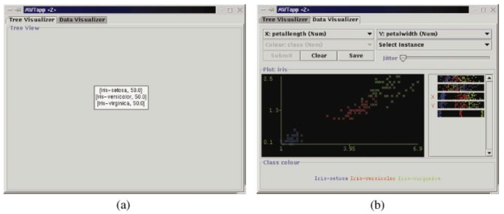
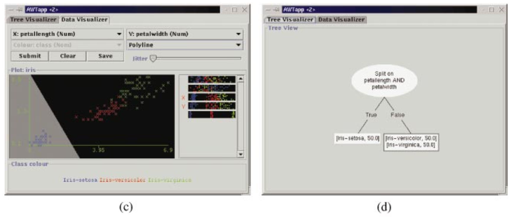
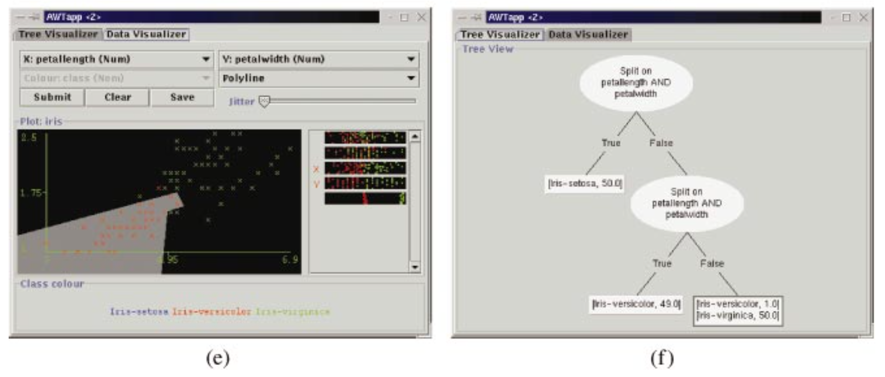

# 간략한 요약

Interactive machine learning: 사용자를 분류기(classifier)에 직접 참여할 수 있도록 하는 것.

→ 모델링 단계에 배경 지식을 통합할 수 있는 자연스러운 방법이 될 수 있다.

결과적으로 사용자에게 적절한 기법을 제공하는 것이 그들이 최첨단 학습 알고리즘과 견줄 수 있는 모델을 만들 수 있다는 것이 확인되었다.

도메인 전문가가 아니어도 ‘A simple two-dimensional visual interface’를 사용하여 좋은 분류기를 만들 수 있다는 것이 증명되었다. 당연하게도 어떤 도메인이냐에 따라 성공 여부가 달려있다.

결과적으로 본 논문의 시스템은 도메인 전문가가 아주 정확한 분류기를 생성할 수 있게끔 한다는 것을 시사한다. 또한 전문가가 규정한 작은 모델도 더 똑똑하여 추가적인 장점이 있다는 것을 알 수 있다.

---

# 상세한 정리

## Introduction

**기존 머신러닝의 단점**:

-   비-상호작용적: 트레이닝 데이터를 넣으면 결과 모델이 나온다.
-   파라미터를 통해 알고리즘을 조절하지만, 알고리즘의 작동방식을 잘 아는 사용자조차 적절한 파라미터 설정을 찾기위해 여러 번 시도해야 한다.
-   대부분의 사용자는 기반이 되는 기술을 잘 모르고 따라서 이는 학습 기획(scheme)을 효율적으로 하게 어렵게 만든다.

**데이터 마이닝을 위한 기법을 선택할 때**도 비슷한 문제:

-   가장 좋은 선택은 도메인의 속성에 일반적으로 의존하기 때문에, 적절한 sheme을 선택하는 표준 방법이 없다. 
→ **02pm:** 도메인 속성에 따라 방법이 다르기 때문에 표준이 없다는 것?
-   사용자는 개별 학습 scheme의 강점과 약점을 모르기 때문에 문제는 더 심각해진다.
-   파라미터 & scheme 선택은 단지 모델이 어떻게 만들어질지 메커니즘 일 뿐이라서 도메인 지식이 추론 과정에 들어갈 방법이 없다. 
→ **02pm:** 그 매커니즘과 도메인 지식을 사용하는 과정이 상이하기 때문에?

### Graphical Interactive approach

따라서 본 논문은 **A graphical interactive approach**를 제안하여 학습 과정의 데이터를 시각화하고 사용자가 선택(decision) 경계를 “그릴" 수 있도록 하였다.

⇒ 사용자가 모든 귀납 과정을 조작하기 때문에 파라미터 & scheme이 필요 없게 되었다.  
⇒ 도메인 전문가가 사용할 경우 배경지식이 자동으로 들어갈 수 있다.  

본 연구의 인터페이스는 **Ankerst, Elsen, Exter and Kriegel (1999)의 interactive classifier에 기반하여** 만들어졌다. (Ankerst 외 다수, (1999)의 연구는 univariate decision tree 기반)

**차이점** 
⇒ 1. two-dimensional visualization을 사용하여 어떤 속성들 사이에서도 복잡한 상호작용이 가능하다. 
⇒ 2. 초보 사용자와 표준이 되는 데이터셋을 통해 실증적 평가를 하였고 따라서 본 interactive visual apporach의 강점과 약점을 알 수 있었다.  

## Visual decision tree construction using 2D polygons

목표: 분류 모델을 가능한한 직관적으로 만들고 flexibility와 simplicity를 중요하게 다루었다.

사용자는 본 시스템에서 의사 결정 나무를 속성의 bivariate splits를 통해 그래픽으로 형성할 수 있다. (univariate 보다 낫고 두 가지 속성 이상을 시각적으로 표현하기 어렵고 사용자도 2차원의 데이터가 편하기 때문에) 
{: width="100%" height="100%"}
출처: [Scribbr](https://www.scribbr.com/frequently-asked-questions/univariate-vs-bivariate-vs-multivariate/#:~:text=Univariate statistics summarize only one,compare more than two variables.)](https://s3-us-west-2.amazonaws.com/secure.notion-static.com/55289a7f-e119-45da-bc19-ddccb83cb67e/Untitled.png)

폴리곤을 사용하여 각각의 Bivariate split를 표현하였다. (아래 이미지) ⇒ 기존의 의사결정 나무의 “divide and conquer” 절차와 마찬가지로 사용자가 목표 컨셉을 대략적으로 알 수 있게하고, split의 수를 적게 만들 수 있다.

### User Interface

**두 가지 종류의 판넬**

1.  Tree visualizer (a, d, f): 현재 단계의 의사결정 나무의 구조를 보여줌 → 사용자는 모든 노드를 좌클릭할 수 있으며, 클릭하면 노드가 밝아지고 data visualizer에 그 노드의 정보를 가져온다.
2.  Data visualizer (b, c, e): 뿌리가 되는 노드의 데이터를 보여준다. → 사용자는 이를 사용하여 폴리곤을 그려 split를 정의할 수 있다. → split이 생성되면 나무 구조에 결과 노드가 추가된다.

→ 각각 화면 위의 Selector를 통해 사용자가 construction을 하는 동안 판넬들을 옮겨다닐 수 있도록 함

{: width="100%" height="100%"}
{: width="100%" height="100%"}
{: width="100%" height="100%"}

### 기본적인 기능

**[Data visualizer]**

세가지 영역으로 나뉜다: 가장 위의 조작 부분, 왼쪽에 있는 2차원의 scatter plot, 우측에 있는 1차원의 bar graphs.

**조작 부분**: 사용자가 속성을 선택하고 디스플레이의 다른 것들을 조작할 수 있도록 해준다.

**Scatter plot**: 사용자가 선택한 2개의 속성 값에 따라 패널에 instance를 보여준다. 각각의 색은 class 값. (하단에 색의 키값 적혀있음.)

**Bar graph**: isolation에 있는 각각의 속성(attribute)을 1차원으로 보여준다. → 각각의 속성의 구별되는 힘을 시각화해서 보여줄 수 있다. → attribute 범위 안의 class 값의 분배(distribution)를 보여준다.

**02pm:** 데이터값에서 column이 attribute가 되고 그 attribute가 결합되어서 나누어 진 것이 class라고 생각하면 될 것 같다.

**[Scatter plot에서 Display Attribute 선택하는 2가지 방법]**

1.  조각 영역 안의 pull-down 메뉴(X축 Y축의 속성 선택)
2.  attribute bars에서 선택 가능(좌클릭 혹은 우클릭하면 scatter plot의 X축 Y축에 반영)

Attribute(=feature) 선택한 것이 마음에 들 경우 Split이 scatter plot에 바로 그려질 수 있다. → 데이터 포인트들이 폴리곤에 포함되며 (shape은 상단의 pull-down 메뉴에서 선택할 수 있는데 polyline에서 폴리곤, 직사각형 등 다양한 모양이 가능하다)

폴리곤은 한개이든 여러개이든 합쳐져서 split이 정의되고 이 결과가 마음에 들면 tree 구조에 넣게 된다.

→ 두 개의 새로운 노드를 생성한다. (왼쪽 노드는 폴리곤 안의 값, 오른쪽 노드는 나머지 값)

마음에 안 들 경우 clear 가능하며 사용자는 마음에 들 때까지 계속 반복할 수 있다.

### 추가적인 기능

-   Tree structure 변형 가능
-   그 밖에도 색이라던가 jitter 슬라이더 또한 제공
-   사용자는 각각의 데이터 포인트의 속성을 확인해 볼 수 있다.

## Iris data를 사용한 예시

Iris data는 Interactive classifier construction에 적합한데 그 이유는, 
1. 붓꽃의 4가지 숫자 속성을 가지고 있다. 
2. 각각의 다른 붓꽃 종류의 3가지 class 가 있다.

{: width="100%" height="100%"}

1.  처음에는 하나의 노드로 시작(나무의 뿌리) (a) → 노드 안에는 instance의 개수 표시(본 예시에서는 각각의 class에 50개의 instances)
2.  노드는 자동으로 선택됨: 하이라이트 된 보더값으로 알 수 있음 (d, f는 보더 없고 선택되지 않은 노드들)
3.  Split을 만들기 위해 사용자는 뿌리 노드의 데이터 포인트를 보여주는 data visualizer로 이동한다. (b)는 3(petallength), 4(petalwidth)번째 attribute를 선택한 다음임. 이것이 X, Y축이 됨.
4.  사용자는 split을 그린다 (c). C는 폴리라인 옵션으로 폴리곤을 그리고 Iris-setosa에 해당하는 instance를 분리한 것(밝은 회색 영역).
5.  (d)를 보면 split을 반영한 결과 값으로 새로운 2개의 노드가 생긴 것. 왼쪽 노드가 밝은 회색 영역, 오른쪽 노드는 남은 instances 영역.

이런식으로 구분하기 쉬운 영역을 먼저 잘라내는 방식!

## 결론

새로운 방식의 decision tree classifier → 인터랙티브하고 쉽고 직관적.

데이터에 친숙한 사람들이 도메인 지식을 효과적으로 사용하는 것을 연습할 수 있도록 해준다.

귀납적 추론을 구체적인 방법으로 보여줄 수 있고 따라서 사용자가 결과의 의미를 학습할 수 있다.

-   너무 큰 데이터보다는 좀 작을 때 더 유용하고 직접(본 연구의 실험 내용?) 만들어진 데이터셋은 더 작고 더 정확할 수 있었다.
-   사람들은 클러스터가 2차원일 때 모델을 더 잘 형성했다.

추후 연구 제안: 인간과 머신러닝 알고리즘을 결합한 공생의 관계를 형성하는 것

예) if-then 조건 구조의 Induct 같은 알고리즘을 사용. 사용자가 직접 만든 알고리즘이 데이터 시각화를 해봤더니 실패했으면, 그 때 induction process가 대신 할 수 있도록.

> Reference: Ware, M., Frank, E., Holmes, G., Hall, M., & Witten, I. H. (2001). Interactive machine learning: letting users build classifiers. _International Journal of Human-Computer Studies_, _55_(3), 281-292.