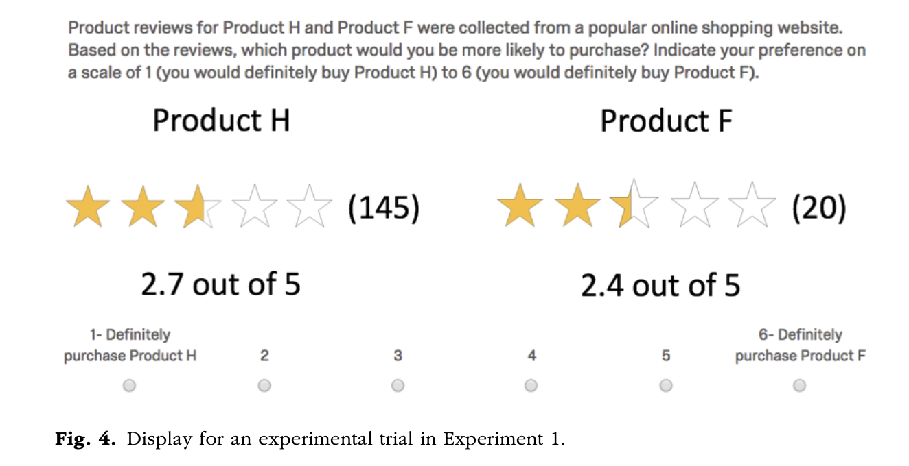

# 요약
본 논문은 'Social Learning'에 대한 논문으로, 여기서 말하는 소셜러닝이란 다른 사람들의 선택과 그 선택의 결과를 관찰하고 학습하는 능력을 말한다. 특히 소셜러닝을 위한 'Social evidendce'는 인터넷 덕분에 더욱 많이 발전하였다.
 
하지만 이런 증거를 잘 사용하려면 통계적 추론을 제대로 할 줄 아는 능력이 필요하다.

본 논문에서는 사람들이 온라인 상의 리뷰 점수를 해석할 때 리뷰의 수에 영향을 받는지 확인하였다. (리뷰수: 제품의 인기도와 평균 리뷰 평점의 정확도 둘 다를 알 수 있는 척도)

아마존의 리뷰 수백만개의 경험적 사전 정보를 활용하여 <b>'직관적 통계학자의 행동'을 모델화하고 '모델의 예측'을 '실험 참가자의 행동'</b>과 비교하였다.

특정한 조건 아래에서 참가자들은 리뷰 수가 많은 제품을 선호하였다 (통계적 모델은 리뷰 수가 적은 것이 더 리뷰의 퀄리티가 높다고 했음에도).

<b>전반적으로 참가자들은 의미있는 통계적 추론을 하지 못했다.</b>
> The Law of Large Numbers 패러디한 타이틀? 

---

# 정리

## Introduction
### Social Learning
소셜러닝은 다른 사람들의 행동을 관찰하여 나의 문제를 해결하고 선택(decision making)을 하는 것으로 모방이나 본받는 것. 소셜러닝을 통해 지식을 빠르고 안전하게 얻을 수 있다. 그렇기 때문에, social learning은 진화적 그리고 사회적으로 엄청난 영향을 미친다.

이런 social learning은 경제적인 것과 자주 관련이 있는 <b>선택</b>에 도움을 준다. 사람들은 다른 사람들은 어떤 선택을 하고 어떤 결과를 얻었는지 관찰한다 (eg., 도서 베스트 셀러, 앱 다운로드 수, 이를 활용한 마케터의 광고 방안)

-> <b>'Popular consensus'</b>

다른 사람들의 선택의 결과를 자세히 살펴보며 학습할 수 있는데, 이 때 '리뷰'와 함께 '평점'을 확인한다. 하지만, 이런 정보들을 활용할 때 추가적인 스킬이 필요하다.

여기서 추가적 스킬이란, 아래의 사항들을 말한다.
- (평균 평점 같은) 요약적 데이터로부터 '직관적으로 통계적 추론을 해낼 줄 아는 능력'
- 제품 전반의 리뷰 '평점의 분포에 대한 지식을 요약적 데이터와 통합할 줄 아는 능력'

  본 글에서는 <b>사람들의 소셜러닝 능력이 소셜 증거의 이점을 취하기에 충분한지</b>를 살펴보았다.

기존 연구(heuristics and biases 관련)를 토대로 확인한 바,
사람들은 단순화 된 표현 혹은 과정을 사용하여 선택을 하고 따라서 편견을 이끌어 낸다고 한다(특히 수치가 연관된 경제적 상황에서).
(추가로 기존에 Heauristics and biases vs. Naturalistic decision making의 연구가 있었다.)

온라인 소비자의 입장에서 리뷰 정보의 요약된 형태는 '제품 구매의 결과'에 대한 정보와 함께 '제품의 인기도'를 알 수 있게 해준다. 이런 상황에서 사람들은 제품의 인기도를 그 품질을 평가하기 위한 중요한 사회적 단서로 보기 때문에 '더 많은 리뷰가 있는 제품'을 선호할 수 있다. 하지만, '큰 수의 법칙'을 따른 통계 드리븐한 동기도 있을 수 있다. 더 큰 수가 더 믿을만하고 더 확실해보이기 때문이다.

본 연구에서는 이러한 사회적 그리고 통계적 추론을 3가지 연구에서 제품 선택을 통해 살펴보았다.

1. 대략 1천 5백만 아마존 리뷰를 통해 리뷰 수와 평균 평점 사이의 관계와 경험적 분포를 확인한 연구
2. 사람들이 리뷰 수를 통한 통계적 & 사회적 정보를 사용하는 방법을 구분하기 위한 실험-1
3. 사람들이 리뷰 수를 통한 통계적 & 사회적 정보를 사용하는 방법을 구분하기 위한 실험-2

  
인기도를 보여주는 사회적 정보 기반은 더 많은 리뷰가 있는 제품을 선호하도록 편향되었다.
 반면, 통계적 정보 기반은 좀 더 선택이 복잡했다: 높은 리뷰 수가 높은 제품 품질에 대한 것일 때 인기있는 제품을 선호해야 하고, 높은 리뷰 수가 낮춘 제품 품질에 대한 것일 때는 그 제품을 선호하지 않아야 한다. 즉, 인기 있는 선택에 대한 선호도는 결과가 만족스럽지 못했다는 증거에 의해 조정되어야 합니다.

## Analysis of Amazon Review Data
- 제품의 성공은 제품의 품질과 연관되어 있을 것 같지만, 그렇지 않았다.
- 평균 평점과 리뷰 수는 관련이 없었다 (가격을 고려하였을 때도).
- 단순한 인기도는 제품의 품질에 의미있는 지표가 아니다.

따라서, 본 연구에서는 통계적 모델을 개발할 때 리뷰 점수를 리뷰 슈와는 독립적인 것으로 여겼다.

### Intuitive statistician (bayesian 통계에 기반한)
1. 샘플 사이즈의 영향: 리뷰 점수의 차이는 더 큰 표본에 의해 점수가 더 정확하게 추정될 때 더 중요합니다.
2. 제품의 절대적 품질: 리뷰가 호의적일 땐 더 리뷰가 많은 것을 선택하고 리뷰가 비판적일 땐 리뷰가 적은 것을 선택하였다. 비판적 리뷰의 수가 낮으면 품질이 낮다는 것을 덜 보장하므로 비판적 리뷰가 적은 것을 선택해야 한다. (Consequently, one should prefer the product for which the quantity of poor reviews provides less, rather than more, certainty of its low quality.) -> 높은 제품 인기가 항상 좋은 것으로 간주되는 인기 휴리스틱의 예측과 정반대
  
## Experiment 1
33회 시도, 각각의 참가자들은 두가지 제품 중 선택하도록 요구된다. (아래 그림 예시)
{: width="100%" height="100%"}

모든 경우에 두 제품은 리뷰 수가 달랐다. 인기 제품은 평균 150개의 리뷰, 비인기 제품은 평균 25개의 리뷰(둘 사이의 차이는 무조건 125개의 리뷰)

결과: 참가자들은 왼쪽 제품이 리뷰가 많은 제품일 때 통계 모델에 의해 예측된 것보다 더 강하게 선호했고, 덜 리뷰된 제품일 때 예측된 것보다 덜 선호했다. (리뷰가 많은 제품을 선호)
  
## Experiment 2
사용 가능한 데이터의 양이 실험 1보다 리뷰가 적은 제품에 대한 참가자의 결정에 미치는 영향 확인 (만약 샘플사이즈를 통해 통계적 추론을 할 수 있다면 샘플 수가 적을 때, 제품의 점수에 영향을 받지 말아야 함)

결과: 참가자들은 실험 1과 2 사이의 표본 크기의 차이에 영향을 받지 않았다. 

-> 이러한 결과는 참가자 통계적 추론을 하지 못했다는 것을 보여준다. 반면, 각 실험 내에서 그들의 결정은 <b>인기도와 평균 리뷰 점수의 경험적 가중치</b>를 기반으로 한 것으로 보인다.
   
## Discussion
두 실험을 통해 참가자들이 리뷰가 많은 (더 인기 있는) 제품을 강하게 편향되어 선호하였다. 또한 참가자들은 샘플 사이즈의 차이에 대하여 완전히 무감각하였다. 따라서 직관적 통계자 모델과는 다른 결과를 보여주었다.

즉, 사람들은 통계적 추론의 과정을 통해 리뷰점수와 샘플사이즈를 확인하고 그들 사이의 미묘한 관계를 가정하기 보다, 단순히 이 단서를 활용하여 결정을 내렸다.

하지만, 사람들이 인기 있는 제품을 선호하는 것은 '편향'이라고 정의될 수 있다.

> Reference:  
> Powell, D., Yu, J., DeWolf, M., & Holyoak, K. J. (2017). The love of large numbers: A popularity bias in consumer choice. _Psychological science_, _28_(10), 1432-1442.