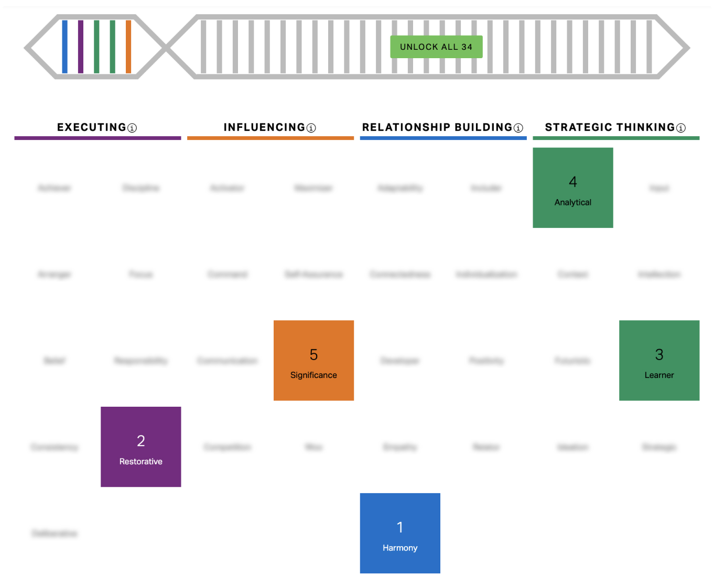

> Books 카테고리는 관심이 가는 책을 읽고 좋은 문장들을 인용하는 카테고리다. **02pm:** 은 나의 의견을 정리해놓은 부분이다.

# 나의 장점 찾기

> 참고: 위대한 나의 발견 강점 혁명 - 갤럽 프레스

근래에 여러 사람들과 말하며 모두들 각자의 강점이 다르고 나 또한 그들과는 다른 분야의 강점이 있다는 것이 느껴졌다. 하지만 나는 지금까지 내 강점보다 내 약점이나 단점을 보완하는 것에 더 집중해 왔던 것 같다. ak님과 이야기하고나서 나의 강점 혹은 장점이 무엇일까 생각해보려던 참에, 최근에 읽은 아티클에서 '위대한 나의 발견 강점 혁명'을 알게되어 바로 구매하였다. 이 책을 다 읽을 때 쯤엔 내 강점을 더 명확하게 파악한 나를 발견할 수 있으면 좋겠다.

## 나를 공부해야 하는 이유
> 자신의 약점을 먼저 파악하고 명확히 이해할 필요는 있지만, 약점은 절대 강점으로 개발될 수 없다. - 도널드 클리프턴

> 사람은 오직 강점을 통해서만 성과를 거둘 수 있다. 자신이 전혀 갖지 못한 재능은 물론이거니와, 약점을 토대로 성과를 낼 수 있는 사람은 아무도 없다. - 피터 드러커

> 저자: 이렇게 파악한 강점은 일 뿐만 아니라 인생 전반에서 빛을 발할 수 있다.

> 저자: 강점은 어느 하나로 정해져 있지 않고 개인은 여러개의 강점을 가질 수 있다.

나의 5가지 강점은 

1. **배움(Learner)**
2. **복구(Restorative)**
3. **분석(Analytical)**
4. **존재감(Significance)**
5. **화합(Harmony)**

{: width="100%" height="100%"}

## 배움

> 최선의 학습 방법을 정리해보자. 

**02pm:** 나의 최선의 학습 방법은 무엇일까... 난 어떻게 했을 때 가장 능률이 좋았지... 일단 암기하는 종류에 대해서는 확실하게 그 방법을 알겠는데, 그 외의 학습은 아직 잘 모르겠다.. 그나마 가장인 것은 이렇게 공개된 영역에 내가 배운 내용을 정리하는 것? 같다

> 학습 진도를 추적하자.

**02pm:** 이건 사실 내가 늘 해오고 있는 영역이다. 매일 할 일을 정해서 그것들을 달성했는지를 확인하긴 하지만, 주별 혹은 월별 정리가 부족했던 것 같긴 하다. 

> 변화를 주도하는 촉매제 같은 존재가 되자.

**02pm:** 다른 사람들에게 새로운 규칙과 기술 또는 새로운 환경을 공유하는 책임을 가지라는 것. 이건 뭐 ESTJ라서 늘상 해오던 것이다. 트래킹이 안되던 회사 문화에 트래킹 요소 집어넣기. 슬랙 도입. 피그마 도입 등.. 하지만 좀 더 체계적이고 친절하게 공유할 수 있도록 해야겠다는 생각이 문득 든다.

> 기술적 역량이 필요한 역할을 찾아보자.

**02pm:** 학습하는 것을 좋아하니 전문 지식을 얻고 유지하는 과정을 즐길 것이라는 건데.. 그렇다면 개발을 배워야하나..? 하하... 개발까지는 허들이 있는 듯하니, 정량적 데이터 분석에 좀 더 집중을 해야겠다.

> 가능하면 기술 또는 규정이 꾸준하게 변하는 분야의 직업을 갖는다.

> 새로운 상황에 도전하고 새로운 역량이나 언어를 빠르게 익히는 대가로 보수를 받는 컨설팅 같은 업무에서 빛을 발할 것이다.

## 복구
**02pm:** 복구 테마의 소유자는 문제를 해결하는 것을 무척 좋아해서 고장이 나거나 문제가 발생하는 상황에서 오히려 활력을 얻는다는데.. 난 왠지 이 테마가 아닌 것 같다는 생각이 들었다. 우리 서비스에서 또 같은 문제 발생하면 아주 기분이 안 좋던데 ... :)

**02pm:** 하지만 읽다보니 굳이 고장난 것을 고치는 상황 뿐 아니라 잘못된 것을 개선하는 것도 포함이 되는 개념인 것 같다. 이런건 내가 좋아하는 부류의 일이긴 하지.. 뭔가 잘못된 부분을 바로 잡는 것...! 읽다보니 완전 내 얘기네

> 문제 해결의 대가로 보수를 받거나 복구 능력 혹은 해결 능력을 발휘해 성공할 수 있는 역할을 찾아보자.

> 문제 해결을 즐긴다는 사실을 다른 사람들에게 알려라. 대개 다른 사람들은 문제를 피하기 때문에 도와줄 수 있다.

> 자신에게 관대해지자. 복구 테마가 강하면 지나치게 자기 비판적일 수 있다. 외부의 실질적 문제를 해결하는 데 집중하자.

> 다른 사람들의 문제는 스스로 해결하도록 두자.

> 상황을 호전시키는 것은 당신의 타고난 강점을 자극한다. 복구 테마를 발휘해 문제가 발생한 프로젝트, 조직, 비즈니스 또는 팀에 활기를 불어넣자.

**02pm:** 다 나한테 해당되는 얘기라서 놀라웠다. 나한테 관대하지 못한 것도 나고... 다른 사람들 문제에 개입하고 프로젝트나 비즈니스 복구하는거에 관심 많은 것도 나고...

> 문제가 발생하기 전에 이를 예상하고 방지하는 데 활용하자. 당신의 가치 입증

> 기술과 지식을 개선할 수 있는 방법을 생각해보자. 어느 부분이 부족한지 파악하고 이를 보완하려면 어떻게 해야 하는지 알아내자.

> 꾸준한 개선 노력이야말로 당신이 지닌 특징 중 하나다. 탁월한 기술이나 지식이 요구되는 까다로운 분야에서의 활동 또는 노력을 통해 능력을 향상시킬 기회를 모색하자.

> 복구 테마를 활용하여 업무에 관한 '문제 실증' 방법을 생각하라. 기존의 문제와 잠재적 문제를 식별하고 향후 오류를 예방하기 위한 체계와 과정을 고안하라.

## 분석

**02pm:** 데이터는 그 자체로는 아무런 목적이 없다. 내가 평소 생각하던 가치관이어서 소름.

> 데이터를 분석하고, 패턴을 발견하고, 아이디어를 체계화할 수 있는 일을 선택하자.
 
> 맡은 역할이 무엇이든 신뢰할 만한 정보 출처를 찾자. 당신의 논리를 지원할 잘 정리된 정보와 수치가 있을 때 당신은 최고의 역량을  발휘한다.

> 당신은 머릿속으로 끊임없이 일에 몰두하며 통찰력 있는 분석을 한다. 주위 사람들에게 이런 사실을 알리자. 글쓰기, 일대일 대화, 그룹 토론, 강연 또는 프레젠테이션 등 당신의 생각을 표현하는 가장 좋은 방법을 찾아보자.

> 누적해온 정보와 분석을 적용하여 눈에 보이는 것으로 만들어내자.

**02pm:** 지금까지 이런 부분이 부족했던 것 같다. 어떻게 분석을 했으며, 그걸 어떻게 정리했는지. 이 부분을 중요하게 생각하고 정리를 할 수 있도록 해봐야겠다.

> 분석 테마를 확장해줄 교육 과정을 수강하라.

> 자발적으로 분석 테마를 발휘하라. 다른 사람들에게 유용한 존재

> 행동 테마가 강한 사람과 파트너 관계를 맺자.

**02pm:** 이 부분도 나에게 중요하게 적용될 수 있다.

> 분석 테마는 확실한 증거를 볼 때까지 회의적인 태도를 보일 수 있으니, 다른 사람들에게 당신의 회의적인 생각은 사람이 아니라 데이터에 대한 것임을 알려주자.

> 데이터의 패턴을 살피자. 주제, 전례 또는 관계를 점수나 숫자로 파악할 수 있는지 확인하자. 데이터의 점들을 연결하고 인과 관계를 추론함으로써 당신은 다른 사람들이 이런 패턴을 알아차릴 수 있도록 도울 수 있다.

## 존재감

> 존재감 테마의 소유자는 '인정받기'를 원한다. 당신은 자신이 하늘 일이 직업이라기보다는 일종의 생활 방식이기를 원한다. 

> 스스로 업무와 활동을 결정할 수 있는 직업 또는 업무를 선택하는 것이 좋다.

> 당신에게는 평판이 중요하므로 마땅히 해야 할 것을 결정하고 아주 소소한 부분까지 신경을 쓰는 것이 좋다. 당신의 성취를 칭찬해줄 그룹 앞에 자발적으로 나서자.

> 가족이나 가까운 친구 또는 동료와 당신의 꿈과 목표를 공유하자.

> 성과에 집중하자. 가시적인 목표를 달성하라.

> 성과가 눈에 보이는 것일 때 최고의 성과를 낸다. 무대 중앙에 설 기회를 찾자.

> 중요한 팀이나 프로젝트를 이끌 때 최고의 기량을 펼친다.

> 자신이 바라는 목표, 성과, 능력 등을 목록으로 만들어 매일 볼 수 있는 곳에 붙여놓자.

> 인정을 받거나 칭찬을 받은 최고의 순간을 떠올려서 재현해보자.

> 자기 확신 테마가 부족할 경우 실패를 두려워할 수도 있음을 받아들여야 한다. 실패에 대한 두려움 때문에 탁월한 성과를 내겠다는 포부를 버려서는 안 된다.

**02pm:** 이 부분이 특히 나에게 중요하다. 실패에 대한 두려움 때문에 성과에 대한 포부를 버리지 말자.

> 당신에게는 당신을 좋아해주기 바라는 특정 청중이 있을 수 있으며 그 사람들에게 인정을 받고 박수를 받기 위해 무엇이든지 할 것이다.

**02pm:** 맞다. 나는 성과가 가장 잘 났을 때, 내가 인정받고 싶은 사람이 곁에 있었다. 요새는 그런게 없다. 회사 분들 심지어 대표님마저 유한 성격이고 타인에게 관심을 갖지 않는 사람들이다. 다시 나의 멘토가 되어줄 사람을 새로 찾아봐야겠다. 

## 화합

**02pm:** 나머지 것들은 오 맞는 것 같아... 하면서 읽었는데 화합은 뭔가 딱 나다! 이런 느낌을 받지 못했다. 근데 이게 1위로 나왔다는 것... 화합 테마의 나에 대해 잘 모르는 상태에서 테스트를 한건가 싶다.

> 화합 테마를 사용하여 관점이 다른 사람들과 네트워크를 구축하자. 그리고 전문 지식이 필요할 때 이들에게 도움을 요청하자.

> 두 사람이 논쟁을 벌이고 있을 때는 그룹 내 다른 사람들에게 의견을 달라고 요청하자. 대화에 참여하는 사람들이 늘어나면 모든 당사자가 동의하는 부분을 발견할 가능성이 높아진다.

> 매일 사람들을 만나야 하는 역할은 피하는 것이 좋다. ex. 전화 접촉, 방분 방식의 영업직, 경쟁이 심한 직장

> 대립하지 않고 갈등을 해결하는 법을 알아야 한다. 그렇지 않으면 갈등을 회피하기에 급급하여 해결은 못할 수도 있다.

> 주도력이나 행동 테마가 특히 강한 사람과 파트너 관계를 맺자.

**02pm:** 여기서도 행동 테마가 강한 사람이랑 파트너를 하라고 하네. 여기저기 교류를 다니며, 행동 테마가 강한 사람을 찾아봐야 겠다.

> 사람들의 의견을 진심으로 경청하는 교류와 포럼의 기회를 마련해보자. 이를 통해 당신은 다른 사람들이 그룹 프로젝트와 활동에 더 몰입하도록 도울 수 있다.

> 모든 사람들이 차례대로 이야기 할 수 있는 화합의 장을 마련하려는 당신의 시도가 실제로는 어떤 사람들과 불화를 빚을 수 있다는 점을 알아야 한다. 경청의 가치에 대해 간결하면서도 효과적으로 알릴 수 있는 방법을 익혀두자.

> 누군가는 화합을 이루려는 당신의 노력을 이용할 수도 있다. 경우에 따라 모든 사람이 말할 기회를 갖게 되면 어떤 사람들은 자신의 입장만을 표명하거나, 당면 과제와 거의 관련이 없는 논쟁을 벌이며 시간을 낭비할 수 있다. 이때는 주저하지 말고 개입하여 실질적인 문제로 대화의 방향을 돌려야 한다. 경청과 효율성 사이의 균형을 유지하는 것이 화합의 열쇠다.

**02pm:** 이 부분을 읽으며 내가 화합 테마가 맞는 것 같기도 하다는 느낌이.. 근데 어느 선에서 자르고 말고에 대한 답이 없다. 어떤 분이 맥락에서 벗어난 이야기를 해도 오히려 그게 다른 사람에게 새로운 발상의 기회가 될 수도 있고, 아닐 수도 있고. 예전에 들은 이야기로는 어떤 얘기를 하든지 경청하는 자세가 중요하다고 했었는데, 그 중간의 선을 정할 줄 알아야할 것 같다.

> 논의 중에는 문제의 실질적인 측면에 주목해야 한다ㅏ. 다른 사람들이 그 실질적인 측면을 볼 수 있도록 도와주자. 그것이 합의의 출발점이 될 수 있다.

**02pm:** 좋은 포인트다. 하지만 말을 계속 길~게 하시는 분과는 어떻게 해야할지? 

> 화합 테마의 소유자에게 존중은 자연스러운 일이다. 전문 지식이 더 뛰어난 사람이 있으면 당신은 쉽게 물러선다. 그럴 때는 자신보다 더 전문적인 사람을 초대하여 자문을 듣고 토론이나 협상의 다음 단계로 진행하자.

**02pm:** 이것도 좋은 해결책이 되었던 것이 기억난다. 다음에도 또 이용할 수 있도록 해야겠다.

## 결론: 나의 개선 방향 정리

1. 내가 기대감을 충족시키고 싶은 사람에게 나의 데이터 관련한 학습의 진도가 추적될 수 있도록 구성하기.
2. 데이터를 분석하고, 패턴을 발견하고, 아이디어를 체계화할 수 있는 일을 하자. 궁극적으로는 데이터를 직접 다를  줄 아는 pm이 되는 것이 나의 방향성이다. 
+ 분석테마를 확장해 줄 교육과정을 수강하라 (그렇다면 ADsP를 하는게 맞는걸까 ?, 우선 지금 듣고 있는 GA 강의 먼저 완료하고 하면 좋을 것 같다.)
3. 행동 테마를 갖춘 사람과 자주 만남을 가질 수 있도록 하자.

참고: [도서 - 위대한 나의 발견 강점혁명]