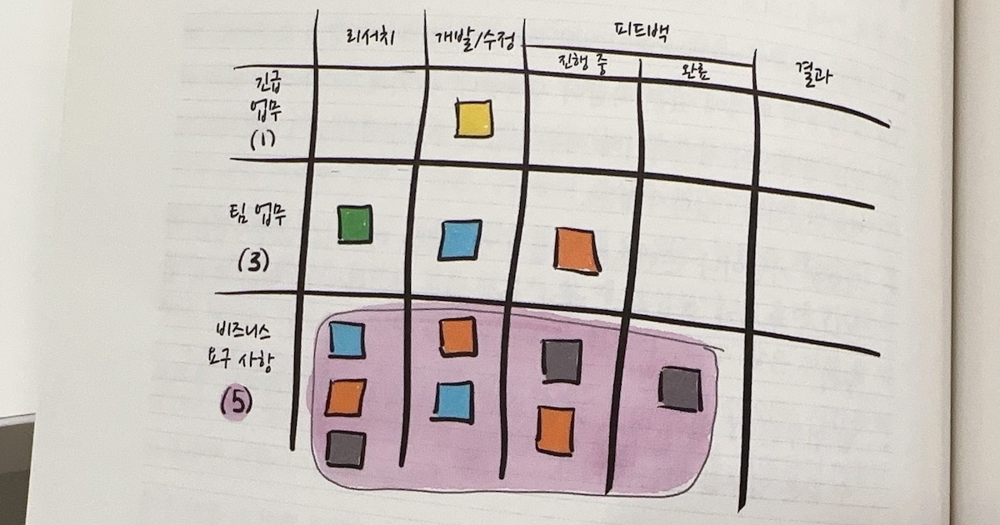

# {{page.title}}
Last modified: {{page.last_modified_date}}

## 시간 도둑을 드러내는 방법
### 시각화를 해야하는 이유
뇌의 1천 억 개 뉴런 중 20%가 시각 정보를 분석하는 데 더 많은 정보를 얻는다. 시각-공간 학습자는 뭔가를 생각할 때 주로 이미지를 떠올린다(인구의 3분의 2가 시각-공간 학습자). 인간의 두뇌는 시각으로 인지한 것에서 패턴과 구조를 찾도록 설계됐기 때문에 시각화는 업무를 개선할 수 있는 가장 기본적인 방법 중 하나다.  
→ 이 책의 나머지 부분은 린, 칸반 그리고 흐름 방법론을 사용해 업무 흐름이 빨라진 것을 보여주는 방법을 안내하고 비즈니스 측면에서의 장점을 다룬다.

## 칸반 보드
(나는 카테고리를 추가하고 칸반 단계를 세부화해야겠다고 생각했다.)  

### 10분이면 처리할 수 있는 일도 추적해야 하는가
아래의 경우 중 하나에 해당하지 않는 한, 10분짜리 업무를 추적할 필요는 없다.  
1. 업무를 처리하는 방법을 오직 한 사람만 알고 있다('알려지지 않은 의존성' 도둑).
   : 업무를 시각화하는 것은 다양한 종류의 훈련이 필요하다.  
2. 한 팀의 업무가 다른 팀에 영향을 미친다('알려지지 않은 의존성' 도둑). 
   : 팀 간의 의존성 문제는 매우 비싼 값을 치른다. 팀 간의 의사소통 가치를 고려한다면, 보드에 카드를 생성하는 1-2분의 추가 비용은 매우 저렴하다.  
3. 업무 대부분이 15분 혹은 그 이하로 소요되는 사람이 있다. 이것은 그 사람의 업무를 추적하지 않으면 눈에 보이지 않다는 것을 의미한다 ('너무 많은 진행 중 업무' 도둑)  
   : 어떤 사람이 진행하고 있는 수많은 업무가 눈에 보이지 않으면, 그 사람의 정상적인 업무량에 산더미 같은 일을 추가하기 쉽다.

이 외에는 어떻게 시각화를 해야할 지에 대한 방법론을 제안하는데, 나는 우선 현재 진행중인 업무들의 카테고리화와 트래킹이 우선이라고 생각해서 다 알려고 하지는 않았음.  
상황에 따라 적용해보고 나에게 최적화된 방법을 찾아나가는 과정으로 사용해야 한다.

152 페이지까지 읽음