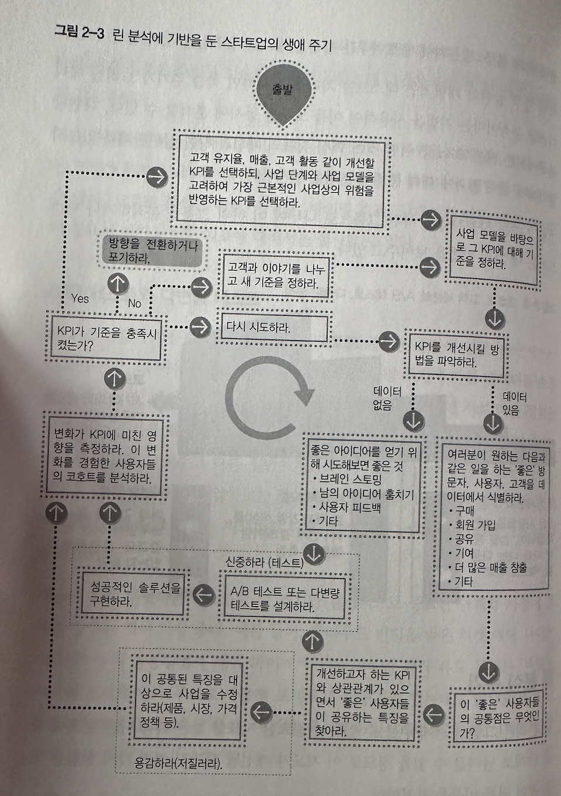
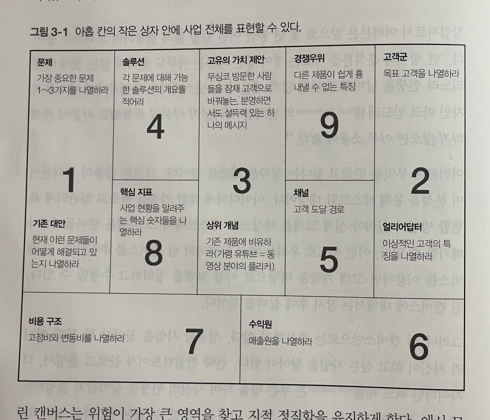
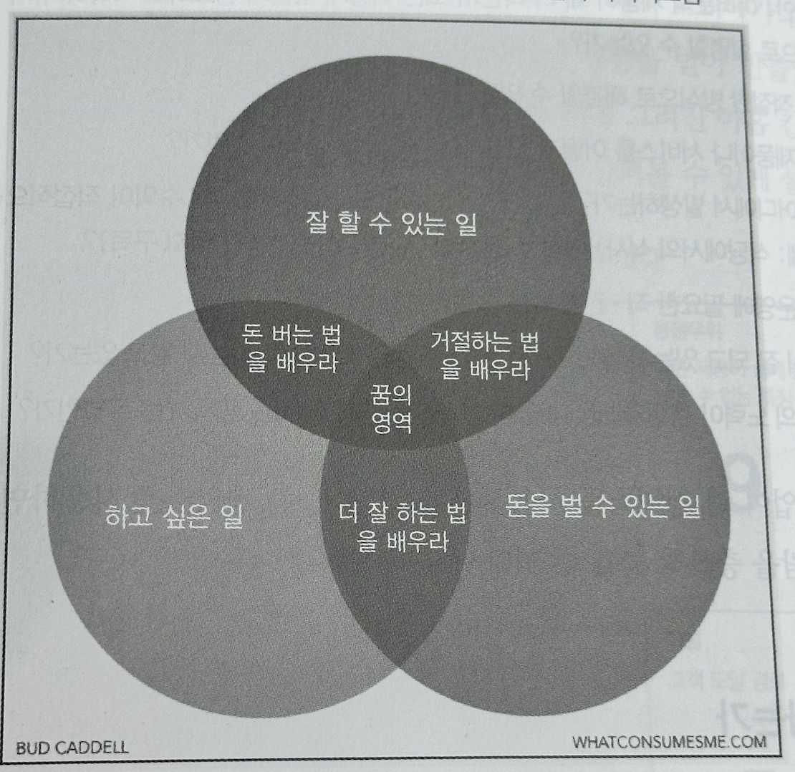

# Part 1. 눈 가리고 아웅하지 말기

## 1. 책에서 궁극적으로 말하고자하는 바

이 책에서 주로 말하고자 하는 내용은 *“궁극적으로 훌륭한 스타트업을 빨리 구축하기 위해 데이터를 어떻게 사용하는지 보여주고자 한다”*는 것이다.

→ **직감이 실험이라면 데이터는 증거다.**

## 2. 다양한 지표

### 좋은 지표란

1. 좋은 지표는 상대적 comparative이다.

: 시대별, 사용자, 그룹별, 경쟁자 별로 비교할 수 있으면 상황을 이해하는 데 도움이 된다.

2. 좋은 지표는 이해하기 쉽다.

: 사람들이 지표를 기억하고 그 지표에 대해 대화를 나눠야 현실로 옮길 수 있다.

3. 좋은 지표는 비율로 표현된다.

- 비율은 행동에 반영하기 쉽다: 자동차를 운전할 때 시간당 이동 거리 (속도)를 알면 그에 따라 행동할 수 있다.

- 비율은 비교의 속성이 있다 ratios are inherently **comparative**: 속도가 하나의 지표가 되지만 현재 속도와 직전 한 시간 동안의 평균 속도를 비교해보면 지금 속도를 높이고 있는지 줄이고 있는지 알 수 있다.

- 비율은 다소 대조적인 요소들이나 내재된 갈등이 있는 요소들을 비교하기 좋다 Ratios are also good for comparing factors that are somehow opposed, or for which there’s an inherent tension: 자동차의 사례에서 주행거리를 교통 위반 스티커의 수로 나눈 것이 여기에 해당될 수 있다. 빨리 달릴수록 주행거리는 길어지지만 교통 위반 스티커를 더 많이 받게 된다. e.g. score = distance / tickets → 서로 tension 관계에 있는 것

4. 좋은 지표는 행동 방식을 바꾼다.

- 데이터를 수집하기 전에 어떤 데이터 변화에 따라 어떤 행동을 어떻게 바꿀지 미리 협의해야 한다.

### 지표별 특성 이해하기

올바른 지표를 선택하려면 여러 지표들이 지닌 각각의 특성을 이해해야 한다.

1. 정성적 지표와 정량적 지표는 각각 장단점이 있다.
: 정성적 지표를 종합하기 어려운 반면, 정량적 지표는 정황적인 정보가 부족하다.
2. 허상 지표보다는 실질 지표를 추구해야 한다.
: 실행으로 옮길 수 없는 것은 허상 지표다. 실질 지표를 따라야 행동 방침을 선택할 때 도움을 줌으로써 행동을 바꾸게 한다.
→ MAU(monthly active users)와 함께 Monthly Revenue도 함께 보고 있는 듯하다 (Revenue만 보면 돈을 많이 쓰는 한 명이 지표를 높일 수 있음
/ARPU(average revenue per user; 사용자당 평균 매출)도 함께 봐야 좋은 지표 
/ARPPU(average revenue per paying user; 돈 내는 사용자당 평균 매출)
3. 탐색 지표와 보고 지표로도 나눌 수 있다.
: 탐색 지표는 아직 알려지지 않은 내용을 찾는 데 목적이 있으며, 보고 지표는 경영 상황을 빠짐없이 알 수 있도록 만드는 데 목적이 있다.
    
    *1. 안다는 것을 아는 것: 사실. 틀릴 수 있기 때문에 데이터와 대조하면서 확인해야 한다.*
    
    *2. 모른다는 것을 아는 것: 보고를 통해 답할 수 있는 질문. 기준을 정하고 자동화해야 한다 (ex. 사용자 수).*
    
    *3. 안다는 것을 모르는 것: 직관. 정량화하고 유효성과 효율성을 향상시킬 방법을 알아야 한다.*
    
    *4. 모른다는 것을 모르는 것: 탐색. 경쟁우위와 흥미로운 깨달음이 비롯되는 영역*
    
    *→스타트업 초기 단계에서는 '모른다는 것을 모르는 것'의 영역이 가장 중요. 비밀 병기가 될 수 있음*
    
4. 선행 지표는 미래를 예측할 수 있게 도와주고 후행 지표는 과거를 설명해준다. 
: 선행 지표는 조치를 취할 수 있기 때문에 후행 지표보다 더 유용하다. (하지만, 스타트업 초기에는 현재 지표 값이 미래와 어떤 관련이 있는지 알 수 있을 정도로 데이터가 충분하지 않다. 그렇기 때문에 이때는 후행 지표를 먼저 측정.)
5. 두 지표 값이 같이 움직이면 상관관계가 있으나, 한 지표가 다른 지표를 움직이게 하면 인과관계가 있다. 
: 지표 사이의 인과관계를 찾아내면 미래를 바꿀 수 있다.

### 목표 수정

처음에 결정한 목표치는 확고 불변한 목표가 아니라 가변적인 목표다. 움직이는 목표를 쫓는 것이다.

### 고객 세분화, 코호트, A/B 테스트, 다변량 분석

테스트는 린 분석의 핵심이므로, 아래의 방법들에 따라 두 가지를 서로 비교해볼 수 있다. 이를 통해 타당성을 입증할 수 있다.

1. 고객 세분화
: 공통의 특징 (기술적 정보 혹은 인구통계학적 정보 같은 것을 사용)을 공유하는 집단을 나누어 비교해 볼 수 있다.
ex. 오스트레일리아 사용자들이 다른 지역의 사용자들보다 웹사이트 활동이 더 활발하다면 그 이유를 조사해서 알아낸 다음 다른 고객군에도 그 성공을 복제하려고 노력해야 한다.
2. 코호트 분석
: 시간을 두고 비슷한 그룹을 비교하는 것
→ 특정한 주기에 사업 모델을 수정할 수도 있으므로, 그 사이에 어떤 영향을 주었는지 알기 위하여 코호트 분석을 이용할 수 있다.
→ 종단적 연구 (자연스러운 수명 주기에 따라 데이터를 수집하는 조사)
3. A/B 테스트와 다변량 테스트
→ 횡단적 연구 (동시에 서로 다른 경험을 하게 하는 조사)
: 방문자의 절반에게는 파란색 링크를 보여주고 다른 절반에게는 녹색 링크를 보여주면서 어떤 그룹이 링크를 더 잘 클릭하는지 알아보는 것
    
    A/B 테스트 단점: 트래픽이 적은 곳에서는 여러개를 테스트하려면 시간이 오래 걸림. ~~그래서 다변량 테스트 같은 것을 활용하여 한 번에 여러 요소를 확인해야 한다.~~ (교호작용 interaction effect 을 고려해서 결과를 볼 수 있음 → 다변량 테스트 장점)
    

### KPI란

KPI란 Key Performance Indicators의 약자로 사업을 이끄는 특정 지표를 의미한다.

어떤 지표에 대하여 "이 정보로 내가 무엇을 할 수 있을까?"의 질문을 떠올리고 이 질문에 대답할 수 없다면 그 지표는 그다지 신경 쓸 필요가 없을지도 모른다.

### 분석이 필요한 이유

1. 오픈율, 전환율 같은 사실과 가정을 확인하고 사업 계획이 정확한지 확인

2. 직관을 테스트하고 가설을 증거로 바꿈

3. 스프레드시트, 각종 그래프, 경영진 회의 등에 필요한 데이터를 구함

4. 사업 기회를 찾음

### 린 분석 주기

린 분석은 아래 이미지와 같이 중요한 지표를 찾은 다음 다른 문제나 다음 단계로 넘어갈 수 있을 정도로 지표가 개선될 때까지 여러 가지 실험을 하는 것이 많은 비중을 차지한다.

## 3. 어떤 일을 할 것인가?

무언가를 만들려면 두 가지가 충족되어야 한다.

1. 실제로 시장이 존재하는지
→ 애시 모리아의 린 캔버스를 이용하여 고객 개발을 바탕으로 사업 모델을 정의하고 수정할 수 있다.
    
    
    
2. 내가 하고 싶은 일인지
→ 하지만 궁극적으로 지표를 통해 성공할 사업을 찾아야 할 뿐만 아니라 자신이 하고 싶은 사업을 찾아야 한다. 버드 캐델이 제안한 무슨 일을 하며 자신의 인생을 살아갈지 결정하는 세 가지 분명한 기준은 아래와 같다.
    
    

## 데이터 주도적 접근법과 데이터를 참고하는 접근법

- 데이터 주도적인 최적화를 통해 반복적인 개선 작업을 수행해야 한다.
- 초기 단계에 만드는 것은 제품이 아닌 어떤 제품을 만들지 알아내기 위해 도구를 만들고 있는 것이다.
    
    → 즉 지속 가능한 사업 모델을 찾는 과정이며 “구축 → 측정 → 학습” 주기를 거치며 상황을 진정으로 이해하고 새로운 가능성에 대해 열린 자세를 가져야 한다.
    

참고: 린 분석 (한빛미디어, 앨리스테어 크롤, 벤저민 요스코비츠)