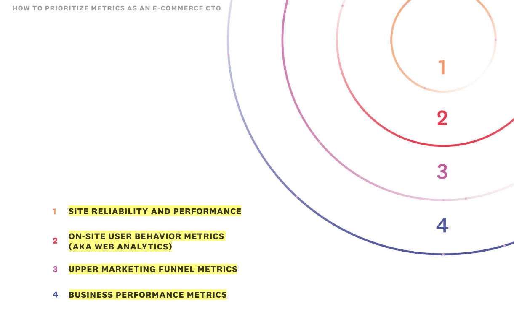
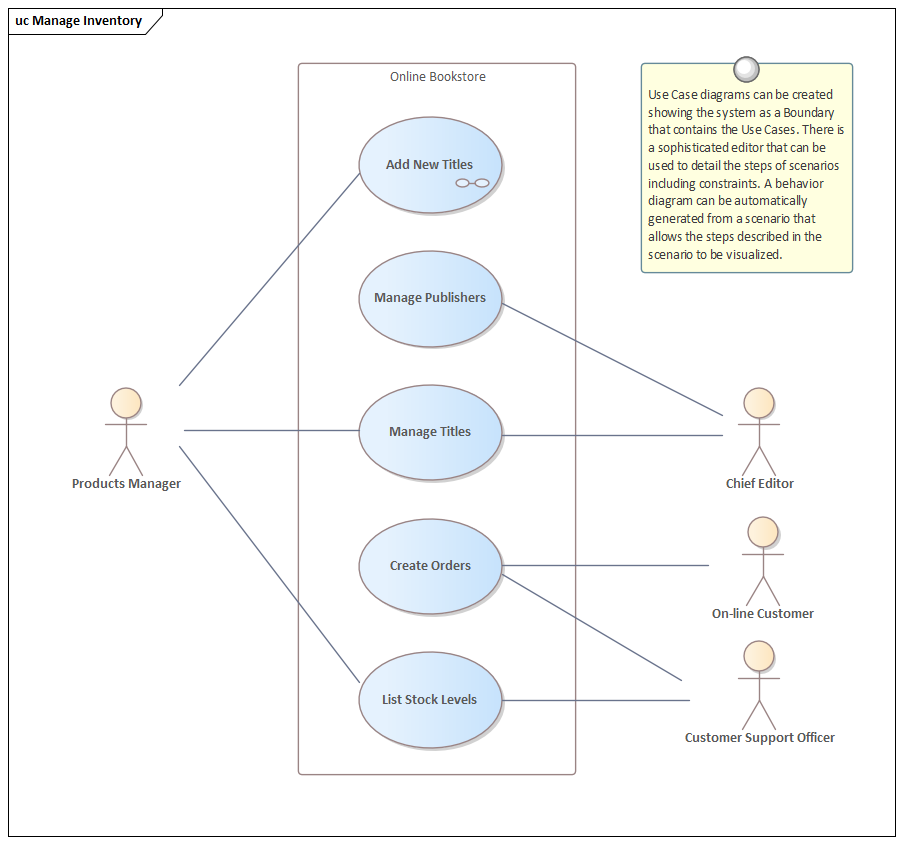

Last modified: {{page.last_modified_date}}

# 이커머스를 위한 지표

## 지표 우선순위
아래의 이미지에서 볼 수 있듯이 모든 지표의 중심에는 사이트 안정성과 퍼포먼스가 있다. 

사이트가 제대로 작동하지 않으면 퍼널안으로 들어오지 못하고 전환이 일어나지 않는다. 그럼 구글이나 페이스북처럼 트래픽을 몰고 오는 사이트들이 우리 사이트에서 전환이 일어나지 않는 것을 알 것이고 광고비가 낭비될 것이다. 그렇게 되면, 트래픽이 소진되고 비즈니스 지표에 큰 타격을 입힐 것이다.

### 앱 레벨의 메트릭스
1. 활성화 세션
2. 카트 생성 수
3. 주문 진행 수
4. 일별 로그인 수: 실패와 성공 모두를 추적
5. 결제 실패 건
6. 계정 정보 변경: 비정상적으로 수치가 높을 경우 악성유저가 있을 수 있다

> 참고 
> [B2B Info Daily-How to Prioritize Metrics as an E-Commerce CTO](https://b2binfodaily.com/how-to-prioritize-metrics-as-an-e-commerce-cto/)

# 데이터 로그 설계, 데이터 로깅, 이벤트 로그 설계, 데이터 QA의 모든 것
- 과거 선박의 속도를 측정하기 위해 칩 로그라는 것이 사용됨

## 데이터 로그 설계의 잘못된 과정
1. 로깅을 신경쓰지 않고 진행
2. 특정 기능 배포
3. 성과를 확인하려고 하니, 데이터에 누락이 있음을 발견(혹은 잘못된 로깅)
4. 다시 로깅을 한 후, 배포
→ 이렇게 진행을 할 경우 과거 성과는 알 수 없음. 이런 경우를 방지하기 위해 데이터 로깅도 항상 진행하고, 데이터 QA도 진행해야 함

## User Property
이커머스 앱에 접속한 이벤트에 그 유저가 여태까지 제품을 구매한 횟수와 총 누적 구매 금액 등이 유저 프로퍼티로 저장되어 있으면 구매 금액별 분석을 할 수 있음
→ 이런 데이터는 Database에 저장될 수도 있는데, 특정 시점의 테이블에 저장된 데이터를 추출한 후, Join해서 사용할 수도 있음. 그러나 분석의 용이성을 위해서 유저 프로퍼티로 저장할 수도 있음
→ 단, 유저의 DB에서 확인할 수 있는 정보 중 정말 의미가 있다고 판단되는 것만 유저 프로퍼티로 넣는 것이 좋음. 혹은 사용자에 따라 수시로 변할 수 있는 옵션이거나 서버에선 모르는 경우 로깅

## 데이터 로깅 프로세스 단계별 설명
1. 현 회사에서 데이터 로깅 관련 문서 또는 아키텍쳐가 있는지 확인하기
2. 해당 프로젝트에서 메인으로 가져갈 지표 생각해보기
3. 어떤 식으로 저장하면 좋을지 작성해보기데이터가 어떤 형태로 저장되는지 확인해보고, 이 데이터를 어떻게 바라볼 수 있는지 생각해보기3) 개발자 또는 데이터 분석가와 커뮤니케이션(이 데이터를 볼 수 있는지 등)
4. 확정된 로깅 가이드 문서를 개발자에게 전달
5. 로깅 개발 완료 후, 실제로 데이터가 잘 들어갔는지 테스트로깅 가이드 문서는 스프레드시트 등을 통해 관리하면 좋음이벤트 이름은 무엇인지어느 상황에 로깅되는지언제부터 적용되는지(=언제 배포되었는지)이벤트의 세부 파라미터의 이름은 무엇인지(Firebase에선 Key라고 표현함), 어떤 Parameter가 들어가는지(예를 들어 주문 완료 이벤트의 파라미터로 Key:product_id, Value : 1 등으로 저장될 수 있음. 이는 product_id가 1번인 주문을 완료했다는 뜻)

> 참고 
> [# 데이터 로그 설계, 데이터 로깅, 이벤트 로그 설계, 데이터 QA의 모든 것](https://zzsza.github.io/data/2021/06/13/data-event-log-definition/)

# 쿠팡의 흑자 전환
- 쿠팡은 대부분 PB와 직매입비중이 높으므로 모든 것을 매출액 기준으로 계산
- 커머스는 시즌성이라는 것이 존재해서 분기별로 차이가 있는데, 예를 들어 고객의 수가 크게 변화가 없다면 3Q, 4Q에는 매출액이 크고 2Q는 매출액이 줄어야 일반적이다. 하지만, 쿠팡은 2020년 이래로 분기별로 단 한번도 매출액이 역성장한 적이 없다.
- 쿠팡의 매출이 크게 성장했을 수 있던 이유
	- 고객의 성장(양), 또는 고객당 매출액(질)의 성장
	- 상품(상품군)의 확장
	- 시장(채널, 국가)의 확장
	- 신규 서비스의 확장 (쿠팡이츠, 쿠팡플레이 등)
	- 등등···

- 쿠팡의 활성고객 수를 확인한 결과 22년도 1Q에 1810만명을 찍은 이후 계속 비슷한 수준에 머물러 있다. 오히려 고객당 매출액(분기별)이 꾸준히 증가하였다. 분기별 38만원으로 1800만명이 1인당 월 13만원을 구매한다는 이야기.
→ 쿠팡의 최근 매출성장은 고객이 늘어서라기 보다는 고객당 매출액이 늘었고 더 나아가서는 LTV(고객생애가치)가 계속 늘고 있다.
→ 배송이라는 매우 만족스러운 서비스가 있기 때문에 결국 로켓와우 가격을 올렸음에도, 최저가가 아님에도 전체 만족도가 유지될 수 있다.
**일단 지불한 로켓와우 비용에 대해서는 구매가 많아질수록 더 많은 혜택을 누린다고 여겨지기 때문에 가격상승이 오히려 고객을 락인하는 요소로 활용**되기도 한다.

## 수익구조의 인식전확
수익구조의 인식전환은 **저비용 비즈니스 구조만들기 > 생산성 향상 > 규모의 경제 > 비용의 절감 순입니다.**

## 쿠팡 커머스의 운용 방식 4가지
쿠팡은 크게 4가지 방식의 커머스를 운용한다.
- 제조 (PB -> 로켓배송)
- 상품직매입 (로켓배송)
- 상품위탁 (3PL)
- 입점 (업체배송)

## 영업이익, 매출액, 매출총이익, 판관비
- 매출액 = 판매량 X 가격 (즉, '제품 판매량'에 '판매가격'을 곱한 것)
- 매출총이익 = 매축액 - 매출원가 (즉, 재료비, 인건비, 인쇄비 등을 뺀 가격)
- 판관비: 기업의 판매와 관리, 유지를 위한 비용으로 인건비, 광고비, 기타 비용 등을 포함한 비용
- 영업이익 = 매출총이익 - 판관비 (영업이익은 회사가 영업을 통해 얼마를 벌었는지 보여주는 지표이기 때문에 굉장히 중요하다. 영업이익이 커지면 기업이 경영을 잘했다는 뜻)

>참고 
>[클리앙-재무선배-흑자 전환에 대한 상세 재무분석](https://m.clien.net/service/board/lecture/17704974)

# 시스템의 상태 변화를 표현하기
→ 하나의 시스템을 분석하고 설명하는 여러 관점이 있다. 상황에 따라 각 관점이 가져다주는 장단점이 다르므로, 시스템을 분석하는 다양한 관점들을 알아두면 유익하다.

## 상태전이: State transition
상태전이는 '비회원'과 '회원' 처럼 어떤 이벤트에 따라 reactive한 state를 뜻한다. 상태전이는 시간의 흐름보다는 상태 그 자체의 변화를 표현할 때 유용하다. 반면에 우리가 흔히 알고 있는 flow chart는 시간의 흐름에 따라 변화는 것을 확인하기에 좋다.

## UML: Unified Modeling Language
[UML](https://en.wikipedia.org/wiki/Unified_Modeling_Language)은 [Rational Software](https://en.wikipedia.org/wiki/Rational_Software)에서 소프트웨어 설계에 대한 단계 표기 시스템과 접근 방식을 표준화하기 위해 고안된 개념이다. ISO(International Organization for Standardization)에서도 2005년에 표준으로 적용되었다.

### UML의 요소들
- 모든 활동 (jobs)
- 시스템의 개별 컴포넌트들 (그리고 그들이 어떻게 다른 컴포넌트들과 상호작용하는지)
- 시스템이 어떻게 작동하는지
- 개체들이 다른 개체들과 어떻게 상호작용하는지
- 외부 유저인터페이스
: UML이 처음에는 객체 지향적 문서화를 위해 만들어졌지만, 그 개념이 점점 확장되어 디자인 문서화의 큰 세트가 되었다.

## != System Diagram (UML은 System Diagram과 같지 않다.)
- 정적(구조적) 보기: 개체, 속성, 작동, 관계를 사용하여 정적 구조를 보여주는 것으로 [Class diagram](https://en.wikipedia.org/wiki/Class_diagram)이나 [Composite structure diagram](https://en.wikipedia.org/wiki/Composite_structure_diagram)을 포함하는 개념이다.
- 동적(행동적) 보기: 개체들과 변화들 사이의 협업을 보여줌으로써 시스템의 동적인 행동을 나타낸다. [Sequence diagrams](https://en.wikipedia.org/wiki/Sequence_diagram), [Activity diagrams](https://en.wikipedia.org/wiki/Activity_diagram), [State machine diagrams](https://en.wikipedia.org/wiki/UML_state_machine) 같은 개념들을 포함한다.

- UML에서 행동 모델링을 위한 핵심 도구 중 하나는 OOSE에서 고안한 **Use-case model**이다. 사용 사례는 시스템의 필수 용도를 지정하는 방법입니다. 일반적으로 시스템의 요구 사항, 즉 시스템이 수행해야 하는 작업을 캡처하는 데 사용됩니다.

## Stately.io
상태전이를 표기하기 쉬운 도구가 있다.
[STATELY](https://stately.ai/)로 심지어 무료다. 심지어 개발자가 활용하기 쉬운 형태로 코드도 뽑아준다..!

>참고 
>[pxd - gunggmee - 시스템의 상태 변화를 표현하기](https://story.pxd.co.kr/1549)
>[wikipedia - Unified Modeling Language](https://en.wikipedia.org/wiki/Unified_Modeling_Language)
